# WW3Tool

[中文文档](README.zh-CN.md)

## Overview


WAVEWATCH III visualization and run tool (WW3Tool) is a pre-processing workflow tool for the WAVEWATCH III model. It helps you complete the basic WAVEWATCH III workflow.

This tool includes:

1.  Multiple forcing fields: wind (ERA5, CFSR, CCMP), currents (Copernicus), water level (Copernicus), sea ice (Copernicus), with automatic fixes (latitude ordering, time fixes, variable fixes).
2.  gridgen rectangular grid generation, supports up to two nested grids (Python version, no MATLAB dependency).
3.  Regional runs, 2D spectrum point runs, and track runs.
4.  Slurm script configuration.
5.  Automatic configuration for ww3_grid.nml, ww3_prnc.nml, ww3_shel.nml, ww3_ounf.nml, ww3_multi.nml, etc. (compute precision, output precision, time range, 2D spectrum points, track runs, partition output, forcing setup).
6.  Wave height plots, wave height videos, contour plots, 2D spectrum plots, JASON3 satellite tracks, 2D spectrum plots.

You must install WAVEWATCH III yourself on local or server environments. This tool does not provide an installer.

I did not major in ocean science as an undergraduate, and my current WAVEWATCH III usage knowledge is limited. If you have more ideas, contact me at atomgoto@gmail.com.

## Quick Start

``` sh
cd src

pip install -r requirements.txt

python main.py
```

If any packages fail to install or are missing, please install them manually.

## Environment

Python ≥ 3.8 is supported.

Tested on:

- Windows 11
- Ubuntu 24
- macOS 15

WAVEWATCH III does not need to be installed locally. Local runs are optional and not recommended.

For actual runs, make sure the server has:

- WAVEWATCH III

- Slurm workload manager

### gridgen/reference_data

reference_data must be downloaded, otherwise grid generation will fail.

Run the download script: WW3Tool/gridgen/get_reference_data.py

Or download from OneDrive: https://tiangongeducn-my.sharepoint.com/:u:/g/personal/1911650207_tiangong_edu_cn/IQBGfWxOrWNlQphTeWCh-7AjAR-dtNWp7guSVhiyUH4dCW8?e=BdDBqQ

Or download from Baidu Netdisk: https://pan.baidu.com/s/1ec8DMcv8bp6MzNnFBkbAPA?pwd=ktch

**Finally place it under gridgen/reference_data**

## Feature Details

### Create a Work Directory

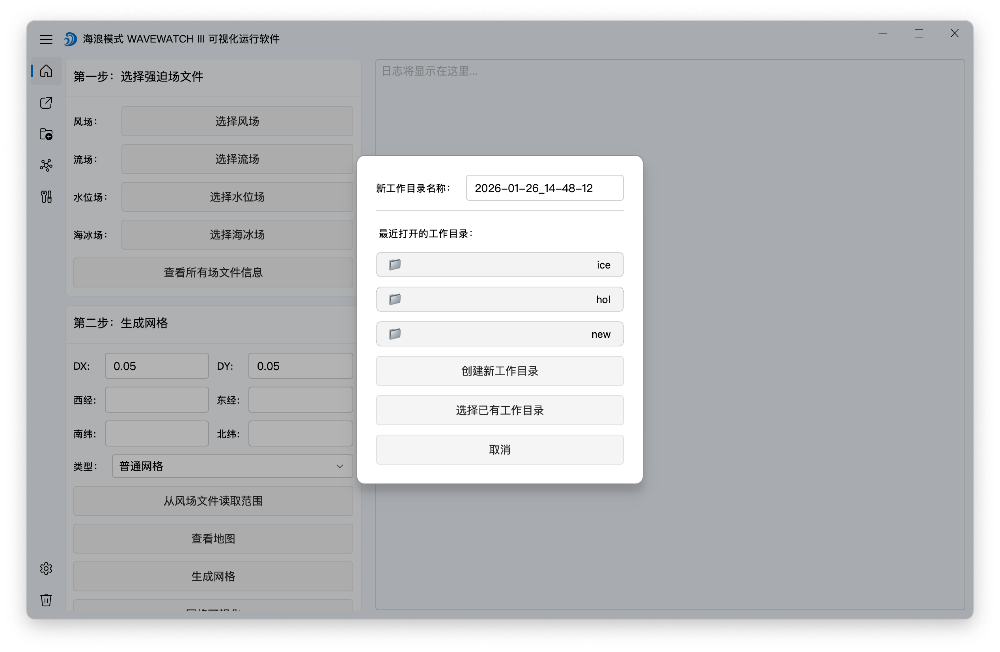

You must choose or create a work directory when the app starts. This step is required and cannot be skipped.

The default new work directory name is the current time. Up to 3 recent work directories are shown.

A work directory is just a folder for files generated during runs, such as grid files, forcing files, and WAVEWATCH III configuration files.

The default work directory is WW3Tool/workSpace. You can change it on the settings page.


### Select Forcing Files

Wind fields can use data from [ERA5](https://cds.climate.copernicus.eu/datasets/reanalysis-era5-single-levels?tab=download), [CFSR](http://tds.hycom.org/thredds/catalog/datasets/force/ncep_cfsv2/netcdf/catalog.html), and [CCMP](https://data.remss.com/ccmp/v03.1/).

For other forcing fields, I only tested Copernicus currents, water level, and sea ice.

I have pre-prepared a few forcing files under WW3Tool/public/forcing. You can select them directly (for testing only).


WAVEWATCH requires latitude to be ascending. ERA5 wind data is descending by default, so the app checks and automatically reverses if needed.

CFSR wind variables are also auto-fixed to match WW3 requirements.

Copernicus forcing timestamps are auto-fixed during this process as well.

Forcing files are automatically copied (or cut, configurable in settings) to the current work directory and renamed to wind.nc, current.nc, level.nc, ice.nc. The log panel shows file info.

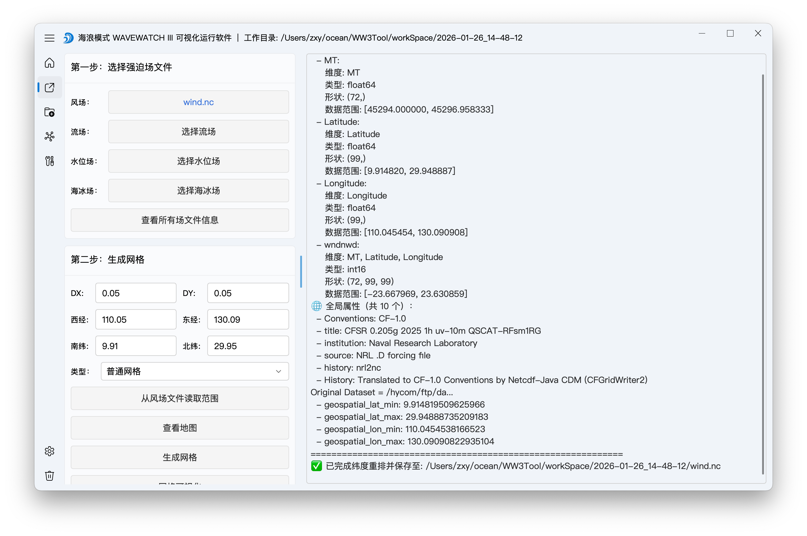

Usually only wind forcing is needed. The software does not allow using other forcing fields without wind.

If a single file contains multiple forcing fields, the related buttons are auto-filled. The file is named like current_level.nc in the work directory to indicate the contained fields.

### Generate Grid Files

#### reference_data

Before generating grids, run get_reference_data.py in WW3Tool/gridgen to download bathymetry data (gebco, etop1, etop2) and coastline boundaries. It downloads and extracts into reference_data.


#### Regular Grid

Run the app, choose a domain from wind.nc, and click Generate Grid. This calls WW3Tool/gridgen to generate grid files into the work directory.

Smaller DX/DY yields higher accuracy because DX/DY is the grid spacing.


Four files are produced in the work directory: grid.bot, grid.obst, grid.meta, grid.mask.

#### Nested Grid

Choose type: Nested grid.


We define a nested grid shrink factor on the settings page. The default is 1.1x.

When setting the outer grid, it expands from the inner grid by 1.1x.

When setting the inner grid, it shrinks from the outer grid by 1.1x.


Nested grid generation runs twice: once for the outer grid and once for the inner grid.

In nested mode, two folders are created under the work directory: coarse (outer) and fine (inner).

When coarse and fine exist, opening the directory automatically switches to nested mode. This affects later operations, so if coarse/fine or other grid files already exist, switching the grid type is disabled.


#### Grid Cache

To avoid repeated computation, each grid is cached under WW3Tool/gridgen/cache.

A cache key based on parameters becomes the folder name. When generating, the cache is checked first and reused if available.


Each cache folder includes params.json:

``` json
{
  "cache_key": "c161115dfd8bde7b30fd01826a3c292ada7835df377a81b9ee59f73acc28328b",
  "source_dir": "/Users/zxy/ocean/WW3Tool/workSpace/2026-01-11_23-18-38",
  "parameters": {
    "dx": 0.05,
    "dy": 0.05,
    "lon_range": [
      110.0,
      130.0
    ],
    "lat_range": [
      10.0,
      30.0
    ],
    "ref_dir": "/Users/zxy/ocean/WW3Tool/gridgen/reference_data",
    "bathymetry": "GEBCO",
    "coastline_precision": "最高"
  }
}
```

#### MATLAB vs Python Versions

We originally used the [gridgen](https://data-ww3.ifremer.fr/COURS/WAVES_SHORT_COURSE/TOOLS/GRIDGEN/) version from Ifremer. The NOAA version is at https://github.com/NOAA-EMC/gridgen.

Because they are MATLAB-based, it was cumbersome, so I converted it to a Python version. The default is now Python.

If you really want to use MATLAB Gridgen (not recommended), you can switch it in settings and configure the MATLAB path.


#### gridgen Settings


Gridgen settings allow you to change many parameters:

- GRIDGEN version: default is Python (much faster than MATLAB, no dependency).

- Default DX/DY for regular grids is the X/Y spacing. Larger DX/DY means a smaller grid and lower precision.

- Nested grid shrink factor: controls auto scaling for inner/outer grids.

- Bathymetry data: gebco, etop1, etop2. We typically use gebco (highest precision), then etop2, then etop1.

- Coastline boundary precision: typically the highest precision.

### Choose Run Mode

The three run modes have similar computational cost, but outputs differ. Spectrum point mode and track mode look like they compute only a few points, but they still compute the entire domain.

Regular regional mode corresponds to ww3_ounf output.

Spectrum point mode adds ww3_ounp.

Track mode corresponds to ww3_trnc.

#### Regional Mode

Regular output mode.

#### Spectrum Point Mode


You can pick points from the map to open a window.


Click points on the map. The blue dashed rectangle shows the grid extent; points must be within it. Then click **Confirm and add points**.

When confirming parameters in step 4, a points.list file is generated in the work directory.

``` swift
117 18 '0'
126 21 '1'
127 20 '2'
115 15 '3'
128 14 '4'
126 18 '5'
```

The three columns in points.list are longitude, latitude, and point name. If a work directory contains points.list, the app switches to spectrum point mode and loads the points.

After running WW3, you can get ww3.2025_spec.nc in the plotting page.


Then you can plot 2D spectra.


#### Track Mode


Similar to spectrum point mode, but adds a time column. Step 4 generates a file: track_i.ww3, with the format below:

    WAVEWATCH III TRACK LOCATIONS DATA 
    20250103 000000   115.4   19.7    0
    20250103 000000   127.6   19.7    1
    20250103 000000   127.6   15.6    2

Finally, ww3_trnc outputs a ww3.2025\_ file.

### Configure Run Parameters

The example below uses track mode, which produces more logs than regular regional mode.

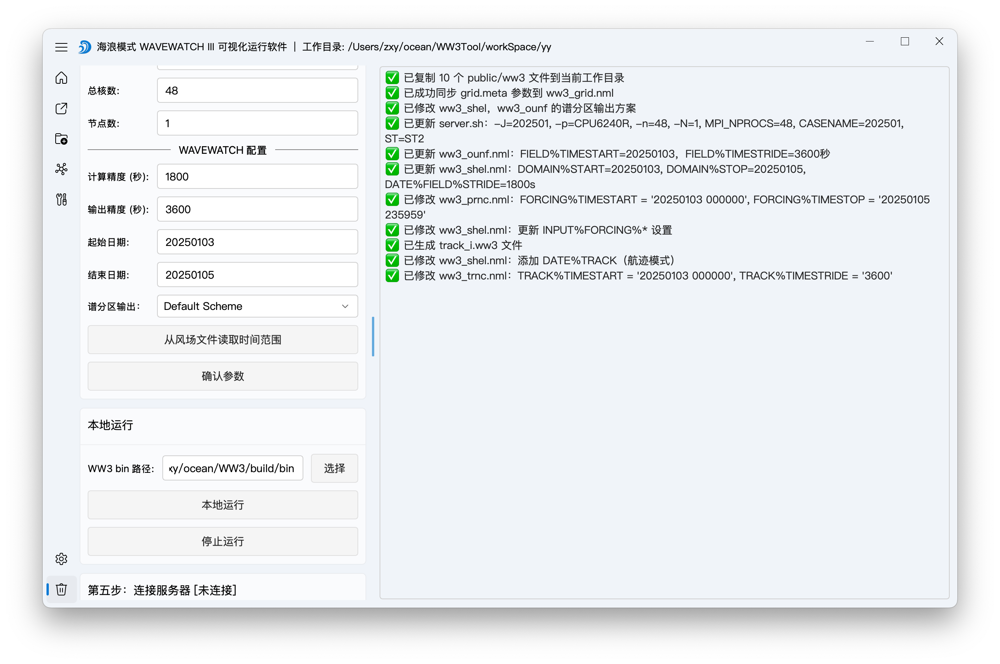

``` log
✅ 已复制 10 个 public/ww3 文件到当前工作目录
✅ 已成功同步 grid.meta 参数到 ww3_grid.nml
✅ 已修改 ww3_shel，ww3_ounf 的谱分区输出方案
✅ 已更新 server.sh：-J=202501, -p=CPU6240R, -n=48, -N=1, MPI_NPROCS=48, CASENAME=202501, ST=ST2
✅ 已更新 ww3_ounf.nml：FIELD%TIMESTART=20250103，FIELD%TIMESTRIDE=3600秒
✅ 已更新 ww3_shel.nml：DOMAIN%START=20250103, DOMAIN%STOP=20250105, DATE%FIELD%STRIDE=1800s
✅ 已修改 ww3_prnc.nml：FORCING%TIMESTART = '20250103 000000', FORCING%TIMESTOP = '20250105 235959'
✅ 已修改 ww3_shel.nml：更新 INPUT%FORCING%* 设置
✅ 已生成 track_i.ww3 文件
✅ 已修改 ww3_shel.nml：添加 DATE%TRACK（航迹模式）
✅ 已修改 ww3_trnc.nml：TRACK%TIMESTART = '20250103 000000', TRACK%TIMESTRIDE = '3600'
```

#### Regular Grid

First, all files under WW3Tool/bin/public/ww3 are copied into the current work directory.

    ✅ 已复制 10 个 public/ww3 文件到：/Users/zxy/ocean/WW3Tool/workSpace/qq


------------------------------------------------------------------------

Next:

``` log
✅ 已成功同步 grid.meta 参数到 ww3_grid.nml
```

We convert the grid.meta section:

       'RECT'  T 'NONE'
    401      401 
     3.00       3.00      60.00 
    110.0000       10.0000       1.00

Into the ww3_grid.nml section:

    &RECT_NML
      RECT%NX           =  401
      RECT%NY           =  401
      RECT%SX           =  3.000000
      RECT%SY           =  3.000000
      RECT%SF           =  60.000000
      RECT%X0           =  110.000000
      RECT%Y0           =  10.000000
      RECT%SF           =  60.000000
    /

------------------------------------------------------------------------

Then modify the partition output plan:

``` swift
✅ 已修改 ww3_shel，ww3_ounf 的谱分区输出方案
```

TYPE%FIELD%LIST in ww3_shel.nml:

``` swift
&OUTPUT_TYPE_NML
  TYPE%FIELD%LIST       = 'HS DIR FP T02 WND PHS PTP PDIR PWS PNR TWS'
/
```

FIELD%LIST in ww3_ounf.nml:

``` swift
&FIELD_NML
  FIELD%TIMESTART        =  '20250103 000000'
  FIELD%TIMESTRIDE       =  '3600'
  FIELD%LIST             =  'HS DIR FP T02 WND PHS PTP PDIR PWS PNR TWS'
  FIELD%PARTITION        =  '0 1'
  FIELD%TYPE             =  4
/
```

------------------------------------------------------------------------

Then update server.sh:

``` log
✅ 已更新 server.sh：-J=202501, -p=CPU6240R, -n=48, -N=1, MPI_NPROCS=48, CASENAME=202501, ST=ST2
```

``` sh
#SBATCH -J 202501
#SBATCH -p CPU6240R
#SBATCH -n 48
#SBATCH -N 1
#SBATCH --time=2880:00:00

#wavewatch3--ST2
export PATH=/public/home/weiyl001/software/wavewatch3/model/exe/exe:$PATH

MPI_NPROCS=48

CASENAME=202501
```

------------------------------------------------------------------------

``` log
✅ 已更新 ww3_ounf.nml：FIELD%TIMESTART=20250103，FIELD%TIMESTRIDE=3600秒
```

Then update ww3_ounf.nml and find:

``` swift
&FIELD_NML
  FIELD%TIMESTART        =  '20250103 000000'
  FIELD%TIMESTRIDE       =  '3600'
  FIELD%LIST             =  'HS LM T02 T0M1 T01 FP DIR SPR DP PHS PTP PLP PDIR PSPR PWS TWS PNR'
  FIELD%PARTITION        =  '0 1'
  FIELD%TYPE             =  4
/
```

FIELD%TIMESTART is the start time, and FIELD%TIMESTRIDE is the output stride.

------------------------------------------------------------------------

``` log
✅ 已更新 ww3_shel.nml：DATE%FIELD%START=20250103, DATE%FIELD%STRIDE=1800s, DATE%FIELD%STOP=20250105
```

Update ww3_shel.nml:

``` swift
&DOMAIN_NML
  DOMAIN%START           =  '20250103 000000'
  DOMAIN%STOP            =  '20250105 235959'
/

&OUTPUT_DATE_NML
  DATE%FIELD          = '20250103 000000' '1800' '20250105 235959'
  DATE%RESTART        = '20250103 000000' '86400' '20250105 235959'
/
```

The dates define the start/stop range, and '1800' in DATE%FIELD is the time step.

------------------------------------------------------------------------

Then update the time range in ww3_prnc.nml:

``` sh
&FORCING_NML
  FORCING%TIMESTART            = '19000101 000000'  
  FORCING%TIMESTOP             = '29001231 000000'  
  FORCING%FIELD%WINDS          = T
  FORCING%FIELD%CURRENTS       = F
  FORCING%FIELD%WATER_LEVELS   = F
  FORCING%FIELD%ICE_CONC       = F
  FORCING%FIELD%ICE_PARAM1     = F
  FORCING%GRID%LATLON          = T
/
```

Based on the selected forcing fields, we generate ww3_prnc_current.nml and ww3_prnc_level.nml. For ice, concentration and thickness become ww3_prnc_ice.nml and ww3_prnc_ice1.nml.

We toggle forcing switches based on the selected fields. Each forcing switch can only enable one, but ww3_prnc is used multiple times later.

We also update forcing file names and variables:

    &FILE_NML
      FILE%FILENAME      = 'wind.nc'
      FILE%LONGITUDE     = 'longitude'
      FILE%LATITUDE      = 'latitude'
      FILE%VAR(1)        = 'u10'
      FILE%VAR(2)        = 'v10'
    /

------------------------------------------------------------------------

``` log
✅ 已修改 ww3_shel.nml：更新 INPUT%FORCING%* 设置
```

Then update ww3_shel.nml based on selected forcing fields:

    &INPUT_NML
      INPUT%FORCING%WINDS         = 'T'
      INPUT%FORCING%WATER_LEVELS  = 'T'
      INPUT%FORCING%CURRENTS      = 'T'
      INPUT%FORCING%ICE_CONC      = 'T'
      INPUT%FORCING%ICE_PARAM1    = 'T'
    /

------------------------------------------------------------------------

Based on the current track points or spectrum point list, we generate:

``` log
✅ 已生成 track_i.ww3 文件
```

------------------------------------------------------------------------

``` log
✅ 已修改 ww3_shel.nml：添加 DATE%TRACK（航迹模式）
```

We also add to ww3_shel.nml:

    &OUTPUT_DATE_NML
      DATE%FIELD          = '20250103 000000' '1800' '20250105 235959'
      DATE%TRACK          = '20250103 000000' '1800' '20250103 000000'
      DATE%RESTART        = '20250103 000000' '86400' '20250105 235959'
    /

------------------------------------------------------------------------

``` log
✅ 已修改 ww3_trnc.nml：TRACK%TIMESTART = '20250103 000000', TRACK%TIMESTRIDE = '3600'
```

In track mode we also update ww3_trnc.nml:

    &TRACK_NML
      TRACK%TIMESTART        =  '20250103 000000'
      TRACK%TIMESTRIDE       =  '3600'
      TRACK%TIMESPLIT        =  8
    /

------------------------------------------------------------------------

``` log
✅ 已修改 namelists.nml：将 E3D 从 0 改为 1
```

In 2D spectrum point mode, we also modify namelists.nml:

``` swift
&OUTS E3D = 0 /
```

#### Nested Grid

We first generate nested grids, creating coarse and fine under the work directory, then select 2D spectrum mode.

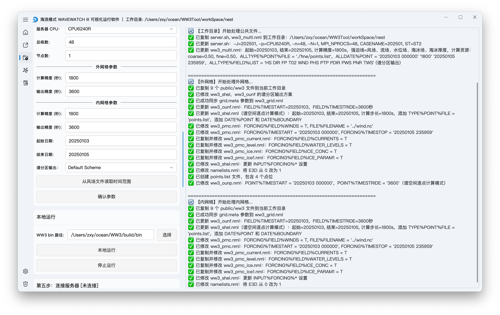

``` log
======================================================================
🔄 【工作目录】开始处理公共文件...
✅ 已复制 server.sh, ww3_multi.nml 到工作目录：/Users/zxy/ocean/WW3Tool/workSpace/nest
✅ 已更新 server.sh：-J=202501, -p=CPU6240R, -n=48, -N=1, MPI_NPROCS=48, CASENAME=202501, ST=ST2
✅ 已更新 ww3_multi.nml：起始=20250103, 结束=20250105, 计算精度=1800s，强迫场=风场、流场、水位场、海冰场、海冰厚度，计算资源：coarse=0.50, fine=0.50，ALLTYPE%POINT%FILE = './fine/points.list'，ALLDATE%POINT = '20250103 000000' '1800' '20250105 235959'，ALLTYPE%FIELD%LIST = 'HS DIR FP T02 WND PHS PTP PDIR PWS PNR TWS' (谱分区输出)

======================================================================
🔄 【外网格】开始处理外网格...
✅ 已复制 9 个 public/ww3 文件到当前工作目录
✅ 已修改 ww3_shel，ww3_ounf 的谱分区输出方案
✅ 已成功同步 grid.meta 参数到 ww3_grid.nml
✅ 已更新 ww3_ounf.nml：FIELD%TIMESTART=20250103，FIELD%TIMESTRIDE=3600秒
✅ 已更新 ww3_shel.nml（谱空间逐点计算模式）：起始=20250103, 结束=20250105, 计算步长=1800s，添加 TYPE%POINT%FILE = 'points.list'，添加 DATE%POINT 和 DATE%BOUNDARY
✅ 已修改 ww3_prnc.nml：FORCING%FIELD%WINDS = T, FILE%FILENAME = '../wind.nc'
✅ 已修改 ww3_prnc.nml：FORCING%TIMESTART = '20250103 000000', FORCING%TIMESTOP = '20250105 235959'
✅ 已复制并修改 ww3_prnc_current.nml：FORCING%FIELD%CURRENTS = T
✅ 已复制并修改 ww3_prnc_level.nml：FORCING%FIELD%WATER_LEVELS = T
✅ 已复制并修改 ww3_prnc_ice.nml：FORCING%FIELD%ICE_CONC = T
✅ 已复制并修改 ww3_prnc_ice1.nml：FORCING%FIELD%ICE_PARAM1 = T
✅ 已修改 ww3_shel.nml：更新 INPUT%FORCING%* 设置
✅ 已修改 namelists.nml：将 E3D 从 0 改为 1
✅ 已创建 points.list 文件，包含 4 个点位
✅ 已修改 ww3_ounp.nml：POINT%TIMESTART = '20250103 000000'，POINT%TIMESTRIDE = '3600'（谱空间逐点计算模式）

======================================================================
🔄 【内网格】开始处理内网格...
✅ 已复制 9 个 public/ww3 文件到当前工作目录
✅ 已成功同步 grid.meta 参数到 ww3_grid.nml
✅ 已更新 ww3_ounf.nml：FIELD%TIMESTART=20250103，FIELD%TIMESTRIDE=3600秒
✅ 已更新 ww3_shel.nml（谱空间逐点计算模式）：起始=20250103, 结束=20250105, 计算步长=1800s，添加 TYPE%POINT%FILE = 'points.list'，添加 DATE%POINT 和 DATE%BOUNDARY
✅ 已修改 ww3_prnc.nml：FORCING%FIELD%WINDS = T, FILE%FILENAME = '../wind.nc'
✅ 已修改 ww3_prnc.nml：FORCING%TIMESTART = '20250103 000000', FORCING%TIMESTOP = '20250105 235959'
✅ 已复制并修改 ww3_prnc_current.nml：FORCING%FIELD%CURRENTS = T
✅ 已复制并修改 ww3_prnc_level.nml：FORCING%FIELD%WATER_LEVELS = T
✅ 已复制并修改 ww3_prnc_ice.nml：FORCING%FIELD%ICE_CONC = T
✅ 已复制并修改 ww3_prnc_ice1.nml：FORCING%FIELD%ICE_PARAM1 = T
✅ 已修改 ww3_shel.nml：更新 INPUT%FORCING%* 设置
✅ 已修改 namelists.nml：将 E3D 从 0 改为 1
✅ 已创建 points.list 文件，包含 4 个点位
✅ 已修改 ww3_ounp.nml：POINT%TIMESTART = '20250103 000000'，POINT%TIMESTRIDE = '3600'（谱空间逐点计算模式）
```

We confirm parameters in step 4 and check the log output:

``` log
已复制 server.sh, ww3_multi.nml 到工作目录：/Users/zxy/ocean/WW3Tool/nest
```

We first copy server.sh and ww3_multi.nml from WW3Tool/public/ww3 to the work directory.


We use ww3_multi.nml to modify start time, precision, and forcing fields. This is similar to ww3_shel.nml.

``` sh
&INPUT_GRID_NML
  INPUT(1)%NAME                  = 'wind'
  INPUT(1)%FORCING%WINDS         = T
  
  INPUT(2)%NAME                  = 'current'
  INPUT(2)%FORCING%CURRENTS      = T
  
  INPUT(3)%NAME                  = 'level'
  INPUT(3)%FORCING%WATER_LEVELS  = T
  
  INPUT(4)%NAME                  = 'ice'
  INPUT(4)%FORCING%ICE_CONC      = T

  INPUT(5)%NAME                  = 'ice1'
  INPUT(5)%FORCING%ICE_PARAM1    = T
/

&MODEL_GRID_NML

  MODEL(1)%NAME                  = 'coarse'
  MODEL(1)%FORCING%WINDS         = 'native'
  MODEL(1)%FORCING%CURRENTS      = 'native'
  MODEL(1)%FORCING%WATER_LEVELS  = 'native'
  MODEL(1)%FORCING%ICE_CONC      = 'native'
  MODEL(1)%FORCING%ICE_PARAM1    = 'native'
  MODEL(1)%RESOURCE              = 1 1 0.00 0.35 F

  MODEL(2)%NAME                  = 'fine'
  MODEL(2)%FORCING%WINDS         = 'native'
  MODEL(2)%FORCING%CURRENTS      = 'native'
  MODEL(2)%FORCING%WATER_LEVELS  = 'native'
  MODEL(2)%FORCING%ICE_CONC      = 'native'
  MODEL(2)%FORCING%ICE_PARAM1    = 'native'
  MODEL(2)%RESOURCE              = 2 1 0.35 1.00 F
/
```

Note that MODEL(2)%FORCING%WINDS = 'native'. Here, native means enabled, and no means disabled.

MODEL(1)%RESOURCE and MODEL(2)%RESOURCE represent the resource allocation ratio.

Other logs are straightforward; we process the inner and outer grids in the same way as regular grids.

Notably, we set FILE%FILENAME = '../wind. nc' in ww3_prnc.nml to avoid duplicating forcing files and instead share references.

### Local Run

Local runs execute local.sh.

If you choose local execution, make sure WAVEWATCH III is configured locally and choose the bin directory containing the programs below.


### Connect to Server

First of all, you need:

### Automation

When opening a work directory, the app auto-detects converted forcing files and fills the related buttons.

It auto-reads grid extent and precision to fill step 2, detects coarse/fine folders, and switches to nested mode.

It auto-detects points. lits to switch to point output mode, and track_i.ww3 to switch to track mode.

It auto-reads server.sh Slurm parameters to fill step 4, and detects ww3_shel.nml precision, time range, and partition scheme.

### Settings Page

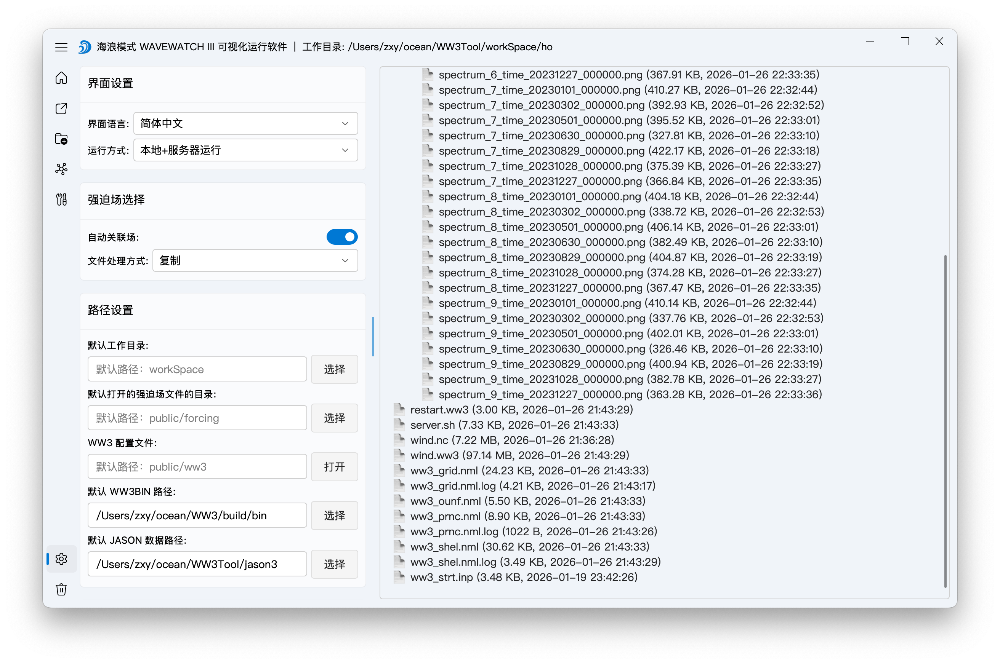

Most settings are saved automatically, except the partition output scheme.

#### Run Mode

Run mode only controls whether some UI elements are shown on the home page. It does not affect core logic.

For example, when local mode is selected, Slurm parameters are hidden.
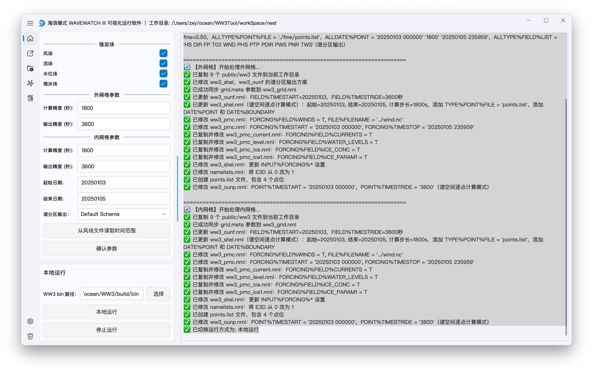

#### Forcing Selection

Forcing selection auto-links: if a file contains multiple forcing fields, other buttons are auto-filled.

File handling follows your forcing file preference: copy or move.

#### JASON Data Path

The JASON data path is used for plotting, e.g., comparing simulated wave heights with JASON 3 observations.

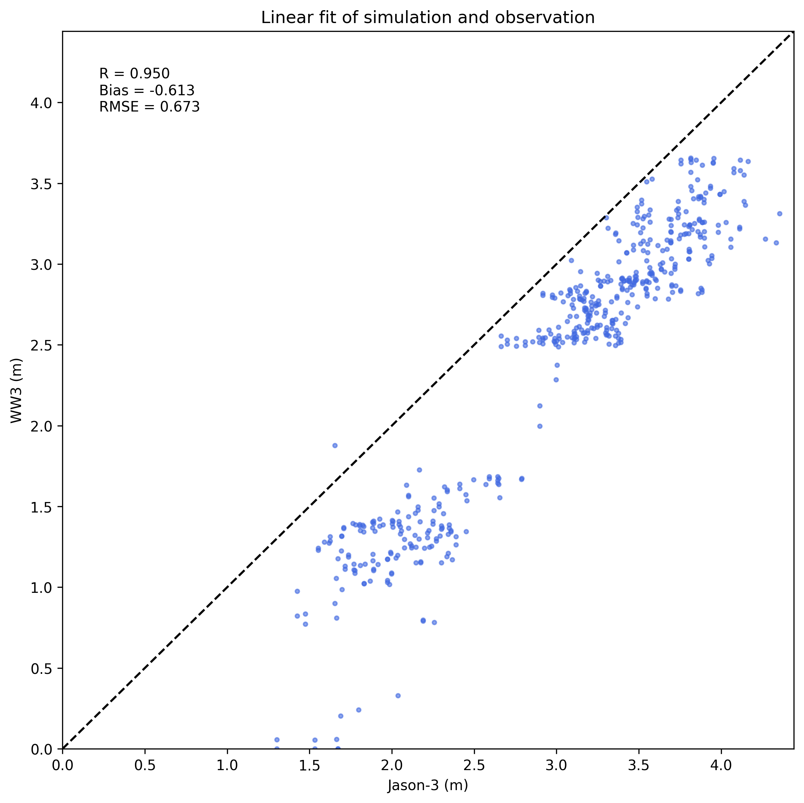

#### WW3 Configuration

WW3 configuration corresponds to step 4 defaults. Confirming parameters updates ww3_shel.nml and ww3_multi.nml precision, and ww3_ounf.nml, ww3_ounp.nml, ww3_trnc.nml output precision.

File splitting is the TIMESPLIT value in ww3_ounf.nml, ww3_ounp.nml, ww3_trnc.nml. If you compute a 3‑month range, monthly or yearly splits make sense; daily split creates a file per day.

Spectrum parameters, numerical integration time step, and nearshore settings are in ww3_grid.nml. Changes here update both WW3Tool and the current work directory's ww3_grid.nml (if present).

Partition output is configured in ww3_shel.nml, ww3_ounf, and ww3_ounp.

#### CPU Configuration

Run on the server:

``` sh
sinfo
```

This shows CPU information (if Slurm is configured).

Then go to Settings → Slurm parameters → CPU management, and set your server CPUs.


#### Server Connection

Fill in your SSH account and default login path. Every work directory is uploaded to this path.

<figure>
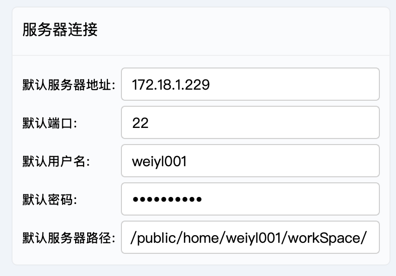
<figcaption aria-hidden="true">400</figcaption>
</figure>

#### ST Version Management

This is for managing different compiled WAVEWATCH versions. Just fill in their paths.

<figure>

<figcaption aria-hidden="true">400</figcaption>
</figure>

### Plotting

#### Wind Plot


#### 2D Spectrum Plot


#### Wave Height Plot


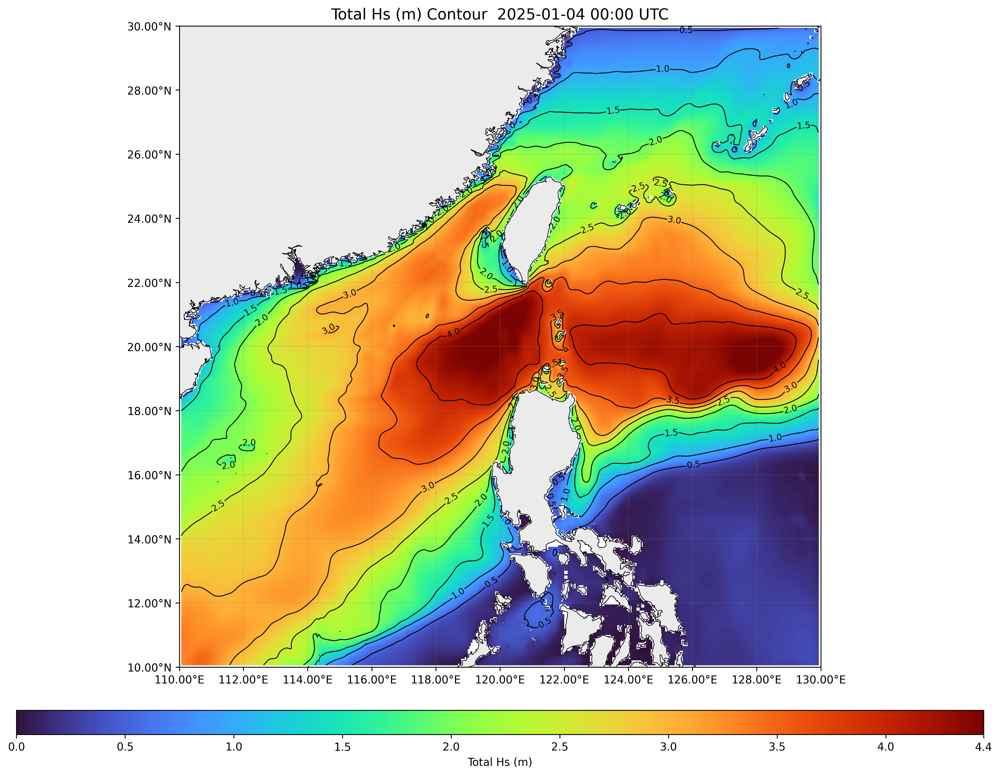

#### Swell Plot

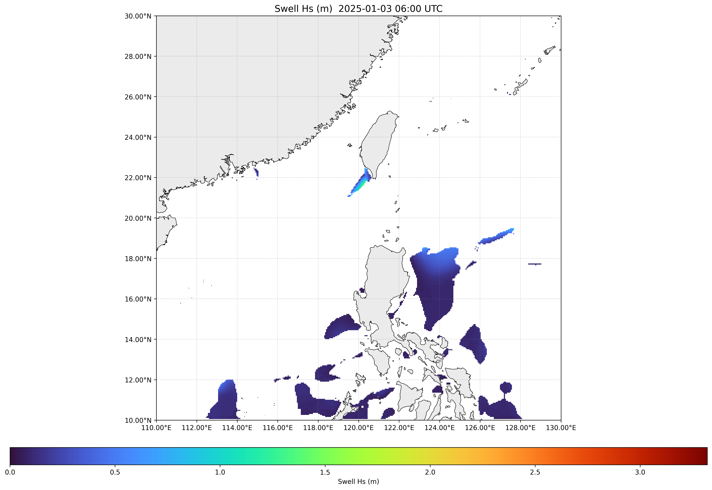
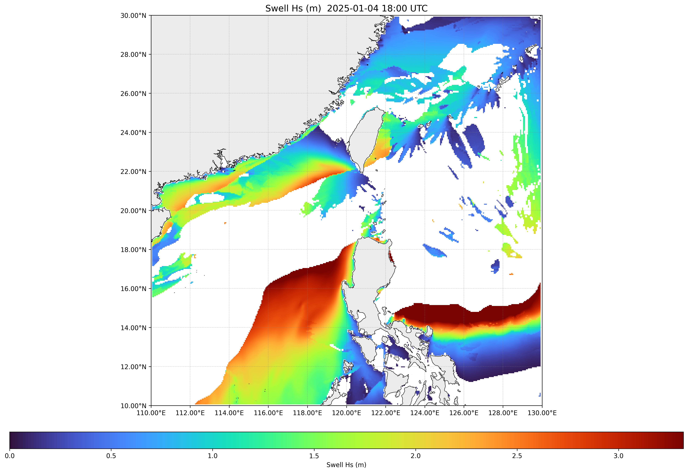

#### Satellite Fit Plot


## Data Sources

### Download Wind Files

#### ERA5

https://cds.climate.copernicus.eu/datasets/reanalysis-era5-single-levels?tab=download

The images below show ERA5 download steps. You need to register an account first. Use a real English name, not random letters.

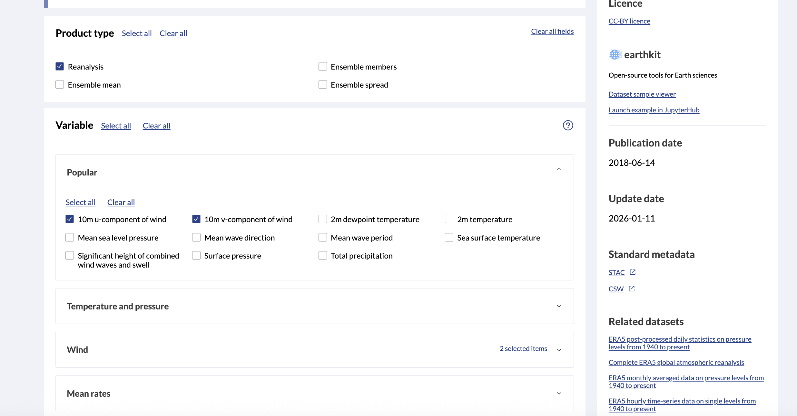


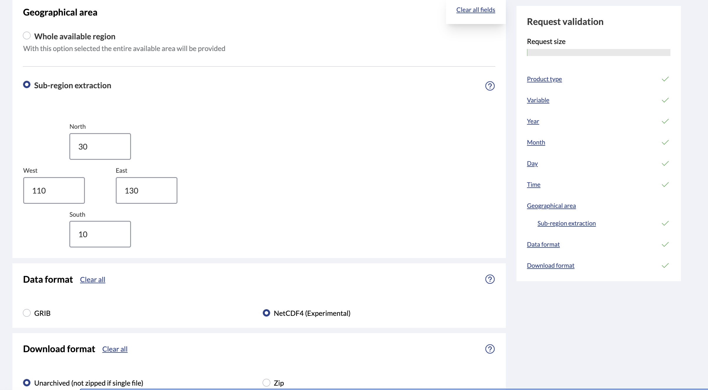


#### CFSR

http://tds.hycom.org/thredds/catalog/datasets/force/ncep_cfsv2/netcdf/catalog.html

Find cfsv2-sec2_2025_01hr_uv-10m.nc and note the uv-10m suffix.

To download global full-year data, click:

HTTPServer: //tds. hycom. org/thredds/fileServer/datasets/force/ncep_cfsv2/netcdf/cfsv2-sec2_2025_01hr_uv-10m. nc

To download a specific region and time range, click NetcdfSubset:
//ncss. hycom. org/thredds/ncss/grid/datasets/force/ncep_cfsv2/netcdf/cfsv2-sec2_2025_01hr_uv-10m. nc

After opening, select wndewd and wndnwd on the left, then choose Output Format: netCDF.

If you cannot input lat/lon, uncheck Disable horizontal subsetting.

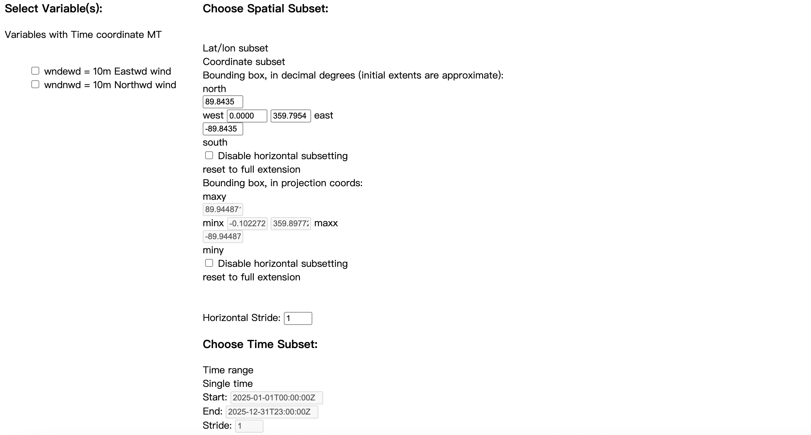

Then click Time range, enter the time range, and submit.

#### CCMP

https://data.remss.com/ccmp/v03.1/

This is straightforward. Just download directly.

### Download Currents and Water Level

https://data.marine.copernicus.eu/product/GLOBAL_ANALYSISFORECAST_PHY_001_024/download?dataset=cmems_mod_glo_phy_anfc_0.083deg_PT1H-m_202406

Choose Variables below. If you don't need water level, uncheck Sea surface height above geoid.

Then enter the range and time and click DOWNLOAD.


### Download Sea Ice

https://data.marine.copernicus.eu/product/GLOBAL_MULTIYEAR_PHY_001_030/download?dataset=cmems_mod_glo_phy_my_0.083deg_P1D-m_202311

You can download sea ice and currents.

Sea ice includes Sea ice area fraction and Sea ice thickness.


### JASON 3 Data

ftp:/ftp-oceans. ncei. noaa. gov/nodc/data/jason3-gdr/gdr
