# WW3Tool

[中文文档](README.zh-CN.md)

## Overview


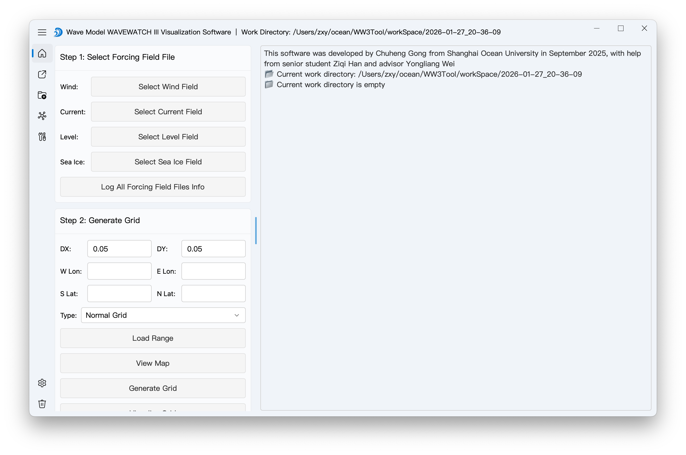

Youtube: https://m.youtube.com/watch?v=PHXLP1FrZmw&pp=ygUHd3czdG9vbA%3D%3D


WAVEWATCH III visualization and run tool (WW3Tool) is a pre-processing workflow tool for the WAVEWATCH III model. It helps you complete the basic WAVEWATCH III workflow.

This tool includes:

1.  Multiple forcing fields: wind (ERA5, CFSR, CCMP), currents (Copernicus), water level (Copernicus), sea ice (Copernicus), with automatic fixes (latitude ordering, time fixes, variable fixes).
2.  gridgen rectangular grid generation, supports up to two nested grids (Python version, no MATLAB dependency,Two-Way Nesting,same forcing field).
3.  Regional runs, 2D spectrum point runs, and track runs.
4.  Slurm script configuration.
5.  Automatic configuration for ww3_grid.nml, ww3_prnc.nml, ww3_shel.nml, ww3_ounf.nml, ww3_multi.nml, etc. (compute precision, output precision, time range, 2D spectrum points, track runs, partition output, forcing setup).
6.  Wave height plots, wave height videos, contour plots, 2D spectrum plots, JASON3 satellite tracks, 2D spectrum plots.

This software can run on Windows, Linux, and Mac, and is almost entirely composed of Python.

You must install WAVEWATCH III yourself on local or server environments. This tool does not provide an installer,please read https://github.com/ZxyGch/WAVEWATCH-III-INSTALL-TUTORIAL

My undergraduate major was not oceanography, and I am currently a first-year graduate student. The only WAVEWATCH III methods I know are these. If you have any more ideas, please contact me at atomgoto@gmail.com or issue.

If you find this tool useful, please give me a star 🥳

## Quick Start

``` sh
cd src

pip install -r requirements.txt

python main.py
```

If any packages fail to install or are missing, please install them manually.

If you are using Ubuntu, it is recommended

``` sh
cd src

sudo apt install python3-full python3-venv

python3 -m venv venv
source venv/bin/activate

pip install -r requirements.txt

python main.py
```

**Note: We also need to download gridgen/reference_data. The download instructions are provided in the below.**

## gridgen/reference_data

reference_data must be downloaded, otherwise grid generation will fail.

Run the download script: WW3Tool/gridgen/get_reference_data.py

Or download from OneDrive: https://tiangongeducn-my.sharepoint.com/:u:/g/personal/1911650207_tiangong_edu_cn/IQBGfWxOrWNlQphTeWCh-7AjAR-dtNWp7guSVhiyUH4dCW8?e=BdDBqQ

Or download from Baidu Netdisk: https://pan.baidu.com/s/1ec8DMcv8bp6MzNnFBkbAPA?pwd=ktch

**Finally place it under WW3Tool/gridgen/reference_data**

## Environment

Python ≥ 3.8 is supported.

Tested on:

- Windows 11
- Ubuntu 24
- macOS 15

WAVEWATCH III does not need to be installed locally. Local runs are optional and not recommended.

For actual runs, make sure the server has:

- WAVEWATCH III

- Slurm workload manager

## Feature Details

### Create a Work Directory

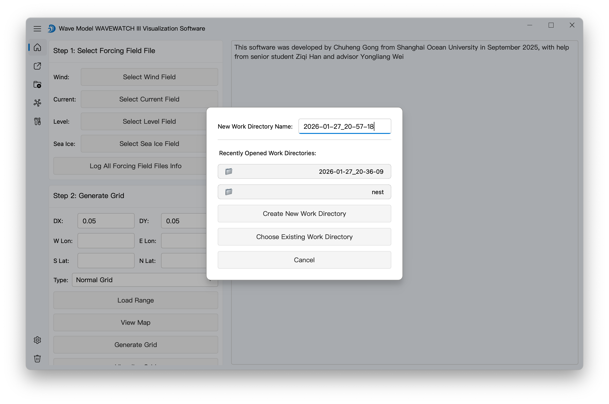

You must choose or create a work directory when the app starts. This step is required and cannot be skipped.

The default new work directory name is the current time. Up to 3 recent work directories are shown.

A work directory is just a folder for files generated during runs, such as grid files, forcing files, and WAVEWATCH III configuration files.

The default work directory is WW3Tool/workSpace. You can change it on the settings page.

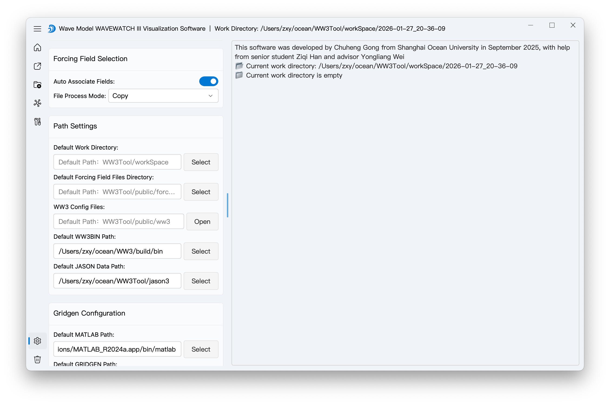

### Select Forcing Files

Wind fields can use data from [ERA5](https://cds.climate.copernicus.eu/datasets/reanalysis-era5-single-levels?tab=download), [CFSR](http://tds.hycom.org/thredds/catalog/datasets/force/ncep_cfsv2/netcdf/catalog.html), and [CCMP](https://data.remss.com/ccmp/v03.1/).

For other forcing fields, I only tested Copernicus currents, water level, and sea ice.

I have pre-prepared a few forcing files under WW3Tool/public/forcing. You can select them directly (for testing only).

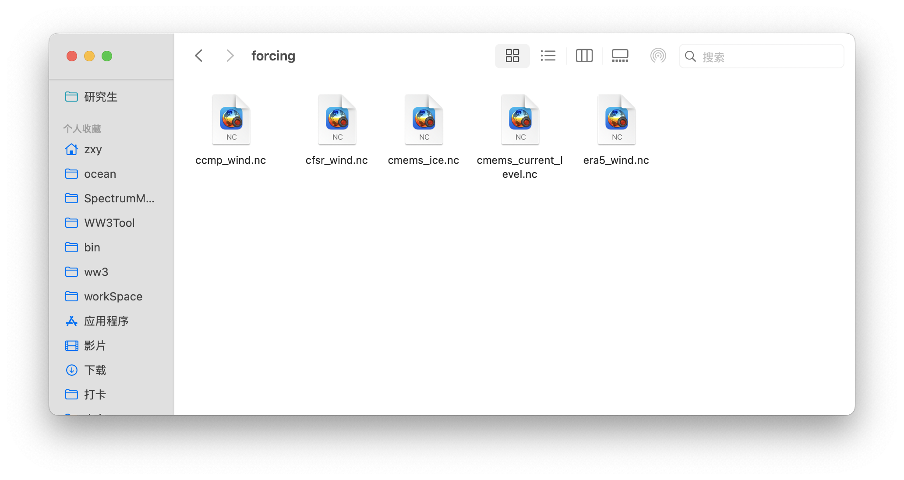

WAVEWATCH requires latitude to be ascending. ERA5 wind data is descending by default, so the app checks and automatically reverses if needed.

CFSR wind variables are also auto-fixed to match WW3 requirements.

Copernicus forcing timestamps are auto-fixed during this process as well.

Forcing files are automatically copied (or cut, configurable in settings) to the current work directory and renamed to wind.nc, current.nc, level.nc, ice.nc. The log panel shows file info.

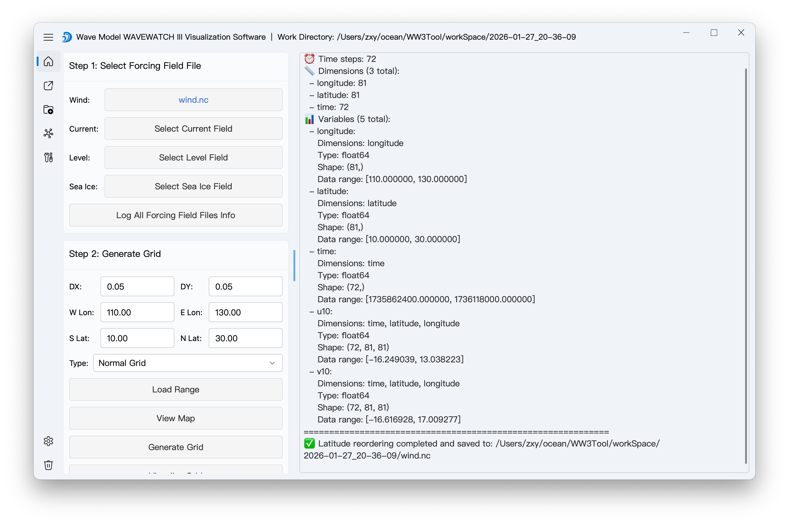

Usually only wind forcing is needed. The software does not allow using other forcing fields without wind.

If a single file contains multiple forcing fields, the related buttons are auto-filled. The file is named like current_level.nc in the work directory to indicate the contained fields.

### Generate Grid Files

#### reference_data

Before generating grids, run get_reference_data.py in WW3Tool/gridgen to download bathymetry data (gebco, etop1, etop2) and coastline boundaries. It downloads and extracts into reference_data.

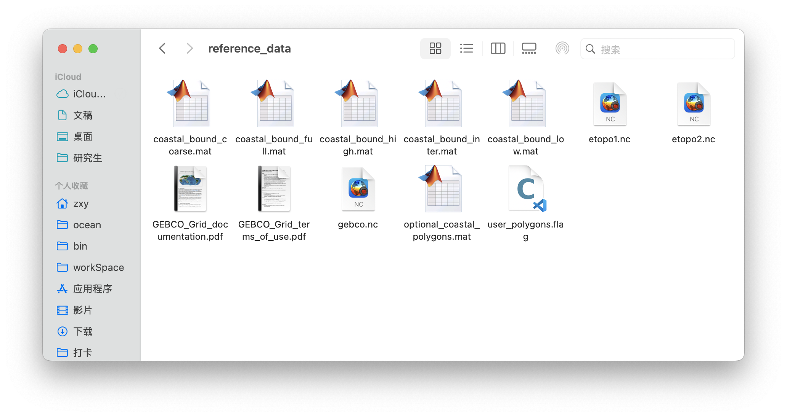

#### Regular Grid

Run the app, choose a domain from wind.nc, and click Generate Grid. This calls WW3Tool/gridgen to generate grid files into the work directory.

Smaller DX/DY yields higher accuracy because DX/DY is the grid spacing.


Four files are produced in the work directory: grid.bot, grid.obst, grid.meta, grid.mask.

#### Nested Grid

Choose type: Nested grid.

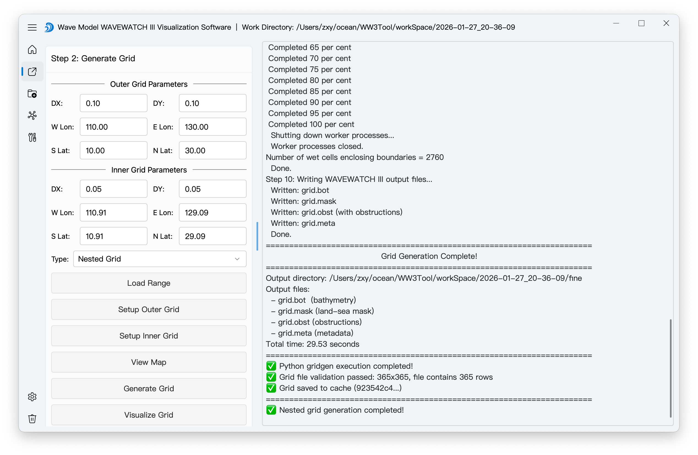

For nested meshes, we use two-way nesting, rectangular meshes, and a spherical coordinate system. Other meshes are not currently supported (if you know how to use other meshes, please let me know and I will add them to the software).

We define a nested grid shrink factor on the settings page. The default is 1.1x.

When setting the outer grid, it expands from the inner grid by 1.1x.

When setting the inner grid, it shrinks from the outer grid by 1.1x.

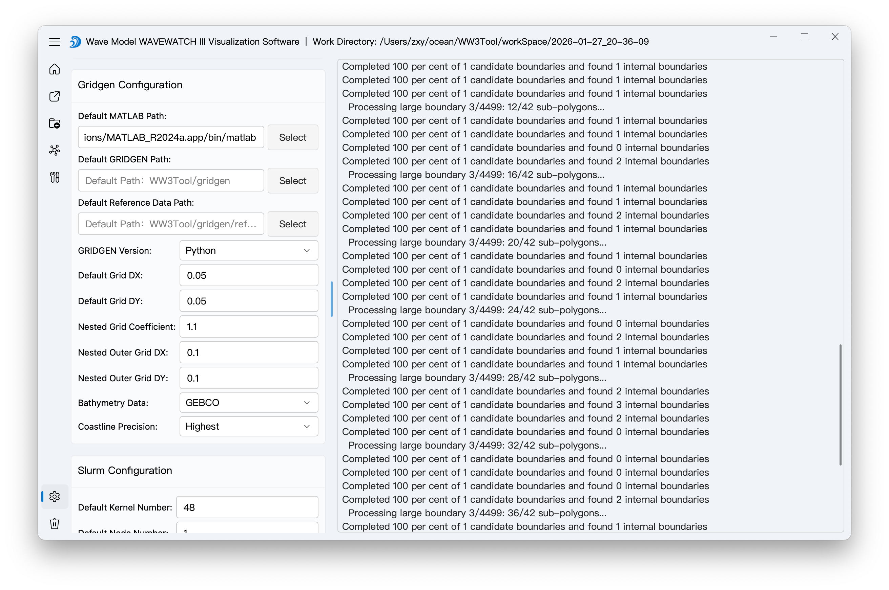

Nested grid generation runs twice: once for the outer grid and once for the inner grid.

In nested mode, two folders are created under the work directory: coarse (outer) and fine (inner).

When coarse and fine exist, opening the directory automatically switches to nested mode. This affects later operations, so if coarse/fine or other grid files already exist, switching the grid type is disabled.

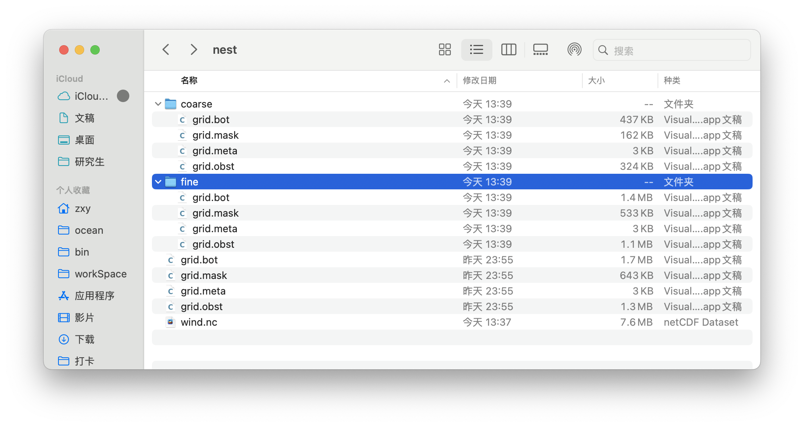

#### Grid Cache

To avoid repeated computation, each grid is cached under WW3Tool/gridgen/cache.

A cache key based on parameters becomes the folder name. When generating, the cache is checked first and reused if available.

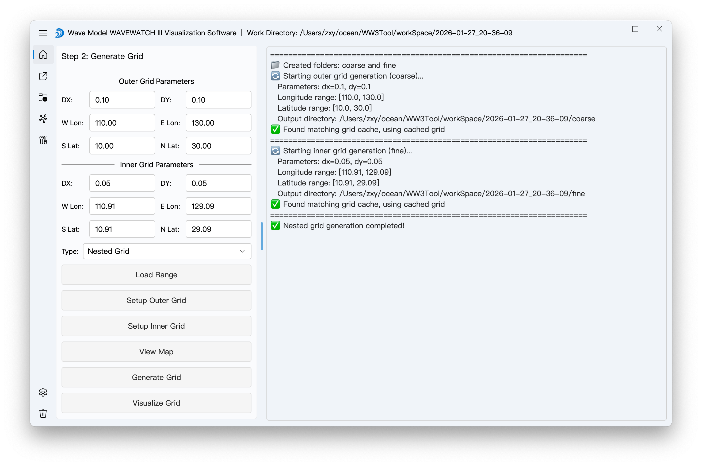

Each cache folder includes params. json:

``` json
{
  "cache_key": "c161115dfd8bde7b30fd01826a3c292ada7835df377a81b9ee59f73acc28328b",
  "source_dir": "/Users/zxy/ocean/WW3Tool/workSpace/2026-01-11_23-18-38",
  "parameters": {
    "dx": 0.05,
    "dy": 0.05,
    "lon_range": [
      110.0,
      130.0
    ],
    "lat_range": [
      10.0,
      30.0
    ],
    "ref_dir": "/Users/zxy/ocean/WW3Tool/gridgen/reference_data",
    "bathymetry": "GEBCO",
    "coastline_precision": "full"
  }
}
```

#### MATLAB vs Python Versions

We originally used the [gridgen](https://data-ww3.ifremer.fr/COURS/WAVES_SHORT_COURSE/TOOLS/GRIDGEN/) version from Ifremer. The NOAA version is at https://github.com/NOAA-EMC/gridgen.

Because they are MATLAB-based, it was cumbersome, so I converted it to a Python version. The default is now Python.

If you really want to use MATLAB Gridgen (not recommended), you can switch it in settings and configure the MATLAB path.

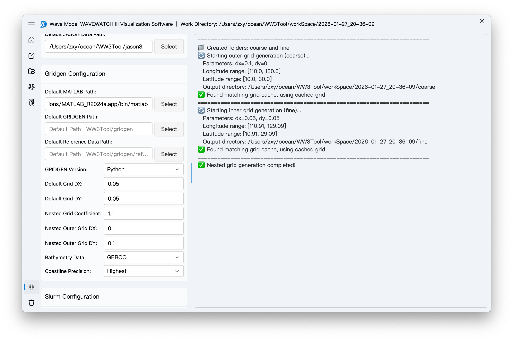

#### gridgen Settings


Gridgen settings allow you to change many parameters:

- GRIDGEN version: default is Python (much faster than MATLAB, no dependency).

- Default DX/DY for regular grids is the X/Y spacing. Larger DX/DY means a smaller grid and lower precision.

- Nested grid shrink factor: controls auto scaling for inner/outer grids.

- Bathymetry data: gebco, etop1, etop2. We typically use gebco (highest precision), then etop2, then etop1.

- Coastline boundary precision: typically the highest precision.

### Choose Run Mode

The three run modes have similar computational cost, but outputs differ. Spectrum point mode and track mode look like they compute only a few points, but they still compute the entire domain.

Regular regional mode corresponds to ww3_ounf output.

Spectrum point mode adds ww3_ounp.

Track mode corresponds to ww3_trnc.

#### Regional Mode

Regular output mode.

#### Spectrum Point Mode

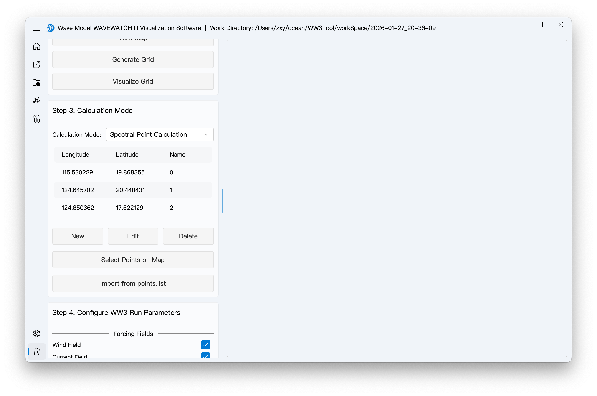

You can pick points from the map to open a window.

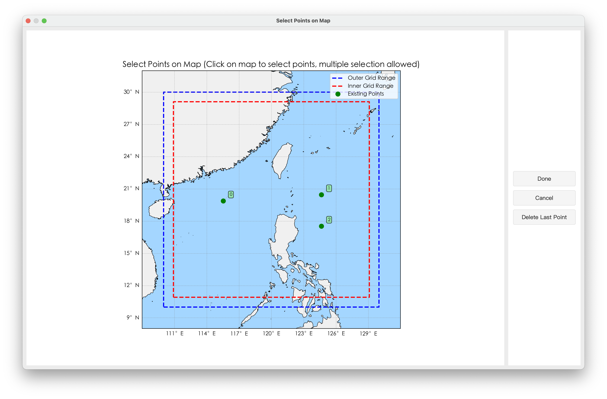

Click points on the map. The blue dashed rectangle shows the grid extent; points must be within it. Then click **Confirm and add points**.

When confirming parameters in step 4, a points.list file is generated in the work directory.

``` swift
117 18 '0'
126 21 '1'
127 20 '2'
115 15 '3'
128 14 '4'
126 18 '5'
```

The three columns in points.list are longitude, latitude, and point name. If a work directory contains points.list, the app switches to spectrum point mode and loads the points.

After running WW3, you can get ww3.2025_spec.nc in the plotting page.

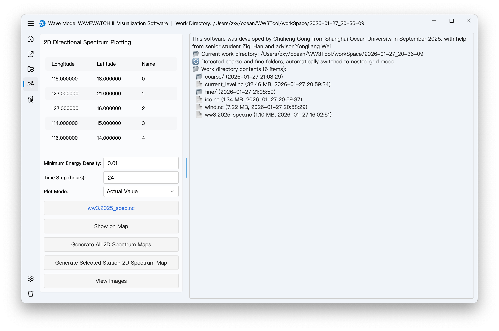

Then you can plot 2D spectra.


#### Track Mode

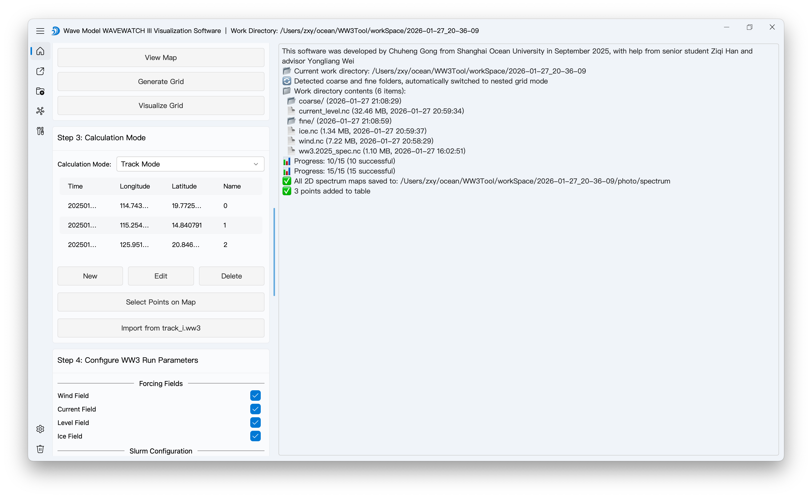

Similar to spectrum point mode, but adds a time column. Step 4 generates a file: track_i.ww3, with the format below:

``` swift
WAVEWATCH III TRACK LOCATIONS DATA     
20250103 000000   115.4   19.7    0
20250103 000000   127.6   19.7    1
20250103 000000   127.6   15.6    2
```

Finally, ww3_trnc outputs a ww3.2025 file.

### Configure Run Parameters

The example below uses track mode, which produces more logs than regular regional mode.

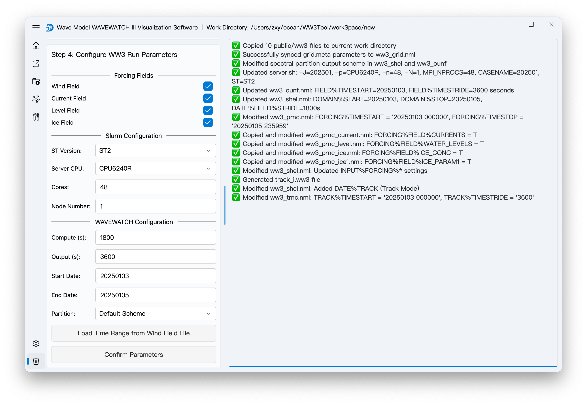

``` log
✅ Copied 10 public/ww3 files to current work directory
✅ Successfully synced grid.meta parameters to ww3_grid.nml
✅ Modified spectral partition output scheme in ww3_shel and ww3_ounf
✅ Updated server.sh: -J=202501, -p=CPU6240R, -n=48, -N=1, MPI_NPROCS=48, CASENAME=202501, ST=ST2
✅ Updated ww3_ounf.nml: FIELD%TIMESTART=20250103, FIELD%TIMESTRIDE=3600 seconds
✅ Updated ww3_shel.nml: DOMAIN%START=20250103, DOMAIN%STOP=20250105, DATE%FIELD%STRIDE=1800s
✅ Modified ww3_prnc.nml: FORCING%TIMESTART = '20250103 000000', FORCING%TIMESTOP = '20250105 235959'
✅ Copied and modified ww3_prnc_current.nml: FORCING%FIELD%CURRENTS = T
✅ Copied and modified ww3_prnc_level.nml: FORCING%FIELD%WATER_LEVELS = T
✅ Copied and modified ww3_prnc_ice.nml: FORCING%FIELD%ICE_CONC = T
✅ Copied and modified ww3_prnc_ice1.nml: FORCING%FIELD%ICE_PARAM1 = T
✅ Modified ww3_shel.nml: Updated INPUT%FORCING%* settings
✅ Generated track_i.ww3 file
✅ Modified ww3_shel.nml: Added DATE%TRACK (Track Mode)
✅ Modified ww3_trnc.nml: TRACK%TIMESTART = '20250103 000000', TRACK%TIMESTRIDE = '3600'
```

#### Regular Grid

First, all files under WW3Tool/bin/public/ww3 are copied into the current work directory.

``` swift
✅ Copied 9 public/ww3 files to current work directory
```

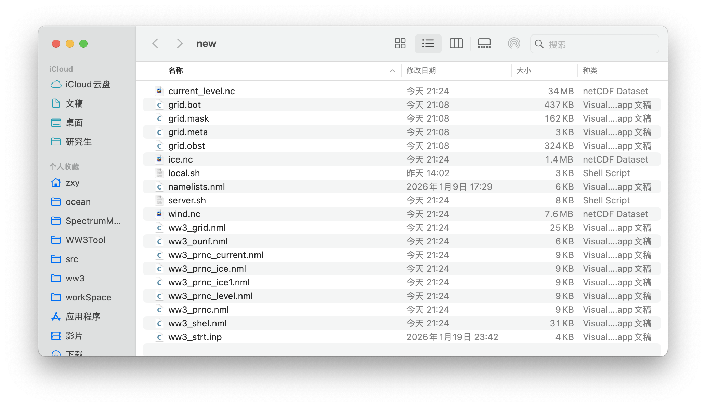

------------------------------------------------------------------------

Next:

``` log
✅ Successfully synced grid.meta parameters to ww3_grid.nml
```

We convert the grid. meta section:

``` swift
   'RECT'  T 'NONE'
401      401 
 3.00       3.00      60.00 
110.0000       10.0000       1.00
```

Into the ww3_grid.nml section:

```
&RECT_NML
   RECT%NX           =  401
   RECT%NY           =  401
   RECT%SX           =  3.000000
   RECT%SY           =  3.000000
   RECT%SF           =  60.000000
   RECT%X0           =  110.000000
   RECT%Y0           =  10.000000
   RECT%SF           =  60.000000
/
```


------------------------------------------------------------------------

Then modify the partition output plan:

``` swift
✅ Modified spectral partition output scheme in ww3_shel and ww3_ounf
```

TYPE%FIELD%LIST in ww3_shel.nml:

``` swift
&OUTPUT_TYPE_NML
  TYPE%FIELD%LIST       = 'HS DIR FP T02 WND PHS PTP PDIR PWS PNR TWS'
/
```

FIELD%LIST in ww3_ounf.nml:

``` swift
&FIELD_NML
  FIELD%TIMESTART        =  '20250103 000000'
  FIELD%TIMESTRIDE       =  '3600'
  FIELD%LIST             =  'HS DIR FP T02 WND PHS PTP PDIR PWS PNR TWS'
  FIELD%PARTITION        =  '0 1'
  FIELD%TYPE             =  4
/
```

------------------------------------------------------------------------

Then update server.sh:

``` log
✅ Updated server.sh: -J=202501, -p=CPU6240R, -n=48, -N=1, MPI_NPROCS=48, CASENAME=202501, ST=ST2
```

``` sh
#SBATCH -J 202501
#SBATCH -p CPU6240R
#SBATCH -n 48
#SBATCH -N 1
#SBATCH --time=2880:00:00

#wavewatch3--ST2
export PATH=/public/home/weiyl001/software/wavewatch3/model/exe/exe:$PATH

MPI_NPROCS=48

CASENAME=202501
```

------------------------------------------------------------------------

``` log
✅ Updated ww3_ounf.nml: FIELD%TIMESTART=20250103, FIELD%TIMESTRIDE=3600 seconds
```

Then update ww3_ounf.nml and find:

``` swift
&FIELD_NML
  FIELD%TIMESTART        =  '20250103 000000'
  FIELD%TIMESTRIDE       =  '3600'
  FIELD%LIST             =  'HS LM T02 T0M1 T01 FP DIR SPR DP PHS PTP PLP PDIR PSPR PWS TWS PNR'
  FIELD%PARTITION        =  '0 1'
  FIELD%TYPE             =  4
/
```

FIELD%TIMESTART is the start time, and FIELD%TIMESTRIDE is the output stride.

------------------------------------------------------------------------

``` log
✅ Updated ww3_shel.nml: DOMAIN%START=20250103, DOMAIN%STOP=20250105, DATE%FIELD%STRIDE=1800s
```

Update ww3_shel.nml:

``` swift
&DOMAIN_NML
  DOMAIN%START           =  '20250103 000000'
  DOMAIN%STOP            =  '20250105 235959'
/

&OUTPUT_DATE_NML
  DATE%FIELD          = '20250103 000000' '1800' '20250105 235959'
  DATE%RESTART        = '20250103 000000' '86400' '20250105 235959'
/
```

The dates define the start/stop range, and '1800' in DATE%FIELD is the time step.

------------------------------------------------------------------------

Then update the time range in ww3_prnc.nml:

``` sh
&FORCING_NML
  FORCING%TIMESTART            = '19000101 000000'  
  FORCING%TIMESTOP             = '29001231 000000'  
  FORCING%FIELD%WINDS          = T
  FORCING%FIELD%CURRENTS       = F
  FORCING%FIELD%WATER_LEVELS   = F
  FORCING%FIELD%ICE_CONC       = F
  FORCING%FIELD%ICE_PARAM1     = F
  FORCING%GRID%LATLON          = T
/
```

Based on the selected forcing fields, we generate ww3_prnc_current.nml and ww3_prnc_level.nml. For ice, concentration and thickness become ww3_prnc_ice.nml and ww3_prnc_ice1.nml.

We toggle forcing switches based on the selected fields. Each forcing switch can only enable one, but ww3_prnc is used multiple times later.

We also update forcing file names and variables:

```
&FILE_NML
  FILE%FILENAME      = 'wind.nc'
  FILE%LONGITUDE     = 'longitude'
  FILE%LATITUDE      = 'latitude'
  FILE%VAR(1)        = 'u10'
  FILE%VAR(2)        = 'v10'
/
```

------------------------------------------------------------------------

``` log
✅ Modified ww3_shel.nml: Updated INPUT%FORCING%* settings
```

Then update ww3_shel.nml based on selected forcing fields:

```
&INPUT_NML
  INPUT%FORCING%WINDS         = 'T'
  INPUT%FORCING%WATER_LEVELS  = 'T'
  INPUT%FORCING%CURRENTS      = 'T'
  INPUT%FORCING%ICE_CONC      = 'T'
  INPUT%FORCING%ICE_PARAM1    = 'T'
/
```

------------------------------------------------------------------------

Based on the current track points or spectrum point list, we generate:

``` log
✅ Generated track_i.ww3 file
```

------------------------------------------------------------------------

``` log
✅ Modified ww3_shel.nml: Added DATE%TRACK (Track Mode)
```

We also add to ww3_shel.nml:

```
&OUTPUT_DATE_NML
   DATE%FIELD          = '20250103 000000' '1800' '20250105 235959'
   DATE%TRACK          = '20250103 000000' '1800' '20250103 000000'
   DATE%RESTART        = '20250103 000000' '86400' '20250105 235959'
/
```

------------------------------------------------------------------------

``` log
✅ Modified ww3_trnc.nml: TRACK%TIMESTART = '20250103 000000', TRACK%TIMESTRIDE = '3600'
```

In track mode we also update ww3_trnc.nml:

```
&TRACK_NML
  TRACK%TIMESTART        =  '20250103 000000'
  TRACK%TIMESTRIDE       =  '3600'
  TRACK%TIMESPLIT        =  8
/
```


------------------------------------------------------------------------

``` log
✅ Updated namelists.nml: Changed E3D from 0 to 1 (Spectral Point Calculation Mode)
```

In 2D spectrum point mode, we also modify namelists.nml:

``` swift
&OUTS E3D = 0 /
```

#### Nested Grid

We first generate nested grids, creating coarse and fine under the work directory, then select 2D spectrum mode.

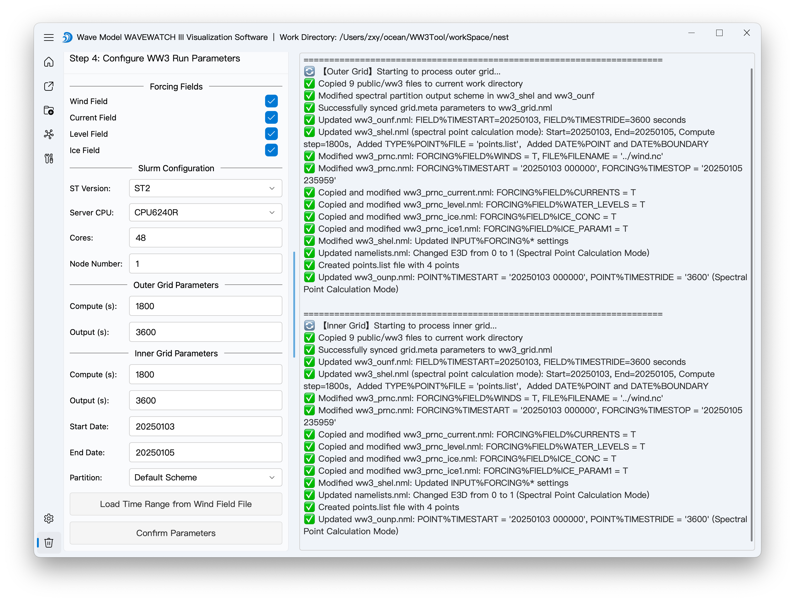

``` log
======================================================================
🔄 【Work Directory】Starting to process public files...
✅ Copied server.sh, ww3_multi.nml to work directory: /Users/zxy/ocean/WW3Tool/workSpace/nest
✅ Updated server.sh: -J=202501, -p=CPU6240R, -n=48, -N=1, MPI_NPROCS=48, CASENAME=202501, ST=ST2
✅ Updated ww3_multi.nml: Start=20250103, End=20250105, Compute precision=1800s，Forcing Fields=Wind Field、Current Field、Level Field、Ice Field、Ice Thickness，Compute Resources: coarse=0.50, fine=0.50，ALLTYPE%POINT%FILE = './fine/points.list'，ALLDATE%POINT = '20250103 000000' '1800' '20250105 235959'，ALLTYPE%FIELD%LIST = 'HS DIR FP T02 WND PHS PTP PDIR PWS PNR TWS' (spectral partition output)

======================================================================
🔄 【Outer Grid】Starting to process outer grid...
✅ Copied 9 public/ww3 files to current work directory
✅ Modified spectral partition output scheme in ww3_shel and ww3_ounf
✅ Successfully synced grid.meta parameters to ww3_grid.nml
✅ Updated ww3_ounf.nml: FIELD%TIMESTART=20250103, FIELD%TIMESTRIDE=3600 seconds
✅ Updated ww3_shel.nml (spectral point calculation mode): Start=20250103, End=20250105, Compute step=1800s，Added TYPE%POINT%FILE = 'points.list'，Added DATE%POINT and DATE%BOUNDARY
✅ Modified ww3_prnc.nml: FORCING%FIELD%WINDS = T, FILE%FILENAME = '../wind.nc'
✅ Modified ww3_prnc.nml: FORCING%TIMESTART = '20250103 000000', FORCING%TIMESTOP = '20250105 235959'
✅ Copied and modified ww3_prnc_current.nml: FORCING%FIELD%CURRENTS = T
✅ Copied and modified ww3_prnc_level.nml: FORCING%FIELD%WATER_LEVELS = T
✅ Copied and modified ww3_prnc_ice.nml: FORCING%FIELD%ICE_CONC = T
✅ Copied and modified ww3_prnc_ice1.nml: FORCING%FIELD%ICE_PARAM1 = T
✅ Modified ww3_shel.nml: Updated INPUT%FORCING%* settings
✅ Updated namelists.nml: Changed E3D from 0 to 1 (Spectral Point Calculation Mode)
✅ Created points.list file with 4 points
✅ Updated ww3_ounp.nml: POINT%TIMESTART = '20250103 000000', POINT%TIMESTRIDE = '3600' (Spectral Point Calculation Mode)

======================================================================
🔄 【Inner Grid】Starting to process inner grid...
✅ Copied 9 public/ww3 files to current work directory
✅ Successfully synced grid.meta parameters to ww3_grid.nml
✅ Updated ww3_ounf.nml: FIELD%TIMESTART=20250103, FIELD%TIMESTRIDE=3600 seconds
✅ Updated ww3_shel.nml (spectral point calculation mode): Start=20250103, End=20250105, Compute step=1800s，Added TYPE%POINT%FILE = 'points.list'，Added DATE%POINT and DATE%BOUNDARY
✅ Modified ww3_prnc.nml: FORCING%FIELD%WINDS = T, FILE%FILENAME = '../wind.nc'
✅ Modified ww3_prnc.nml: FORCING%TIMESTART = '20250103 000000', FORCING%TIMESTOP = '20250105 235959'
✅ Copied and modified ww3_prnc_current.nml: FORCING%FIELD%CURRENTS = T
✅ Copied and modified ww3_prnc_level.nml: FORCING%FIELD%WATER_LEVELS = T
✅ Copied and modified ww3_prnc_ice.nml: FORCING%FIELD%ICE_CONC = T
✅ Copied and modified ww3_prnc_ice1.nml: FORCING%FIELD%ICE_PARAM1 = T
✅ Modified ww3_shel.nml: Updated INPUT%FORCING%* settings
✅ Updated namelists.nml: Changed E3D from 0 to 1 (Spectral Point Calculation Mode)
✅ Created points.list file with 4 points
✅ Updated ww3_ounp.nml: POINT%TIMESTART = '20250103 000000', POINT%TIMESTRIDE = '3600' (Spectral Point Calculation Mode)
```

We confirm parameters in step 4 and check the log output:

``` log
✅ Copied server.sh, ww3_multi.nml to work directory: /Users/zxy/ocean/WW3Tool/workSpace/nest
```

We first copy server.sh and ww3_multi.nml from WW3Tool/public/ww3 to the work directory.


We use ww3_multi.nml to modify start time, precision, and forcing fields. This is similar to ww3_shel.nml.

``` sh
&INPUT_GRID_NML
  INPUT(1)%NAME                  = 'wind'
  INPUT(1)%FORCING%WINDS         = T
  
  INPUT(2)%NAME                  = 'current'
  INPUT(2)%FORCING%CURRENTS      = T
  
  INPUT(3)%NAME                  = 'level'
  INPUT(3)%FORCING%WATER_LEVELS  = T
  
  INPUT(4)%NAME                  = 'ice'
  INPUT(4)%FORCING%ICE_CONC      = T

  INPUT(5)%NAME                  = 'ice1'
  INPUT(5)%FORCING%ICE_PARAM1    = T
/

&MODEL_GRID_NML

  MODEL(1)%NAME                  = 'coarse'
  MODEL(1)%FORCING%WINDS         = 'native'
  MODEL(1)%FORCING%CURRENTS      = 'native'
  MODEL(1)%FORCING%WATER_LEVELS  = 'native'
  MODEL(1)%FORCING%ICE_CONC      = 'native'
  MODEL(1)%FORCING%ICE_PARAM1    = 'native'
  MODEL(1)%RESOURCE              = 1 1 0.00 0.35 F

  MODEL(2)%NAME                  = 'fine'
  MODEL(2)%FORCING%WINDS         = 'native'
  MODEL(2)%FORCING%CURRENTS      = 'native'
  MODEL(2)%FORCING%WATER_LEVELS  = 'native'
  MODEL(2)%FORCING%ICE_CONC      = 'native'
  MODEL(2)%FORCING%ICE_PARAM1    = 'native'
  MODEL(2)%RESOURCE              = 2 1 0.35 1.00 F
/
```

Note that MODEL (2)%FORCING%WINDS = 'native'. Here, native means enabled, and no means disabled.

MODEL (1)%RESOURCE and MODEL (2)%RESOURCE represent the resource allocation ratio.

Other logs are straightforward; we process the inner and outer grids in the same way as regular grids.

Notably, we set FILE%FILENAME = '../wind.nc' in ww3_prnc.nml to avoid duplicating forcing files and instead share references.

### Local Run

Local runs execute local.sh.

If you choose local execution, make sure WAVEWATCH III is configured locally and choose the bin directory containing the programs below.


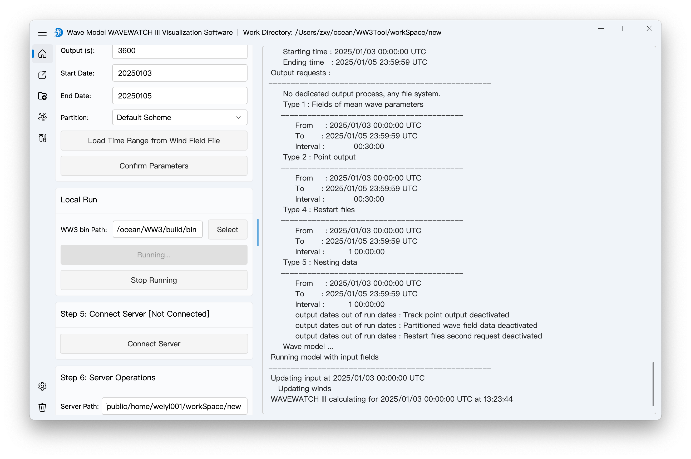

### Connect to Server

First, you need to configure the ssh account and password. On the settings page, we find the server configuration option.

Pay attention to the default server path. This is the path where your server stores the working directory.

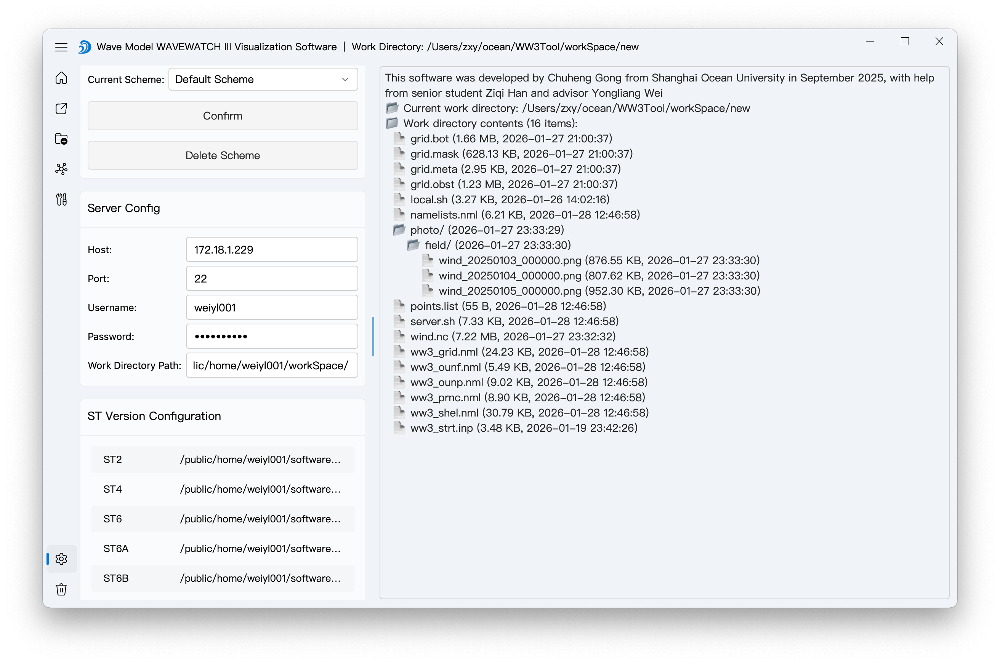

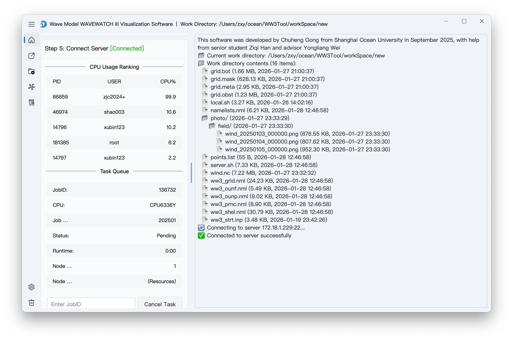

Click to connect to the server. After the connection is successful, a CPU usage ranking will be displayed first. This list will be refreshed every second.

If you submit the calculation task to Slurm in step 6, the task queue will also be displayed.

### Server operations

To view the task queue, execute squeue -l on the server.

Uploading the working directory to the server means uploading the current working directory to the server working directory. This is configured on the settings page.

Submitting a computing task means executing the server.sh script on the server. If it runs successfully (all instructions run normally), a success. log will be generated in the server working directory, containing all execution logs. If it fails, a fail. log will be generated, which also contains all execution logs.

Checking whether it has completed is detecting whether there is success. log or fail. log

Clearing the folder means clearing the current server working directory folder.

Downloading the results to the local computer will automatically download all ww3\*nc files. If it is nested grid mode, only the result files in fine will be downloaded.

Downloading the log file means downloading success. log or fail. log

### Automation

When opening a work directory, the app auto-detects converted forcing files and fills the related buttons.

It auto-reads grid extent and precision to fill step 2, detects coarse/fine folders, and switches to nested mode.

It auto-detects points.list to switch to point output mode, and track_i.ww3 to switch to track mode.

It auto-reads server.sh Slurm parameters to fill step 4, and detects ww3_shel.nml precision, time range, and partition scheme.

### Settings Page

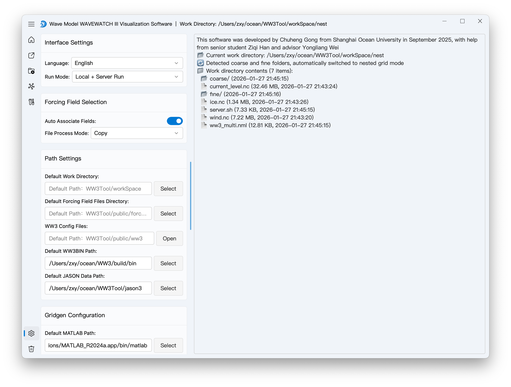

Most settings are saved automatically, except the partition output scheme.

#### Run Mode

Run mode only controls whether some UI elements are shown on the home page. It does not affect core logic.

For example, when local mode is selected, Slurm parameters are hidden.

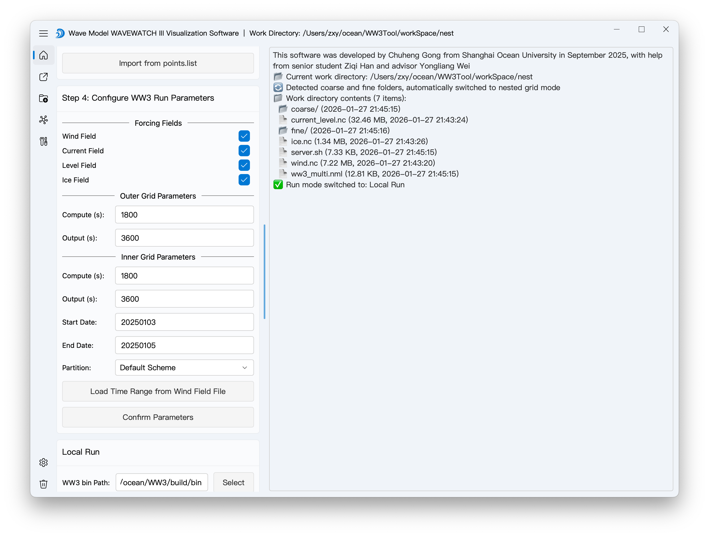

#### Forcing Selection

Forcing selection auto-links: if a file contains multiple forcing fields, other buttons are auto-filled.

File handling follows your forcing file preference: copy or move.

#### JASON Data Path

The JASON data path is used for plotting, e.g., comparing simulated wave heights with JASON 3 observations.


#### WW3 Configuration

WW3 configuration corresponds to step 4 defaults. Confirming parameters updates ww3_shel.nml and ww3_multi.nml precision, and ww3_ounf.nml, ww3_ounp.nml, ww3_trnc.nml output precision.

File splitting is the TIMESPLIT value in ww3_ounf.nml, ww3_ounp.nml, ww3_trnc.nml. If you compute a 3‑month range, monthly or yearly splits make sense; daily split creates a file per day.

Spectrum parameters, numerical integration time step, and nearshore settings are in ww3_grid.nml. Changes here update both WW3Tool and the current work directory's ww3_grid.nml (if present).

Partition output is configured in ww3_shel.nml, ww3_ounf, and ww3_ounp.

#### CPU Configuration

Run on the server:

``` sh
sinfo
```

This shows CPU information (if Slurm is configured).

Then go to Settings → Slurm parameters → CPU management, and set your server CPUs.


#### Server Connection

Fill in your SSH account and work directory path.

Every work directory is uploaded to this work directory path.

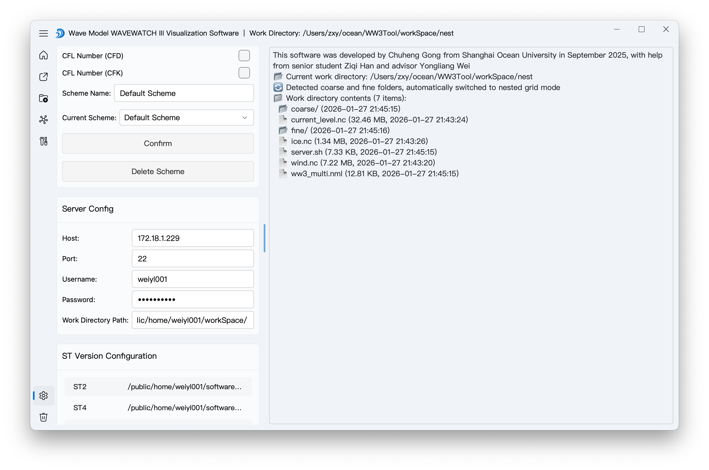

#### ST Version Management

This is for managing different compiled WAVEWATCH versions. Just fill in their paths.

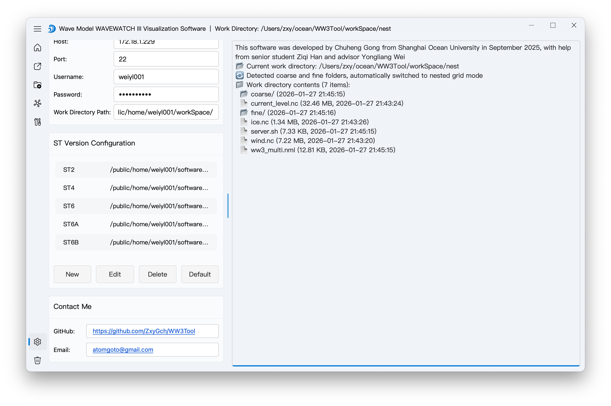

### Plotting

#### Wind Field Plot


#### 2D Spectrum Plot

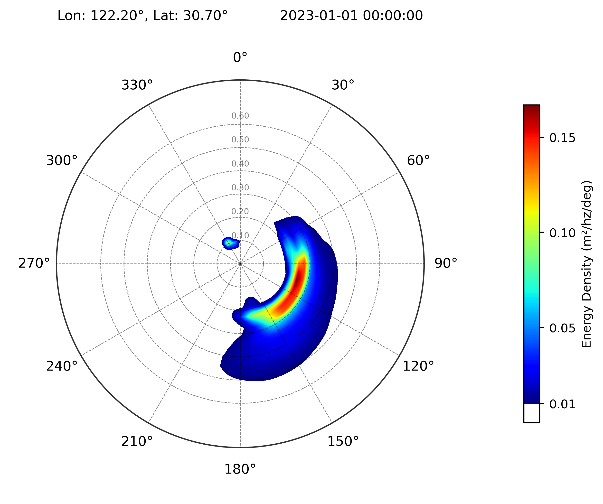

#### Wave Height Plot

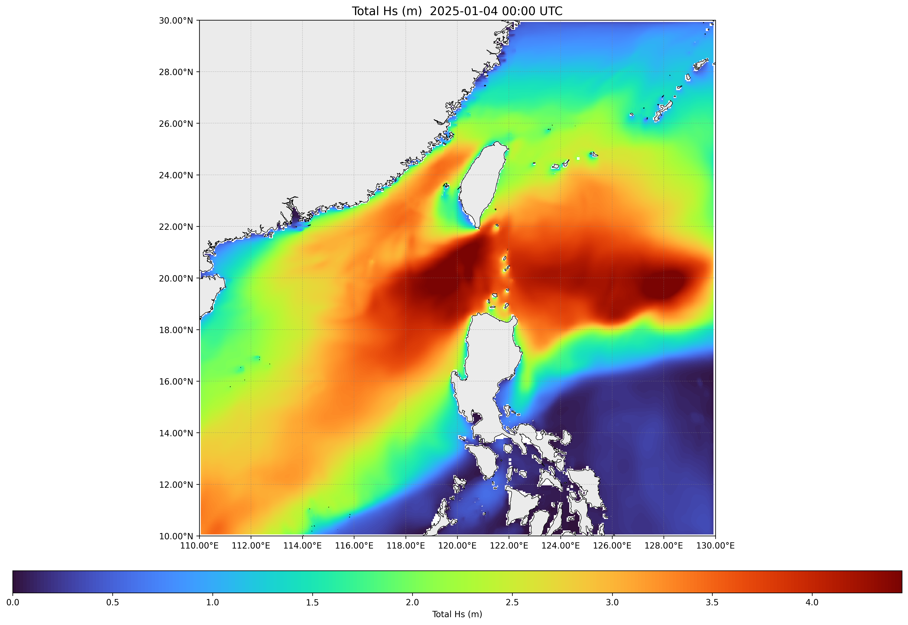


#### Swell Plot


#### Satellite Fit Plot


## Data Sources

### Download Wind Files

#### ERA5

https://cds.climate.copernicus.eu/datasets/reanalysis-era5-single-levels?tab=download

The images below show ERA5 download steps. You need to register an account first. Use a real English name, not random letters.


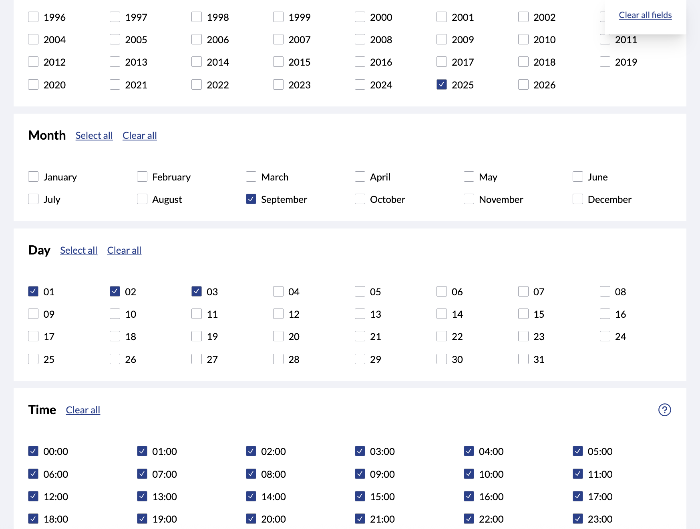


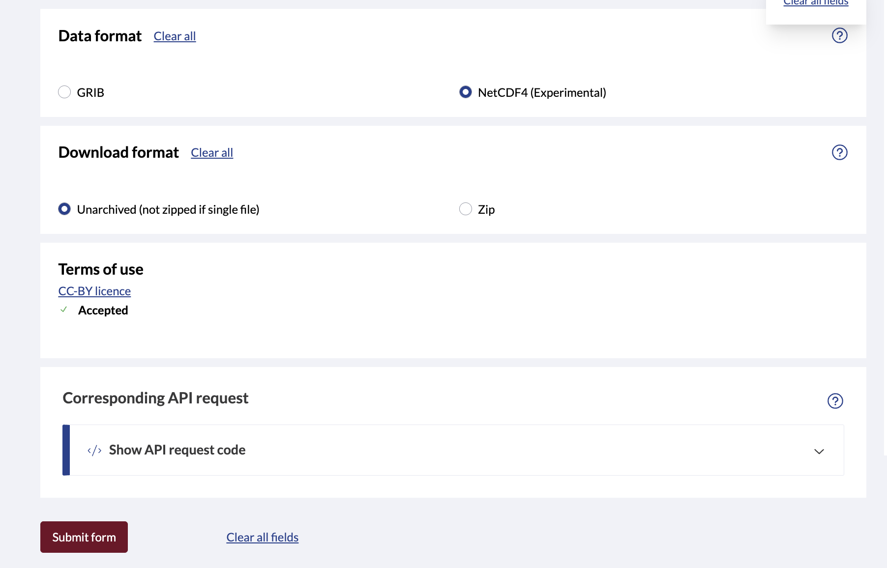

#### CFSR

http://tds.hycom.org/thredds/catalog/datasets/force/ncep_cfsv2/netcdf/catalog.html

Find cfsv2-sec2_2025_01hr_uv-10m.nc and note the uv-10m suffix.

To download global full-year data, click:

HTTPServer://tds.hycom.org/thredds/fileServer/datasets/force/ncep_cfsv2/netcdf/cfsv2-sec2_2025_01hr_uv-10m.nc

To download a specific region and time range, click NetcdfSubset:
//ncss.hycom.org/thredds/ncss/grid/datasets/force/ncep_cfsv2/netcdf/cfsv2-sec2_2025_01hr_uv-10m.nc

After opening, select wndewd and wndnwd on the left, then choose Output Format: netCDF.

If you cannot input lat/lon, uncheck Disable horizontal subsetting.


Then click Time range, enter the time range, and submit.

#### CCMP

https://data.remss.com/ccmp/v03.1/

This is straightforward. Just download directly.

### Download Currents and Water Level

https://data.marine.copernicus.eu/product/GLOBAL_ANALYSISFORECAST_PHY_001_024/download?dataset=cmems_mod_glo_phy_anfc_0.083deg_PT1H-m_202406

Choose Variables below. If you don't need water level, uncheck Sea surface height above geoid.

Then enter the range and time and click DOWNLOAD.

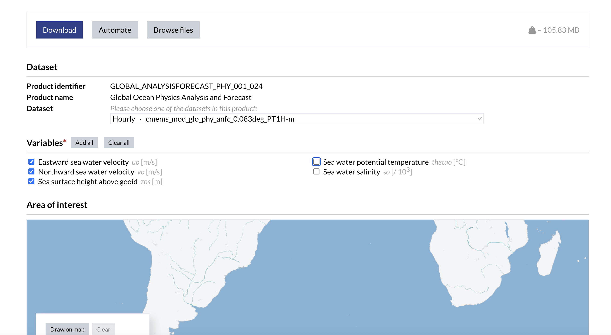

### Download Sea Ice

https://data.marine.copernicus.eu/product/GLOBAL_MULTIYEAR_PHY_001_030/download?dataset=cmems_mod_glo_phy_my_0.083deg_P1D-m_202311

You can download sea ice and currents.

Sea ice includes Sea ice area fraction and Sea ice thickness.

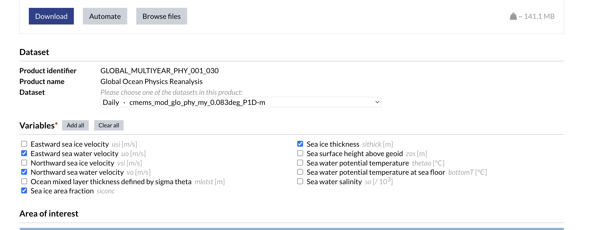

### JASON 3 Data

ftp:/ftp-oceans.ncei.noaa.gov/nodc/data/jason3-gdr/gdr


## License

This software is licensed under the GNU General Public License v3.0 (GPL-3.0), as it is based on and links against GPLv3-licensed frameworks.

