# WW3Tool Documentation

## Quick Install (one line)

```bash
curl -fsSL https://raw.githubusercontent.com/ZxyGch/WW3Tool/master/public/packaging/remote-install.sh | bash
```

Homebrew users (macOS / Linux): `brew tap ZxyGch/ww3tool && brew trust zxygch/ww3tool && brew install ww3tool`

## 1. Project Overview


WW3Tool is a **preprocessing and run-assist toolkit** built around **WAVEWATCH III** (a spectral ocean wave model). It does not replace WW3 executables (`ww3_grid`, `ww3_prnc`, `ww3_shel`, etc.). Instead it handles:

- Validation, repair, and merging of forcing-field NetCDF files (latitude ordering, variable renaming, time-axis fixes)
- Grid generation (structured rectangular grids with arbitrary-depth Two-Way Nesting / unstructured triangular grids / SMC grids)
- Automatic configuration of the full WW3 namelist set for v6.07.1 and v7.14 (`ww3_grid.nml`, `ww3_prnc.nml`, `ww3_shel.nml`, `ww3_ounf.nml`, `ww3_multi.nml`, etc.)
- Run scripts that correctly invoke `ww3_grid`, `ww3_prnc`, `ww3_shel`, and related programs
- SSH upload of work directories to HPC, Slurm configuration, job submission, status monitoring, and result download
- Post-processing plots (wave-height maps, directional spectra, Jason-3 validation, NDBC buoy matching, etc.)

WW3Tool is written entirely in Python (non-Python code comes from the meshgen grid generator). It supports Windows / Linux / macOS with a bilingual Chinese/English UI.

I am a graduate student in Marine Science at Shanghai Ocean University. Since my undergraduate background is not in Marine Science, my knowledge of WAVEWATCH III is somewhat limited; therefore, if you have any suggestions for WW3Tool, please contact me at atomgoto@gmail.com.

Also, if you find WW3Tool helpful, please give it a 🌟! 🥳


## 2. Quick Start

Two equivalent ways to use WW3Tool:

- **Installed via the one-line command / Homebrew** — use the `ww3tool` command from anywhere (same entry point as `run.py`):

  ```sh
  ww3tool                    # GUI (graphical interface)
  ww3tool shell              # Interactive terminal (REPL; steps can be run repeatedly)
  ww3tool <subcommand> [workdir]  # Headless CLI (one command per step; suited for scripts and AI agents)
  ```

- **Just want to run it from a directory** — clone the repo and use `python3 run.py` (identical behavior, commands are the same):

  ```sh
  python3 run.py                    # GUI (graphical interface)
  python3 run.py shell              # Interactive terminal (REPL; steps can be run repeatedly)
  python3 run.py <subcommand> [workdir]  # Headless CLI (one command per step; suited for scripts and AI agents)
  ```

Both ways share the same business logic (`src/workflows/application/`); only the interaction layer differs.


### 2.1 GUI


```bash
python3 run.py
```

This is the mode we use most often.


### 2.2 Interactive Shell

```sh
python3 run.py shell              # Interactive terminal
```


This mode is better suited for remote use on a server.


### 2.3 Headless CLI

```sh
python3 run.py <subcommand> [workdir]  # Headless CLI (one command per step; suited for scripts and AI agents)
```

The CLI’s “one command, one step, no manual interaction” design is naturally suited for AI agent calls. Commands include:

| Category | Subcommand | Description |
| ---- | --------------------------------------------------------------- | -------------------- |
| Config | workdir <path> | Create or load a work directory |
| | validate [workdir] | Validate `params.yml` |
| | config [workdir] | Print configuration summary |
| | print-params [workdir] | Print raw `params.yml` |
| Preprocessing | generate-grid [workdir] | Generate grid (Step 1) |
| | merge-forcing <in1.nc> [...] -o <out.nc> | Standalone tool: validate and merge forcing NetCDF |
| | prepare-forcing [workdir] | Prepare forcing fields (Step 2) |
| | recommend-grid [workdir] [--coarse\|--fine] | Recommend grid spacing from domain extent |
| | recommend-cfl [workdir] [--mode safe\|fast\|faster] [--factor X] | Recommend timesteps from CFL formula |
| | prepare-ww3 [workdir] | Generate WW3 namelists only |
| | run-workflow [workdir] | Full preprocessing workflow |
| | local-run [workdir] | Run `local.sh` |
| Remote ops | connect-test [workdir] | Test SSH connection |
| | ssh [workdir] | Open interactive SSH terminal |
| | slurm-idle [workdir] | List idle Slurm partitions |
| | confirm-slurm [workdir] | Write `server.sh` |
| | upload [workdir] --confirm | Upload work directory to remote |
| | submit [workdir] | Submit `server.sh` |
| | check-status [workdir] | Check remote job status |
| | queue-status [workdir] | View Slurm queue |
| | download-results [workdir] | Download remote results; nested grids auto-download finest level |
| | download-log [workdir] | Download remote log |
| | clear-remote [workdir] --confirm | Clear remote directory |
| | cancel-job [workdir] <job_id> | Cancel Slurm job |
| | ntfy-watch [workdir] | Inject persistent ntfy watcher |
| | ntfy-watch-job [workdir] <job_id> | Inject one-shot ntfy watcher for a job |
| Post-processing | plot-wave-maps [workdir] [--contour] | Wave-height maps |
| | plot-spectrum [workdir] [--mode ...] [--station N] | Directional spectrum plots |
| | plot-jason3 / plot-jason3-swh / download-jason3 [workdir] | Jason-3 related |
| | plot-ndbc [workdir] | NDBC buoy matching |
| | download-ndbc [workdir] | Download NDBC buoy observations |
| Helper | print-example | Print example `params.yml` |

Note: Almost every CLI command **must** specify a work directory; commands without one are not allowed.


## 3. Work Directory 

> What is a work directory?
>
> Suppose you want to simulate waves over 110°E–130°E, 10°N–30°N. After generating a grid with gridgen and downloading ERA5 reanalysis winds for 2025-01-03 through 2025-01-05 as forcing, you need a place to store the grid, namelists, scripts, and outputs: the **work directory**.

A typical single-level case looks like this:

```text
work_dir_name/
├── params.yml                         # Authoritative config for this case; GUI restores forms from it
├── run.log                            # Run log appended by local.sh / server.sh
├── local.sh                           # Local run script; copied from public/scripts/local.sh and patched
├── server.sh                          # Server Slurm script; copied from public/scripts/server.sh and patched
├── success / fail                     # Empty marker files for last run success or failure
│
├── wind.nc                            # Normalized wind forcing, usually from Step 2
├── current.nc                         # Normalized current forcing, optional
├── level.nc                           # Normalized water-level forcing, optional
├── ice.nc                             # Normalized sea-ice forcing, optional
│
├── grid.bot                           # Bathymetry grid; Step 1 or import
├── grid.obst                          # Obstruction grid; common for structured grids
├── grid.meta                          # Grid metadata recorded by WW3Tool
├── mod_def.ww3                        # WW3 grid definition from ww3_grid
│
├── ww3_grid.nml                       # Grid and spectral namelist
├── ww3_prnc.nml                       # Forcing preprocessing namelist
├── ww3_shel.nml                       # Main integration namelist
├── ww3_ounf.nml                       # Field output namelist
├── ww3_ounp.nml                       # Point-spectrum output namelist
├── ww3_trnc.nml                       # Track output namelist, if tracks enabled
├── namelists.nml                      # Combined namelist used by some WW3 versions
│
├── points.list                        # Spectral output points from params.yml calc.points
├── track_i.ww3                        # Track input from params.yml calc.track_points
│
├── wind.ww3 / current.ww3 / level.ww3 # WW3 binary forcing from ww3_prnc
├── out_grd.ww3                        # Field output intermediate file from ww3_shel
├── out_pnt.ww3                        # Point-spectrum intermediate file from ww3_shel
├── track_o.ww3                        # Track output intermediate file from ww3_shel
├── restart*.ww3                       # Restart files, if restart enabled
│
├── ww3.YYYY.nc                        # Field NetCDF, usually from ww3_ounf
├── ww3.YYYY_spec.nc                   # Point-spectrum NetCDF, usually from ww3_ounp
├── ww3.YYYY_trck.nc                   # Track NetCDF, usually from ww3_trnc
└── photo/                             # Images saved by GUI or post-processing, if any
```

Nested-grid cases keep master files at the root and one subdirectory per level:

```text
work_dir_name/
├── params.yml
├── ww3_multi.nml                      # Multi-grid coupling master namelist
├── local.sh / server.sh / run.log
├── wind.nc / current.nc / level.nc    # Normalized forcing NetCDF at root
├── level0/
│   ├── grid.bot / grid.obst / grid.meta
│   ├── ww3_grid.nml / ww3_prnc.nml / ww3_shel.nml / ww3_ounf.nml
│   ├── mod_def.ww3
│   ├── out_grd.ww3 / out_pnt.ww3
│   └── ww3.YYYY.nc / ww3.YYYY_spec.nc
├── level1/
│   └── ...
└── levelN/
    └── ...
```


## 4. Configuration: params.yml

`params.yml` describes all parameters for one simulation task.

For example, to simulate 110°E–130°E, 10°N–30°N with ERA5 winds from 2025-01-03 to 2025-01-05, that entire task is configured in `params.yml`, including common WW3 namelist settings.

Example `ww3_grid.nml` spectral and timestep blocks:

```swift
&SPECTRUM_NML
	SPECTRUM%XFR   = 1.1
	SPECTRUM%FREQ1 = 0.04118
	SPECTRUM%NK    = 32
	SPECTRUM%NTH   = 24
/

&TIMESTEPS_NML
	TIMESTEPS%DTMAX = 900
	TIMESTEPS%DTXY = 320
	TIMESTEPS%DTKTH = 300
	TIMESTEPS%DTMIN = 15
/
```

In `params.yml`:

```swift
ww3_grid:
	SPECTRUM%XFR: 1.1
	SPECTRUM%FREQ1: 0.04118
	SPECTRUM%NK: 32
	SPECTRUM%NTH: 24
	TIMESTEPS%DTMAX: 900
	TIMESTEPS%DTXY: 320
	TIMESTEPS%DTKTH: 300
	TIMESTEPS%DTMIN: 15
```

The root `params.yml` (`WW3Tool/params.yml`) is only a **template** with defaults. For a real run, create a separate work directory and edit `params.yml` inside it — that work-directory file is the authoritative description of one simulation task.

In GUI mode, form values are held in memory first; then the root `params.yml` is copied into the work directory and overwritten with your edits so the work-directory file always matches the root template structure.

Each time you open a work directory, the GUI reads `params.yml` and restores the form.

In Shell and CLI modes, edit the work-directory `params.yml` manually, then run commands.


### Validating params.yml

Every command auto-validates `params.yml` for format issues.

Shell and CLI also provide a dedicated validate command:

```sh
python run.py validate [work_dir_name]
```


### Path validation

When running a step, e.g.:

```swift
python3 run.py prepare-forcing [work_dir_name]
```

path-related parameters are validated automatically, for example:

```swift
paths:
	matlab_path: /Applications/MATLAB_R2024a.app/bin/matlab
	jason_path: /Users/zxy/ocean/Paper/WW3Tool/jason3
	ndbc_path: null
	jason3_download_url: https://www.ncei.noaa.gov/data/oceans/jason3/
```

If a value is empty or the path does not exist, defaults such as `WW3Tool/ndbc`, `WW3Tool/jason`, etc. are filled in according to internal rules.


## 5. Internal Workflow

Typical end-to-end chain:

```
→ [Create or load work directory]  Copy root params.yml into work directory
→ [Step 1 Grid generation] Call meshgen to build grid files
→ [Step 2 Forcing preparation] Validate, repair, copy/move forcing into work directory
→ [Step 3 Computation mode] Region / spectral points / track
→ [Step 4 WW3 configuration] Configure namelist files
→ [Step 5 Connect server] SSH, Slurm, server WW3 version
→ [Step 6 Upload & run] Upload work directory, submit Slurm job
→ [Step 7 Output] WW3 results (ww3.*.nc, etc.)
```

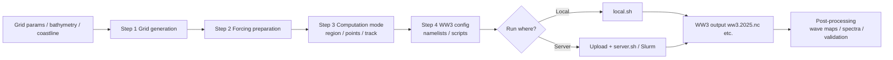
```mermaid
flowchart LR
  A[Grid params / bathymetry / coastline] --> B[Step 1 Grid generation]
  B --> C[Step 2 Forcing preparation]
  C --> D[Step 3 Computation mode
  region / points / track]
  D --> E[Step 4 WW3 config
  namelists / scripts]
  E --> F{Run where?}
  F -->|Local| G[local.sh]
  F -->|Server| H[Upload + server.sh / Slurm]
  G --> I[WW3 output ww3.2025.nc etc.]
  H --> I
  I --> J[Post-processing
  wave maps / spectra / validation]
```

CLI examples for each step are placed under the corresponding `params.yml` sections below so you can read parameters and run commands together.

The following sections explain each step in detail.


### 5.1 Creating a Work Directory


When creating a work directory, the program:

1. Creates a new folder under `WW3Tool/workSpace/` (default name: current timestamp, e.g. `2026-06-17_19-37-01`)
2. Copies the root `params.yml` into the work directory unchanged
3. Patches the work-directory `params.yml`: sets workdir path, clears forcing paths, date range, and `remote_dir` (avoids wrongly restoring root-template values on the home form)
4. Loads `params.yml` to populate default UI values


#### params.yml fields

```swift
workdir:
	path: /Users/zxy/ocean/Paper/WW3Tool/workSpace/new
	default_workspace: /public/home/weiyl001/user/gongchuheng/WorkSpace/ShangHai/
```

`path` — work directory path  
`default_workspace` — default parent folder for new work directories

```sh
python run.py workdir [work_dir_name]
```

`work_dir_name` may be an absolute path or a folder name. If the directory does not exist, a work directory is created, root `params.yml` is copied, and `workdir.path` is set.


#### Root-directory guard

To prevent using the repo root without creating a work directory, CLI and Shell refuse to run against the template root `params.yml`.

CLI without workdir:

```bash
python3 run.py prepare-forcing

---------------------------------------------------------------

Using project virtual environment: /Users/zxy/ocean/Paper/WW3Tool/.venv
Dependency check passed.
Parameter error: Cannot use the repository root params.yml directly (it is a template file).
Please create or load a working directory first:
  python3 run.py workdir my_workdir
```

In Shell mode, without `workdir` you cannot run any command:

```sh
ww3>  config
⚠ No configuration loaded. Use 'workdir <path>' first.
ww3> queue-status
⚠ No configuration loaded. Use 'workdir <path>' first.
```


### 5.2 Step 1 — Grid Generation

Step 1 builds WW3 grid input from the `params.yml` `grid` section — turning domain extent, bathymetry, coastlines, and grid type into files WW3 can read. It does **not** run `ww3_grid`; compiling `mod_def.ww3` happens in Step 4 / run scripts.


#### GUI workflow

Step 1 on the home page is **set grid params, preview bounds, then generate grid**:

For meshgen internals see `meshgen/README.md`. Below covers the GUI/CLI fields you change most often and common misunderstandings.


1. Choose grid type: normal / nested, and rectangular / SMC / unstructured.
2. Enter main grid extent (`lat` and `lon` rows; maps to `grid.lat: [south, north]`, `grid.lon: [west, east]`).
3. Rectangular grids need `DX/DY`; SMC and unstructured hide `DX/DY` and show their own cards.
4. **Recommend grid spacing** writes conservative starter values.
5. **View map** previews extent; nested shows all level rectangles.
6. **Generate grid** calls meshgen and writes files into the work directory.

Missing `reference_data` triggers a download prompt. Results are cached under `meshgen/cache/` by parameter hash.

#### reference_data

The reference data package (GEBCO, ETOPO1/2, coastlines, etc.) is required for grid generation.

If `WW3Tool/meshgen/reference_data` is missing, Step 1 shows a download dialog:


Click download: the program fetches from [GitHub Release](https://github.com/ZxyGch/WW3Tool/releases/tag/data) (~6.5 GB) automatically.


#### Grid types

| Type | Use case | Main outputs |
| ------ | --------------------------- | ------------------------------------------------------ |
| Rectangular | Regional regular grids; debugging; batch events; most stable | `grid.bot`, `grid.obst`, `grid.mask_nobound`, `grid.meta` |
| Nested rectangular | Coarse outer, fine inner; local detail with far-field propagation | `level0/` … `levelN/` each with its own grid set |
| SMC | Global or large domains; needs SMC-capable WW3 | `grid_cell.dat`, `grid_subtr.dat`, etc. |
| Unstructured | Complex coastlines; local high-res triangles | `grid.ww3`, `unstructured_grid.json` |


#### Refining resolution

The simplest way to increase resolution is **not** enlarging the domain but **reducing** spacing parameters. Finer grids increase point count, cost, and output size; re-run `recommend-cfl` or Step 4 auto-timestep after changes.

| Grid | Primary knobs | Simplest refinement | Notes |
| --- | --- | --- | --- |
| Rectangular | `structured.nested.levels[0].dx`, `dy`; GUI `DX/DY` | Halve `dx/dy` (e.g. 0.05 → 0.025) | Halving both directions ≈ 4× points; `DTXY` usually smaller |
| Nested | Finest `levels[-1].dx/dy`, `lon/lat`; add a level | Shrink finest `dx/dy` or add inner level | Fine level must lie inside parent; spectral points on finest level |
| SMC | `smc.n_levels`, `smc.dshalw`, `smc.depmin`, `smc.msea` | Increase `n_levels` | Needs SMC WW3; refinement tied to depth thresholds |
| Unstructured | `hmin`, `hshr`, `hmax`, `nwav`, `dhdx`, `edge_segments` | Decrease `hmin/hshr` near shore | Very small `hmin` explodes triangle count |


Rules of thumb:

1. Rectangular: reduce `DX/DY`.
2. Nested: refine innermost level only.
3. SMC: tune `n_levels` and shallow thresholds.
4. Unstructured: tune `hmin/hshr` first.
5. `coastline_precision` affects coastline detail, not overall cell size.


#### Grid params.yml

```sh
python3 run.py generate-grid  [work_dir_name]                 # Generate grid
python3 run.py recommend-grid [work_dir_name] --coarse        # Use recommended spacing
```

```yaml
# ────────────────────────────────────────────────────────────────────
# Grid generation (rectangular / SMC / unstructured).
#   mesh_type – grid topology: 'structured' | 'smc' | 'unstructured'.
#   grid_type – 'normal' single layer; 'nested' nesting (rectangular only).
#   gridgen_version – grid backend: 'Python' or 'MATLAB'.
#   reference_data_path – bathymetry/coastline directory;
#                         null = auto-detect project default path.
#   lon       – main grid longitude range [west, east], degrees.
#   lat       – main grid latitude range [south, north], degrees.
#   structured.nested.levels – nesting levels coarse→fine when grid_type=nested.
# ────────────────────────────────────────────────────────────────────
grid:
  mesh_type: structured
  grid_type: normal
  gridgen_version: Python
  reference_data_path: /Users/zxy/ocean/Paper/WW3Tool/meshgen/reference_data
  lon:
  - 110.0
  - 130.0
  lat:
  - 10.0
  - 30.0
```

| Field | Meaning |
| --- | --- |
| `grid.mesh_type` | Grid topology: `structured`, `smc`, `unstructured` |
| `grid.grid_type` | Rectangular only: `normal` single layer, `nested` multi-level |
| `grid.lon` | Main grid longitude range `[west, east]` |
| `grid.lat` | Main grid latitude range `[south, north]` |
| `grid.reference_data_path` | Bathymetry/coastline directory; empty → project default |
| `grid.structured.nested.levels` | Nested levels coarse→fine; `level0` outermost, `levelN` finest |

#### Structured rectangular grid

pygridgen / gridgen on a regular lat-lon lattice. `normal`: one layer at work-dir root. `nested`: multiple levels; see below.


##### Nested grids


Nesting = coarse outer + fine inner for multi-resolution runs. WW3Tool uses WW3 `ww3_multi` (one integration drives all levels; see §5.5.8 and nested-grid design notes).

| Item | Description |
|----|------|
| `grid.grid_type` | `nested` enables nesting; `normal` = single layer |
| `grid.structured.nested.levels` | Ordered coarse→fine; `levels[0]` = level0; 2–99 levels |
| Per level | `dx`, `dy` (deg), `lon`, `lat` rectangle |
| `nested_contraction_coefficient` | GUI “matryoshka”: shrink parent extent and halve `dx/dy` for next level; can also hand-write each level in yaml |
| Validation | Fine `dx/dy` < coarse; level k fully inside level k−1; supports 2–99 levels |

Generation layout:

- `generate-grid` calls gridgen per level → `level0/`, `level1/`, …


- Each level has `grid.bot`, `grid.obst`, `grid.meta`; forcing NetCDF stays at root; per-level prnc uses `../wind.nc`.
- Root `ww3_multi.nml`; spectral `points.list` at root; points must lie on finest grid.

Nested cases are still evolving; errors like `OUTPUT POINT OUT OF GRID`, `NBI=0 AND RANK > 1` — check nested design doc.


##### params.yml example

Single layer: one entry in `levels`. Nested: at least two.

```sh
python3 run.py workdir nested_demo
# params.yml:
#   grid.grid_type: nested
#   grid.structured.nested.levels: [ level0 coarse, level1 fine ]
python3 run.py generate-grid nested_demo
python3 run.py recommend-cfl nested_demo    # Timesteps from level0 spacing (per-level in Step 4)
python3 run.py prepare-ww3 nested_demo
python3 run.py local-run nested_demo
```

```yml
# Rectangular grid parameters:
#   bathymetry       – bathymetry dataset name (see presets.structured_bathymetry).
#   coastline_precision – GSHHG coastline detail (full/high/inter/low/coarse).
#   min_dist         – minimum spacing filter between adjacent grid points (km).
#   cut_off          – land-sea mask cutoff; 0 keeps all sea points.
#   lim_bathy        – wet-fraction threshold for cell retention by depth.
#   lim_val          – mask classification threshold, 0–1.
#   split_lim        – cell-split threshold; 0 disables splitting.
#   lake_tol         – minimum lake size in grid points; smaller lakes are filled.
#   nested.levels    – nesting levels coarse→fine; level0 = levels[0], finest = levels[-1].
#   nested.nested_contraction_coefficient – GUI matryoshka shrink factor (≥ 1).
structured:
  nested:
    nested_contraction_coefficient: 1.3
    levels:
    - dx: 0.05
      dy: 0.05
      lon:
      - 100.0
      - 130.0
      lat:
      - 10.0
      - 30.0
    - dx: 0.025
      dy: 0.025
      lon:
      - 103.4615
      - 126.5385
      lat:
      - 12.3077
      - 27.6923
    - dx: 0.0125
      dy: 0.0125
      lon:
      - 106.1242
      - 123.8758
      lat:
      - 14.0828
      - 25.9172
  bathymetry: GEBCO
  coastline_precision: full
  min_dist: 20
  cut_off: 0
  lim_bathy: 0.4
  lim_val: 0.5
  split_lim: 0
  lake_tol: 50
```


##### Grid visualization

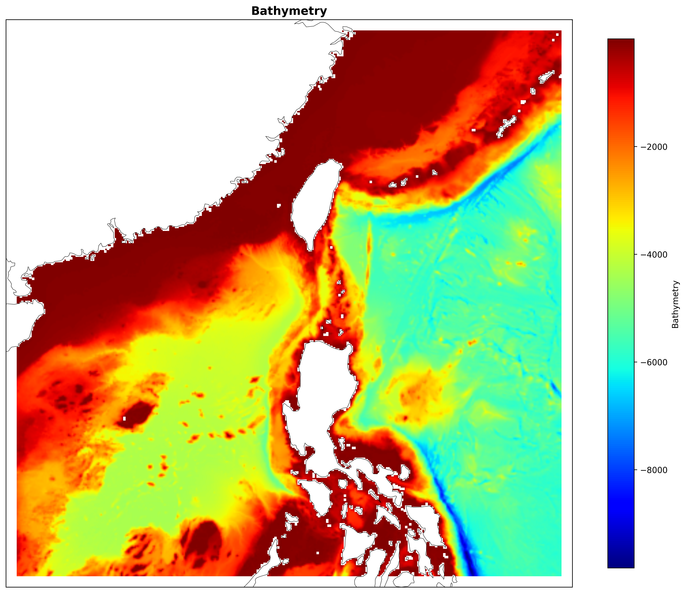


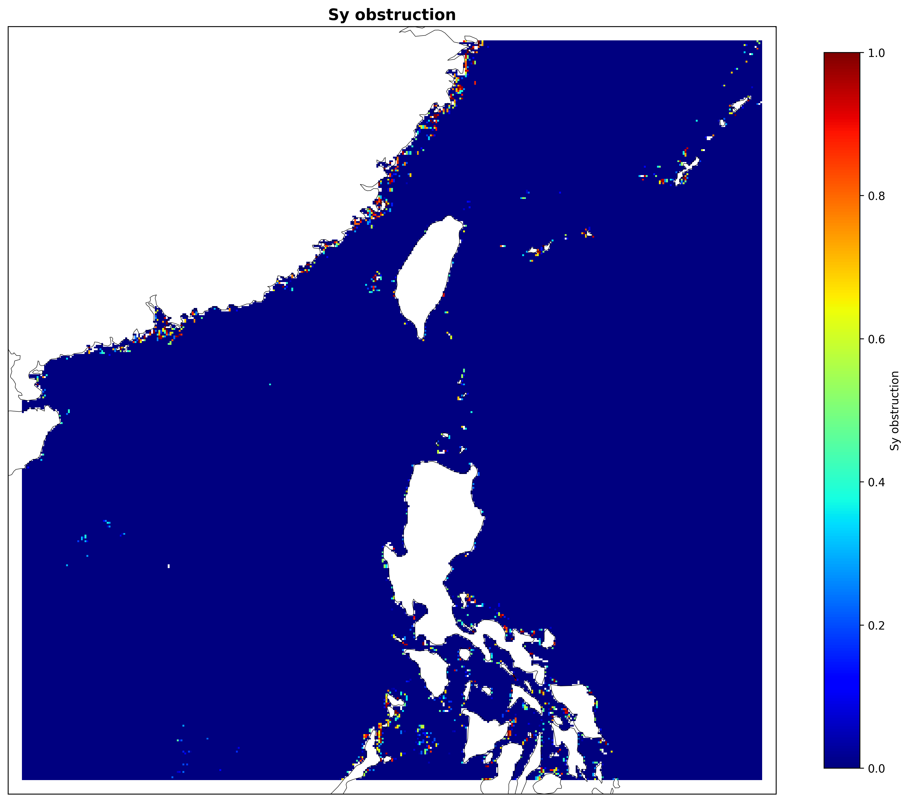

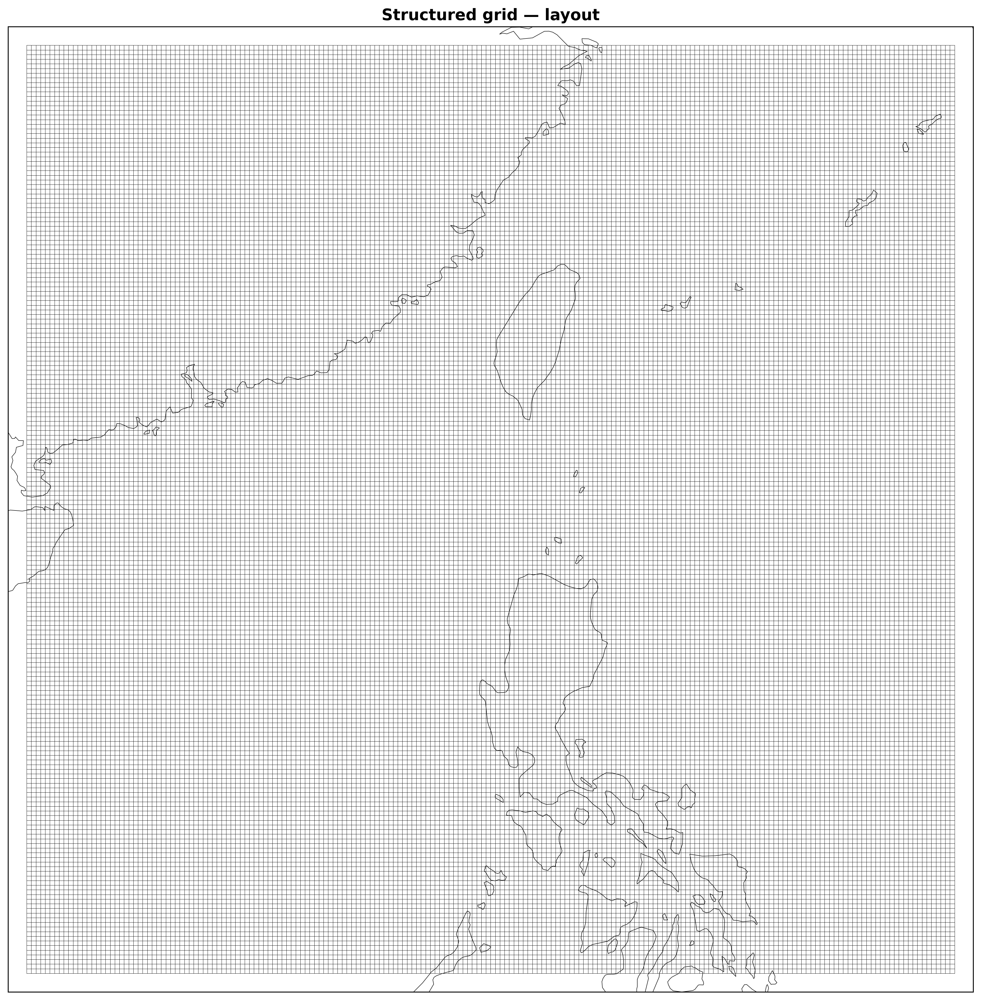


##### Grid files

Single layer: `grid.obst`, `grid.bot`, `grid.mask_nobound`, `grid.meta` at work-dir root. Nested: same set under each `levelK/`.

| File | Description |
| --- | --- |
| `grid.bot` | Bathymetry ASCII, usually `Ny × Nx`; `ww3_grid.nml` bottom input |
| `grid.mask_nobound` | Land-sea mask: `0` land, `1` sea |
| `grid.obst` | x/y obstruction fractions |
| `grid.meta` | WW3Tool metadata (extent, resolution, point count); Step 4 syncs namelist |


#### Unstructured triangular grid

JIGSAW / NOAA `unst_msh_gen` builds triangular meshes with deep-water scale, nearshore refinement, shallow-wavelength refinement, and bathymetry-gradient controls. No `DX/DY`; core knobs are `hmax/hmin/hshr`.


##### params.yml

```yaml
# Unstructured (triangular) spacing parameters:
# hmax – maximum cell spacing in deep water (km).
# hmin – minimum allowed cell spacing globally (km).
# hshr – target nearshore spacing (km).
# nwav – wavelengths resolved per cell.
# dhdx – spacing variation rate with bathymetry gradient.
# deep_ocean_threshold_m – depths above this use hmax (m).
# margin_deg – domain buffer outside the bbox (degrees).
# edge_segments – coastline boundary segment count.
# options.data – optional mask / exclusion file.
# options.command_line_args – extra JIGSAW CLI arguments.
# options.regional – regional projection center (stereo_lon / stereo_lat).

unstructured:
	hmax: 100
	hmin: 2
	hshr: 20
	nwav: 400
	dhdx: 0.05
	deep_ocean_threshold_m: 4000
	margin_deg: 1
	edge_segments: 64
	options:
	data:
	mask_file: ''
	command_line_args:
	black_sea: 3
	regional:
	stereo_lon: 120.0
	stereo_lat: 20.0
```


##### Grid files

| File | Description |
| --- | --- |
| `grid.ww3` | Main unstructured grid for WW3 |
| `unstructured_grid.json` | Parsed config for reproducibility and cache |

Cache: `meshgen/cache/unst/<hash>/`; on hit, `grid.ww3` is copied to work directory.


##### Visualization

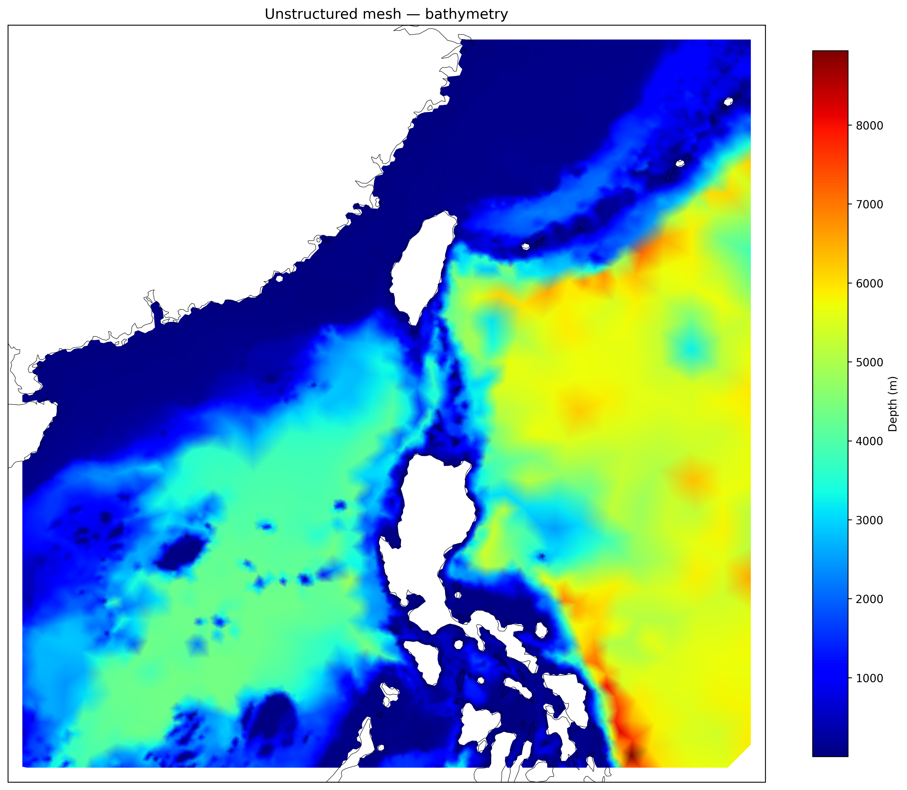

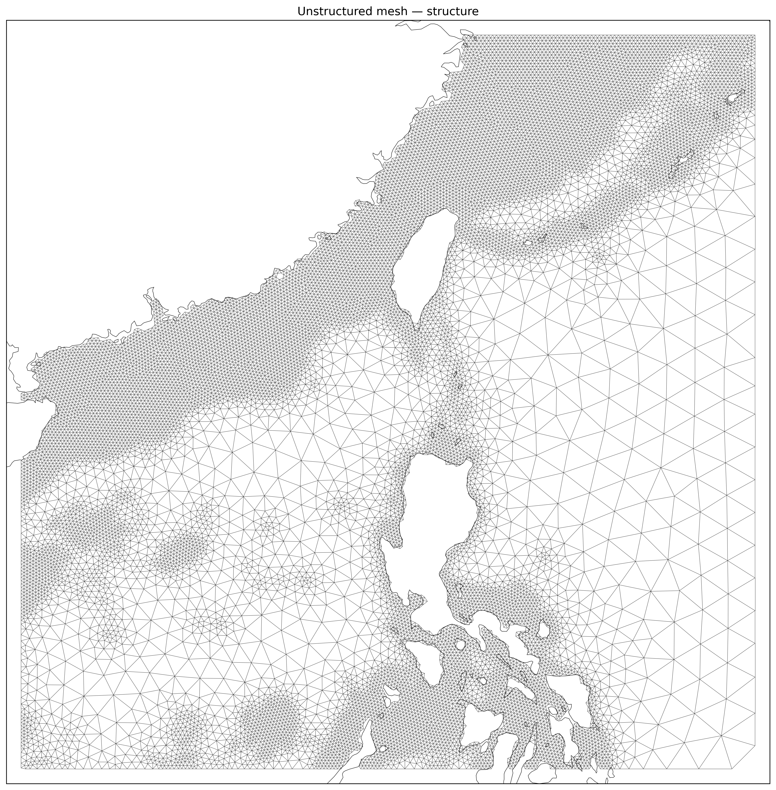


#### SMC grid

SMCGTools-based. Requires SMC-capable WW3 and templates; not the default for simple regional runs.


##### params.yml

```yml
# SMC (Spherical Multi-Cell) grid parameters:
#   bathymetry       – bathymetry dataset name (see presets.smc_bathymetry).
#   bathy_convention – 'elevation' (up positive) or 'depth' (down positive).
#   n_levels         – number of cell-scale refinement levels.
#   wlevel           – water-level reference index.
#   depmin           – minimum depth threshold; shallower cells removed (m).
#   dshalw           – shallow-water extra-refinement depth threshold (m).
#   generate_boundary_cells – whether to generate open-boundary ghost cells.
#   msea             – minimum cells retained in straits.
#   options.input    – input preprocessing (auto flip, tolerances, etc.).
#   options.grid     – grid identity and projection (global, arctic, origin, etc.).
#   options.output   – output file naming and formatting.
smc:
  bathymetry: ETOPO2
  bathy_convention: elevation
  n_levels: 2
  wlevel: 0
  depmin: 0
  dshalw: -150
  generate_boundary_cells: true
  msea: 1
  options:
    input:
      auto_flip_lat: true
      auto_flip_lon: true
      coord_spacing_rtol: 0.001
      coord_spacing_atol: 1.0e-08
      nan_fill_value: 1000.0
    grid:
      name: grid
      global: false
      arctic: false
      glb_arc_lat: 84.4
      origin:
        lon0: 0.0
        lat0: -90.0
    output:
      file_prefix: ''
```


##### Visualization

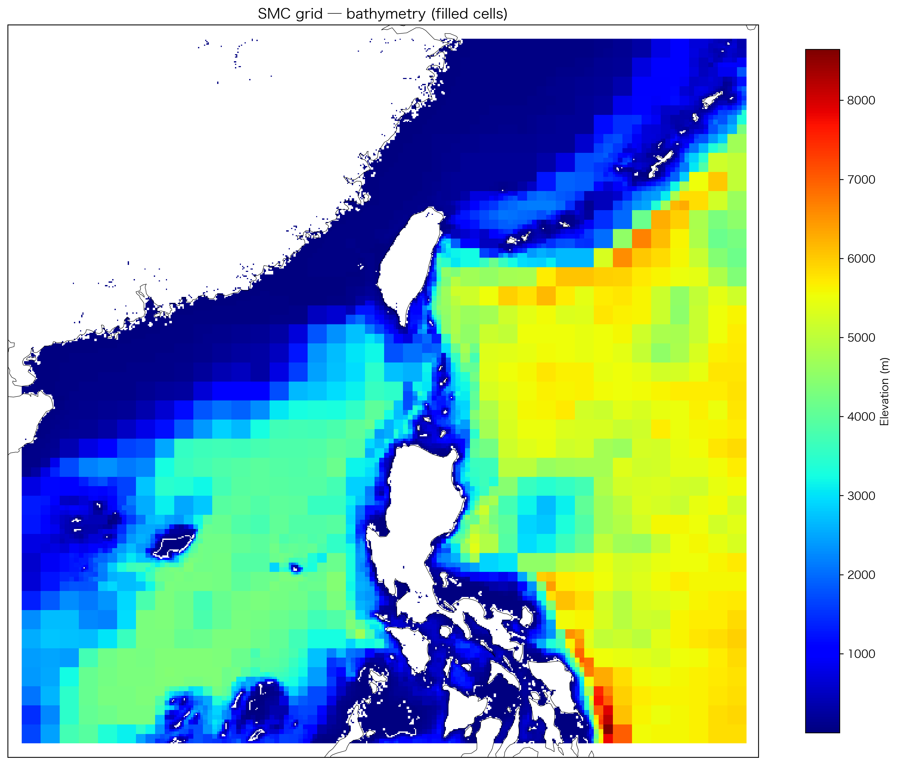

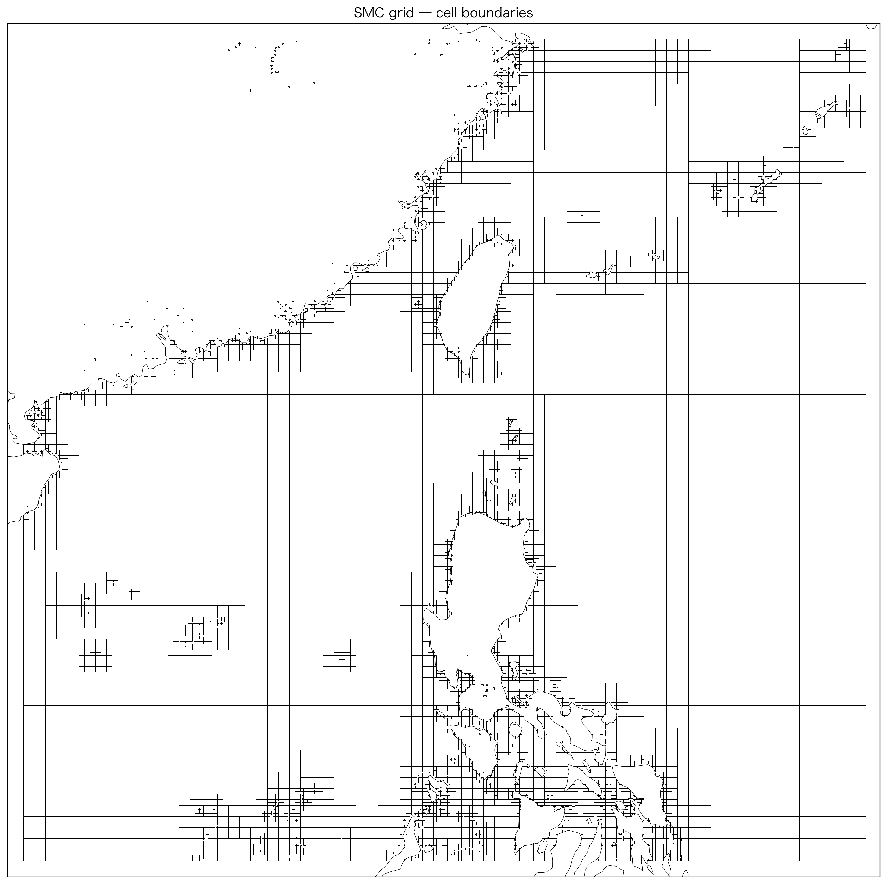


### 5.3 Step 2 — Forcing Preparation


Step 2 imports external NetCDF forcing into the work directory and normalizes it for later steps. Supported fields: wind, current, water level, sea ice.

#### GUI workflow

Recommended order on Step 2:

1. Click wind / current / level / ice buttons to choose NetCDF files.
2. After selection, the log shows file info (variables, time range, lat/lon extent). This step only reads metadata; no copy, move, or crop yet.

3. To crop, edit time/lat/lon, then click **Confirm crop and import**. Time format: `YYYYMMDD`; space: decimal degrees.
4. To import without cropping, click **Import directly without cropping**. Files are copied or moved in full, then normalized.

Import modes:

- **Copy**: keep originals; write processed files into the work directory.
- **Move**: remove or relocate originals after import. With crop, the source is not moved as-is; a cropped file is written first, then the source is deleted on success.

Helper buttons:

- **View Map**: generate a region preview image from the current Step 2 lon/lat bounds.
- **View map**: show spatial extent of up to four fields.
- **View all field info**: dump info for all selected fields to the log.
- **×** next to each field button: clear selection; if pointing at a normalized file in the work directory, optionally delete it and clear references.


#### params.yml

Step 2 settings are under `forcing`:

```sh
python3 run.py prepare-forcing [work_dir_name]    # Prepare forcing
```

```yaml
forcing:
  wind: null
  current: null
  level: null
  ice: null
  process_mode: copy        # copy or move
  crop_time_range: []       # [start_YYYYMMDD, end_YYYYMMDD]; empty = no crop
  crop_bbox: []             # [west, east, south, north]; empty = no crop
  auto_associate: true      # If one file has multiple fields, link to multiple slots
```

Settings page **Forcing configuration** provides default import mode and auto-associate toggle. The home page reads these when you open a work directory; actual import still follows current home-page selections and button clicks.


#### Detecting field type

Field type is inferred from NetCDF variable names:

- **Wind**: any of u10/v10, wndewd/wndnwd, uwnd/vwnd (case-insensitive)
- **Current**: uo/vo
- **Water level**: zos
- **Ice**: siconc


#### Normalization

```swift
🔄 Rewriting time metadata to WW3-readable char attributes (units + calendar)

✅ Forcing field normalized and saved to: /User/WW3Tool/workSpace/2026-06-29_16-57-02/wind.nc
```

After confirm import:

1. Rename variants (e.g. `wndewd/wndnwd`, `uwnd/vwnd` → wind; `uo/vo`, `zos`, `siconc` → respective fields).
2. Coordinates unified to `longitude`, `latitude`, `time`; dimensions and dependent variables updated.
3. Output named by field type: `wind.nc`, `current.nc`, etc.; combined names like `current_level.nc` when multiple fields share one file with `auto_associate`.
4. Latitude flipped from descending to ascending if needed (avoids WW3 6.07.1 `ww3_prnc` `EXTCDE(32)` on regular lat-lon grids).
5. Normalized files feed Step 4 `ww3_prnc.nml` generation; no manual namelist edits for original variable names.


#### Multi-field auto-association

If one NetCDF contains multiple field types and `forcing.auto_associate: true`, all detected types are linked to the same normalized file path in multiple GUI slots.

Examples:

- File with `uo/vo` and `zos` → `current_level.nc`; current and level slots both point to it.
- File with wind, current, level, ice → `wind_current_level_ice.nc`; all four slots point to it.

With `auto_associate: false`, only the slot where you selected the file is updated.

#### Work-directory scan

On open, normalized forcing files are detected and GUI buttons restored (`wind.nc`, `current.nc`, `level.nc`, `ice.nc`, `current_level.nc`, `wind_current_level_ice.nc`, etc.). Scan only restores display; import still requires **Confirm crop and import** or **Import directly**.


### 5.4 Step 3 — Computation Mode

Computation mode chooses whether WW3 integrates over the full grid, fixed spectral points, or a moving track. Set in `calc.mode` (GUI Step 3). No dedicated CLI subcommand; read during `prepare-ww3` or `run-workflow`.


| Mode | `calc.mode` | Use case | Work-dir files | Typical output |
| ------- | ---------------- | ------------------ | ------------- | ------------------------ |
| Regional | `region` | Full-grid HS, period, direction, etc. | None extra | `ww3.YYYY.nc` |
| Spectral points | `spectral_point` | 2D spectrum at stations | `points.list` | `ww3.YYYY_spec.nc` |
| Track | `track` | Values along ship/buoy/TC path | `track_i.ww3` | `ww3.YYYY_trck.nc` |

If unsure, use **region** — it is the most common.


#### params.yml

Step 3 settings live in the `calc` section. The GUI writes mode, points, or track points back to the work-directory `params.yml`; Step 4 `prepare-ww3` reads them to generate `points.list` or `track_i.ww3`.

```sh
# No separate Step 3 CLI; edit calc then:
python3 run.py prepare-ww3 [work_dir_name]
python3 run.py run-workflow [work_dir_name]
```

```yaml
calc:
  mode: spectral_point     # region | spectral_point | track
  points:
  - lon: 114.225
    lat: 15.4798
    name: '0'
  - lon: 115.519
    lat: 20.6623
    name: '1'
  track_points: []
```

Notes:

1. `region`: no `points` or `track_points`.
2. `spectral_point`: at least one point → `points.list` in Step 4.
3. `track`: track points → `track_i.ww3` in Step 4.


### 5.5 Step 4 — WW3 Configuration

> What does Step 4 do?
>
> Steps 1–3 prepared forcing, grid, and computation mode. Step 4 writes the full WW3 namelist set from work-directory `params.yml`.
>
> Principle: only change fields relevant to this case; keep `public/nml/` templates otherwise intact for comparison with official examples.


#### 5.5.3 CFL-based timestep recommendation

```log
📐 CFL-based timesteps: DXY≈5230 m, Tcfl≈252 s → DTXY=226, DTMAX=678, DTKTH=339, DTMIN=15
```

Step 4 **Auto-configure timesteps** uses CFL stability; values are written to `ww3_grid.nml` on confirm.

```swift
✅ Spectral parameters and time steps have been written to ww3_grid.nml:
  SPECTRUM%XFR    = 1.1
  SPECTRUM%FREQ1  = 0.0375
  SPECTRUM%NK     = 35
  SPECTRUM%NTH    = 36

  TIMESTEPS%DTMAX = 678
  TIMESTEPS%DTXY  = 226
  TIMESTEPS%DTKTH = 339
  TIMESTEPS%DTMIN = 15
```

CLI:

```sh
# Writes params.yml ww3_grid.parameters.TIMESTEPS%*
python3 run.py recommend-cfl new                         # default safe, CFL 0.9
python3 run.py recommend-cfl new --mode fast             # CFL 1.05
python3 run.py recommend-cfl new --mode faster           # CFL 1.15
python3 run.py recommend-cfl new --factor 1.2            # custom factor, cap 1.25
python3 run.py prepare-ww3 new
```


##### CFL calculation

WW3’s `ww3_grid.nml` comments state that wave group travel per timestep must not exceed one grid spacing. Define:

- $\Delta x$: minimum grid spacing (m). Structured/SMC from `dx`/`dy` and latitude; unstructured uses `hmin` (km) as finest scale.
- $f_1$: lowest spectral frequency `SPECTRUM%FREQ1` (Hz).
- Deep-water group speed $C_g \approx g / (4\pi f_1)$ ($g=9.8\,\mathrm{m/s^2}$).

CFL timescale:

$$
T_{\mathrm{cfl}} = \frac{\Delta x}{C_g} = \frac{\Delta x \cdot f_1 \cdot 4\pi}{g}
$$

WW3Tool rounds to integer seconds and cascades:

| Mode | CFL factor | Description |
|------|----------|------|
| safe | 0.90 | Default conservative |
| fast | 1.05 | More aggressive |
| faster | 1.15 | Most aggressive built-in |
| --factor X | custom, max 1.25 | Manual multiplier |

| Parameter | Role | Typical relation |
|------|------|----------|
| DTXY | Spatial propagation step | $\approx \mathrm{CFL} \times T_{\mathrm{cfl}}$ |
| DTMAX | Main integration cap | $\approx 3 \times \mathrm{DTXY}$ |
| DTKTH | Source/sink spectral step | $\approx \mathrm{DTMAX}/2$ without strong currents |
| DTMIN | Minimum step | Default 15 s |

In short:

- `DTXY` — spatial propagation step; finest grids need smaller values.
- `DTMAX` — main integration cap; usually scales with `DTXY`.
- `DTKTH` — source/sink spectral step; use smaller values with strong currents or complex bathymetry.
- `DTMIN` — adaptive source-term floor; rarely the first knob for accuracy.

Nested grids: CFL recomputed **per level** (fine grids → smaller `DTXY` → more steps). Tied to `ww3_multi.nml` process allocation (§5.5.8).

If the grid is very coarse or `FREQ1` very small, recommended steps may still be too large; reduce spacing or CFL factor rather than blindly increasing `DTMAX`.


#### 5.5.10 Namelist physics source-term parameters

Step 4 provides a **Namelist Parameters** group below the numerical-integration timestep fields. It exposes five physics coefficients commonly tuned under the ST4 package. After you click **Confirm parameters**, values are written into `namelists.nml` (work-directory root for a normal grid; each `level*/namelists.nml` for nested grids) and saved under `ww3.namelist` in `params.yml`.

Unlike spectrum discretization and timesteps in `ww3_grid.nml`, these five entries control **wind input, whitecapping dissipation, and bottom friction**, affecting significant wave height $H_s$, swell decay, and nearshore energy levels. Defaults match the WW3 6.07 ST4 (Ardhuin et al. 2010) template.

| GUI field | YAML key | Namelist block | Default | Meaning and typical tuning |
|-----------|----------|----------------|---------|----------------------------|
| BETAMAX | `SIN4%BETAMAX` | `&SIN4` | 1.43 | Wind-input gain (Miles coefficient); **most often tuned**. Increase (e.g. 1.52, 1.55) if $H_s$ is too low; decrease (e.g. 1.33) if too high. |
| SWELLF | `SIN4%SWELLF` | `&SIN4` | 0.66 | Swell attenuation in wind input; affects far-field swell propagation; often tuned in 0.6–0.8. |
| SDSC2 | `SDS4%SDSC2` | `&SDS4` | -2.2e-5 | Saturation dissipation coefficient; **tune together with BETAMAX** for energy balance. |
| SDSBR | `SDS4%SDSBR` | `&SDS4` | 0.90e-3 | Saturation threshold $B_r$; affects when dissipation starts and spectral shape. |
| GAMMA | `SBT1%GAMMA` | `&SBT1` | -0.067 | JONSWAP bottom-friction coefficient; important for **nearshore/shelf** runs. Try -0.038 for swell-dominated cases; keep -0.067 for mixed sea states. |

Example `params.yml`:

```yaml
ww3:
  namelist:
    SIN4%BETAMAX: 1.43
    SIN4%SWELLF: 0.66
    SDS4%SDSC2: -2.2e-05
    SDS4%SDSBR: 0.0009
    SBT1%GAMMA: -0.067
```

After confirming parameters, `run.log` may show:

```log
✅ Physics source-term parameters written to namelists.nml:
  SIN4/BETAMAX = 1.43
  SIN4/SWELLF  = 0.66

  SDS4/SDSC2   = -2.2e-05
  SDS4/SDSBR   = 0.0009
  SBT1/GAMMA   = -0.067
```

**Usage notes:**

- Tune **BETAMAX + SDSC2** together for overall $H_s$ and energy balance; do not change only one of them.
- For nearshore or shallow-water cases with $H_s$ or period bias, try **GAMMA** (bottom friction) separately.
- With ST2/ST3 or other non-ST4 source packages, `&SIN4` / `&SDS4` blocks may be ignored; edit the namelist blocks for your ST version or leave defaults.
- Leaving a field empty skips overwriting that key (same behavior as spectrum/timestep fields).


#### 5.5.1 Copy templates and run scripts

```log
✅ Copied server.sh, local.sh to the current work directory
✅ Copied 8 NML template files to current work directory
```

- Copy namelists from `public/6.07_nml/` or `public/7.14_nml/` (per NML version): `ww3_grid.nml`, `ww3_prnc.nml`, `ww3_shel.nml`, `ww3_ounf.nml`, etc.
- Copy `local.sh` and `server.sh` from `public/scripts/`. They define the WW3 program execution order (`ww3_grid`, `ww3_shel`, …). `local.sh` runs on your machine; `server.sh` runs under Slurm. Step-by-step flow: §5.5.9.


#### 5.5.2 Write grid into ww3_grid.nml

Step 1 grid files must be synced into `ww3_grid.nml` grid fields before WW3 can read them. Syntax differs by grid type:

```log
✅ Successfully synced grid.meta parameters to ww3_grid.nml:
  GRID%TYPE  = 'RECT'
  GRID%COORD = 'SPHE'
  GRID%CLOS  = 'NONE'

  RECT%NX    = 401
  RECT%NY    = 401
  RECT%SX    = 0.050000000000
  RECT%SY    = 0.050000000000
  RECT%X0    = 110.0000
  RECT%Y0    = 10.0000
  DEPTH%SF   = 0.001000
  OBST%SF    = 0.010000
```

```log
✅ Unstructured mesh: updated ww3_grid.nml and namelists.nml (&RECT_NML, &DEPTH_NML, &MASK_NML, &OBST_NML blocks commented with !):
  GRID%TYPE     = 'UNST'
  UNST%FILENAME = 'grid.ww3'

  FLAGTR        = 0
```

```log
✅ SMC mesh: updated ww3_grid.nml (template &DEPTH_NML, &MASK_NML, &OBST_NML commented with !; appended &DEPTH_NML DEPTH%SF):
  GRID%TYPE          = 'RECT'

  RECT%NX            = 570
  RECT%NY            = 598
  RECT%SX            = 0.033332824707
  RECT%SY            = 0.033332824707
  RECT%X0            = 109.9983
  RECT%Y0            = 9.9985
  RECT%SF            = 1.00
  RECT%SF0           = 1.00
  SMC%MCELS%FILENAME = 'grid_cell.dat'
  SMC%ISIDE%FILENAME = 'grid_iside.dat'
  SMC%JSIDE%FILENAME = 'grid_jside.dat'
  SMC%SUBTR%FILENAME = 'grid_subtr.dat'
  SMC%BUNDY%FILENAME = 'grid_bundy.dat'
  DEPTH%SF           = -1.0
✅ Updated namelists.nml:
  NBISMC = 341 (grid_bundy.dat)
  LvSMC  = 2
```

Rectangular: extent, resolution, bathy file. Unstructured: point to `grid.ww3`. SMC: envelope rectangle + SMC cell/side/boundary files. All automated in Step 4.


#### 5.5.4 Time and output stride

```log
✅ Updated ww3_ounp.nml:
  POINT%TIMESTART  = '20250103 000000'
  POINT%TIMESTRIDE = '3600'
  POINT%TIMESPLIT  = 0
✅ Updated ww3_ounf.nml:
  FIELD%TIMESTART  = '20250103 000000'
  FIELD%TIMESTRIDE = '3600'
  FIELD%TIMESPLIT  = 0
✅ Updated ww3_shel.nml:
  DOMAIN%START            = '20250103 000000'
  DOMAIN%STOP             = '20250105 235959'
  OUTPUT%FIELD%TIMESTART  = '20250103 000000'
  OUTPUT%FIELD%TIMESTRIDE = '3600'
  DATE%FIELD              = '20250103 000000' '3600' '20250105 235959'
  DATE%RESTART%START      = '20250103 000000'
  DATE%RESTART%STOP       = '20250105 235959'

  TYPE%POINT%FILE         = 'points.list'
  DATE%POINT              = '20250103 000000' '3600' '20250105 235959'
  DATE%BOUNDARY           = '20250103 000000' '86400' '20250105 235959'
✅ Modified ww3_prnc.nml:
  FORCING%TIMESTART = '20250103 000000'
  FORCING%TIMESTOP  = '20250105 235959'
```

params.yml:

```yaml
ww3:
  start_date: "20250103"
  end_date: "20250105"
  output_step: "3600"   # seconds
```

| Location | Role |
| --------------------------------------------- | ---------------------------------------------------------------- |
| `ww3_shel.nml` `DOMAIN%START/STOP` | Overall integration window |
| `ww3_shel.nml` `DATE%FIELD` | When/how often field output is written during integration; smaller stride → larger `out_grd.ww3` and `ww3.*.nc` |
| `ww3_ounf.nml` `FIELD%TIMESTART/TIMESTRIDE` | NetCDF field export from `out_grd.ww3` |
| `ww3_ounp.nml` `POINT%TIMESTART/TIMESTRIDE` | Spectral point NetCDF export |
| `ww3_prnc.nml` `FORCING%TIMESTART/TIMESTOP` | Forcing preprocessing window; must cover integration |

These fields are not redundant — each serves a different WW3 program.


#### 5.5.5 Cold start and hot restart

Under **Time settings** in Step 4 you choose **cold start** or **hot restart**. New cases always use cold start. Hot restart is only for when the work directory already has `restart*.ww3` from a previous run.

**Cold start** runs the full chain: `ww3_strt` builds the initial wave field → `ww3_shel` integrates from the **start date** you enter in Step 4.

**Hot restart** skips `ww3_strt` and continues from the saved wave state. Use it to split long runs, resume after a server interruption, or after a spin-up period.

##### What Step 4 shows on screen

| UI item | Cold start | Hot + Auto Latest | Hot + manual |
| --- | --- | --- | --- |
| Start mode | Cold | Hot restart | Hot restart |
| Restart date | Disabled | Shows “Auto Latest” | `YYYYMMDD` or `YYYYMMDD HHMMSS` |
| Restart file | Disabled | Disabled | Optional, e.g. `restart036.ww3` |
| Start date | Editable | **Read-only** (still the calendar start of the full segment) | Read-only |
| End date | Editable | Editable | Editable |

When you click **Confirm parameters**, your choices are saved to `params.yml` in the work directory, and per §5.5.4 the **start date, end date, and output stride** are written into the namelists. In `ww3_shel.nml`:

- `DOMAIN%START` / `DOMAIN%STOP`: full integration window (`START` = start date at 00:00:00 for now)
- `DATE%FIELD` etc.: field output window and interval (interval = Step 4 **output stride**)
- `DATE%RESTART`: how often to **write** restart files during a cold run (start = start date, stride = output stride)

Forcing times in `ww3_prnc.nml` (`FORCING%TIMESTART/TIMESTOP`) use the same start/end dates and must cover the whole calendar span you want to integrate.

With **Auto Latest**, Step 4 does **not** scan the work directory for the newest checkpoint or set `DOMAIN%START` to that moment. That happens when `local.sh` / `server.sh` actually run (below).

##### What happens when you start the run (Auto Latest)

When you click **Local run** on your machine, or **Submit** on the server after upload, `local.sh` / `server.sh` handle hot restart **first**, then `ww3_grid`. For a single grid:

1. **Find a checkpoint**  
   Prefer a timestamped file such as `20250104.120000.restart.ww3` (common on 7.14).  
   If none, take the highest-numbered `restart071.ww3` (common on 6.07). The time is not in the filename; the tool infers it from `DATE%RESTART` in `ww3_shel.nml` (written in Step 4), e.g. start `20250103 000000`, stride `3600`, file `restart071.ww3` → `20250105 230000`.

2. **Copy to `restart.ww3`**  
   `ww3_shel` only reads this filename as the initial field.

3. **Update integration start in `ww3_shel.nml`**  
   Set `DOMAIN%START`, `DATE%FIELD`, and other **output-related** start times to the checkpoint time.  
   **`DATE%RESTART` is unchanged** — it still defines how often the next restart files are written, as set in Step 4.

4. **Skip `ww3_strt`, run `ww3_shel`**  
   Integrate from the checkpoint time to `DOMAIN%STOP` (end date 23:59:59).

Typical `run.log` lines:

```log
✅ Auto Latest restart: restart071.ww3 -> restart.ww3 (20250105 230000)
⏭️ Restart mode: skip ww3_strt, start from 20250105 230000
```

##### Manual checkpoint (Auto Latest off)

Turn off Auto Latest, then set **Restart date**; **Restart file** is optional.

File lookup order:

1. If Restart file is set (e.g. `restart036.ww3`) → use it;
2. Else match `YYYYMMDD.HHMMSS.restart.ww3` to Restart date;
3. Else map Restart date to `restartNNN.ww3` via `DATE%RESTART` (time must fall on the schedule grid).

Date-only `20250104` is treated as `20250104 000000`.

##### Restart files in the work directory

| Pattern | Origin | How time is known |
| --- | --- | --- |
| `restart001.ww3`, `restart002.ww3`, … | Written during 6.07 cold/integration at `DATE%RESTART` intervals | `DATE%RESTART` start + index × stride |
| `20250104.120000.restart.ww3` | Written when 7.14 uses `DATE%RESTART2` | In the filename |

**`restart.ww3`** is not the fourth file in a series — it is copied from a checkpoint **before each run** as the initial field for that run. Cold start: created by `ww3_strt`. Hot restart: copied by the run script.

After several hot restarts, older `restartNNN.ww3` files may be overwritten so index and embedded time no longer match; `ww3_shel` then reports `CONFLICTING TIMES`. Use a manual Restart file or a timestamped checkpoint.

##### Nested grids

Each `level0/`, `level1/`, … has its own restart; all levels must share the same time on hot restart. Auto Latest in nested mode **only accepts timestamped checkpoints** (e.g. `20250104.120000.restart.level2`), not numbered `restartNNN.ww3` inference. Integration start is updated in root `ww3_multi.nml`, not per-level `ww3_shel.nml`.

##### Notes

- Checkpoints must match grid, spectral settings, and WW3 version.
- Step 4 **start date** on hot restart still means “which calendar day this segment belongs to” and which forcing to read; **the actual resume instant** comes from the checkpoint and is written to `DOMAIN%START` when the run starts.
- Design details: `public/WW3Tool_Restart支持方案.md`.


#### 5.5.6 Spectral partition output scheme


Configure schemes on the settings page (add/edit/delete).

```log
✅ Modified spectral partition output scheme in ww3_shel and ww3_ounf:
  TYPE%FIELD%LIST = 'HS DIR FP T02 WND PHS PTP PDIR PWS PNR TWS EF'
  FIELD%LIST      = 'HS DIR FP T02 WND PHS PTP PDIR PWS PNR TWS EF'
```

Nested: also synced to `ww3_multi.nml` `ALLTYPE%FIELD%LIST`.

```swift
ww3:
  output_scheme:
    use: with_spectrum
    standard: HS DIR FP T02 WND PHS PTP PDIR PWS PNR TWS
    with_spectrum: HS DIR FP T02 WND PHS PTP PDIR PWS PNR TWS EF
```


#### 5.5.7 Forcing switches and multiple prnc


If Step 2 imported multiple fields, Step 4 shows multi-select (wind required). Separate `ww3_prnc_*.nml` per field type.

```log
✅ Copied and modified ww3_prnc_current.nml:
  FORCING%FIELD%CURRENTS = T
  FILE%FILENAME          = 'current_level.nc'
  FILE%VAR(1)            = 'uo'
  FILE%VAR(2)            = 'vo'
✅ Copied and modified ww3_prnc_level.nml:
  FORCING%FIELD%WATER_LEVELS = T
  FILE%FILENAME              = 'current_level.nc'
  FILE%VAR(1)                = 'zos'
```

Default `ww3_prnc.nml` handles wind. `ww3_prnc` reads one namelist per run, so WW3Tool copies the wind template and edits variables for other fields; `local.sh` / `server.sh` rename/swap nml files automatically at runtime.


#### 5.5.8 Nested grids


For nested grids, WW3Tool places `ww3_multi.nml` and `points.list` (spectral mode) at the work root; each `level0/`, `level1/`, … has its own `ww3_grid.nml`, `mod_def`, etc.


##### ww3_multi.nml

```nml
&INPUT_GRID_NML
  INPUT(1)%NAME                  = 'wind'
  INPUT(1)%FORCING%WINDS         = T

  INPUT(2)%NAME                  = 'current'
  INPUT(2)%FORCING%CURRENTS      = T

  INPUT(3)%NAME                  = 'level'
  INPUT(3)%FORCING%WATER_LEVELS  = T

  INPUT(4)%NAME                  = 'ice'
  INPUT(4)%FORCING%ICE_CONC      = F

  INPUT(5)%NAME                  = 'ice1'
  INPUT(5)%FORCING%ICE_PARAM1    = F
/

&MODEL_GRID_NML

  MODEL(1)%NAME                  = 'level0'
  MODEL(1)%FORCING%WINDS         = 'native'
  MODEL(1)%FORCING%CURRENTS      = 'native'
  MODEL(1)%FORCING%WATER_LEVELS  = 'native'
  MODEL(1)%FORCING%ICE_CONC      = 'no'
  MODEL(1)%FORCING%ICE_PARAM1    = 'no'
  MODEL(1)%RESOURCE              = 1 1 0.00 0.08 F

  MODEL(2)%NAME                  = 'level1'
  MODEL(2)%FORCING%WINDS         = 'native'
  MODEL(2)%FORCING%CURRENTS      = 'native'
  MODEL(2)%FORCING%WATER_LEVELS  = 'native'
  MODEL(2)%FORCING%ICE_CONC      = 'no'
  MODEL(2)%FORCING%ICE_PARAM1    = 'no'
  MODEL(2)%RESOURCE              = 2 1 0.08 0.24 F

  MODEL(3)%NAME                  = 'level2'
  MODEL(3)%FORCING%WINDS         = 'native'
  MODEL(3)%FORCING%CURRENTS      = 'native'
  MODEL(3)%FORCING%WATER_LEVELS  = 'native'
  MODEL(3)%FORCING%ICE_CONC      = 'no'
  MODEL(3)%FORCING%ICE_PARAM1    = 'no'
  MODEL(3)%RESOURCE              = 3 1 0.24 1.00 F
/
```

`ww3_multi.nml` chains all nesting levels into one `mpirun ww3_multi` integration. Each `MODEL(i)%NAME` maps to a level directory (e.g. `level2`), and `MODEL(i)%RESOURCE` declares that level’s role in nesting and MPI parallelism.

`MODEL(i)%RESOURCE` is five fields on one line:

| Field | Meaning |
| ------------ | -------------------------------------------------------------------------------------------------------- |
| `RANK_ID` | Nesting level index: level0 (coarsest) = 1, increases toward fine |
| `GROUP_ID` | MPI group; WW3Tool default 1 (all levels in one communicator) |
| `COMM_FRAC` | Process share interval `[low, high]` in 0–1; partitions all MPI ranks. E.g. 48 total ranks and `0.24 1.00` on the finest level ≈ ranks 37–48 |
| `BOUND_FLAG` | Output nest boundary file `nest.<NAME>`; default `F` |

WW3Tool estimates relative cost `points / DTXY` per level from each `ww3_grid.nml` and writes `COMM_FRAC`.


##### Shared forcing

Forcing NetCDF stays at the root; each level `ww3_prnc.nml` references `../wind.nc`:

```log
✅ Modified ww3_prnc.nml:
  FORCING%FIELD%WINDS = T
  FILE%FILENAME       = '../wind.nc'
  FILE%VAR(1)         = 'u10'
  FILE%VAR(2)         = 'v10'

✅ Copied and modified ww3_prnc_current.nml:
  FORCING%FIELD%CURRENTS = T
  FILE%FILENAME          = '../current_level.nc'
  FILE%VAR(1)            = 'uo'
  FILE%VAR(2)            = 'vo'

✅ Copied and modified ww3_prnc_level.nml:
  FORCING%FIELD%WATER_LEVELS = T
  FILE%FILENAME              = '../current_level.nc'
  FILE%VAR(1)                = 'zos'
```


##### Spectral points

```
&DOMAIN_NML
  DOMAIN%NRINP  = 0
  DOMAIN%NRGRD  = 3
  DOMAIN%UNIPTS = F
  DOMAIN%FLGHG1 = T
  DOMAIN%FLGHG2 = T
  DOMAIN%START  = '20250103 000000'
  DOMAIN%STOP   = '20250105 235959'
/

&OUTPUT_TYPE_NML
  ALLTYPE%FIELD%LIST     = 'HS DIR FP T02 WND PHS PTP PDIR PWS PNR TWS EF'
  ALLTYPE%POINT%FILE     = 'points.list'
  ALLTYPE%POINT%NAME     = 'level2'
/
```

WW3Tool uses `DOMAIN%UNIPTS = F` (do not merge spectral-point raw output across levels).

`points.list` exists only at the work root; coordinates must lie on the finest `levelN` grid. After `ww3_multi`, the effective spectral raw file is `out_pnt.<finest MODEL%NAME>` at the root (three-level example: `out_pnt.level2`).

`local.sh` / `server.sh` move it to `levelN/out_pnt.ww3`, then run `ww3_ounp` in the finest level directory. Coarse levels do not maintain separate point lists; WW3Tool does not use the `UNIPTS = T` unified-point path.


##### Per-level auto CFL

Nested levels have different `dx`/`dy` (`level0` coarsest, `levelN` finest), so **propagation timesteps cannot be shared**: CFL requires `DTXY ∝ Δx`; using the coarse level’s `DTXY` on a fine grid is numerically unstable.

In nested mode, Step 4 processes each `level0/`, `level1/`, … in turn. After writing spectral parameters and syncing `grid.meta` into that level’s `ww3_grid.nml`, it **automatically** recomputes CFL (`TIMESTEPS%DTXY`, `DTMAX`, `DTKTH`, `DTMIN`) and writes them back to that level’s `ww3_grid.nml`:

```log
✅ Recomputed CFL timesteps: DTXY=189, DTMAX=567, DTKTH=284 (bathy Cg=24.9m/s)
```


#### 5.5.9 How local.sh and server.sh run your case

Step 4 **Confirm parameters** copies `local.sh` and `server.sh` from `public/scripts/` into the work directory. They are not WW3 itself — they **call** `ww3_grid`, `ww3_prnc`, `ww3_shel`, and the rest in a fixed order. All output is appended to `run.log` in that directory. Any step failure stops the run and creates an empty `fail` file; a full success creates `success`.

Use `local.sh` for local debugging (Step 6 **Local run** or `python3 run.py local-run`). Use `server.sh` on the cluster (upload first, then Step 6 **Submit** or `python3 run.py submit`). **The WW3 steps are identical**; only where they run, how many cores, and which compiled WW3 build is on `PATH` differ (table at the end).

On start, each script reads `params.yml` in the work directory: **grid type** picks single-grid vs nested; **start mode** (cold/hot) decides whether to prepare restart and skip `ww3_strt`. Those values were written in Step 4 — the scripts do not guess.

##### Single grid: from Run to NetCDF

Below is a **cold start** pipeline. Hot restart adds a few steps at the top and skips `ww3_strt`; everything else is the same.

**0. Hot-restart prep (hot only)**  
If Step 4 chose hot restart, before anything else the script: finds the latest checkpoint in the work directory → copies it to `restart.ww3` → updates integration/output start times in `ww3_shel.nml` (§5.5.5). Cold start skips this.

**1. `ww3_grid`**  
Reads `ww3_grid.nml` (from Step 1 grid in Step 4) and `grid.bot`, etc., and builds `mod_def.ww3`. Required for all later steps.

**2. `ww3_prnc` (possibly several times)**  
Reads `ww3_prnc.nml` and Step 2 NetCDF forcing, producing `wind.ww3` and similar binaries. WW3 handles one forcing type per invocation, so if Step 4 enabled current, level, ice, the script renames nml files and runs **wind → current → level → ice** in order (§5.5.7 log examples).

**3. `ww3_strt` (cold only)**  
Builds the initial spectrum and writes `restart.ww3`. On hot restart, `restart.ww3` is already in place from step 0; the log shows `skip ww3_strt`.

**4. `ww3_shel` (main integration)**  
Reads `mod_def.ww3`, forcing files, `restart.ww3`, and `ww3_shel.nml`, integrates from `DOMAIN%START` to `DOMAIN%STOP`, writes `out_grd.ww3` and other intermediates, and continues writing `restartNNN.ww3` on the `DATE%RESTART` schedule for the next hot restart.  
The script tries `mpirun` first; if MPI fails locally, it retries serial `ww3_shel` once.

**5. Export (as needed)**  
- `points.list` present (spectral points from Step 4) → `ww3_ounp` → `ww3.*_spec.nc`  
- `track_i.ww3` present (track mode) → `ww3_trnc`  
- Almost always: `ww3_ounf` converts `out_grd.ww3` to `ww3.YYYY.nc`  

**6. `success`**  
The full chain completed.

```text
[hot] find checkpoint → restart.ww3 → patch ww3_shel.nml start
    ↓
ww3_grid → ww3_prnc (×N forcings) → ww3_strt or skip
    ↓
mpirun ww3_shel
    ↓
ww3_ounp? → ww3_trnc? → ww3_ounf
    ↓
success
```

##### Nested grid: extra directory layout

Nested cases have no root-level `ww3_shel`. Instead:

1. For **each** `level0/` (coarsest) … `levelN/` (finest): `ww3_grid` → `ww3_prnc` → `ww3_strt` (skipped on hot restart per level);  
2. Move each level’s `mod_def.ww3`, `restart.ww3`, `wind.ww3`, … to the work root as `mod_def.level0`, `restart.level0`, … for `ww3_multi`;  
3. `mpirun ww3_multi` at the root (reads `ww3_multi.nml` from Step 4);  
4. Move finest `levelN` `out_grd.*` / `out_pnt.*` back into that level and run `ww3_ounp` / `ww3_trnc` / `ww3_ounf` there.

Forcing NetCDF stays at the root; each level’s `ww3_prnc.nml` references `../wind.nc` (§5.5.8).

##### How local.sh and server.sh differ

**The WW3 steps are the same.** What changes is where they run and how you observe them:

| | Local `local.sh` | Server `server.sh` |
| --- | --- | --- |
| How to start | Step 6 Local run | Upload, then Step 6 Submit; if not already in a Slurm job, the script `sbatch`s itself first |
| Cores | Default: all local logical CPUs; override with `WW3_MPI_NPROCS=8` | Matches cores from Step 5 **Confirm Slurm** |
| WW3 binaries | **Local ST** from Step 4 on system `PATH` | Step 5 writes **server ST** path in `export PATH=...` at the top of the script |
| Log | Terminal + `run.log` | Server `run.log` only; use `download-log` |
| Done? | `success` / `fail` in the work dir | Same; `check-status` checks remote markers |

**Before submit:** Step 4 confirmed (fresh namelists and scripts) → `upload --confirm` → Step 5 Slurm confirmed (`server.sh` header matches the queue) → submit. **Submit does not** regenerate namelists or upload files.

##### Troubleshooting

Open `run.log` in the work directory and search for `Running` section headers; the last one is usually where it failed (`Running ww3_prnc`, `Running mpirun ww3_shel`, …).

Hot-restart issues are usually **at the top**: search for `Auto Latest restart`, `Restart file`, `skip ww3_strt`. `CONFLICTING TIMES` from `ww3_shel` means `restart.ww3`’s embedded time does not match `DOMAIN%START` in `ww3_shel.nml` — see §5.5.5 manual checkpoint.

Quick local test:

```sh
python3 run.py local-run <workdir>
```

Standard server flow:

```sh
python3 run.py upload --confirm <workdir>
python3 run.py submit <workdir>
python3 run.py check-status <workdir>
python3 run.py download-log <workdir>
```


### 5.6 Step 5 — Slurm Configuration

#### Server connection

Configure SSH before connecting.


`default_remote_dir` is the default remote parent for uploaded work directories.

Three SSH modes:

**SSH config Host (recommended)** — uses `server.ssh_config_host`; `host/user/password/key_file` may be null. Best when `~/.ssh/config` already defines a Host alias:

```yaml
server:
  ssh_config_host: SHOU
  host: null
  port: 22
  user: null
  password: null
  key_file: null
  default_remote_dir: /public/home/weiyl001/user/gongchuheng/
  remote_dir: ''
```

**Password** — uses `server.host`, `server.port`, `server.user`, `server.password`. Straightforward for temporary servers or when no key is available; avoid storing passwords in config long term:

```yaml
server:
  ssh_config_host: ''
  host: <server-host>
  port: 22
  user: <server-user>
  password: <server-password>
  key_file: null
  default_remote_dir: /public/home/weiyl001/user/gongchuheng/
  remote_dir: ''
```


**Private key** — uses `server.host`, `server.port`, `server.user`, `server.key_file`. Suited for fixed servers and automation. If both password and key are set, the client tries available keys first:

```yaml
server:
  ssh_config_host: ''
  host: <server-host>
  port: 22
  user: <server-user>
  password: null
  key_file: /Users/<name>/.ssh/id_rsa
  default_remote_dir: /public/home/weiyl001/user/gongchuheng/
  remote_dir: ''
```


If `ssh_config_host` is set, `~/.ssh/config` is resolved first; explicit password/key in `params.yml` supplement it.

Priority: when `server.ssh_config_host` is filled, connection uses that Host alias first, then falls back to explicit fields in `params.yml`.


#### Job list and idle resources

These lists help you pick partitions and nodes before submitting long jobs.


The GUI polls Slurm automatically after connect.

The job list shows JobID, partition, job name, state, runtime, node count, cores, and reason/node. GUI command:

```sh
squeue -o '%i %P %j %T %M %D %C %R' -h
```

CLI equivalent:

```sh
python3 run.py queue-status
```

Idle resources are parsed per node from state, CPU allocation, partition, and memory:

```sh
sinfo -h -N -o '%N|%T|%c|%C|%P|%m|%e'
```

CLI equivalent:

```sh
python3 run.py slurm-idle <workdir>
```

Note: CLI `queue-status` uses `squeue -l` for full text; the GUI card view uses the fixed `-o` format above.


#### Slurm settings

Defaults live in Settings; Step 5 lets you edit them after connect. Values are written back to the workdir `params.yml` when you click **Confirm Slurm** or run `confirm-slurm`, refreshing `#SBATCH` lines and `MPI_NPROCS` in `server.sh`.

The GUI parses partition lists from the server when possible; the Settings default is only a fallback used when parsing fails. If the parsed list contains that default partition, it is pre-selected.


```log
✅ Updated server.sh:
  #SBATCH -J    = 2026-06-28_21-10-11
  #SBATCH -p    = CPU6240R
  #SBATCH -n    = 48
  #SBATCH -N    = 1
  #SBATCH --mem = 360G
  #SBATCH -w    = -
  #SBATCH --time = -
  MPI_NPROCS    = 48
  ST            = ST2
  export PATH   = /public/home/weiyl001/software/wavewatch3/model/exe
```

Partition list is parsed from the server when possible; the Settings default is only a fallback. If the parsed list contains that default partition, it is pre-selected.

Slurm fields written by Step 5:

- `slurm.job_name` → `#SBATCH -J`; empty → work directory name
- `slurm.partition` → `#SBATCH -p`; GUI fills from `sinfo` after connect
- `slurm.nodes` → `#SBATCH -N`
- `slurm.cores` → `#SBATCH -n` and script `MPI_NPROCS`
- `slurm.nodelist` → optional `#SBATCH -w` (space-separated nodes, e.g. `node01 node02`); empty → no node pin
- `slurm.time` → optional `#SBATCH --time` (Slurm format, e.g. `2-00:00:00` or `48:00:00`); empty → template default
- `slurm.mem` → optional `#SBATCH --mem=`; GUI may suggest from idle resources
- `slurm.server_st.use` → `export PATH=...` for the server WW3 build

`nodes` and `cores` must be consistent: e.g. `nodes: 2`, `cores: 96` usually means 96 cores across 2 nodes. With `nodelist: node01 node02`, Slurm tries those nodes; success depends on queue policy and free capacity.


#### CLI example

Step 5 only connects, inspects resources, and refreshes `server.sh` — not upload/submit (Step 6).

```yaml
server:
  # Prefer ~/.ssh/config Host alias; host/user/password/key_file may be null when set
  ssh_config_host: SHOU
  host: null
  port: 22
  user: null
  password: null
  key_file: null

  # Remote work root for upload; remote_dir is usually auto-generated from the workdir name
  default_remote_dir: /public/home/weiyl001/user/gongchuheng/
  remote_dir: ''

slurm:
  # job_name empty → work directory name
  job_name: null
  partition: CPU6240R
  nodes: 1
  cores: 48
  nodelist: null        # optional; space-separated, e.g. "node01 node02"
  time: null            # optional; e.g. "2-00:00:00" or "48:00:00"
  mem: 190G

  # server_st.use is the selected server WW3 build
  server_st:
    use: ST2
    ST2: /public/home/weiyl001/software/wavewatch3/model/exe
    ST4: /public/home/weiyl001/software2/ww4/model/exe
```

```sh
# 1. Test SSH
python3 run.py connect-test hpc_case

# 2. List idle partitions/cores
python3 run.py slurm-idle hpc_case

# 3. Write #SBATCH, MPI_NPROCS, ST path into server.sh
python3 run.py confirm-slurm hpc_case

# 4. Optional: view your queue
python3 run.py queue-status
```

To change only `partition`, `nodes`, `cores`, `nodelist`, `time`, `mem`, or `server_st.use`, re-run `confirm-slurm` without repeating Steps 1–4.


#### ST version management

ST = server WW3 build path written into `server.sh` when you confirm Slurm settings:

```sh
#wavewatch3--ST2
export PATH=/public/home/weiyl001/software/wavewatch3/model/exe:$PATH
```


```yaml
slurm:
  server_st:
    use: ST2
    ST2: /public/home/weiyl001/software/wavewatch3/model/exe
    ST4: /public/home/weiyl001/software2/ww4/model/exe
    ST6: /public/home/weiyl001/software2/ww6/model/exe
    ST6A: /public/home/weiyl001/software2/ww6a/model/exe
    7.14 ST2: /public/home/weiyl001/software/ww3_714/WW3-develop/install_ST2/bin
    7.14 ST4: /public/home/weiyl001/software/ww3_714/WW3-develop/install_ST4/bin
    7.14 ST6: /public/home/weiyl001/software/ww3_714/WW3-develop/install_ST6/bin
```


#### ntfy notifications

Poll Slurm on the login node; push ntfy to your phone when a job ends.

The persistent watcher is bound to `server.default_remote_dir` (remote work root). PID/log/state files live there, decoupled from per-case workdirs, so clearing one case directory does not stop the watcher.

```sh
python3 run.py ntfy-watch work_dir_name
python3 run.py ntfy-watch-job work_dir_name 12345

# After submit, attach a one-shot watcher (replace 12345 with squeue JobID)
python3 run.py submit hpc_case
python3 run.py ntfy-watch-job hpc_case 12345
```


### 5.7 Step 6 — Upload and Run


| Control | Function |
|---------|----------|
| Server path | Remote work directory for upload/submit/download; empty → `default_remote_dir` + local folder name |
| View file list | List remote directory |
| Clear folder | Delete remote contents (keep directory) |
| Upload work directory | Full upload including forcing |
| Upload non-forcing only | Scripts, namelists, config — skip large forcing if already on server |
| Submit job | Run `server.sh` / submit Slurm; does not regenerate namelists or auto-upload |
| View queue | Refresh Slurm queue |
| Check completion | Read remote `success` / `fail` markers |
| Download results | `ww3*.nc`; nested → finest `levelN/` |
| Download log | Remote `run.log` |
| Execute | Run arbitrary remote shell command (use with care) |

**Server path** — remote directory for upload, submit, and download. If empty, `default_remote_dir` + local folder name is used.

**View file list** — list remote files to verify upload, results, and logs.

**Clear folder** — delete remote files and subdirectories but keep the directory. Destructive; use when the remote tree is messy and you need a full re-upload.

**Upload work directory** — full upload including forcing, namelists, and scripts. Use before first submit.

**Upload non-forcing only** — scripts, namelists, and config without large forcing NetCDF. Use when forcing is already on the server and only parameters changed.

**Submit job** — run `server.sh` / submit Slurm. Does not regenerate namelists or auto-upload; ensure remote files are current first.

**View queue** — refresh Slurm queue (also auto-refreshed after connect on the home page).

**Check completion** — read remote `success` / `fail` markers from `server.sh`. Not live queue status; no marker may mean queued, running, or not started.

**Download results** — download `ww3*.nc`; nested grids → finest `levelN/`.

**Download log** — download remote `run.log` for diagnosis before re-submit.

**Execute** — run the command in the input box on the server (e.g. `squeue`, `tail run.log`). High privilege — verify path and command first.


#### Recommended CLI sequence

```sh
python3 run.py upload --confirm work_dir_name   # full workdir upload
python3 run.py submit work_dir_name             # submit server.sh on server
python3 run.py check-status work_dir_name       # read success / fail markers
python3 run.py download-results work_dir_name   # nested → finest levelN
python3 run.py download-log work_dir_name       # fetch run.log
python3 run.py cancel-job work_dir_name 12345   # cancel job
python3 run.py clear-remote --confirm work_dir_name
python3 run.py local-run work_dir_name          # run local.sh locally
```


#### Remote path params

```yaml
server:
  default_remote_dir: /public/home/weiyl001/user/gongchuheng/
  remote_dir: ''
```

`default_remote_dir` is the server parent for work directories. If `remote_dir` is empty, the tool uses `default_remote_dir` + work directory name. If `remote_dir` is set, that exact path is used.


### 5.9 Post-processing


Step 7 visualizes and validates existing `ww3*.nc`, spectra, `points.list`, forcing, and external observations. It does **not** re-run WW3 — it only reads finished outputs. If files are missing, download results or inspect `run.log` first.


#### Purpose of each plot

**Wave-height map** — spatial HS distribution: where waves are largest, swell reach, coastal decay, and obvious field anomalies.

**Contour map** — same field with contours for gradients and fronts; better for shelf/island sharp changes and moving high-HS boundaries between times.

**Wind-swell overlay** — wave direction vs wind direction on one map. Mismatch often indicates swell; strong alignment suggests local wind forcing.

**Wave-height video** — time evolution of an event: arrival timing, path continuity, boundary jumps, unnatural flicker.

**Wind map** — input wind direction only (arrow length uniform, not wind speed). Check synoptic rotation and forcing vs wave propagation.

**2D spectrum** — direction–frequency energy at a station; compare shape across sites/times with max-normalized mode.

**Points on map** — spectral station locations before plotting spectra (important for multi-point output).

**Jason-3 observation** — along-track satellite SWH before matching; confirm pass time and coverage.

**Jason-3 match** — model SWH interpolated near Jason-3 track vs altimeter.

**NDBC stations** — buoy locations vs your domain/event path.

**NDBC match** — model vs buoy time series: arrival time, peak bias, duration, decay (often clearer than satellite for coastal sites).


#### CLI

| Command | Input | Output |
| --- | --- | --- |
| `plot-wave-maps` | `ww3.YYYY.nc` | Spatial wave maps |
| `plot-spectrum` | `ww3.YYYY_spec.nc`, `points.list` | Spectra |
| `plot-jason3` / `plot-jason3-swh` | WW3 fields + Jason-3 | Satellite comparison |
| `plot-ndbc` | WW3 + NDBC | Buoy comparison |

Plotting never re-runs WW3. If outputs are missing, download results or check `run.log` first.

```sh
python3 run.py plot-wave-maps work_dir_name
python3 run.py plot-wave-maps work_dir_name --contour
python3 run.py plot-spectrum work_dir_name
python3 run.py plot-spectrum work_dir_name --station 0
python3 run.py plot-jason3 work_dir_name
python3 run.py plot-jason3-swh work_dir_name
python3 run.py download-jason3 work_dir_name
python3 run.py plot-ndbc work_dir_name
python3 run.py download-ndbc work_dir_name
```

After a run completes:

```sh
python3 run.py download-results new
python3 run.py plot-wave-maps new
python3 run.py plot-spectrum new --mode polar
```


#### Wind field

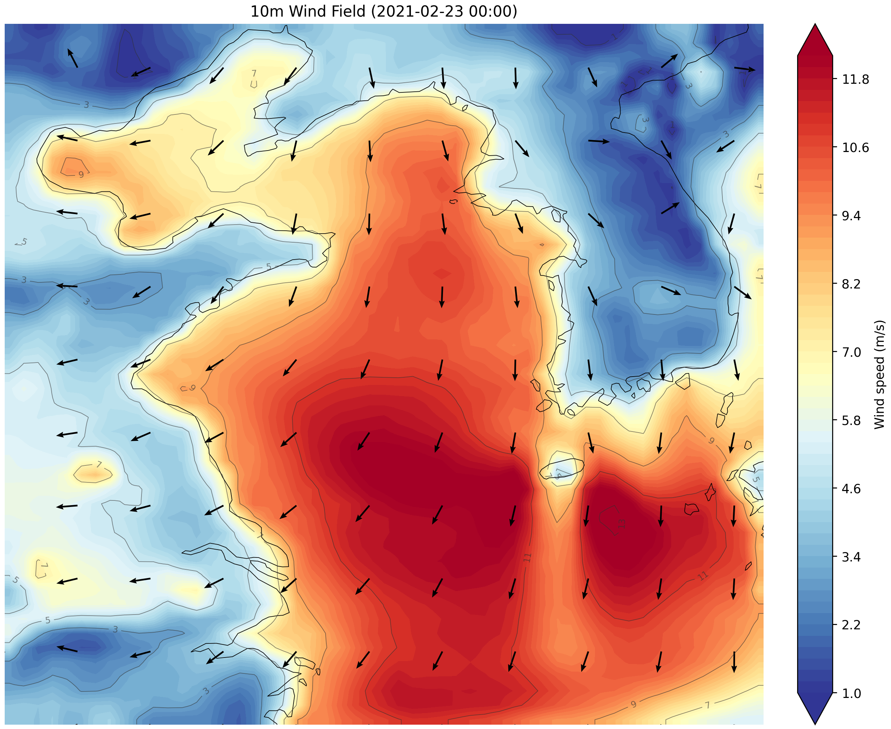


#### 2D spectrum

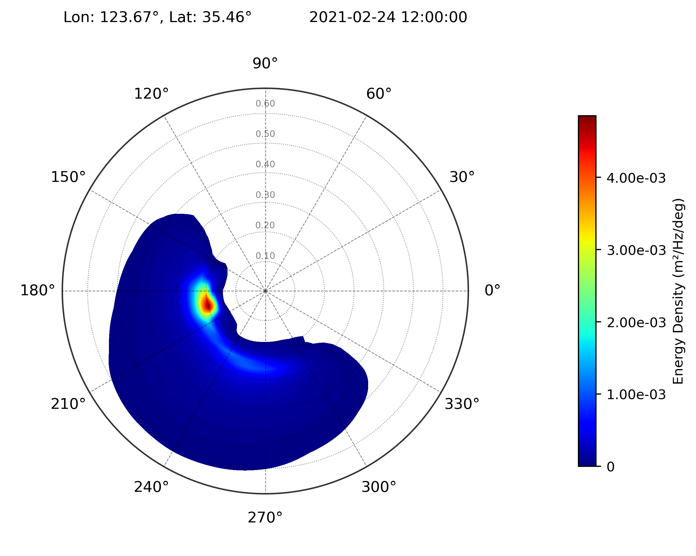

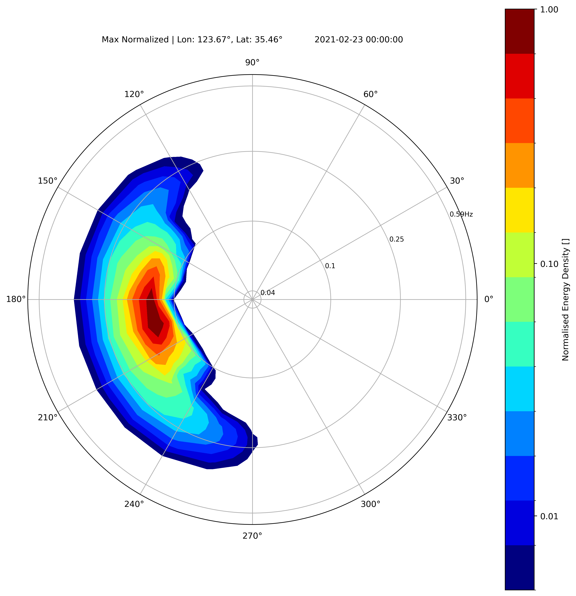


#### Wave-height maps

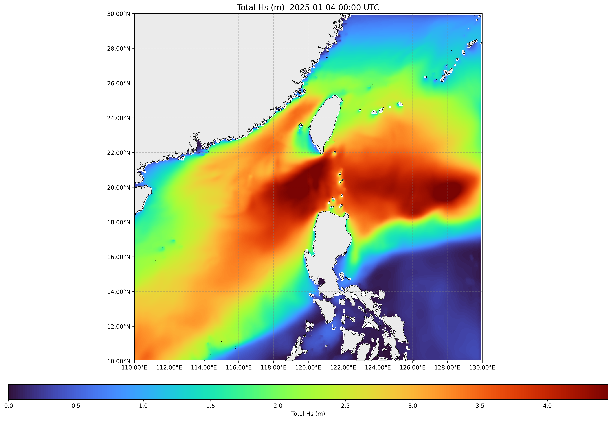
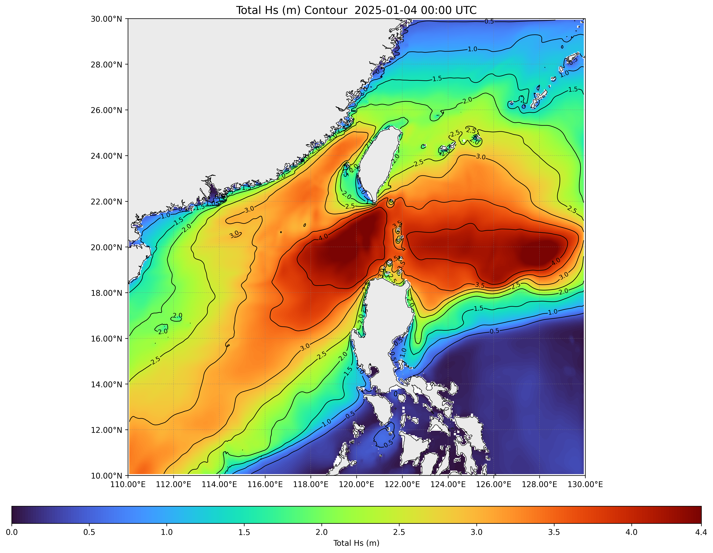


#### Wind-swell overlay

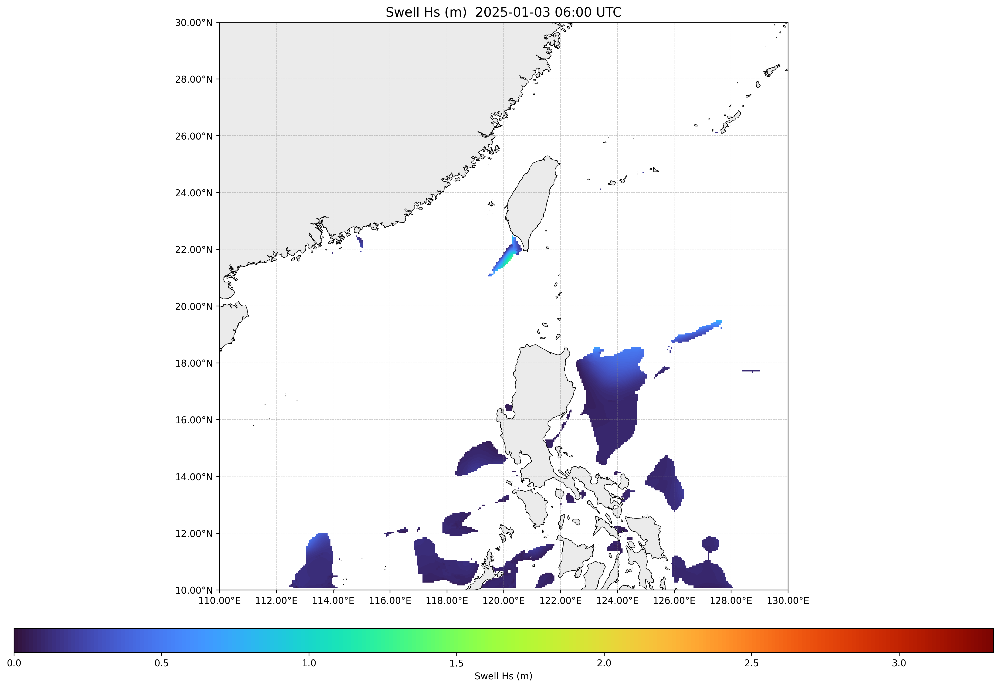
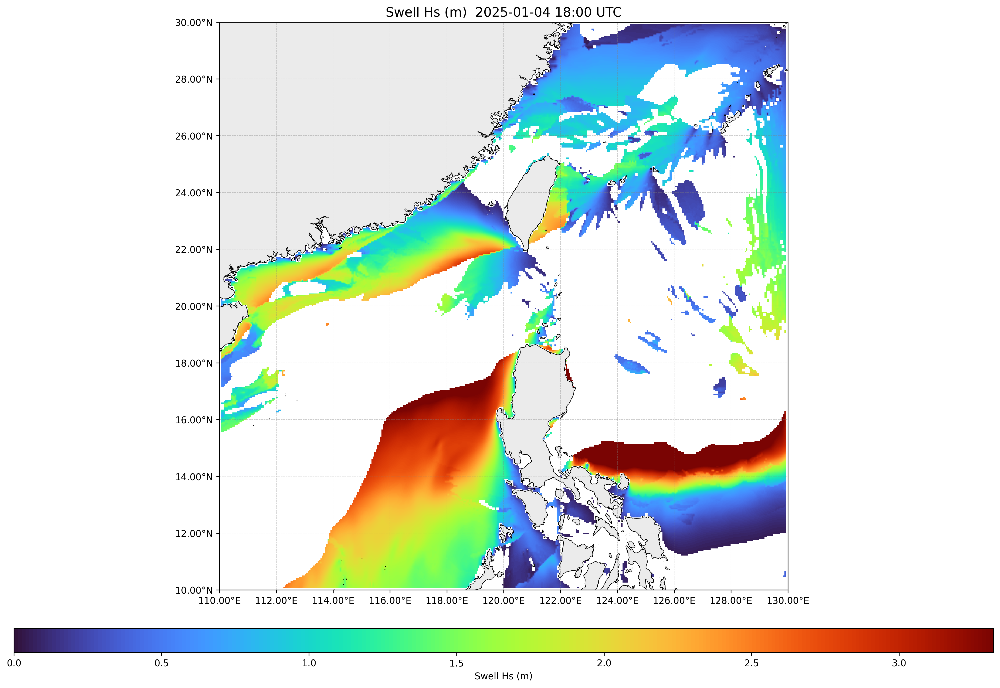


#### Satellite match

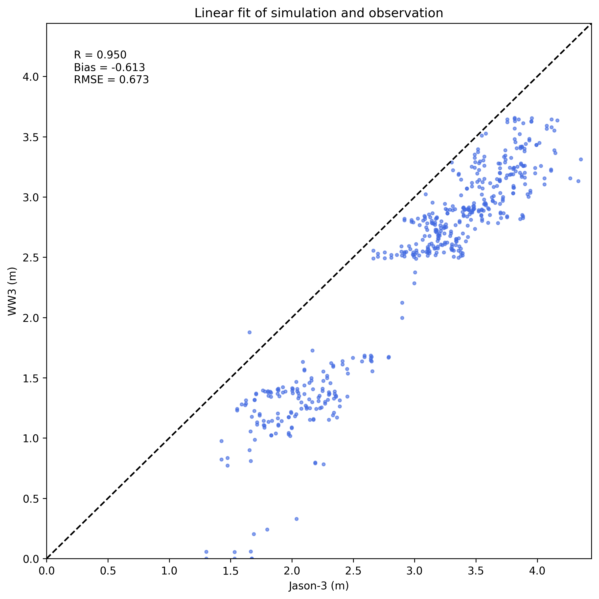


## 7. Project Structure

```
WW3Tool/
├── run.py                  # Entry: deps → locale → GUI / Shell / CLI
├── params.yml              # Template (do not run directly; use workdir copy)
├── public/                 # Global assets
│   ├── languages/          #   zh_CN.json / en_US.json
│   ├── 7.14_nml/           #   WW3 namelist templates (ww3_shel.nml, ww3_prnc.nml, …)
│   ├── 6.07_nml/
│   ├── scripts/            #   Remote helpers (ww3_ntfy_watch.sh, local.sh, server.sh, …)
│   └── forcing/            #   Sample forcing (tests)
├── meshgen/                # Grid generators
│   ├── structured_generator/  # Structured rectangular (pygridgen)
│   ├── unst_generator/        # JIGSAW unstructured
│   ├── smc_generator/         # SMC grid
│   ├── reference_data/        # Bathymetry/coastline (~6.5 GB)
│   └── cache/                 # Grid cache (hash-keyed)
├── workSpace/              # Default work-dir root; one subfolder per case
└── src/
    ├── desktop/            # PyQt6 GUI
    │   ├── windows/        #   Main window, settings
    │   ├── steps/          #   Step panels (ww3_panel, server_connect_panel, …)
    │   ├── view_models/    #   remote.py, pipeline.py, …
    │   └── components/     #   Reusable UI widgets
    └── workflows/          # Core logic (DDD-style)
        ├── interfaces/     #   command_line.py, interactive_cli.py, workdir_setup.py
        ├── application/    #   configuration, preprocessing_workflow, remote_ops, slurm_ops, …
        ├── domain/         #   config_models, forcing_fields, grid_spacing_recommendation, …
        ├── infrastructure/ #   forcing/, remote/, plot/, ww3/, adapters/, …
        └── support/        #   logging, exceptions, …
```

GUI and Shell call use cases under `src/workflows/application/`.


## 8. Data Sources

### Wind

#### ERA5

[https://cds.climate.copernicus.eu/datasets/reanalysis-era5-single-levels?tab=download](https://cds.climate.copernicus.eu/datasets/reanalysis-era5-single-levels?tab=download)

Register a CDS account first. Use a real name (not random letters) or registration may fail. Screenshots below walk through the ERA5 single-levels download form.

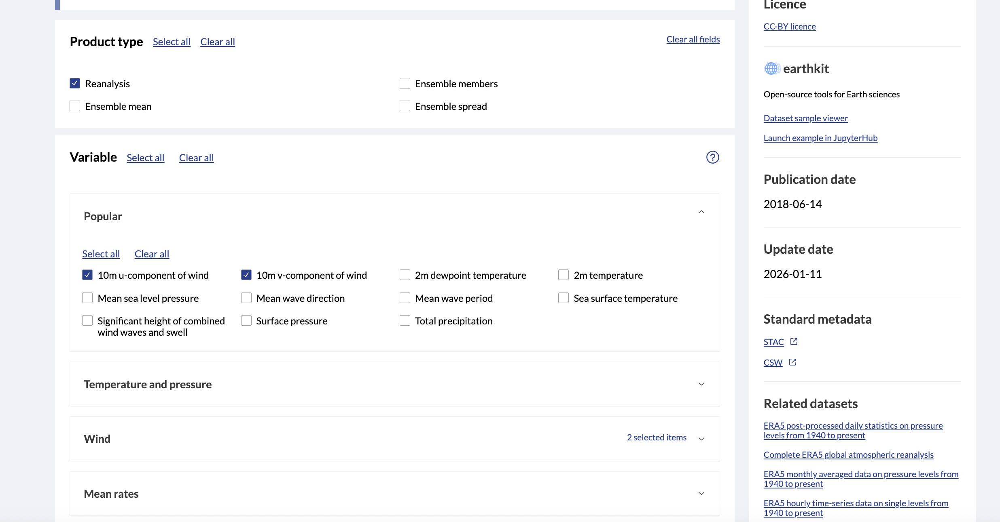

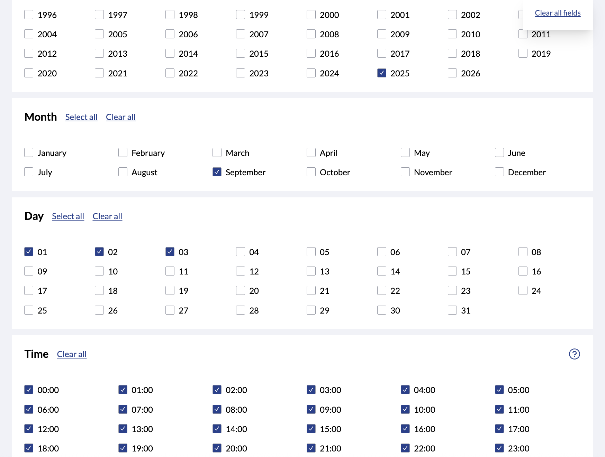

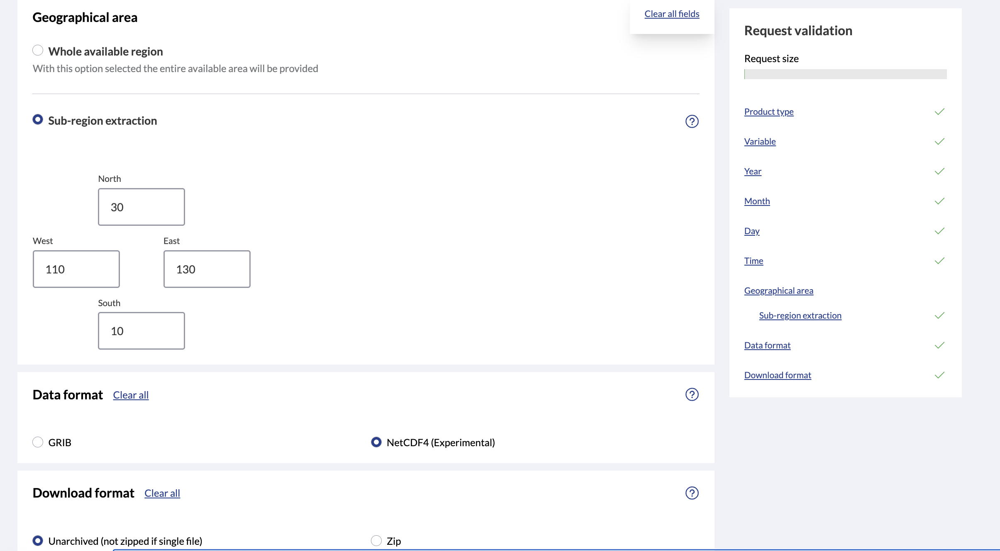

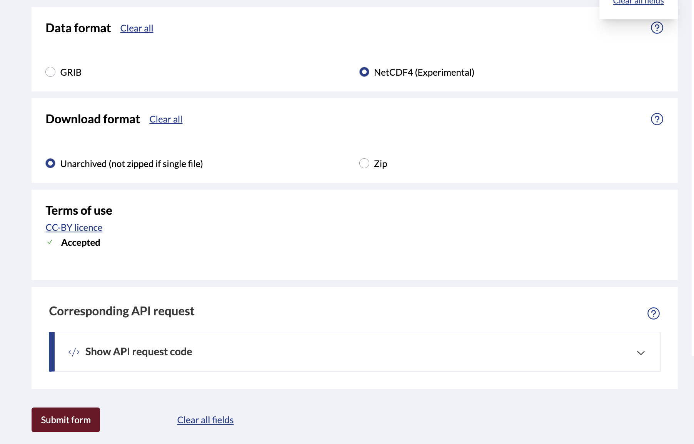


#### CFSR

[http://tds.hycom.org/thredds/catalog/datasets/force/ncep_cfsv2/netcdf/catalog.html](http://tds.hycom.org/thredds/catalog/datasets/force/ncep_cfsv2/netcdf/catalog.html)

Find `cfsv2-sec2_2025_01hr_uv-10m.nc` (suffix `uv-10m`).

Global full year:

HTTPServer: //tds.hycom.org/thredds/fileServer/datasets/force/ncep_cfsv2/netcdf/cfsv2-sec2_2025_01hr_uv-10m.nc

Subset by region/time:

NetcdfSubset: //ncss.hycom.org/thredds/ncss/grid/datasets/force/ncep_cfsv2/netcdf/cfsv2-sec2_2025_01hr_uv-10m.nc

Select `wndewd` and `wndnwd`; output format netCDF. Uncheck **Disable horizontal subsetting** if lat/lon inputs are disabled.

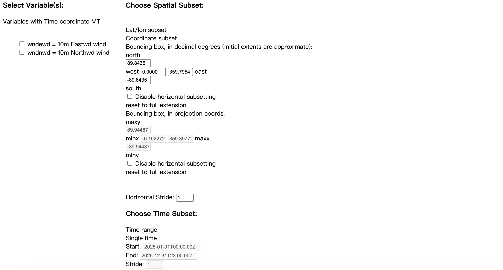

Time range tab → submit.


#### CCMP

[https://data.remss.com/ccmp/v03.1/](https://data.remss.com/ccmp/v03.1/)

Direct download.


### Current and water level

[https://data.marine.copernicus.eu/product/GLOBAL_ANALYSISFORECAST_PHY_001_024/download?dataset=cmems_mod_glo_phy_anfc_0.083deg_PT1H-m_202406](https://data.marine.copernicus.eu/product/GLOBAL_ANALYSISFORECAST_PHY_001_024/download?dataset=cmems_mod_glo_phy_anfc_0.083deg_PT1H-m_202406)

Choose variables; uncheck **Sea surface height above geoid** if you do not need water level. Set extent and time → DOWNLOAD.

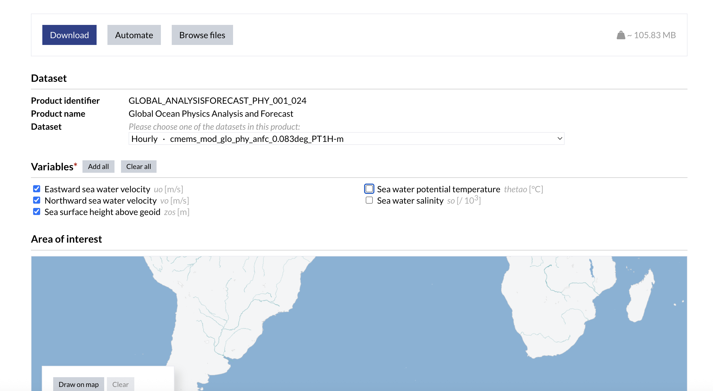


### Sea ice

[https://data.marine.copernicus.eu/product/GLOBAL_MULTIYEAR_PHY_001_030/download?dataset=cmems_mod_glo_phy_my_0.083deg_P1D-m_202311](https://data.marine.copernicus.eu/product/GLOBAL_MULTIYEAR_PHY_001_030/download?dataset=cmems_mod_glo_phy_my_0.083deg_P1D-m_202311)

Sea ice area fraction, thickness, and current are available from this product.

Ice variables include **Sea ice area fraction** (`siconc`) and **Sea ice thickness**.

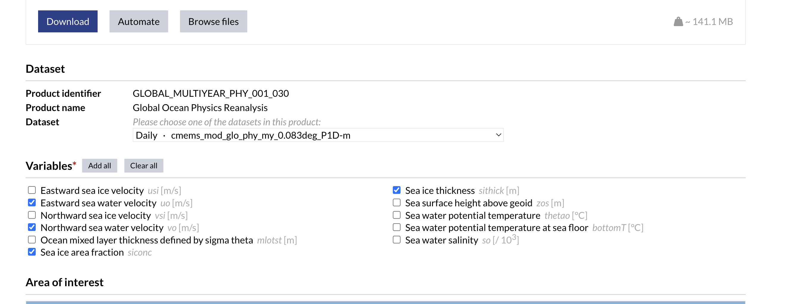


### Jason-3

https://www.ncei.noaa.gov/products/jason-satellite-products


### NDBC buoys

https://www.ndbc.noaa.gov

## License

This software is built on a GPLv3-licensed framework and is distributed under GPLv3 as required.
