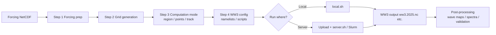

# WW3Tool Documentation

## 1. Project Overview


WW3Tool is a **preprocessing and run-assist toolkit** built around **WAVEWATCH III** (a spectral ocean wave model). It does not replace WW3 executables (`ww3_grid`, `ww3_prnc`, `ww3_shel`, etc.). Instead it handles:

- Validation, repair, and merging of forcing-field NetCDF files (latitude ordering, variable renaming, time-axis fixes)
- Grid generation (structured rectangular grids with arbitrary-depth Two-Way Nesting / unstructured triangular grids / SMC grids)
- Automatic configuration of the full WW3 namelist set for v6.07.1 and v7.14 (`ww3_grid.nml`, `ww3_prnc.nml`, `ww3_shel.nml`, `ww3_ounf.nml`, `ww3_multi.nml`, etc.)
- Run scripts that correctly invoke `ww3_grid`, `ww3_prnc`, `ww3_shel`, and related programs
- SSH upload of work directories to HPC, Slurm configuration, job submission, status monitoring, and result download
- Post-processing plots (wave-height maps, directional spectra, Jason-3 validation, NDBC buoy matching, etc.)

WW3Tool is written entirely in Python (non-Python code comes from the meshgen grid generator). It supports Windows / Linux / macOS with a bilingual Chinese/English UI.


## 2. Quick Start

`run.py` is the single entry point. Three modes are selected via CLI arguments:

```sh
python3 run.py                    # GUI (graphical interface)
python3 run.py shell              # Interactive terminal (REPL; steps can be run repeatedly)
python3 run.py <subcommand> [workdir]  # Headless CLI (one command per step; suited for scripts and AI agents)
```

All three modes share the same business logic (`src/workflows/application/`); only the interaction layer differs.


### 2.1 GUI


```bash
python3 run.py
```

This is the mode we use most often.


### 2.2 Interactive Shell

```sh
python3 run.py shell              # Interactive terminal
```


This mode is better suited for remote use on a server.


### 2.3 Headless CLI

```sh
python3 run.py <subcommand> [workdir]  # Headless CLI (one command per step; suited for scripts and AI agents)
```

The CLI’s “one command, one step, no manual interaction” design is naturally suited for AI agent calls. Commands include:

| Category | Subcommand | Description |
| ---- | --------------------------------------------------------------- | -------------------- |
| Config | workdir <path> | Create or load a work directory |
| | validate [workdir] | Validate `params.yml` |
| | config [workdir] | Print configuration summary |
| | print-params [workdir] | Print raw `params.yml` |
| Preprocessing | prepare-forcing [workdir] | Prepare forcing fields (Step 1) |
| | merge-forcing <in1.nc> [...] -o <out.nc> | Standalone tool: validate and merge forcing NetCDF |
| | generate-grid [workdir] | Generate grid (Step 2) |
| | recommend-grid [workdir] [--coarse\|--fine] | Recommend grid spacing from domain extent |
| | recommend-cfl [workdir] [--mode safe\|fast\|faster] [--factor X] | Recommend timesteps from CFL formula |
| | prepare-ww3 [workdir] | Generate WW3 namelists only |
| | run-workflow [workdir] | Full preprocessing workflow |
| | local-run [workdir] | Run `local.sh` |
| Remote ops | connect-test [workdir] | Test SSH connection |
| | ssh [workdir] | Open interactive SSH terminal |
| | slurm-idle [workdir] | List idle Slurm partitions |
| | confirm-slurm [workdir] | Write `server.sh` |
| | upload [workdir] --confirm | Upload work directory to remote |
| | submit [workdir] | Submit `server.sh` |
| | check-status [workdir] | Check remote job status |
| | queue-status [workdir] | View Slurm queue |
| | download-results [workdir] | Download remote results; nested grids auto-download finest level |
| | download-log [workdir] | Download remote log |
| | clear-remote [workdir] --confirm | Clear remote directory |
| | cancel-job [workdir] <job_id> | Cancel Slurm job |
| | ntfy-watch [workdir] | Inject persistent ntfy watcher |
| | ntfy-watch-job [workdir] <job_id> | Inject one-shot ntfy watcher for a job |
| Post-processing | plot-wave-maps [workdir] [--contour] | Wave-height maps |
| | plot-spectrum [workdir] [--mode ...] [--station N] | Directional spectrum plots |
| | plot-jason3 / plot-jason3-swh / download-jason3 [workdir] | Jason-3 related |
| | plot-ndbc [workdir] | NDBC buoy matching |
| | download-ndbc [workdir] | Download NDBC buoy observations |
| Helper | print-example | Print example `params.yml` |

Note: Almost every CLI command **must** specify a work directory; commands without one are not allowed.


## 3. Work Directory 

> What is a work directory?
>
> Suppose you want to simulate waves over 110°E–130°E, 10°N–30°N. After generating a grid with gridgen and downloading ERA5 reanalysis winds for 2025-01-03 through 2025-01-05 as forcing, you need a place to store the grid, namelists, scripts, and outputs: the **work directory**.

A typical single-level case looks like this:

```text
work_dir_name/
├── params.yml                         # Authoritative config for this case; GUI restores forms from it
├── run.log                            # Run log appended by local.sh / server.sh
├── local.sh                           # Local run script; copied from public/scripts/local.sh and patched
├── server.sh                          # Server Slurm script; copied from public/scripts/server.sh and patched
├── success / fail                     # Empty marker files for last run success or failure
│
├── wind.nc                            # Normalized wind forcing, usually from Step 1
├── current.nc                         # Normalized current forcing, optional
├── level.nc                           # Normalized water-level forcing, optional
├── ice.nc                             # Normalized sea-ice forcing, optional
│
├── grid.bot                           # Bathymetry grid; Step 2 or import
├── grid.obst                          # Obstruction grid; common for structured grids
├── grid.meta                          # Grid metadata recorded by WW3Tool
├── mod_def.ww3                        # WW3 grid definition from ww3_grid
│
├── ww3_grid.nml                       # Grid and spectral namelist
├── ww3_prnc.nml                       # Forcing preprocessing namelist
├── ww3_shel.nml                       # Main integration namelist
├── ww3_ounf.nml                       # Field output namelist
├── ww3_ounp.nml                       # Point-spectrum output namelist
├── ww3_trnc.nml                       # Track output namelist, if tracks enabled
├── namelists.nml                      # Combined namelist used by some WW3 versions
│
├── points.list                        # Spectral output points from params.yml calc.points
├── track_i.ww3                        # Track input from params.yml calc.track_points
│
├── wind.ww3 / current.ww3 / level.ww3 # WW3 binary forcing from ww3_prnc
├── out_grd.ww3                        # Field output intermediate file from ww3_shel
├── out_pnt.ww3                        # Point-spectrum intermediate file from ww3_shel
├── track_o.ww3                        # Track output intermediate file from ww3_shel
├── restart*.ww3                       # Restart files, if restart enabled
│
├── ww3.YYYY.nc                        # Field NetCDF, usually from ww3_ounf
├── ww3.YYYY_spec.nc                   # Point-spectrum NetCDF, usually from ww3_ounp
├── ww3.YYYY_trck.nc                   # Track NetCDF, usually from ww3_trnc
└── photo/                             # Images saved by GUI or post-processing, if any
```

Nested-grid cases keep master files at the root and one subdirectory per level:

```text
work_dir_name/
├── params.yml
├── ww3_multi.nml                      # Multi-grid coupling master namelist
├── local.sh / server.sh / run.log
├── wind.nc / current.nc / level.nc    # Normalized forcing NetCDF at root
├── level0/
│   ├── grid.bot / grid.obst / grid.meta
│   ├── ww3_grid.nml / ww3_prnc.nml / ww3_shel.nml / ww3_ounf.nml
│   ├── mod_def.ww3
│   ├── out_grd.ww3 / out_pnt.ww3
│   └── ww3.YYYY.nc / ww3.YYYY_spec.nc
├── level1/
│   └── ...
└── levelN/
    └── ...
```


## 4. Configuration: params.yml

`params.yml` describes all parameters for one simulation task.

For example, to simulate 110°E–130°E, 10°N–30°N with ERA5 winds from 2025-01-03 to 2025-01-05, that entire task is configured in `params.yml`, including common WW3 namelist settings.

Example `ww3_grid.nml` spectral and timestep blocks:

```swift
&SPECTRUM_NML
	SPECTRUM%XFR   = 1.1
	SPECTRUM%FREQ1 = 0.04118
	SPECTRUM%NK    = 32
	SPECTRUM%NTH   = 24
/

&TIMESTEPS_NML
	TIMESTEPS%DTMAX = 900
	TIMESTEPS%DTXY = 320
	TIMESTEPS%DTKTH = 300
	TIMESTEPS%DTMIN = 15
/
```

In `params.yml`:

```swift
ww3_grid:
	SPECTRUM%XFR: 1.1
	SPECTRUM%FREQ1: 0.04118
	SPECTRUM%NK: 32
	SPECTRUM%NTH: 24
	TIMESTEPS%DTMAX: 900
	TIMESTEPS%DTXY: 320
	TIMESTEPS%DTKTH: 300
	TIMESTEPS%DTMIN: 15
```

The root `params.yml` (`WW3Tool/params.yml`) is only a **template** with defaults. For a real run, create a separate work directory and edit `params.yml` inside it.

In GUI mode, form values are held in memory first; then the root `params.yml` is copied into the work directory and overwritten with your edits so the work-directory file always matches the root template structure.

Each time you open a work directory, the GUI reads `params.yml` and restores the form.

In Shell and CLI modes, edit the work-directory `params.yml` manually, then run commands.


### Validating params.yml

Every command auto-validates `params.yml` for format issues.

Shell and CLI also provide a dedicated validate command:

```sh
python run.py validate [work_dir_name]
```


### Path validation

When running a step, e.g.:

```swift
python3 run.py prepare-forcing [work_dir_name]
```

path-related parameters are validated automatically, for example:

```swift
paths:
	matlab_path: /Applications/MATLAB_R2024a.app/bin/matlab
	jason_path: /Users/zxy/ocean/Paper/WW3Tool/jason3
	ndbc_path: null
	jason3_download_url: https://www.ncei.noaa.gov/data/oceans/jason3/
```

If a value is empty or the path does not exist, defaults such as `WW3Tool/ndbc`, `WW3Tool/jason`, etc. are filled in according to internal rules.


## 5. Internal Workflow

Typical end-to-end chain:

```
→ [Create or load work directory]  Copy root params.yml into work directory
→ [Step 1 Forcing preparation] Validate, repair, copy/move forcing into work directory
→ [Step 2 Grid generation] Call meshgen to build grid files
→ [Step 3 Computation mode] Region / spectral points / track
→ [Step 4 WW3 configuration] Configure namelist files
→ [Step 5 Connect server] SSH, Slurm, server WW3 version
→ [Step 6 Upload & run] Upload work directory, submit Slurm job
→ [Step 7 Output] WW3 results (ww3.*.nc, etc.)
```


```mermaid
flowchart LR
  A[Forcing NetCDF] --> B[Step 1 Forcing prep]
  B --> C[Step 2 Grid generation]
  C --> D[Step 3 Computation mode
  region / points / track]
  D --> E[Step 4 WW3 config
  namelists / scripts]
  E --> F{Run where?}
  F -->|Local| G[local.sh]
  F -->|Server| H[Upload + server.sh / Slurm]
  G --> I[WW3 output ww3.2025.nc etc.]
  H --> I
  I --> J[Post-processing
  wave maps / spectra / validation]
```

CLI examples for each step are placed under the corresponding `params.yml` sections below so you can read parameters and run commands together.

The following sections explain each step in detail.


### 5.1 Creating a Work Directory


When creating a work directory, the program:

1. Creates a new folder under `WW3Tool/workSpace/` (default name: current timestamp, e.g. `2026-06-17_19-37-01`)
2. Copies the root `params.yml` into the work directory unchanged
3. Patches the work-directory `params.yml`: sets workdir path, clears forcing paths, date range, and `remote_dir` (avoids wrongly restoring root-template values on the home form)
4. Loads `params.yml` to populate default UI values


#### params.yml fields

```swift
workdir:
	path: /Users/zxy/ocean/Paper/WW3Tool/workSpace/new
	default_workspace: /Volumes/Zxy's Disk/WW3Tool_workSpace/
```

`path` — work directory path  
`default_workspace` — default parent folder for new work directories

```sh
python run.py workdir [work_dir_name]
```

`work_dir_name` may be an absolute path or a folder name. If the directory does not exist, a work directory is created, root `params.yml` is copied, and `workdir.path` is set.


#### Root-directory guard

To prevent using the repo root without creating a work directory, CLI and Shell refuse to run against the template root `params.yml`.

CLI without workdir:

```bash
python3 run.py prepare-forcing

---------------------------------------------------------------

Using project virtual environment: /Users/zxy/ocean/Paper/WW3Tool/.venv
Dependency check passed.
Parameter error: Cannot use the repository root params.yml directly (it is a template file).
Please create or load a working directory first:
  python3 run.py workdir my_workdir
```

In Shell mode, without `workdir` you cannot run any command:

```sh
ww3>  config
⚠ No configuration loaded. Use 'workdir <path>' first.
ww3> queue-status
⚠ No configuration loaded. Use 'workdir <path>' first.
```


### 5.2 Step 1 — Forcing Preparation

Step 1 imports external NetCDF forcing into the work directory and normalizes it for later steps. Supported fields: wind, current, water level, sea ice.


#### GUI workflow

Step 1 on the home page is **select first, then confirm import**:

1. Click wind / current / level / ice buttons to choose NetCDF files.
2. After selection, the log shows file info (variables, time range, lat/lon extent). This step only reads metadata; no copy, move, or crop yet.


3. With one or more fields selected, common time and spatial extents are read into Step 1 inputs. When opening an existing work directory, standard files (`wind.nc`, `current.nc`, etc.) are scanned and extents filled when possible.
4. To crop, edit time/lat/lon, then click **Confirm crop and import**. Time format: `YYYYMMDD`; space: decimal degrees.
5. To import without cropping, click **Import directly without cropping**. Files are copied or moved in full, then normalized.

Import modes:

- **Copy**: keep originals; write processed files into the work directory.
- **Move**: remove or relocate originals after import. With crop, the source is not moved as-is; a cropped file is written first, then the source is deleted on success.

Helper buttons:

- **Read common extent**: re-read common time/lat/lon from selected fields into Step 1 inputs.
- **View map**: show spatial extent of up to four fields.
- **View all field info**: dump info for all selected fields to the log.
- **×** next to each field button: clear selection; if pointing at a normalized file in the work directory, optionally delete it and clear references.


#### params.yml

Step 1 settings are under `forcing`:

```sh
python3 run.py prepare-forcing [work_dir_name]    # Prepare forcing
```

```yaml
forcing:
  wind: null
  current: null
  level: null
  ice: null
  process_mode: copy        # copy or move
  crop_time_range: []       # [start_YYYYMMDD, end_YYYYMMDD]; empty = no crop
  crop_bbox: []             # [west, east, south, north]; empty = no crop
  auto_associate: true      # If one file has multiple fields, link to multiple slots
```

Settings page defaults apply when opening a work directory; actual import still follows home-page selections and buttons.


#### Detecting field type

Field type is inferred from NetCDF variable names:

- **Wind**: any of u10/v10, wndewd/wndnwd, uwnd/vwnd (case-insensitive)
- **Current**: uo/vo
- **Water level**: zos
- **Ice**: siconc


#### Normalization

```swift
🔄 Rewriting time metadata to WW3-readable char attributes (units + calendar)

✅ Forcing field normalized and saved to: /User/WW3Tool/workSpace/2026-06-29_16-57-02/wind.nc
```

After confirm import:

1. Rename variants (e.g. `wndewd/wndnwd`, `uwnd/vwnd` → wind; `uo/vo`, `zos`, `siconc` → respective fields).
2. Coordinates unified to `longitude`, `latitude`, `time`; dimensions and dependent variables updated.
3. Output named by field type: `wind.nc`, `current.nc`, etc.; combined names like `current_level.nc` when multiple fields share one file with `auto_associate`.
4. Latitude flipped from descending to ascending if needed (avoids WW3 6.07.1 `ww3_prnc` `EXTCDE(32)` on regular lat-lon grids).
5. Normalized files feed Step 4 `ww3_prnc.nml` generation; no manual namelist edits for original variable names.


#### Multi-field auto-association

If one NetCDF contains multiple field types and `forcing.auto_associate: true`, all detected types are linked to the same normalized file path in multiple GUI slots.

Examples:

- File with `uo/vo` and `zos` → `current_level.nc`; current and level slots both point to it.
- File with wind, current, level, ice → `wind_current_level_ice.nc`; all four slots point to it.

With `auto_associate: false`, only the slot where you selected the file is updated.

#### Work-directory scan

On open, normalized forcing files are detected and GUI buttons restored (`wind.nc`, `current_level.nc`, etc.). Scan only restores display; import still requires **Confirm crop and import** or **Import directly**.


### 5.3 Step 2 — Grid Generation


Step 2 builds WW3 grid input from `params.yml` `grid` section. It does **not** run `ww3_grid`; compiling `mod_def.ww3` happens in Step 4 / run scripts.

For meshgen internals see `meshgen/README.md`. Below covers GUI/CLI essentials.

#### GUI workflow

Recommended order on Step 2:


1. Choose grid type: normal / nested, and rectangular / SMC / unstructured.
2. Enter main grid extent (`lat` and `lon` rows; maps to `grid.lat: [south, north]`, `grid.lon: [west, east]`).
3. Rectangular grids need `DX/DY`; SMC and unstructured hide `DX/DY` and show their own cards.
4. **Recommend grid spacing** writes conservative starter values.
5. **View map** previews extent; nested shows all level rectangles.
6. **Generate grid** calls meshgen and writes files into the work directory.

Missing `reference_data` triggers a download prompt. Results are cached under `meshgen/cache/` by parameter hash.

#### reference_data

The reference data package (GEBCO, ETOPO1/2, coastlines, etc.) is required for grid generation.

If `WW3Tool/meshgen/reference_data` is missing, Step 2 shows a download dialog:


Click download: the program fetches from [GitHub Release](https://github.com/ZxyGch/WW3Tool/releases/tag/data) (~6.5 GB) automatically.


#### Grid types

| Type | Use case | Main outputs |
| ------ | --------------------------- | ------------------------------------------------------ |
| Rectangular | Regional regular grids; debugging; batch events; most stable | `grid.bot`, `grid.obst`, `grid.mask_nobound`, `grid.meta` |
| Nested rectangular | Coarse outer, fine inner; local detail with far-field propagation | `level0/` … `levelN/` each with its own grid set |
| SMC | Global or large domains; needs SMC-capable WW3 | `grid_cell.dat`, `grid_subtr.dat`, etc. |
| Unstructured | Complex coastlines; local high-res triangles | `grid.ww3`, `unstructured_grid.json` |


#### Refining resolution

The simplest way to increase resolution is **not** enlarging the domain but **reducing** spacing parameters. Finer grids increase point count, cost, and output size; re-run `recommend-cfl` or Step 4 auto-timestep after changes.

| Grid | Primary knobs | Simplest refinement | Notes |
| --- | --- | --- | --- |
| Rectangular | `structured.nested.levels[0].dx`, `dy`; GUI `DX/DY` | Halve `dx/dy` (e.g. 0.05 → 0.025) | Halving both directions ≈ 4× points; `DTXY` usually smaller |
| Nested | Finest `levels[-1].dx/dy`, `lon/lat`; add a level | Shrink finest `dx/dy` or add inner level | Fine level must lie inside parent; spectral points on finest level |
| SMC | `smc.n_levels`, `smc.dshalw`, `smc.depmin`, `smc.msea` | Increase `n_levels` | Needs SMC WW3; refinement tied to depth thresholds |
| Unstructured | `hmin`, `hshr`, `hmax`, `nwav`, `dhdx`, `edge_segments` | Decrease `hmin/hshr` near shore | Very small `hmin` explodes triangle count |


Rules of thumb:

1. Rectangular: reduce `DX/DY`.
2. Nested: refine innermost level only.
3. SMC: tune `n_levels` and shallow thresholds.
4. Unstructured: tune `hmin/hshr` first.
5. `coastline_precision` affects coastline detail, not overall cell size.


#### Grid params.yml

```sh
python3 run.py generate-grid  [work_dir_name]                 # Generate grid
python3 run.py recommend-grid [work_dir_name] --coarse        # Use recommended spacing
```

```yaml
# Grid generation (rectangular / SMC / unstructured).
#   mesh_type – 'structured' | 'smc' | 'unstructured'
#   grid_type – 'normal' single layer; 'nested' nesting (rectangular only)
#   gridgen_version – 'Python' or 'MATLAB'
#   reference_data_path – bathymetry/coastline data; null = auto-detect
#   lon – [west, east] degrees
#   lat – [south, north] degrees
#   structured.nested.levels – coarse to fine when grid_type=nested
grid:
  mesh_type: structured
  grid_type: normal
  gridgen_version: Python
  reference_data_path: /Users/zxy/ocean/Paper/WW3Tool/meshgen/reference_data
  lon:
  - 110.0
  - 130.0
  lat:
  - 10.0
  - 30.0
```

| Field | Meaning |
| --- | --- |
| `grid.mesh_type` | `structured`, `smc`, `unstructured` |
| `grid.grid_type` | Rectangular only: `normal` or `nested` |
| `grid.lon` | `[west, east]` |
| `grid.lat` | `[south, north]` |
| `grid.reference_data_path` | Bathymetry/coastline directory |
| `grid.structured.nested.levels` | Nested levels; `level0` coarsest, `levelN` finest |

#### Structured rectangular grid

pygridgen / gridgen on a regular lat-lon lattice. `normal`: one layer at work-dir root. `nested`: multiple levels; see below.


##### Nested grids


Nesting = coarse outer + fine inner for multi-resolution runs. WW3Tool uses WW3 `ww3_multi` (one integration drives all levels; see §5.5.7 and nested-grid design notes).

| Item | Description |
|----|------|
| `grid.grid_type` | `nested` enables nesting; `normal` = single layer |
| `grid.structured.nested.levels` | Ordered coarse→fine; `levels[0]` = level0; 2–99 levels |
| Per level | `dx`, `dy` (deg), `lon`, `lat` rectangle |
| `nested_contraction_coefficient` | GUI “matryoshka”: shrink parent extent and halve `dx/dy` for next level |
| Validation | Fine `dx/dy` < coarse; level k fully inside level k−1 |

Generation layout:

- `generate-grid` calls gridgen per level → `level0/`, `level1/`, …


- Each level has `grid.bot`, `grid.obst`, `grid.meta`; forcing NetCDF stays at root; per-level prnc uses `../wind.nc`.
- Root `ww3_multi.nml`; spectral `points.list` at root; points must lie on finest grid.

Nested cases are still evolving; errors like `OUTPUT POINT OUT OF GRID`, `NBI=0 AND RANK > 1` — check nested design doc.


##### params.yml example

Single layer: one entry in `levels`. Nested: at least two.

```sh
python3 run.py workdir nested_demo
# params.yml:
#   grid.grid_type: nested
#   grid.structured.nested.levels: [ level0 coarse, level1 fine ]
python3 run.py generate-grid nested_demo
python3 run.py recommend-cfl nested_demo    # Timesteps from level0 spacing (per-level in Step 4)
python3 run.py prepare-ww3 nested_demo
python3 run.py local-run nested_demo
```

```yml
structured:
  nested:
    nested_contraction_coefficient: 1.3
    levels:
    - dx: 0.05
      dy: 0.05
      lon: [100.0, 130.0]
      lat: [10.0, 30.0]
    - dx: 0.025
      dy: 0.025
      lon: [103.4615, 126.5385]
      lat: [12.3077, 27.6923]
    - dx: 0.0125
      dy: 0.0125
      lon: [106.1242, 123.8758]
      lat: [14.0828, 25.9172]
  bathymetry: GEBCO
  coastline_precision: full
  min_dist: 20
  cut_off: 0
  lim_bathy: 0.4
  lim_val: 0.5
  split_lim: 0
  lake_tol: 50
```


##### Grid visualization


##### Grid files

Single layer: `grid.obst`, `grid.bot`, `grid.mask_nobound`, `grid.meta` at work-dir root. Nested: same set under each `levelK/`.

| File | Description |
| --- | --- |
| `grid.bot` | Bathymetry ASCII, usually `Ny × Nx`; `ww3_grid.nml` bottom input |
| `grid.mask_nobound` | Land-sea mask: `0` land, `1` sea |
| `grid.obst` | x/y obstruction fractions |
| `grid.meta` | WW3Tool metadata (extent, resolution, point count); Step 4 syncs namelist |


#### Unstructured triangular grid

JIGSAW / NOAA `unst_msh_gen`. No `DX/DY`; core knobs: `hmax/hmin/hshr`.


##### params.yml

```yaml
unstructured:
	hmax: 100
	hmin: 2
	hshr: 20
	nwav: 400
	dhdx: 0.05
	deep_ocean_threshold_m: 4000
	margin_deg: 1
	edge_segments: 64
	options:
	data:
	mask_file: ''
	command_line_args:
	black_sea: 3
	regional:
	stereo_lon: 120.0
	stereo_lat: 20.0
```


##### Grid files

| File | Description |
| --- | --- |
| `grid.ww3` | Main unstructured grid for WW3 |
| `unstructured_grid.json` | Parsed config for reproducibility and cache |

Cache: `meshgen/cache/unst/<hash>/`; on hit, `grid.ww3` is copied to work directory.


##### Visualization


#### SMC grid

SMCGTools-based. Requires SMC-capable WW3 and templates; not the default for simple regional runs.


##### params.yml

```yml
smc:
  bathymetry: ETOPO2
  bathy_convention: elevation
  n_levels: 2
  wlevel: 0
  depmin: 0
  dshalw: -150
  generate_boundary_cells: true
  msea: 1
  options:
    input:
      auto_flip_lat: true
      auto_flip_lon: true
      coord_spacing_rtol: 0.001
      coord_spacing_atol: 1.0e-08
      nan_fill_value: 1000.0
    grid:
      name: grid
      global: false
      arctic: false
      glb_arc_lat: 84.4
      origin:
        lon0: 0.0
        lat0: -90.0
    output:
      file_prefix: ''
```


##### Visualization


### 5.4 Step 3 — Computation Mode

Computation mode chooses whether WW3 integrates over the full grid, fixed spectral points, or a moving track. Set in `calc.mode` (GUI Step 3). No dedicated CLI subcommand; read during `prepare-ww3` or `run-workflow`.


| Mode | `calc.mode` | Use case | Work-dir files | Typical output |
| ------- | ---------------- | ------------------ | ------------- | ------------------------ |
| Regional | `region` | Full-grid HS, period, direction, etc. | None extra | `ww3.YYYY.nc` |
| Spectral points | `spectral_point` | 2D spectrum at stations | `points.list` | `ww3.YYYY_spec.nc` |
| Track | `track` | Values along ship/buoy/TC path | `track_i.ww3` | `ww3.YYYY_trck.nc` |

If unsure, use **region** — it is the most common.


#### params.yml

```sh
# No separate Step 3 CLI; edit calc then:
python3 run.py prepare-ww3 [work_dir_name]
python3 run.py run-workflow [work_dir_name]
```

```yaml
calc:
  mode: spectral_point     # region | spectral_point | track
  points:
  - lon: 114.225
    lat: 15.4798
    name: '0'
  - lon: 115.519
    lat: 20.6623
    name: '1'
  track_points: []
```

Notes:

1. `region`: no `points` or `track_points`.
2. `spectral_point`: at least one point → `points.list` in Step 4.
3. `track`: track points → `track_i.ww3` in Step 4.


### 5.5 Step 4 — WW3 Configuration

> What does Step 4 do?
>
> Steps 1–3 prepared forcing, grid, and computation mode. Step 4 writes the full WW3 namelist set from work-directory `params.yml`.
>
> Principle: only change fields relevant to this case; keep `public/nml/` templates otherwise intact for comparison with official examples.


#### 5.5.3 CFL-based timestep recommendation

```log
📐 CFL-based timesteps: DXY≈5230 m, Tcfl≈252 s → DTXY=226, DTMAX=678, DTKTH=339, DTMIN=15
```

Step 4 **Auto-configure timesteps** uses CFL stability; values are written to `ww3_grid.nml` on confirm.

```swift
✅ Spectral parameters and time steps have been written to ww3_grid.nml:
  SPECTRUM%XFR    = 1.1
  SPECTRUM%FREQ1  = 0.0375
  SPECTRUM%NK     = 35
  SPECTRUM%NTH    = 36

  TIMESTEPS%DTMAX = 678
  TIMESTEPS%DTXY  = 226
  TIMESTEPS%DTKTH = 339
  TIMESTEPS%DTMIN = 15
```

CLI:

```sh
python3 run.py recommend-cfl new                         # default safe, CFL 0.9
python3 run.py recommend-cfl new --mode fast             # CFL 1.05
python3 run.py recommend-cfl new --mode faster           # CFL 1.15
python3 run.py recommend-cfl new --factor 1.2            # custom factor, cap 1.25
python3 run.py prepare-ww3 new
```


##### CFL calculation

WW3 convention: wave group travel per timestep must not exceed one grid spacing.

- $\Delta x$: minimum grid spacing (m). Structured/SMC from `dx`/`dy` and latitude; unstructured uses `hmin` (km) as finest scale.
- $f_1$: lowest spectral frequency `SPECTRUM%FREQ1` (Hz).
- Deep-water group speed $C_g \approx g / (4\pi f_1)$ ($g=9.8\,\mathrm{m/s^2}$).

CFL timescale:

$$
T_{\mathrm{cfl}} = \frac{\Delta x}{C_g} = \frac{\Delta x \cdot f_1 \cdot 4\pi}{g}
$$

WW3Tool rounds to integer seconds and cascades:

| Mode | CFL factor | Description |
|------|----------|------|
| safe | 0.90 | Default conservative |
| fast | 1.05 | More aggressive |
| faster | 1.15 | Most aggressive built-in |
| --factor X | custom, max 1.25 | Manual multiplier |

| Parameter | Role | Typical relation |
|------|------|----------|
| DTXY | Spatial propagation step | $\approx \mathrm{CFL} \times T_{\mathrm{cfl}}$ |
| DTMAX | Main integration cap | $\approx 3 \times \mathrm{DTXY}$ |
| DTKTH | Source/sink spectral step | $\approx \mathrm{DTMAX}/2$ without strong currents |
| DTMIN | Minimum step | Default 15 s |

Nested grids: CFL recomputed **per level** (fine grids → smaller `DTXY` → more steps). Tied to `ww3_multi.nml` process allocation (§5.5.7).

If the grid is very coarse or `FREQ1` very small, recommended steps may still be too large; reduce spacing or CFL factor rather than blindly increasing `DTMAX`.


#### 5.5.1 Copy templates and run scripts

```log
✅ Copied server.sh, local.sh to the current work directory
✅ Copied 8 NML template files to current work directory
```

- Copy namelists from `public/6.07_nml/` or `public/7.14_nml/` (per NML version).
- Copy `local.sh` and `server.sh` from `public/scripts/`. Same WW3 program sequence; environment differs (§5.5.8).


#### 5.5.2 Write grid into ww3_grid.nml

Step 2 grid files are synced into `ww3_grid.nml` by grid type:

```log
✅ Successfully synced grid.meta parameters to ww3_grid.nml:
  GRID%TYPE  = 'RECT'
  ...
```

```log
✅ Unstructured mesh: updated ww3_grid.nml ...
  GRID%TYPE     = 'UNST'
  UNST%FILENAME = 'grid.ww3'
```

```log
✅ SMC mesh: updated ww3_grid.nml ...
  SMC%MCELS%FILENAME = 'grid_cell.dat'
  ...
```

Rectangular: extent, resolution, bathy file. Unstructured: point to `grid.ww3`. SMC: envelope + SMC data files. All automated in Step 4.


#### 5.5.4 Time and output stride

```log
✅ Updated ww3_ounp.nml: ...
✅ Updated ww3_ounf.nml: ...
✅ Updated ww3_shel.nml: ...
✅ Modified ww3_prnc.nml: ...
```

params.yml:

```yaml
ww3:
  start_date: "20250103"
  end_date: "20250105"
  output_step: "3600"   # seconds
```

| Location | Role |
| --------------------------------------------- | ---------------------------------------------------------------- |
| `ww3_shel.nml` `DOMAIN%START/STOP` | Main integration window |
| `ww3_shel.nml` `DATE%FIELD` | When/how often field output is written during integration |
| `ww3_ounf.nml` `FIELD%TIMESTART/TIMESTRIDE` | NetCDF field export from `out_grd.ww3` |
| `ww3_ounp.nml` `POINT%TIMESTART/TIMESTRIDE` | Spectral point NetCDF export |
| `ww3_prnc.nml` `FORCING%TIMESTART/TIMESTOP` | Forcing preprocessing window; should cover integration |


#### 5.5.5 Spectral partition output scheme


Configure schemes on the settings page (add/edit/delete).

```log
✅ Modified spectral partition output scheme in ww3_shel and ww3_ounf:
  TYPE%FIELD%LIST = 'HS DIR FP T02 WND PHS PTP PDIR PWS PNR TWS EF'
  FIELD%LIST      = 'HS DIR FP T02 WND PHS PTP PDIR PWS PNR TWS EF'
```

Nested: also synced to `ww3_multi.nml` `ALLTYPE%FIELD%LIST`.

```swift
ww3:
  output_scheme:
    use: with_spectrum
    standard: HS DIR FP T02 WND PHS PTP PDIR PWS PNR TWS
    with_spectrum: HS DIR FP T02 WND PHS PTP PDIR PWS PNR TWS EF
```


#### 5.5.6 Forcing switches and multiple prnc


If Step 1 imported multiple fields, Step 4 shows multi-select (wind required). Separate `ww3_prnc_*.nml` per field type.

```log
✅ Copied and modified ww3_prnc_current.nml: ...
✅ Copied and modified ww3_prnc_level.nml: ...
```

Default `ww3_prnc.nml` is for wind. `ww3_prnc` reads one namelist per run; `local.sh` / `server.sh` rename/swap namelists automatically.


#### 5.5.7 Nested grids


Nested: root `ww3_multi.nml` and `points.list` (spectral mode); each `level*/` has its own `ww3_grid.nml`, `mod_def`, etc.


##### ww3_multi.nml

```nml
&INPUT_GRID_NML
  INPUT(1)%NAME                  = 'wind'
  INPUT(1)%FORCING%WINDS         = T
  ...
/

&MODEL_GRID_NML
  MODEL(1)%NAME                  = 'level0'
  MODEL(1)%RESOURCE              = 1 1 0.00 0.08 F
  MODEL(2)%NAME                  = 'level1'
  MODEL(2)%RESOURCE              = 2 1 0.08 0.24 F
  MODEL(3)%NAME                  = 'level2'
  MODEL(3)%RESOURCE              = 3 1 0.24 1.00 F
/
```

`ww3_multi.nml` chains levels for one `mpirun ww3_multi` integration.

`MODEL(i)%RESOURCE` five fields:

| Field | Meaning |
| ------------ | -------------------------------------------------------------------------------------------------------- |
| `RANK_ID` | Nesting level index: level0 (coarsest) = 1, increases toward fine |
| `GROUP_ID` | MPI group; WW3Tool default 1 |
| `COMM_FRAC` | Process share interval `[low, high]` in 0–1; partitions all MPI ranks |
| `BOUND_FLAG` | Output nest boundary file `nest.<NAME>`; default `F` |

WW3Tool estimates relative cost `points / DTXY` per level from each `ww3_grid.nml` and writes `COMM_FRAC`.


##### Shared forcing

Forcing at root; each level `ww3_prnc.nml` uses `../wind.nc`:

```log
✅ Modified ww3_prnc.nml:
  FILE%FILENAME       = '../wind.nc'
```


##### Spectral points

```
&DOMAIN_NML
  DOMAIN%NRGRD  = 3
  DOMAIN%UNIPTS = F
  ...
/

&OUTPUT_TYPE_NML
  ALLTYPE%POINT%FILE     = 'points.list'
  ALLTYPE%POINT%NAME     = 'level2'
/
```

`points.list` only at root; coordinates on finest `levelN`. Raw output `out_pnt.<finest MODEL%NAME>`; scripts move to `levelN/out_pnt.ww3` then run `ww3_ounp` there.


##### Per-level auto CFL

Each level gets its own `TIMESTEPS%DTXY`, `DTMAX`, etc. in that level’s `ww3_grid.nml`:

```log
✅ Recomputed CFL timesteps: DTXY=189, DTMAX=567, DTKTH=284 (bathy Cg=24.9m/s)
```


#### 5.5.8 What local.sh and server.sh run

These scripts **orchestrate** WW3 executables; they do not perform physics. They append to `run.log`, write `fail` on error, `success` when done.

Local:

```sh
python3 run.py local-run new
```

Remote:

```sh
python3 run.py upload --confirm new
python3 run.py submit new
python3 run.py check-status new
python3 run.py download-log new
```

Programs invoked:

- **`ww3_grid`**: compile `mod_def.ww3` from grid + namelist (always first).
- **`ww3_prnc`**: NetCDF forcing → `wind.ww3`, etc.; one namelist per run, wind/current/level/ice in sequence.
- **`ww3_strt`**: initial spectrum → `restart.ww3`.
- **`ww3_shel`**: single-grid main integration → `out_grd.ww3`, `out_pnt.ww3`, …; `mpirun` with fallback to serial.
- **`ww3_multi`**: nested main integration (replaces `ww3_shel`).
- **`ww3_ounf`**: `out_grd.ww3` → `ww3.YYYY.nc`.
- **`ww3_ounp`**: `out_pnt.ww3` → `ww3.YYYY_spec.nc` (if `points.list`).
- **`ww3_trnc`**: track output (if `track_i.ww3`).

Single-grid flow:

```text
ww3_grid
→ ww3_prnc (wind/current/level/ice)
→ ww3_strt
→ mpirun ww3_shel (fallback: ww3_shel)
→ ww3_ounp (spectral points)
→ ww3_trnc (track)
→ ww3_ounf
→ success / fail
```

Nested flow:

```text
per level*: ww3_grid → ww3_prnc → ww3_strt
aggregate mod_def.*, wind.*, restart.* to root
mpirun ww3_multi
→ move out_grd/out_pnt/track to finest levelN/
→ ww3_ounp / ww3_trnc / ww3_ounf on levelN/
→ success / fail
```

`local.sh`: local CPUs, optional `WW3_MPI_NPROCS`. `server.sh`: Slurm `#SBATCH` + server `PATH` for chosen ST version.

Use `run.log` markers: `Running ww3_grid`, `Running ww3_prnc`, `Running mpirun ww3_shel`, etc.


### 5.6 Step 5 — Slurm Configuration

#### Server connection

Configure SSH before connecting. Three modes:


`default_remote_dir` is the default remote parent for uploaded work directories.

**SSH config Host (recommended)** — uses `server.ssh_config_host`; `host/user/password/key_file` may be null:

```yaml
server:
  ssh_config_host: SHOU
  host: null
  port: 22
  user: null
  password: null
  key_file: null
  default_remote_dir: /public/home/weiyl001/workSpace/
  remote_dir: ''
```

**Password** — `host`, `port`, `user`, `password`:

```yaml
server:
  ssh_config_host: ''
  host: <server-host>
  port: 22
  user: <server-user>
  password: <server-password>
  key_file: null
  default_remote_dir: /public/home/weiyl001/workSpace/
  remote_dir: ''
```


**Private key** — `host`, `port`, `user`, `key_file`:

```yaml
server:
  ssh_config_host: ''
  host: <server-host>
  port: 22
  user: <server-user>
  password: null
  key_file: /Users/<name>/.ssh/id_rsa
  default_remote_dir: /public/home/weiyl001/workSpace/
  remote_dir: ''
```


If `ssh_config_host` is set, `~/.ssh/config` is resolved first; explicit password/key in `params.yml` supplement it.


#### Job list and idle resources


GUI polls Slurm after connect.

Job list (`squeue -o '%i %P %j %T %M %D %C %R' -h`):

```sh
python3 run.py queue-status
```

Idle resources (`sinfo -h -N -o '%N|%T|%c|%C|%P|%m|%e'`):

```sh
python3 run.py slurm-idle <workdir>
```

Note: CLI `queue-status` uses `squeue -l` for full text; GUI uses fixed columns for cards.


#### Slurm settings

Defaults in settings; editable on Step 5 after connect.


```log
✅ Updated server.sh:
  #SBATCH -J    = 2026-06-28_21-10-11
  #SBATCH -p    = CPU6240R
  #SBATCH -n    = 48
  #SBATCH -N    = 1
  #SBATCH --mem = 360G
  MPI_NPROCS    = 48
  ST            = ST2
  export PATH   = /public/home/weiyl001/software/wavewatch3/model/exe
```

Partition list is parsed from the server when possible; settings default is fallback only.


#### CLI example

Step 5: connect, resources, `confirm-slurm` — not upload/submit (Step 6).

```yaml
server:
  ssh_config_host: SHOU
  default_remote_dir: /public/home/weiyl001/workSpace/
  remote_dir: ''

slurm:
  job_name: null
  partition: CPU6240R
  nodes: 1
  cores: 48
  mem: 190G
  server_st:
    use: ST2
    ST2: /public/home/weiyl001/software/wavewatch3/model/exe
```

```sh
python3 run.py connect-test hpc_case
python3 run.py slurm-idle hpc_case
python3 run.py confirm-slurm hpc_case
python3 run.py queue-status
```

To change only Slurm/ST settings, re-run `confirm-slurm` without repeating Steps 1–4.


#### ST version management

ST = server WW3 build path written into `server.sh`:

```sh
export PATH=/public/home/weiyl001/software/wavewatch3/model/exe:$PATH
```


```yaml
slurm:
  server_st:
    use: ST2
    ST2: /public/home/weiyl001/software/wavewatch3/model/exe
    ST4: /public/home/weiyl001/software2/ww4/model/exe
    ...
```


#### ntfy notifications

Poll Slurm on login node; push ntfy to phone when job ends.

```sh
python3 run.py ntfy-watch work_dir_name
python3 run.py ntfy-watch-job work_dir_name 12345
```


### 5.7 Step 6 — Upload and Run


| Control | Function |
|---------|----------|
| Server path | Remote work directory for upload/submit/download; empty → `default_remote_dir` + local folder name |
| View file list | List remote directory |
| Clear folder | Delete remote contents (keep directory) |
| Upload work directory | Full upload including forcing |
| Upload non-forcing only | Scripts, namelists, config — skip large forcing if already on server |
| Submit job | Run `server.sh` / submit Slurm; does not regenerate namelists or auto-upload |
| View queue | Refresh Slurm queue |
| Check completion | Read remote `success` / `fail` markers |
| Download results | `ww3*.nc`; nested → finest `levelN/` |
| Download log | Remote `run.log` |
| Execute | Run arbitrary remote shell command (use with care) |


#### Recommended CLI sequence

```sh
python3 run.py upload --confirm work_dir_name
python3 run.py submit work_dir_name
python3 run.py check-status work_dir_name
python3 run.py download-results work_dir_name
python3 run.py download-log work_dir_name
python3 run.py cancel-job work_dir_name 12345
python3 run.py clear-remote --confirm work_dir_name
python3 run.py local-run work_dir_name
```


#### Remote path params

```yaml
server:
  default_remote_dir: /public/home/weiyl001/workSpace/
  remote_dir: ''
```

If `remote_dir` is empty, `default_remote_dir` + work directory name is used. If set, that path is used.


### 5.9 Post-processing


Step 7 visualizes/validates existing `ww3*.nc`, spectra, `points.list`, forcing, and external observations. It does **not** re-run WW3.


#### Purpose of each plot

| Plot | Purpose |
|------|---------|
| Wave-height map | Spatial HS distribution, propagation, coastal decay |
| Contour map | Gradients and fronts more clearly than fill |
| Wind-swell overlay | Relate wave direction to wind; distinguish swell vs wind sea |
| Wave-height video | Time evolution of an event |
| Wind map | Forcing wind direction (arrow length uniform; direction only) |
| 2D spectrum | Direction-frequency energy at a point |
| Points on map | Spectral station locations |
| Jason-3 observation | Satellite SWH along track |
| Jason-3 match | Model vs Jason-3 SWH |
| NDBC stations | Buoy locations for validation |
| NDBC match | Model vs buoy time series |


#### CLI

| Command | Input | Output |
| --- | --- | --- |
| `plot-wave-maps` | `ww3.YYYY.nc` | Spatial wave maps |
| `plot-spectrum` | `ww3.YYYY_spec.nc`, `points.list` | Spectra |
| `plot-jason3` / `plot-jason3-swh` | WW3 fields + Jason-3 | Satellite comparison |
| `plot-ndbc` | WW3 + NDBC | Buoy comparison |

```sh
python3 run.py plot-wave-maps work_dir_name
python3 run.py plot-wave-maps work_dir_name --contour
python3 run.py plot-spectrum work_dir_name --station 0
python3 run.py plot-jason3 work_dir_name
python3 run.py download-jason3 work_dir_name
python3 run.py plot-ndbc work_dir_name
python3 run.py download-ndbc work_dir_name
```


#### Example figures

Wind field:


2D spectrum:


Wave height:


Wind-swell:


Satellite match:


## 7. Project Structure

```
WW3Tool/
├── run.py                  # Entry: deps → locale → GUI / Shell / CLI
├── params.yml              # Template (do not run directly; use workdir copy)
├── public/
│   ├── languages/          #   zh_CN.json / en_US.json
│   ├── 7.14_nml/           #   WW3 namelist templates
│   ├── 6.07_nml/
│   ├── scripts/            #   Remote helpers (ww3_ntfy_watch.sh, etc.)
│   └── forcing/            #   Sample forcing (tests)
├── meshgen/
│   ├── structured_generator/
│   ├── unst_generator/
│   ├── smc_generator/
│   ├── reference_data/     #   ~6.5 GB bathymetry/coastline
│   └── cache/
├── workSpace/              #   Default work-dir root; one subfolder per case
└── src/
    ├── desktop/            # PyQt6 GUI
    └── workflows/          # Core logic (DDD-style)
        ├── interfaces/
        ├── application/
        ├── domain/
        ├── infrastructure/
        └── support/
```

GUI and Shell call `src/workflows/application/` use cases.


## 8. Data Sources

### Wind

#### ERA5

[https://cds.climate.copernicus.eu/datasets/reanalysis-era5-single-levels?tab=download](https://cds.climate.copernicus.eu/datasets/reanalysis-era5-single-levels?tab=download)

Register a CDS account first. Use a real name (not random letters) or registration may fail.


#### CFSR

[http://tds.hycom.org/thredds/catalog/datasets/force/ncep_cfsv2/netcdf/catalog.html](http://tds.hycom.org/thredds/catalog/datasets/force/ncep_cfsv2/netcdf/catalog.html)

Find `cfsv2-sec2_2025_01hr_uv-10m.nc` (suffix `uv-10m`).

Global full year:

HTTPServer: //tds.hycom.org/thredds/fileServer/datasets/force/ncep_cfsv2/netcdf/cfsv2-sec2_2025_01hr_uv-10m.nc

Subset by region/time:

NetcdfSubset: //ncss.hycom.org/thredds/ncss/grid/datasets/force/ncep_cfsv2/netcdf/cfsv2-sec2_2025_01hr_uv-10m.nc

Select `wndewd` and `wndnwd`; output format netCDF. Uncheck **Disable horizontal subsetting** if lat/lon inputs are disabled.


Time range tab → submit.


#### CCMP

[https://data.remss.com/ccmp/v03.1/](https://data.remss.com/ccmp/v03.1/)

Direct download.


### Current and water level

[https://data.marine.copernicus.eu/product/GLOBAL_ANALYSISFORECAST_PHY_001_024/download?dataset=cmems_mod_glo_phy_anfc_0.083deg_PT1H-m_202406](https://data.marine.copernicus.eu/product/GLOBAL_ANALYSISFORECAST_PHY_001_024/download?dataset=cmems_mod_glo_phy_anfc_0.083deg_PT1H-m_202406)

Choose variables; uncheck **Sea surface height above geoid** if you do not need water level. Set extent and time → DOWNLOAD.


### Sea ice

[https://data.marine.copernicus.eu/product/GLOBAL_MULTIYEAR_PHY_001_030/download?dataset=cmems_mod_glo_phy_my_0.083deg_P1D-m_202311](https://data.marine.copernicus.eu/product/GLOBAL_MULTIYEAR_PHY_001_030/download?dataset=cmems_mod_glo_phy_my_0.083deg_P1D-m_202311)

Sea ice area fraction, thickness, and current available.


### Jason-3

https://www.ncei.noaa.gov/products/jason-satellite-products


### NDBC buoys

https://www.ndbc.noaa.gov

## License

This software is built on a GPLv3-licensed framework and is distributed under GPLv3 as required.
