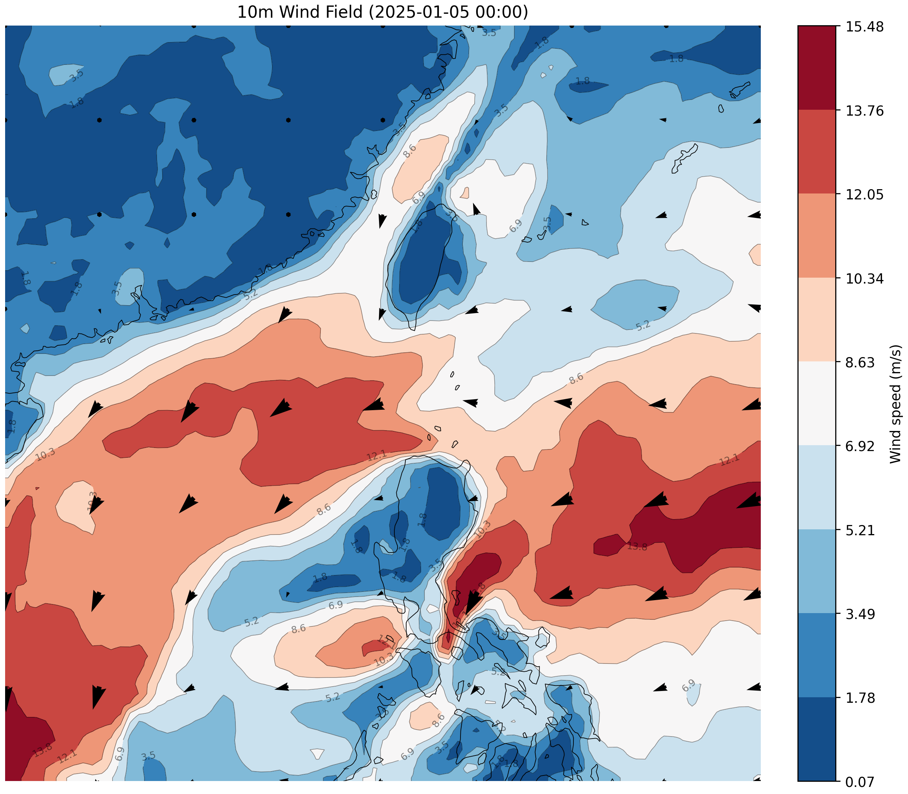
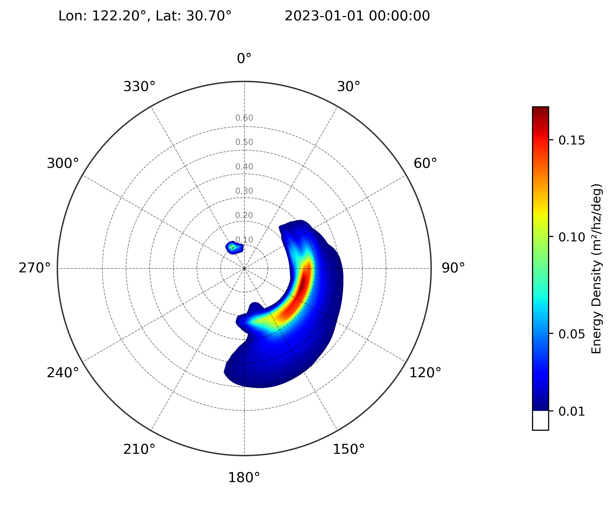

# WW3Tool

简体中文版本：[README.zh-CN](README.zh-CN.md)

## Overview


Youtube: [https://m.youtube.com/watch?v=PHXLP1FrZmw&pp=ygUHd3czdG9vbA%3D%3D](https://m.youtube.com/watch?v=PHXLP1FrZmw&pp=ygUHd3czdG9vbA%3D%3D)

WW3Tool is a pre-processing tool for the WAVEWATCH III model. It helps you run a basic WAVEWATCH III workflow in a streamlined way.

This software includes the following features:

1. Supports multiple forcing fields: wind (ERA5, CFSR, CCMP), currents (Copernicus), water level (Copernicus), sea ice (Copernicus), with automatic fixes for forcing fields (latitude ordering, time fixes, variable fixes)

2. gridgen/pygridgen structured rectangular grids, JIGSAW triangular unstructured grids, SMCGTools SMC grids, and up to two levels of nested grids for structured rectangular grids

3. Supports regional runs, spectral point runs, and track runs

4. Supports Slurm script configuration (ssh configuration, slurm cores, nodes, CPU)

5. Automatically configures files such as ww3_grid.nml, ww3_prnc.nml, ww3_shel.nml, ww3_ounf.nml, ww3_multi.nml, including grid file config, calculation precision, output precision, time range, spectral point runs, track runs, spectral partition output, and forcing field configuration

6. Wave height plots, wave height videos, contour plots, 2D spectrum plots, JASON3 satellite track plots, 2D spectrum plots

This software runs on Win/Linux/Mac and is almost entirely written in Python (the original gridgen Matlab code is retained).

You need to install WAVEWATCH III yourself on your local machine or server. This software does not provide an installer yet. Please see the tutorial:
[https://github.com/ZxyGch/WAVEWATCH-III-INSTALL-TUTORIAL](https://github.com/ZxyGch/WAVEWATCH-III-INSTALL-TUTORIAL)

I was not an ocean science major in undergrad and I am now a first-year graduate student. The WAVEWATCH III usage I know is limited to these parts. If you have more ideas, please contact me at [atomgoto@gmail.com](mailto:atomgoto@gmail.com) or open an issue.

If you find this tool useful, please give it a ⭐️ 🥳


## Quick Start

```sh
python3 runDesktop.py
```

If anything fails to install or some packages are missing, please install them manually.

`runDesktop.py` starts an independently implemented preprocessing home page through `src2/desktop`. Its Fluent styling, navigation, step cards, and right-hand log panel are aligned with the established application; settings and plotting views will be brought across during migration. Desktop actions call `src2/workflows` rather than the old main-window business implementation.

### Scripted Preprocessing

The new architecture starts in `src2`; the old `src` tree is kept as reference and temporary compatibility fallback. For scripted workflows or server-side preprocessing, use `runCLI.py`:

```sh
python3 runCLI.py
python3 runCLI.py validate params.yml
python3 runCLI.py prepare-forcing params.yml
python3 runCLI.py run params.yml
```

Running `python3 runCLI.py` without arguments checks runtime packages, installs missing ones from `src/requirements.txt`, then automatically reads the root-level `params.yml` and runs the full preprocessing workflow. On the first run, if `params.yml` does not exist, a template is created for editing and is not executed immediately. Existing parameter files are never overwritten. `python3 runCLI.py print-example` remains available for printing a template separately.

`prepare-forcing` runs only Step 1 forcing preparation: copy/move, variable detection, wind normalization, and combined-forcing auto-association.

The command entrypoint directly calls `src2/workflows`. The desktop preprocessing home page uses the same workflows for forcing preparation, parameter validation, and preprocessing-file generation; remaining desktop actions will move to that logic incrementally.

Running without arguments or explicitly using `run` reads the YAML parameter file and prepares forcing files, grid files, calculation-mode artifacts, and WW3 namelists/scripts. It does not execute WAVEWATCH III, upload to a server, or generate plots. If the work directory already contains grid files, use `--skip-grid`:

```sh
python3 runCLI.py run params.yml --skip-grid
```

The `grid` section of `params.yml` is grouped by mesh type: `structured` contains bathymetry, coastline precision, and pygridgen thresholds; `smc` contains bathymetry, refinement, physics, and boundary settings; and `unstructured` contains triangular-mesh sizing and regional settings. For `grid_type: nested`, provide `inner` explicitly or omit it to derive the inner region using `nested_contraction_coefficient`.

The `presets` section at the top of `params.yml` stores available choices for script validation and later desktop-interface reuse, including output-field presets, ST executable paths, bathymetry, coastline precision, and file splitting. `presets.st` maps a name to a server executable directory, such as `ST2: /public/home/.../model/exe`, and `ww3.st: ST2` selects that path. Define complete field arrays in `presets.output_scheme`, such as `standard: [HS, DIR, FP, T02, WND]`, then select one for a run with `ww3.output_scheme: standard`.

The `ww3_grid` section uses `ww3_grid.nml` keys directly, such as `SPECTRUM%XFR`, `TIMESTEPS%DTMAX`, and `GRID%ZLIM`, for spectrum discretization, numerical timesteps, and nearshore depth controls. Nested grids can separately set `ww3.inner_compute_precision` and `ww3.inner_output_precision`; `slurm.server_script_path` selects a custom `server.sh` template when needed.


## Environment

This software supports Python ≥ 3.8 and has been tested on:

- Windows 11
- Ubuntu 24
- macOS 15

WAVEWATCH III is not required for local installation. Local runs are optional, as long as the server side has the following environment correctly installed:

- WAVEWATCH III
- Slurm workload manager


## Implementation Details

### Create a working directory


At startup, you must select or create a working directory. This step is mandatory and cannot be skipped.

The default new working directory name is the current time, and up to the 3 most recent directories will be shown.

A working directory is just a folder for files generated during runs, such as grid files, wind field files, and WAVEWATCH III configuration files.

The default path is `WW3Tool/workSpace`, and you can change it in Settings.


### Choose forcing field files

Wind fields can use data from [ERA5](https://cds.climate.copernicus.eu/datasets/reanalysis-era5-single-levels?tab=download), [CFSR](http://tds.hycom.org/thredds/catalog/datasets/force/ncep_cfsv2/netcdf/catalog.html), and [CCMP](https://data.remss.com/ccmp/v03.1/)

For other forcing fields I have only tested Copernicus currents, water levels, and sea ice.


I have pre-prepared several forcing files in `WW3Tool/public/forcing`, you can select them directly (for testing only).

WAVEWATCH requires latitude to be increasing, but ERA5 wind data latitude is decreasing by default. I added logic to detect and automatically flip if latitude is not increasing.


CFSR wind variables are also automatically renamed to match WW3 requirements.

Copernicus forcing timestamps are also automatically fixed in this process.

Forcing files are automatically copied (you can switch to move in Settings) into the current working directory and renamed to `wind.nc`, `current.nc`, `level.nc`, `ice.nc`. The log on the right will also show forcing file information.

Usually, only wind fields are used, and the software does not allow using other forcing fields without wind.

If a file contains multiple forcing fields, the corresponding buttons will be auto-filled, and the file in the working directory will be named like `current_level.nc`, indicating the included fields.


### Generate grid files

#### reference_data

The `reference_data` package contains gebco, etopo1/2, coastline boundaries, and other files needed for grid generation. Without `reference_data`, grid files cannot be generated.

If `WW3Tool/WW3-Grid-Generator/reference_data` does not contain these files, a download window will appear in step 2.


Click Download: the program will download from [GitHub Release](https://github.com/ZxyGch/WW3Tool/releases/tag/data) (~6.5GB).


If GitHub is too slow or fails, you can download from [OneDrive](https://tiangongeducn-my.sharepoint.com/:u:/r/personal/1911650207_tiangong_edu_cn/Documents/reference_data.zip?csf=1&web=1&e=SXDbA9) or [Baidu Netdisk](https://pan.baidu.com/s/1SxQEfiaomdi3CXFOXC6DMw?pwd=cb48), then extract to `WW3Tool/WW3-Grid-Generator/reference_data`.


#### Structured rectangular grids

##### Single grid


Click Generate Grid to call `WW3-Grid-Generator/structured_generator/pygridgen` and generate grid files into the working directory.

Smaller DX/DY gives higher resolution because DX/DY is the spacing between grid points.

Finally, four files will be created in the working directory: `grid.bot`, `grid.obst`, `grid.meta`, `grid.mask_nobound`.

1. **`grid.bot`**
   - Format: ASCII text file
   - Content: bathymetry (depth) data
   - Unit: meters (actual value = file value / 1000)
   - Size: Ny × Nx

2. **`grid.mask_nobound`**
   - Format: ASCII text file
   - Content: land/sea mask
   - Values: 0 = land, 1 = ocean
   - Size: Ny × Nx

3. **`grid.obst`**
   - Format: ASCII text file
   - Content: obstacle values in x and y directions
   - Unit: ratio between 0–1 (actual value = file value / 100)
   - Size: Ny × Nx (x direction), Ny × Nx (y direction)

4. **`grid.meta`** (actually `ww3_grid.nml`, used to sync some configuration)
   - Format: ASCII text file
   - Content: grid description for WAVEWATCH III `ww3_grid`
   - Includes: grid size, resolution, ranges, etc.

Generated grids are automatically cached in `WW3Tool/WW3-Grid-Generator/cache`.


##### Nested grids


Nested grids use two-way nesting.

In Settings we define a nesting shrink factor, default 1.1x.

When setting the outer grid, it is automatically expanded based on the inner grid (about 1.1x). Likewise, setting the inner grid shrinks based on the outer grid (about 1.1x).

In nested mode, grid generation runs twice: once for the outer grid and once for the inner grid.

In nested mode, two folders are created in the working directory: `coarse` (outer grid) and `fine` (inner grid).

When a working directory contains `coarse` and `fine`, opening it automatically switches to nested mode, which affects many later operations. Therefore, if `coarse`/`fine` or other grid files already exist, switching grid types is disabled.


#### SMC grids


#### Unstructured triangular grids


#### Grid cache

To avoid unnecessary computation, each generated grid is cached in `WW3Tool/WW3-Grid-Generator/cache`.

A key is generated from the grid parameters as the folder name. Each time you generate a grid, the cache is checked first; if it exists, the cached grid files are used directly.

Each cache folder also contains `params.json`:

```json
{
  "cache_key": "c161115dfd8bde7b30fd01826a3c292ada7835df377a81b9ee59f73acc28328b",
  "source_dir": "/Users/zxy/ocean/WW3Tool/workSpace/2026-01-11_23-18-38",
  "parameters": {
    "dx": 0.05,
    "dy": 0.05,
    "lon_range": [
      110.0,
      130.0
    ],
    "lat_range": [
      10.0,
      30.0
    ],
    "ref_dir": "/Users/zxy/ocean/WW3Tool/WW3-Grid-Generator/reference_data",
    "bathymetry": "GEBCO",
    "coastline_precision": "full"
  }
}
```


#### View the map

The dashed outline shows the actual map range.


### Choose calculation mode


These three modes have similar computational cost, but the outputs differ. Spectral point mode and track mode look like only a few points are computed, but the whole map is still computed.

Regional mode is the standard `ww3_ounf` output.

Spectral point mode adds `ww3_ounp`.

Track mode uses `ww3_trnc`.

You can see their configuration differences in step 4.


#### Regional mode

Standard calculation mode.


#### Spectral point mode


Click to select points from the map and a window will open.

Click points on the map; the blue dashed box is the grid range, and you can only select points within it. After selecting, click Finish.


Then, in step 4, a `points.list` file is created in the working directory:

```swift
117 18 '0'
126 21 '1'
127 20 '2'
115 15 '3'
128 14 '4'
126 18 '5'
```

The three columns are longitude, latitude, and point name. If a working directory contains `points.list`, opening it will auto-switch to spectral point mode and load the points.

After WW3 runs, you get `ww3.2025_spec.nc` in the plotting page.


You can plot 2D spectra:


#### Track mode


Similar to spectral point mode, but with an extra time column. In step 4 a file is generated: `track_i.ww3`, format:

```
WAVEWATCH III TRACK LOCATIONS DATA 
20250103 000000   113.121   19.314    0
20250104 000000   126.442   21.132    1
20250105 000000   126.365   16.356    2
```

Finally, `ww3_trnc` outputs `ww3.2025_trck.nc`.


### Configure run parameters


We added wind, water level, and current as forcing fields. Ice can be added, but our grid region has no ice, so it is not shown here.

We use track mode. This mode produces more configuration logs than regional mode, so below we explain the track-mode-specific configs.


```log
✅ Copied 10 public/ww3 files to current work directory
✅ Successfully synced grid.meta parameters to ww3_grid.nml
✅ Modified spectral partition output scheme in ww3_shel and ww3_ounf
✅ Updated server.sh: -J=202501, -p=CPU6240R, -n=48, -N=1, MPI_NPROCS=48, CASENAME=202501, ST=ST2
✅ Updated ww3_ounf.nml: FIELD%TIMESTART=20250103, FIELD%TIMESTRIDE=3600 seconds
✅ Updated ww3_shel.nml: DOMAIN%START=20250103, DOMAIN%STOP=20250105, DATE%FIELD%STRIDE=1800s
✅ Modified ww3_prnc.nml: FORCING%TIMESTART = '20250103 000000', FORCING%TIMESTOP = '20250105 235959'
✅ Copied and modified ww3_prnc_current.nml: FORCING%FIELD%CURRENTS = T
✅ Copied and modified ww3_prnc_level.nml: FORCING%FIELD%WATER_LEVELS = T
✅ Modified ww3_shel.nml: Updated INPUT%FORCING%* settings
✅ Generated track_i.ww3 file
✅ Modified ww3_shel.nml: Added DATE%TRACK (Track Mode)
✅ Modified ww3_trnc.nml: TRACK%TIMESTART = '20250103 000000', TRACK%TIMESTRIDE = '3600'
```


#### Regular grid

First, all files under `WW3Tool/public/ww3` are copied to the current working directory.

```
✅ Copied 10 public/ww3 files to current work directory
```

These include:


---

Next:

```log
✅ Successfully synced grid.meta parameters to ww3_grid.nml
```

We sync the `grid.meta` contents:

```
&GRID_NML
  GRID%TYPE            =  'RECT'
  GRID%COORD           =  'SPHE'
  GRID%CLOS            =  'NONE'
/


&RECT_NML
  RECT%NX              =  201
  RECT%NY              =  201
  RECT%SX              =   0.100000000000
  RECT%SY              =   0.100000000000
  RECT%X0              =  110.0000
  RECT%Y0              =   10.0000
/

&DEPTH_NML
  DEPTH%SF             = 0.001
  DEPTH%FILENAME       = 'grid.bot'
/

&OBST_NML
  OBST%SF              = 0.010
  OBST%FILENAME        = 'grid.obst'
/
```

to the same positions in `ww3_grid.nml`.


---

Then we modify the spectral partition output scheme:

```swift
✅ Modified spectral partition output scheme in ww3_shel and ww3_ounf
```

`TYPE%FIELD%LIST` in `ww3_shel.nml`:

```swift
&OUTPUT_TYPE_NML
  TYPE%FIELD%LIST       = 'HS DIR FP T02 WND PHS PTP PDIR PWS PNR TWS'
/
```

`FIELD%LIST` in `ww3_ounf.nml`:

```swift
&FIELD_NML
  FIELD%TIMESTART        =  '20250103 000000'
  FIELD%TIMESTRIDE       =  '3600'
  FIELD%LIST             =  'HS DIR FP T02 WND PHS PTP PDIR PWS PNR TWS'
  FIELD%PARTITION        =  '0 1'
  FIELD%TYPE             =  4
/
```

The spectral partition output scheme can be configured in Settings.


---

Next we update `server.sh`:

```log
✅ Updated server.sh: -J=202501, -p=CPU6240R, -n=48, -N=1, MPI_NPROCS=48, CASENAME=202501, ST=ST2
```

```sh
#SBATCH -J 202501
#SBATCH -p CPU6240R
#SBATCH -n 48
#SBATCH -N 1
#SBATCH --time=2880:00:00

#wavewatch3--ST2
export PATH=/public/home//software/wavewatch3/model/exe/exe:$PATH

MPI_NPROCS=48

CASENAME=202501
```

---

```log
✅ Updated ww3_ounf.nml: FIELD%TIMESTART=20250103, FIELD%TIMESTRIDE=3600 seconds
```

We then edit `ww3_ounf.nml` and find:

```swift
&FIELD_NML
  FIELD%TIMESTART        =  '20250103 000000'
  FIELD%TIMESTRIDE       =  '3600'
  FIELD%LIST             =  'HS LM T02 T0M1 T01 FP DIR SPR DP PHS PTP PLP PDIR PSPR PWS TWS PNR'
  FIELD%PARTITION        =  '0 1'
  FIELD%TYPE             =  4
/
```

`FIELD%TIMESTART` is the start time, and `FIELD%TIMESTRIDE` is the output interval.

---

```log
✅ Updated ww3_shel.nml: DOMAIN%START=20250103, DOMAIN%STOP=20250105, DATE%FIELD%STRIDE=1800s
```

We edit `ww3_shel.nml`:

```swift
&DOMAIN_NML
  DOMAIN%START           =  '20250103 000000'
  DOMAIN%STOP            =  '20250105 235959'
/

&OUTPUT_DATE_NML
  DATE%FIELD          = '20250103 000000' '1800' '20250105 235959'
  DATE%TRACK          = '20250103 000000' '1800' '20250105 000000'
  DATE%RESTART        = '20250103 000000' '86400' '20250105 235959'
/
```

The dates are start/stop dates. The `'1800'` in `DATE%FIELD` and `DATE%TRACK` is the timestep.

`DATE%TRACK` is added for track mode; it is absent by default.

---

```log
✅ Modified ww3_prnc.nml: FORCING%TIMESTART = '20250103 000000', FORCING%TIMESTOP = '20250105 235959'
✅ Copied and modified ww3_prnc_current.nml: FORCING%FIELD%CURRENTS = T
✅ Copied and modified ww3_prnc_level.nml: FORCING%FIELD%WATER_LEVELS = T
```

We change the time range in `ww3_prnc.nml` to constrain the later `ww3_prnc` run:

```sh
&FORCING_NML
  FORCING%TIMESTART            = '19000101 000000'  
  FORCING%TIMESTOP             = '29001231 000000'  
  FORCING%FIELD%WINDS          = T
  FORCING%FIELD%CURRENTS       = F
  FORCING%FIELD%WATER_LEVELS   = F
  FORCING%FIELD%ICE_CONC       = F
  FORCING%FIELD%ICE_PARAM1     = F
  FORCING%GRID%LATLON          = T
/
```

We then generate `ww3_prnc_current.nml` and `ww3_prnc_level.nml` based on selected forcing. For sea ice, concentration and thickness are split into `ww3_prnc_ice.nml` and `ww3_prnc_ice1.nml`.

We toggle forcing flags accordingly. Each `ww3_prnc*.nml` can only enable a single `FORCING%FIELD%` (set to `T`). Later we rename each `ww3_prnc_*.nml` to `ww3_prnc.nml`, because `ww3_prnc` always reads `ww3_prnc.nml`.

We also update forcing file names and variable names:

```
&FILE_NML
  FILE%FILENAME      = 'wind.nc'
  FILE%LONGITUDE     = 'longitude'
  FILE%LATITUDE      = 'latitude'
  FILE%VAR(1)        = 'u10'
  FILE%VAR(2)        = 'v10'
/

&FILE_NML
  FILE%FILENAME      = 'current_level.nc'
  FILE%LONGITUDE     = 'longitude'
  FILE%LATITUDE      = 'latitude'
  FILE%VAR(1)        = 'uo'
  FILE%VAR(2)        = 'vo'
/

&FILE_NML
  FILE%FILENAME      = 'current_level.nc'
  FILE%LONGITUDE     = 'longitude'
  FILE%LATITUDE      = 'latitude'
  FILE%VAR(1)        = 'zos'
/
```


---

```log
✅ Modified ww3_shel.nml: Updated INPUT%FORCING%* settings
```

Based on selected forcing fields, we update `ww3_shel.nml`:

```
&INPUT_NML
  INPUT%FORCING%WINDS         = 'T'
  INPUT%FORCING%WATER_LEVELS  = 'T'
  INPUT%FORCING%CURRENTS      = 'T'
  INPUT%FORCING%ICE_CONC      = 'F'
  INPUT%FORCING%ICE_PARAM1    = 'F'
/
```


---

Based on the track-mode list (or spectral point list), we generate:

```log
✅ Generated track_i.ww3 file
```

Format of `track_i.ww3`:

```
WAVEWATCH III TRACK LOCATIONS DATA 
20250103 000000   113.1   19.3    0
20250104 000000   126.4   21.1    1
20250105 000000   126.4   16.4    2
```


---

```log
✅ Modified ww3_shel.nml: Added DATE%TRACK (Track Mode)
```

We also add to `ww3_shel.nml`:

```
&OUTPUT_DATE_NML
   DATE%FIELD          = '20250103 000000' '1800' '20250105 235959'
   DATE%TRACK          = '20250103 000000' '1800' '20250103 000000'
   DATE%RESTART        = '20250103 000000' '86400' '20250105 235959'
/
```

---

```log
✅ Modified ww3_trnc.nml: TRACK%TIMESTART = '20250103 000000', TRACK%TIMESTRIDE = '3600'
```

We edit `ww3_trnc.nml`:

```
&TRACK_NML
  TRACK%TIMESTART        =  '20250103 000000'
  TRACK%TIMESTRIDE       =  '3600'
  TRACK%TIMESPLIT        =  8
/
```

---

```log
✅ Updated namelists.nml: Changed E3D from 0 to 1 (Spectral Point Calculation Mode)
```

For spectral point mode, we also modify `namelists.nml`:

```swift
&OUTS E3D = 0 /
```


#### Nested grid


We first generate nested grids and create `coarse` and `fine` folders in the working directory, then choose spectral point mode.


```log
======================================================================
🔄 【Work Directory】Starting to process public files...
✅ Copied server.sh, ww3_multi.nml, local.sh to the current work directory
✅ Updated server.sh: -J=202501, -p=CPU6240R, -n=48, -N=1, MPI_NPROCS=48, CASENAME=202501, ST=ST2
✅ Updated ww3_multi.nml: Start=20250103, End=20250105, Compute precision=1800s，Forcing Fields=Wind Field、Current Field、Level Field、Ice Field、Ice Thickness，Compute Resources: coarse=0.60, fine=0.40，ALLTYPE%POINT%FILE = './fine/points.list'，ALLDATE%POINT = '20250103 000000' '1800' '20250105 235959'，ALLTYPE%FIELD%LIST = 'WND HS T02 FP DIR PHS PTP PDIR PWS TWS PNR' (spectral partition output)

======================================================================
🔄 【Outer Grid】Starting to process outer grid...
✅ Copied 8 public/ww3 files to current work directory
✅ Successfully synced grid.meta parameters to ww3_grid.nml
✅ Updated ww3_ounf.nml: FIELD%TIMESTART=20250103, FIELD%TIMESTRIDE=3600 seconds
✅ Updated ww3_shel.nml (spectral point calculation mode): Start=20250103, End=20250105, Compute step=1800s，Added TYPE%POINT%FILE = 'points.list'，Added DATE%POINT and DATE%BOUNDARY
✅ Modified ww3_prnc.nml: FORCING%FIELD%WINDS = T, FILE%FILENAME = '../wind.nc'
✅ Modified ww3_prnc.nml: FORCING%TIMESTART = '20250103 000000', FORCING%TIMESTOP = '20250105 235959'
✅ Copied and modified ww3_prnc_current.nml: FORCING%FIELD%CURRENTS = T
✅ Copied and modified ww3_prnc_level.nml: FORCING%FIELD%WATER_LEVELS = T
✅ Copied and modified ww3_prnc_ice.nml: FORCING%FIELD%ICE_CONC = T
✅ Copied and modified ww3_prnc_ice1.nml: FORCING%FIELD%ICE_PARAM1 = T
✅ Modified ww3_shel.nml: Updated INPUT%FORCING%* settings
✅ Updated namelists.nml: Changed E3D from 0 to 1 (Spectral Point Calculation Mode)
✅ Created points.list file with 4 points
✅ Updated ww3_ounp.nml: POINT%TIMESTART = '20250103 000000', POINT%TIMESTRIDE = '3600' (Spectral Point Calculation Mode)

======================================================================
🔄 【Inner Grid】Starting to process inner grid...
✅ Copied 8 public/ww3 files to current work directory
✅ Modified spectral partition output scheme in ww3_shel and ww3_ounf
✅ Successfully synced grid.meta parameters to ww3_grid.nml
✅ Updated ww3_ounf.nml: FIELD%TIMESTART=20250103, FIELD%TIMESTRIDE=3600 seconds
✅ Updated ww3_shel.nml (spectral point calculation mode): Start=20250103, End=20250105, Compute step=1800s，Added TYPE%POINT%FILE = 'points.list'，Added DATE%POINT and DATE%BOUNDARY
✅ Modified ww3_prnc.nml: FORCING%FIELD%WINDS = T, FILE%FILENAME = '../wind.nc'
✅ Modified ww3_prnc.nml: FORCING%TIMESTART = '20250103 000000', FORCING%TIMESTOP = '20250105 235959'
✅ Copied and modified ww3_prnc_current.nml: FORCING%FIELD%CURRENTS = T
✅ Copied and modified ww3_prnc_level.nml: FORCING%FIELD%WATER_LEVELS = T
✅ Copied and modified ww3_prnc_ice.nml: FORCING%FIELD%ICE_CONC = T
✅ Copied and modified ww3_prnc_ice1.nml: FORCING%FIELD%ICE_PARAM1 = T
✅ Modified ww3_shel.nml: Updated INPUT%FORCING%* settings
✅ Updated namelists.nml: Changed E3D from 0 to 1 (Spectral Point Calculation Mode)
✅ Created points.list file with 4 points
✅ Updated ww3_ounp.nml: POINT%TIMESTART = '20250103 000000', POINT%TIMESTRIDE = '3600' (Spectral Point Calculation Mode)
```

We confirm parameters in step 4 and watch the log output:

```log
✅ Copied server.sh, ww3_multi.nml, local.sh to the current work directory
```

We first copy `server.sh`, `local.sh`, and `ww3_multi.nml` from `WW3Tool/public/ww3` to the working directory.

We import `ww3_multi.nml` and modify start time, precision, and forcing fields. This is similar to `ww3_shel.nml`:

```sh
&INPUT_GRID_NML
  INPUT(1)%NAME                  = 'wind'
  INPUT(1)%FORCING%WINDS         = T
  
  INPUT(2)%NAME                  = 'current'
  INPUT(2)%FORCING%CURRENTS      = T
  
  INPUT(3)%NAME                  = 'level'
  INPUT(3)%FORCING%WATER_LEVELS  = T
  
  INPUT(4)%NAME                  = 'ice'
  INPUT(4)%FORCING%ICE_CONC      = T

  INPUT(5)%NAME                  = 'ice1'
  INPUT(5)%FORCING%ICE_PARAM1    = T
/

&MODEL_GRID_NML

  MODEL(1)%NAME                  = 'coarse'
  MODEL(1)%FORCING%WINDS         = 'native'
  MODEL(1)%FORCING%CURRENTS      = 'native'
  MODEL(1)%FORCING%WATER_LEVELS  = 'native'
  MODEL(1)%FORCING%ICE_CONC      = 'native'
  MODEL(1)%FORCING%ICE_PARAM1    = 'native'
  MODEL(1)%RESOURCE              = 1 1 0.00 0.35 F

  MODEL(2)%NAME                  = 'fine'
  MODEL(2)%FORCING%WINDS         = 'native'
  MODEL(2)%FORCING%CURRENTS      = 'native'
  MODEL(2)%FORCING%WATER_LEVELS  = 'native'
  MODEL(2)%FORCING%ICE_CONC      = 'native'
  MODEL(2)%FORCING%ICE_PARAM1    = 'native'
  MODEL(2)%RESOURCE              = 2 1 0.35 1.00 F
/
```

Where:

INPUT (I)%FORCING%ICE_CONC = ice concentration
INPUT (I)%FORCING%ICE_PARAM1 = ice thickness

There are still many incomplete parts for sea-ice forcing.

Note `MODEL (2)%FORCING%WINDS = 'native'`, where `native` means enabled and `no` means disabled.

`MODEL (1)%RESOURCE` and `MODEL (2)%RESOURCE` define the compute resource allocation ratio.

Other logs are straightforward; we just handle inner/outer grids like normal grids.

Notably, we modify `ww3_prnc.nml`: `FILE%FILENAME = '../wind.nc'` to avoid doubling forcing file size by sharing a reference.


#### Spectral point mode

```log
✅ Updated namelists.nml: Changed E3D from 0 to 1 (Spectral Point Calculation Mode)
✅ Created points.list file with 4 points
✅ Updated ww3_ounp.nml: POINT%TIMESTART = '20250103 000000', POINT%TIMESTRIDE = '3600' (Spectral Point Calculation Mode)
```

In the previous section, these three logs are for spectral point mode, and they are easy to understand.

 Log: E3D is changed from 0 to 1, if the spectral partitioning output scheme includes EF, then this will also be executed.


### Local run


Local run executes `local.sh`.

If you choose local execution, make sure WAVEWATCH III is configured locally, and choose the `bin` directory which should contain:

```
gx_outf    ww3_bound  ww3_grid   ww3_ounf   ww3_outp   ww3_shel   

ww3_trck   gx_outp    ww3_gint   ww3_gspl   ww3_ounp   ww3_prep   

ww3_strt   ww3_trnc   ww3_bounc  ww3_grib   ww3_multi  ww3_outf   

ww3_prnc   ww3_systrk ww3_uprstr
```


### Connect to server


First, configure your SSH username and password in Settings under server configuration.

Note the default server path, which is where your server will store working directories.

Click Connect Server. On success, a CPU usage ranking will show and refresh every second.

If you submit a Slurm job in step 6, the job queue will also be shown.


### Server operations

Viewing the job queue runs `squeue -l` on the server.

Upload working directory uploads the current directory to the server working directory (configured in Settings).


Submit job runs the `server.sh` script on the server. If successful (all commands run normally), it will create `success.log` in the server working directory with all WW3 logs. If it fails, it creates `fail.log` with all logs. If it is still running, the log file is `run.log`.

So to check completion, see if `success.log` or `fail.log` exists. If `run.log` exists, the server is still running.


Clear folder clears the current server working directory.

Download results downloads all `ww3.nc` files. In nested mode, it only downloads results under `fine`.

Download log file downloads `success.log` or `fail.log`.


### Automation

Open a working directory and it will auto-detect converted forcing files (by filename `wind.nc`, `level.nc`, `current.nc`) and auto-fill forcing buttons.

Auto-read grid range and resolution and fill step 2, detect `coarse` and `fine` folders and switch to nested mode.

Auto-detect `points.list` to switch to point output mode; detect `track_i.ww3` to switch to track mode and import the points list.

Auto-read Slurm parameters from `server.sh` to fill step 4, auto-detect `ww3_shel.nml` precision, time range, spectral partition scheme.


### Settings

Most settings are auto-saved, except spectral partition output scheme.

#### Run mode

Run mode only controls whether some elements are shown on the home page; it has no real effect.

For example, if local run is chosen, Slurm parameters are hidden.

#### Forcing selection

Auto-association means if a file contains multiple forcing fields, other buttons can be auto-filled.

File handling mode is how to handle the original forcing file: copy or move.

Some forcing files are large; using copy doubles disk usage.


#### JASON data path

JASON data path is used for plotting, e.g., comparing simulated results with JASON 3 satellite observations.


#### WW3 configuration

WW3 configuration is the default values in step 4 and the Confirm Parameters button.

File splitting is `TIMESPLIT` in `ww3_ounf.nml`, `ww3_ounp.nml`, `ww3_trnc.nml`. If your time range is 3 months, monthly or yearly split is suitable; daily split produces one file per day.


Spectrum parameters, numerical integration timestep, and nearshore configuration are in `ww3_grid.nml`. Changing them here updates both WW3Tool and the current working directory `ww3_grid.nml` (if it exists).

```swift
&SPECTRUM_NML
  SPECTRUM%XFR       =  1.1
  SPECTRUM%FREQ1     =  0.04118
  SPECTRUM%NK        =  32
  SPECTRUM%NTH       =  24
/

&TIMESTEPS_NML
  TIMESTEPS%DTMAX        =  900
  TIMESTEPS%DTXY         =  320
  TIMESTEPS%DTKTH        =  300
  TIMESTEPS%DTMIN        =  15
/
```

Spectral partition output is configured in `ww3_shel.nml`, `ww3_ounf.nml`, `ww3_ounp.nml`.


#### CPU configuration

On the server, run:

```sh
sinfo
```

This shows the CPU list (if Slurm is installed).

Then open Settings in the software, find Slurm parameters, click CPU Management, and set it to your server's CPU.


#### Server connection

Fill in SSH account info and a default login path. All working directories will be uploaded there.


#### ST version management


This is the WAVEWATCH builds you compiled; just fill in their paths.


### Plotting

#### Wind field plot



#### 2D spectrum plot



#### Wave height plots


#### Wind + swell plots


#### Satellite fit plot


## File Downloads

### Download wind fields

#### ERA5

[https://cds.climate.copernicus.eu/datasets/reanalysis-era5-single-levels?tab=download](https://cds.climate.copernicus.eu/datasets/reanalysis-era5-single-levels?tab=download)

The image below shows ERA5 download. You must register an account first. When registering, your English name cannot be random letters, otherwise registration fails.


#### CFSR

[http://tds.hycom.org/thredds/catalog/datasets/force/ncep_cfsv2/netcdf/catalog.html](http://tds.hycom.org/thredds/catalog/datasets/force/ncep_cfsv2/netcdf/catalog.html)

Find `cfsv2-sec2_2025_01hr_uv-10m.nc` (note the `uv-10m` suffix).

If you want to download global full-year data, click:

HTTPServer: //tds. hycom. org/thredds/fileServer/datasets/force/ncep_cfsv2/netcdf/cfsv2-sec2_2025_01hr_uv-10m.nc

If you want a specific region/time range, click NetcdfSubset:

NetcdfSubset: //ncss. hycom. org/thredds/ncss/grid/datasets/force/ncep_cfsv2/netcdf/cfsv2-sec2_2025_01hr_uv-10m.nc

Open it and select the two variables `wndewd` and `wndnwd` on the left, scroll down and choose Output Format: netCDF.

If you cannot input lat/lon, uncheck Disable horizontal subsetting.


Then click Time range, input the time range, and submit.


#### CCMP

[https://data.remss.com/ccmp/v03.1/](https://data.remss.com/ccmp/v03.1/)

This is simple; just download directly.

### Download currents and water levels

[https://data.marine.copernicus.eu/product/GLOBAL_ANALYSISFORECAST_PHY_001_024/download?dataset=cmems_mod_glo_phy_anfc_0.083deg_PT1H-m_202406](https://data.marine.copernicus.eu/product/GLOBAL_ANALYSISFORECAST_PHY_001_024/download?dataset=cmems_mod_glo_phy_anfc_0.083deg_PT1H-m_202406)

Choose Variables. If you do not need water level, uncheck Sea surface height above geoid.

Then input range/time and click DOWNLOAD.


### Download sea ice

[https://data.marine.copernicus.eu/product/GLOBAL_MULTIYEAR_PHY_001_030/download?dataset=cmems_mod_glo_phy_my_0.083deg_P1D-m_202311](https://data.marine.copernicus.eu/product/GLOBAL_MULTIYEAR_PHY_001_030/download?dataset=cmems_mod_glo_phy_my_0.083deg_P1D-m_202311)

You can download sea ice and currents.

Sea ice includes sea ice area fraction and sea ice thickness.


### JASON 3 data

https://www.ncei.noaa.gov/products/jason-satellite-products

### NDBC 

https://www.ndbc.noaa.gov


## License

This software is developed on a GPLv3-licensed framework, and is released as GPLv3 as required by the GPLv3 license.
