# WW3Tool

## 基本介绍


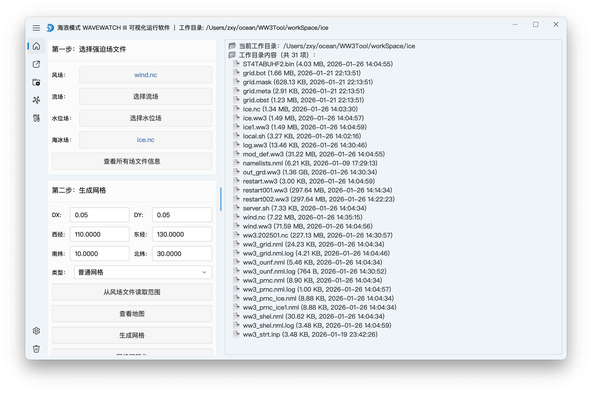

海浪模式 WAVEWATCH III 可视化运行软件 (简称 WW3Tool) 是 WAVEWATCH III 模型的前置准备操作软件，使用本软件可以完成基本的 WAVEWATCH III 流程化运行。

本软件包括以下功能：

1.  支持多种强迫场：风场 (ERA5，CFSR，CCMP)、流场 (Copernicus)、水位场(Copernicus)、海冰场(Copernicus)，包含对强迫场的自动修复功能 （纬度排序、时间修复、变量修复）
2.  gridgen 矩形网格生成，支持最多两层的嵌套网格模式（支持 Python 版本，不依赖 Matlab，Two-Way Nesting，相同强迫场数据）
3.  支持区域计算、二维谱点计算、航迹计算
4.  支持 Slurm 脚本配置
5.  自动配置 ww3_grid.nml，ww3_prnc.nml ，ww3_shel.nml，ww3_ounf.nml，ww3_multi.nml 等文件，主要配置计算精度、输出精度、时间范围、二维谱点计算、航迹计算、谱分区输出、强迫场配置
6.  波高图、波高视频、等高线图、二维谱图、JASON3 卫星轨迹图、二维谱图

实际运行的 WAVEWATCH III 模型需要自行在安装本地或服务器上，本软件暂时无法提供安装程序。

我本科不是海洋科学的，现在是研究生一年级，目前掌握的 WAVEWATCH III 用法只有这些，如果你有更多的想法，请联系我 atomgoto@gmail.com 或在 issue 中提出意见

## 快速开始

``` sh
cd src

pip install -r requirements.txt

python main.py
```

如果还有什么安装失败或缺失的包，请手动安装

如果你是 Ubuntu 系统，建议

``` sh
cd src

sudo apt install python3-full python3-venv

python3 -m venv venv
source venv/bin/activate

pip install -r requirements.txt

python main.py
```

**注意：我们还需要下载 reference_data ，在下面有下载方法**

## gridgen/reference_data

reference_data 必须下载，否则无法生成网格文件！

执行下载脚本 WW3Tool/gridgen/get_reference_data. py

或者从 OneDrive 下载： https://tiangongeducn-my.sharepoint.com/:u:/g/personal/1911650207_tiangong_edu_cn/IQBGfWxOrWNlQphTeWCh-7AjAR-dtNWp7guSVhiyUH4dCW8?e=BdDBqQ

或者从百度网盘下载：https://pan.baidu.com/s/1ec8DMcv8bp6MzNnFBkbAPA?pwd=ktch

**最后放到 WW3Tool/gridgen/reference_data**

## 环境配置

本软件支持 Python ≥ 3.8

经测试可在以下系统环境下正常运行：

- Windows 11
- Ubuntu 24
- macOS 15

本软件不要求在本地安装 WAVEWATCH III，本地运行仅作为可选方案，也不推荐在本地环境中部署 WAVEWATCH III

实际运行时，仅需确保服务器端已正确部署以下环境：

- WAVEWATCH III

- Slurm 作业调度系统

## 功能实现细节

### 创建工作目录


程序启动时选择或创建工作目录，这一步是强制的，不允许跳过。

我们默认的新工作目名称是当前时间，下面会最多显示 3 个最近的工作目录。

工作目录本质上没有什么特殊的，只是一个文件夹而已，用于存放我们在运行中产生的各种文件，例如网格文件，风场文件，WAVEWATCH III 配置文件。

工作目录的默认路径是 WW3Tool/workSpace，在设置页面可以更改默认的工作目录

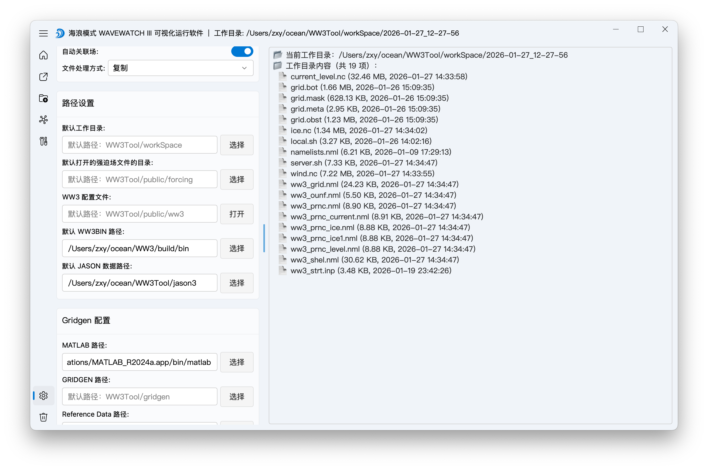

### 选择强迫场文件

风场可以使用来自 [ERA5](https://cds.climate.copernicus.eu/datasets/reanalysis-era5-single-levels?tab=download) ， [CFSR](http://tds.hycom.org/thredds/catalog/datasets/force/ncep_cfsv2/netcdf/catalog.html) ，[CCMP](https://data.remss.com/ccmp/v03.1/) 的数据

其他强迫场我暂时只尝试了 Copernicus 的流场、水位场、海冰场

我已经在 WW3Tool/public/forcing 预先准备好了几个强迫场文件，你可以直接选择使用（当然，这只是为了测试）。


由于 WAVEWATCH 要求纬度必须从小到大，而 ERA5 的风场数据纬度默认是从大到小，因此，我在这里加上了隐含的转换逻辑，会判断是否纬度是从小到大的，如果不是则会自动转换。

并且对于 CFSR 的风场会自动修复变量名称符合 WW3 的要求

另外 Copernicus 强迫场的时间标签也会在这个过程中自动修复。

强迫场文件会被自动复制（如果你想剪切，在设置页面可以更改）到当前工作目录，并改名为 wind.nc，current.nc，level.nc，ice.nc ，右侧的日志会同时输出强迫场文件的信息。


通常，我们只使用风场作为强迫场即可，并且软件不允许只使用其他强迫场而不包含风场。

如果一个文件内包含多种强迫场，那么会自动填充相应的按钮，并且这个文件在工作目录会命名为类似 current_level. nc ，表明其中包含的强迫场

### 生成网格文件

#### reference_data

在生成网格之前，我们需要到 WW3Tool/gridgen 目录执行脚本 get_reference_data. py，这个脚本是用来下载水深数据 gebco 和 etop1、etop2，以及海岸边界数据，它会自动下载并解压到目录 reference_data。


#### 一般网格

运行软件，选择从 wind. nc 读取范围，点击生成网格，会调用 WW3Tool/gridgen 目录的代码生成网格文件到工作目录

DX/DY 越小，精度越高，因为 DX/DY 网格之间的间距

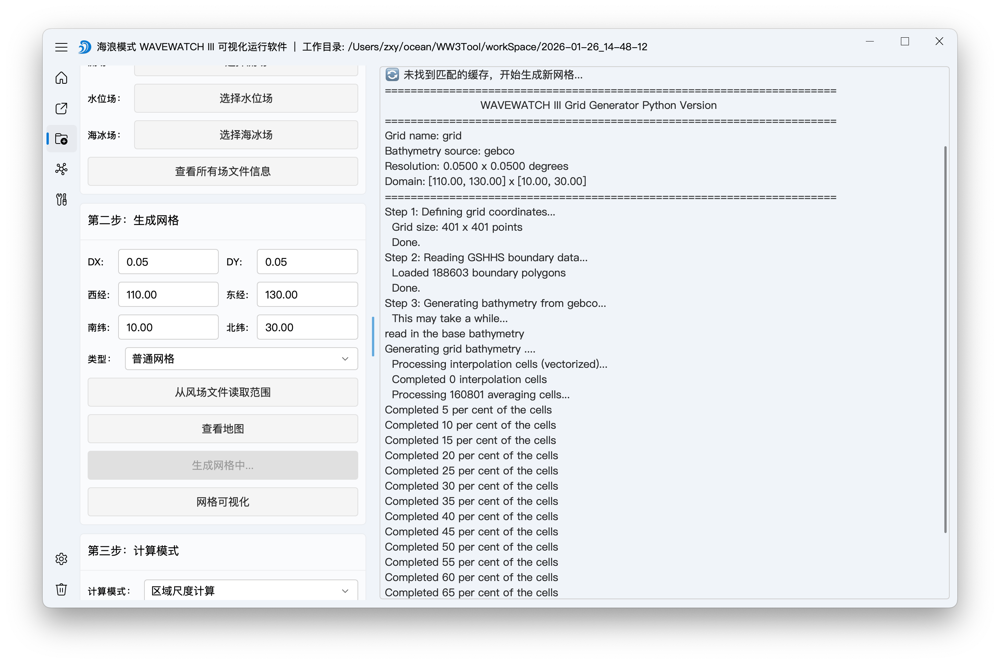

最后在工作目录下，会多出四个文件 grid. bot 、grid. obst、grid. meta、grid. mask

#### 嵌套网格

选择类型：嵌套网格


我们在设置页面的规定了一个：嵌套网格收缩系数，我们默认设置为 1.1 倍

当我们点击设置外网格我们会自动根据内网格的范围向外扩张，相当于内网格的 1.1 倍

同理，点击设置内网格，会自动根据外网格的范围向内收缩 1.1 倍

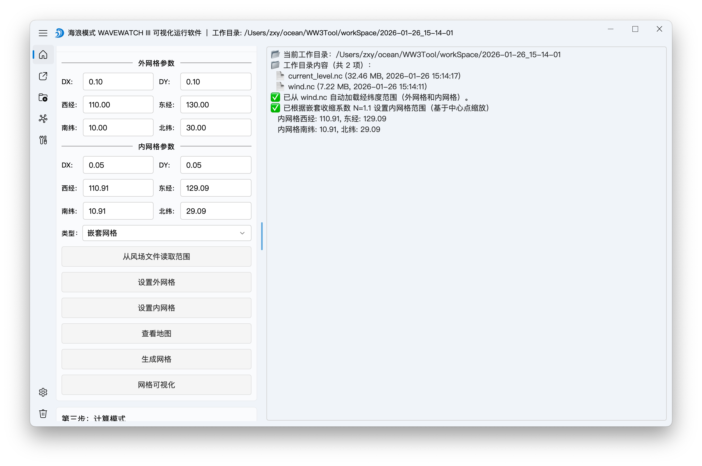

嵌套模式下生成网格会生成执行两次，一次生成外网格，一次生成内网格。

我们在嵌套网格模式下生成的网格，会在当前工作目录创建两个文件夹：coarse 和 fine，其中 coarse 存放外网格，fine 存放内网格。

当工作目录存在 coarse 和 fine 文件夹时，打开该目录会自动切换到嵌套网格模式，这对后续的很多操作都会产生影响，因此我们规定当本地已经存在 coarse 和 fine 文件夹或者已经存在其他网格文件，禁止切换网格类型。


#### 网格缓存

为了避免无意义的计算，每次生成的网格我们都会在 WW3Tool/gridgen/cache 中缓存。

根据网格的生成参数生成 key，作为文件夹的名称，这样每次生成网格的时候会先遍历缓存，如果已经存在缓存了，则直接使用缓存的网格文件。

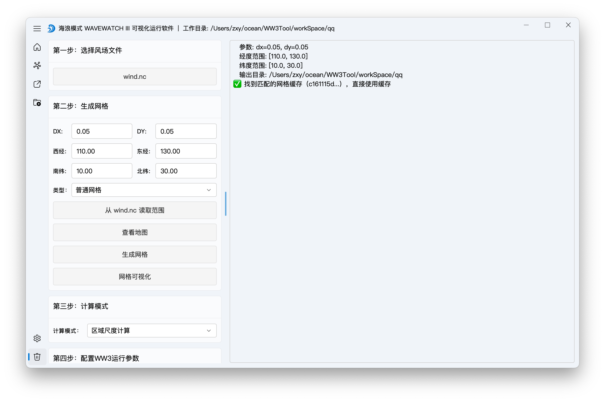

每个缓存文件夹下，还有 params. json 可以查看

``` json
{
  "cache_key": "c161115dfd8bde7b30fd01826a3c292ada7835df377a81b9ee59f73acc28328b",
  "source_dir": "/Users/zxy/ocean/WW3Tool/workSpace/2026-01-11_23-18-38",
  "parameters": {
    "dx": 0.05,
    "dy": 0.05,
    "lon_range": [
      110.0,
      130.0
    ],
    "lat_range": [
      10.0,
      30.0
    ],
    "ref_dir": "/Users/zxy/ocean/WW3Tool/gridgen/reference_data",
    "bathymetry": "GEBCO",
    "coastline_precision": "最高"
  }
}
```

#### MATLAB 与 Python 版本

我们早期使用的是 ifremer 提供的 [gridgen](https://data-ww3.ifremer.fr/COURS/WAVES_SHORT_COURSE/TOOLS/GRIDGEN/) ，NOAA 官方的代码在 https://github.com/NOAA-EMC/gridgen

但是由于都是 MATLAB 的，运行比较麻烦，因此我后来转换为了 Python 版本，目前默认使用的就是 Python 版本。

如果你很想使用 MATLAB 的 Gridgen（完全不建议），可以到设置页面改成 MATLAB，同时需要在设置页面配置 MATLAB 的路径。

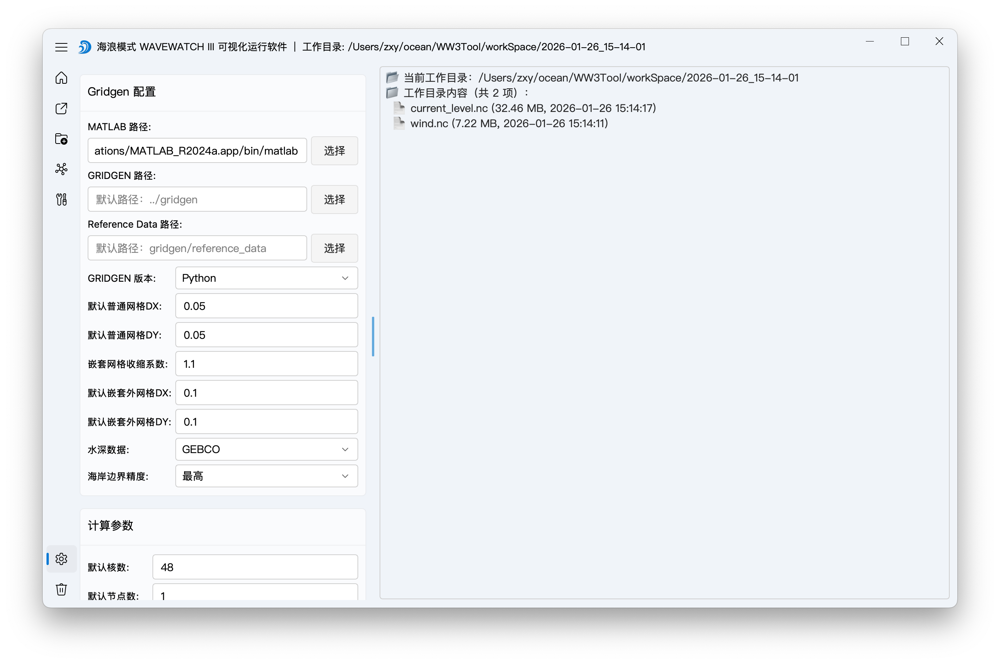

#### gridgen 配置


在设置页面，我们有 Gridgen 的配置，可以修改很多参数

- GRIDGEN 版本：我们默认使用 Python 版本，因为速度相比于 MATLAB 快很多，而且不需要依赖于 MATLAB。

- 默认普通网格 DX/DY 其实是网格的 X/Y 方向的间距，也就是说 DX/DY 越大，网格越小，精度越低。

- 嵌套网格收缩系数：嵌套模式下，设置内外网格自动变化

- 水深数据：有三种数据 gebco、etop1、etop2 ，通常我们使用 gebco ，因为精度高，etop2 次之，etop1 最低

- 海岸边界精度：通常我们选择最高精度

### 选择计算模式

其实这三种计算模式计算量上是一样的，但是最终输出的结果有些不同，看似谱空间逐点计算模式和航迹模式似乎是只计算几个点，但是计算的实际是整个地图范围。

普通的区域计算模式就是基础的 ww3_ounf 输出

谱空间逐点计算模式就是加了个 ww3_ounp

航迹模式就是 ww3_trnc

#### 区域计算模式

普通的输出模式

#### 谱空间逐点计算模式

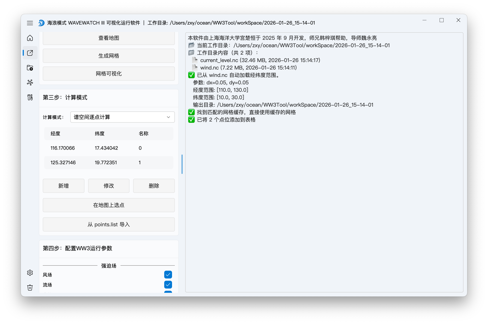

我们可以点击从地图上选点，会打开一个窗口

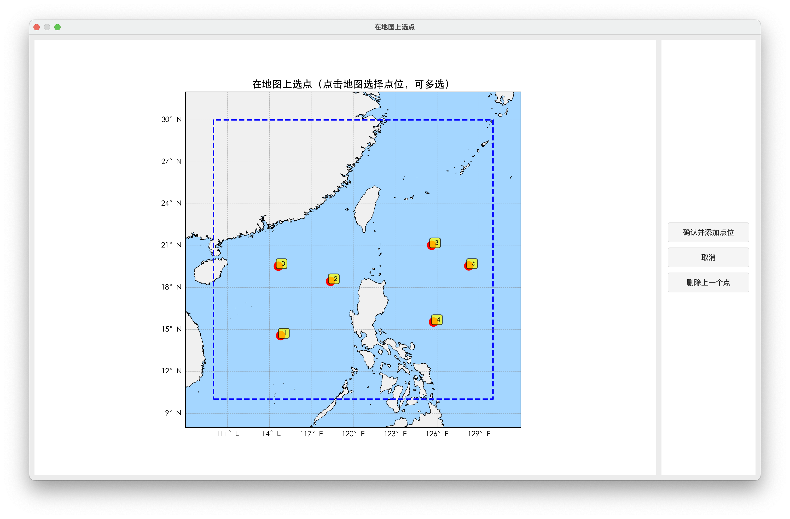
我们在地图上点击选点，注意蓝色虚线方框内的是网格文件的范围，我们只能在这里面选点，选好后我们点击 **确认并添加点位** 按钮。

随后，在第四步的确认参数时会在工作目录生成一个 points.list 文件

``` swift
117 18 '0'
126 21 '1'
127 20 '2'
115 15 '3'
128 14 '4'
126 18 '5'
```

points.list 的三列分别是：经度、纬度、点名称，当某个工作目录存在 points. list 文件时，打开该工作目录计算模式会自动切换到：谱空间逐点计算，并自动导入 points. list 的点

最后我们经过 WW3 的运算后可以得到 ww3.2025_spec.nc 在绘图界面

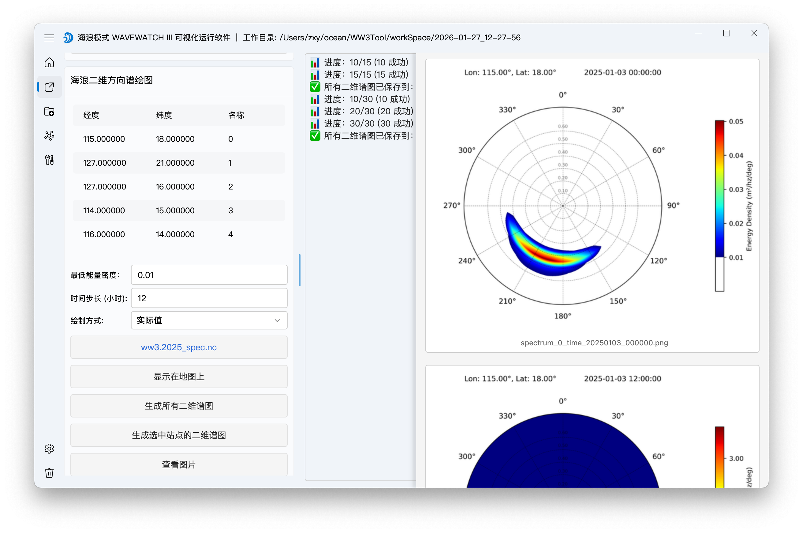

我们可以画出二维谱图

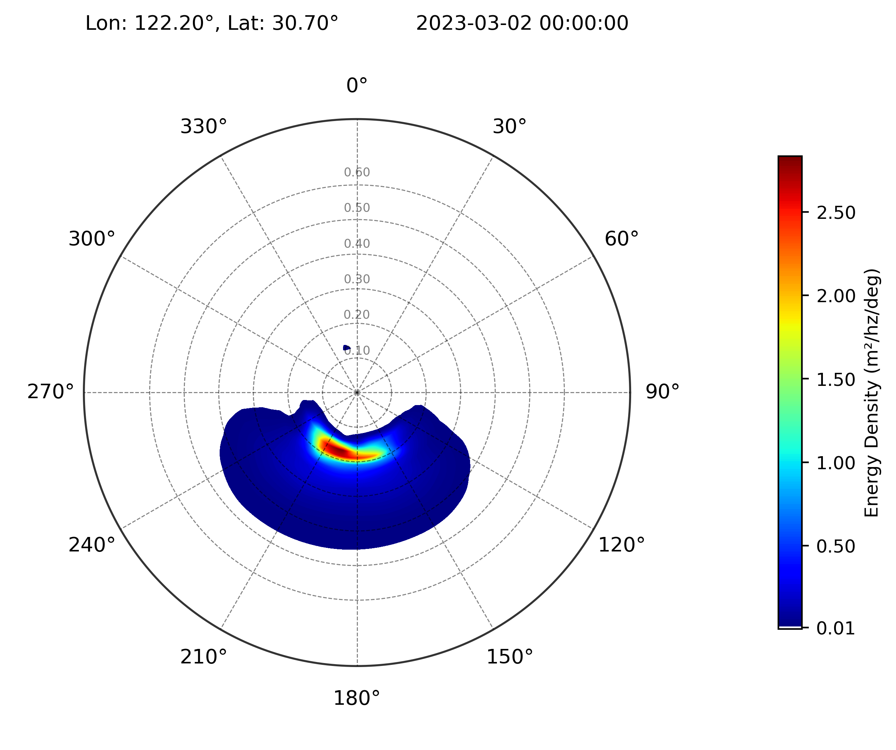

#### 航迹模式

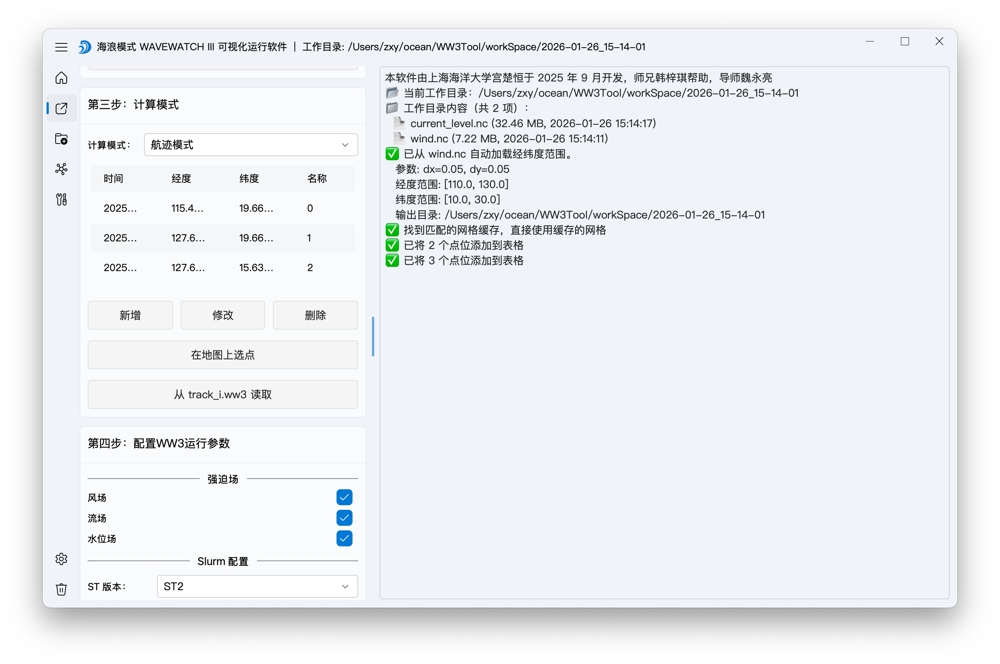
和谱空间逐点计算模式很像，但是新增了一列时间，在第四步确认参数的时候会生成一个文件：track_i.ww3，格式如下

    WAVEWATCH III TRACK LOCATIONS DATA 
    20250103 000000   115.4   19.7    0
    20250103 000000   127.6   19.7    1
    20250103 000000   127.6   15.6    2

最后我们会使用 ww3_trnc 输出一个 ww3.2025\_

### 配置运行参数

我们使用的是航迹模式，这个模式会比普通的区域计算模式多一些日志


``` log
✅ 已复制 10 个 public/ww3 文件到当前工作目录
✅ 已成功同步 grid.meta 参数到 ww3_grid.nml
✅ 已修改 ww3_shel，ww3_ounf 的谱分区输出方案
✅ 已更新 server.sh：-J=202501, -p=CPU6240R, -n=48, -N=1, MPI_NPROCS=48, CASENAME=202501, ST=ST2
✅ 已更新 ww3_ounf.nml：FIELD%TIMESTART=20250103，FIELD%TIMESTRIDE=3600秒
✅ 已更新 ww3_shel.nml：DOMAIN%START=20250103, DOMAIN%STOP=20250105, DATE%FIELD%STRIDE=1800s
✅ 已修改 ww3_prnc.nml：FORCING%TIMESTART = '20250103 000000', FORCING%TIMESTOP = '20250105 235959'
✅ 已修改 ww3_shel.nml：更新 INPUT%FORCING%* 设置
✅ 已生成 track_i.ww3 文件
✅ 已修改 ww3_shel.nml：添加 DATE%TRACK（航迹模式）
✅ 已修改 ww3_trnc.nml：TRACK%TIMESTART = '20250103 000000', TRACK%TIMESTRIDE = '3600'
```

#### 普通网格

首先，我们会把 WW3Tool/bin/public/ww3 目录下的所有文件复制到当前工作目录

    ✅ 已复制 10 个 public/ww3 文件到：/Users/zxy/ocean/WW3Tool/workSpace/qq

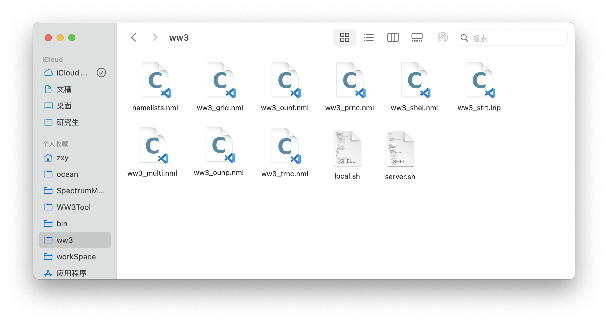

------------------------------------------------------------------------

接下来

``` log
✅ 已成功同步 grid.meta 参数到 ww3_grid.nml
```

我们会把 grid.meta 的

       'RECT'  T 'NONE'
    401      401 
     3.00       3.00      60.00 
    110.0000       10.0000       1.00

部分，转换到 ww3_grid.nml 的

    &RECT_NML
      RECT%NX           =  401
      RECT%NY           =  401
      RECT%SX           =  3.000000
      RECT%SY           =  3.000000
      RECT%SF           =  60.000000
      RECT%X0           =  110.000000
      RECT%Y0           =  10.000000
      RECT%SF           =  60.000000
    /

------------------------------------------------------------------------

然后修改谱分区输出方案

``` swift
✅ 已修改 ww3_shel，ww3_ounf 的谱分区输出方案
```

ww3_shel. nml 的 TYPE%FIELD%LIST

``` swift
&OUTPUT_TYPE_NML
  TYPE%FIELD%LIST       = 'HS DIR FP T02 WND PHS PTP PDIR PWS PNR TWS'
/
```

ww3_ounf. nml 的 FIELD%LIST

``` swift
&FIELD_NML
  FIELD%TIMESTART        =  '20250103 000000'
  FIELD%TIMESTRIDE       =  '3600'
  FIELD%LIST             =  'HS DIR FP T02 WND PHS PTP PDIR PWS PNR TWS'
  FIELD%PARTITION        =  '0 1'
  FIELD%TYPE             =  4
/
```

------------------------------------------------------------------------

再然后，我们修改 server. sh 文件

``` log
✅ 已更新 server.sh：-J=202501, -p=CPU6240R, -n=48, -N=1, MPI_NPROCS=48, CASENAME=202501, ST=ST2
```

``` sh
#SBATCH -J 202501
#SBATCH -p CPU6240R
#SBATCH -n 48
#SBATCH -N 1
#SBATCH --time=2880:00:00

#wavewatch3--ST2
export PATH=/public/home/weiyl001/software/wavewatch3/model/exe/exe:$PATH

MPI_NPROCS=48

CASENAME=202501
```

------------------------------------------------------------------------

``` log
✅ 已更新 ww3_ounf.nml：FIELD%TIMESTART=20250103，FIELD%TIMESTRIDE=3600秒
```

然后修改 ww3_ounf.nml，找到下面

``` swift
&FIELD_NML
  FIELD%TIMESTART        =  '20250103 000000'
  FIELD%TIMESTRIDE       =  '3600'
  FIELD%LIST             =  'HS LM T02 T0M1 T01 FP DIR SPR DP PHS PTP PLP PDIR PSPR PWS TWS PNR'
  FIELD%PARTITION        =  '0 1'
  FIELD%TYPE             =  4
/
```

FIELD%TIMESTART 为起始时间，FIELD%TIMESTRIDE 是输出精度

------------------------------------------------------------------------

``` log
✅ 已更新 ww3_shel.nml：DATE%FIELD%START=20250103, DATE%FIELD%STRIDE=1800s, DATE%FIELD%STOP=20250105
```

我们修改 ww3_shel.nml

``` swift
&DOMAIN_NML
  DOMAIN%START           =  '20250103 000000'
  DOMAIN%STOP            =  '20250105 235959'
/

&OUTPUT_DATE_NML
  DATE%FIELD          = '20250103 000000' '1800' '20250105 235959'
  DATE%RESTART        = '20250103 000000' '86400' '20250105 235959'
/
```

其中日期即为起始日期，另外 DATE%FIELD 中间的 '1800' 是计算时间步长

------------------------------------------------------------------------

然后我们修改 ww3_prnc. nml 的时间范围

``` sh
&FORCING_NML
  FORCING%TIMESTART            = '19000101 000000'  
  FORCING%TIMESTOP             = '29001231 000000'  
  FORCING%FIELD%WINDS          = T
  FORCING%FIELD%CURRENTS       = F
  FORCING%FIELD%WATER_LEVELS   = F
  FORCING%FIELD%ICE_CONC       = F
  FORCING%FIELD%ICE_PARAM1     = F
  FORCING%GRID%LATLON          = T
/
```

然后我们根据选择的强迫场生成 ww3_prnc_current.nml ww3_prnc_level.nml，对于冰场，冰场的浓度和厚度会分成两个 ww3_prnc_ice.nml 和 ww3_prnc_ice1. nml

我们会根据强迫场修改强迫场的开关，每个强迫场开关只能打开一个，但是在后续处理的时候我们会多次使用 ww3_prnc

我们还修改了强迫场的文件名和强迫场变量

    &FILE_NML
      FILE%FILENAME      = 'wind.nc'
      FILE%LONGITUDE     = 'longitude'
      FILE%LATITUDE      = 'latitude'
      FILE%VAR(1)        = 'u10'
      FILE%VAR(2)        = 'v10'
    /

------------------------------------------------------------------------

``` log
✅ 已修改 ww3_shel.nml：更新 INPUT%FORCING%* 设置
```

根据我们使用的强迫场，修改 ww3_shel.nml

    &INPUT_NML
      INPUT%FORCING%WINDS         = 'T'
      INPUT%FORCING%WATER_LEVELS  = 'T'
      INPUT%FORCING%CURRENTS      = 'T'
      INPUT%FORCING%ICE_CONC      = 'T'
      INPUT%FORCING%ICE_PARAM1    = 'T'
    /

------------------------------------------------------------------------

根据当前的航迹模式的点列表或者谱空间逐点计算的点列表我们生成

``` log
✅ 已生成 track_i.ww3 文件
```

------------------------------------------------------------------------

``` log
✅ 已修改 ww3_shel.nml：添加 DATE%TRACK（航迹模式）
```

我们还会在 ww3_shel. nml 添加

    &OUTPUT_DATE_NML
      DATE%FIELD          = '20250103 000000' '1800' '20250105 235959'
      DATE%TRACK          = '20250103 000000' '1800' '20250103 000000'
      DATE%RESTART        = '20250103 000000' '86400' '20250105 235959'
    /

------------------------------------------------------------------------

``` log
✅ 已修改 ww3_trnc.nml：TRACK%TIMESTART = '20250103 000000', TRACK%TIMESTRIDE = '3600'
```

航迹模式下我们还会修改 ww3_trnc. nml

    &TRACK_NML
      TRACK%TIMESTART        =  '20250103 000000'
      TRACK%TIMESTRIDE       =  '3600'
      TRACK%TIMESPLIT        =  8
    /

------------------------------------------------------------------------

``` log
✅ 已修改 namelists.nml：将 E3D 从 0 改为 1
```

二维谱点计算模式的时候我们还会修改 namelists.nml

``` swift
&OUTS E3D = 0 /
```

#### 嵌套网格

我们首先生成了嵌套网格，在工作目录创建了 coarse 和 fine 目录，然后选择了二维谱计算模式。


``` log
======================================================================
🔄 【工作目录】开始处理公共文件...
✅ 已复制 server.sh, ww3_multi.nml 到工作目录：/Users/zxy/ocean/WW3Tool/workSpace/nest
✅ 已更新 server.sh：-J=202501, -p=CPU6240R, -n=48, -N=1, MPI_NPROCS=48, CASENAME=202501, ST=ST2
✅ 已更新 ww3_multi.nml：起始=20250103, 结束=20250105, 计算精度=1800s，强迫场=风场、流场、水位场、海冰场、海冰厚度，计算资源：coarse=0.50, fine=0.50，ALLTYPE%POINT%FILE = './fine/points.list'，ALLDATE%POINT = '20250103 000000' '1800' '20250105 235959'，ALLTYPE%FIELD%LIST = 'HS DIR FP T02 WND PHS PTP PDIR PWS PNR TWS' (谱分区输出)

======================================================================
🔄 【外网格】开始处理外网格...
✅ 已复制 9 个 public/ww3 文件到当前工作目录
✅ 已修改 ww3_shel，ww3_ounf 的谱分区输出方案
✅ 已成功同步 grid.meta 参数到 ww3_grid.nml
✅ 已更新 ww3_ounf.nml：FIELD%TIMESTART=20250103，FIELD%TIMESTRIDE=3600秒
✅ 已更新 ww3_shel.nml（谱空间逐点计算模式）：起始=20250103, 结束=20250105, 计算步长=1800s，添加 TYPE%POINT%FILE = 'points.list'，添加 DATE%POINT 和 DATE%BOUNDARY
✅ 已修改 ww3_prnc.nml：FORCING%FIELD%WINDS = T, FILE%FILENAME = '../wind.nc'
✅ 已修改 ww3_prnc.nml：FORCING%TIMESTART = '20250103 000000', FORCING%TIMESTOP = '20250105 235959'
✅ 已复制并修改 ww3_prnc_current.nml：FORCING%FIELD%CURRENTS = T
✅ 已复制并修改 ww3_prnc_level.nml：FORCING%FIELD%WATER_LEVELS = T
✅ 已复制并修改 ww3_prnc_ice.nml：FORCING%FIELD%ICE_CONC = T
✅ 已复制并修改 ww3_prnc_ice1.nml：FORCING%FIELD%ICE_PARAM1 = T
✅ 已修改 ww3_shel.nml：更新 INPUT%FORCING%* 设置
✅ 已修改 namelists.nml：将 E3D 从 0 改为 1
✅ 已创建 points.list 文件，包含 4 个点位
✅ 已修改 ww3_ounp.nml：POINT%TIMESTART = '20250103 000000'，POINT%TIMESTRIDE = '3600'（谱空间逐点计算模式）

======================================================================
🔄 【内网格】开始处理内网格...
✅ 已复制 9 个 public/ww3 文件到当前工作目录
✅ 已成功同步 grid.meta 参数到 ww3_grid.nml
✅ 已更新 ww3_ounf.nml：FIELD%TIMESTART=20250103，FIELD%TIMESTRIDE=3600秒
✅ 已更新 ww3_shel.nml（谱空间逐点计算模式）：起始=20250103, 结束=20250105, 计算步长=1800s，添加 TYPE%POINT%FILE = 'points.list'，添加 DATE%POINT 和 DATE%BOUNDARY
✅ 已修改 ww3_prnc.nml：FORCING%FIELD%WINDS = T, FILE%FILENAME = '../wind.nc'
✅ 已修改 ww3_prnc.nml：FORCING%TIMESTART = '20250103 000000', FORCING%TIMESTOP = '20250105 235959'
✅ 已复制并修改 ww3_prnc_current.nml：FORCING%FIELD%CURRENTS = T
✅ 已复制并修改 ww3_prnc_level.nml：FORCING%FIELD%WATER_LEVELS = T
✅ 已复制并修改 ww3_prnc_ice.nml：FORCING%FIELD%ICE_CONC = T
✅ 已复制并修改 ww3_prnc_ice1.nml：FORCING%FIELD%ICE_PARAM1 = T
✅ 已修改 ww3_shel.nml：更新 INPUT%FORCING%* 设置
✅ 已修改 namelists.nml：将 E3D 从 0 改为 1
✅ 已创建 points.list 文件，包含 4 个点位
✅ 已修改 ww3_ounp.nml：POINT%TIMESTART = '20250103 000000'，POINT%TIMESTRIDE = '3600'（谱空间逐点计算模式）
```

我们第四步确认参数，观察 Log 输出

``` log
已复制 server.sh, ww3_multi.nml 到工作目录：/Users/zxy/ocean/WW3Tool/nest
```

我们首先把 WW3Tool/public/ww3 目录的 server. sh 和 ww3_multi. nml 复制到了工作目录。

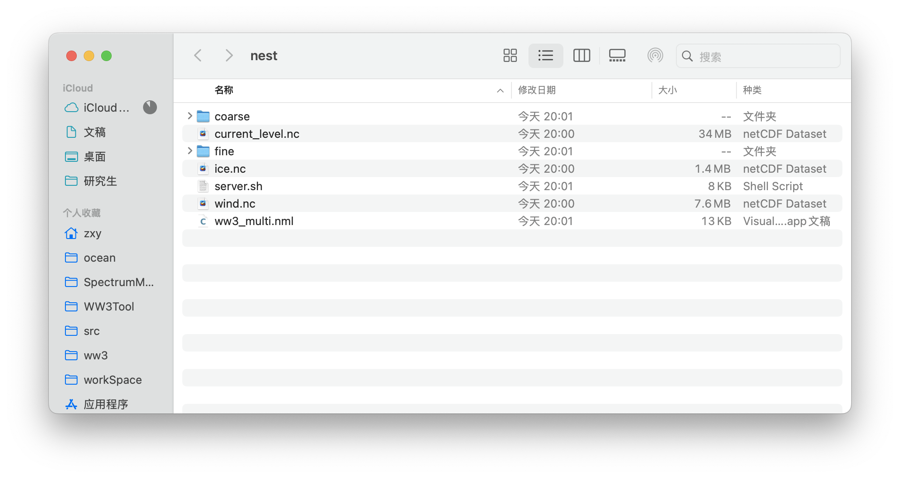

我们引入了 ww3_multi.nml 修改了起始时间，计算精度，强迫场，这其实和 ww3_shel.nml 类似

``` sh
&INPUT_GRID_NML
  INPUT(1)%NAME                  = 'wind'
  INPUT(1)%FORCING%WINDS         = T
  
  INPUT(2)%NAME                  = 'current'
  INPUT(2)%FORCING%CURRENTS      = T
  
  INPUT(3)%NAME                  = 'level'
  INPUT(3)%FORCING%WATER_LEVELS  = T
  
  INPUT(4)%NAME                  = 'ice'
  INPUT(4)%FORCING%ICE_CONC      = T

  INPUT(5)%NAME                  = 'ice1'
  INPUT(5)%FORCING%ICE_PARAM1    = T
/

&MODEL_GRID_NML

  MODEL(1)%NAME                  = 'coarse'
  MODEL(1)%FORCING%WINDS         = 'native'
  MODEL(1)%FORCING%CURRENTS      = 'native'
  MODEL(1)%FORCING%WATER_LEVELS  = 'native'
  MODEL(1)%FORCING%ICE_CONC      = 'native'
  MODEL(1)%FORCING%ICE_PARAM1    = 'native'
  MODEL(1)%RESOURCE              = 1 1 0.00 0.35 F

  MODEL(2)%NAME                  = 'fine'
  MODEL(2)%FORCING%WINDS         = 'native'
  MODEL(2)%FORCING%CURRENTS      = 'native'
  MODEL(2)%FORCING%WATER_LEVELS  = 'native'
  MODEL(2)%FORCING%ICE_CONC      = 'native'
  MODEL(2)%FORCING%ICE_PARAM1    = 'native'
  MODEL(2)%RESOURCE              = 2 1 0.35 1.00 F
/
```

注意 MODEL (2)%FORCING%WINDS = 'native' 其中的 native 表示开始，no 表示关闭

MODEL (1)%RESOURCE 和 MODEL (2)%RESOURCE 表示分配的计算资源比例

至于其他的 Log ，很容易理解，我们只是按照普通网格的方式处理了内外网格

值得注意的是，我们修改了 ww3_prnc.nml：FILE%FILENAME = '../wind. nc' ，这是为了避免强迫场文件占用两倍的空间，所以指向了共同的引用。

### 本地运行

本地运行实际执行的是 local.sh

如果选择本地执行，确保你已经在本地配置好了 WAVEWATCH III，选择 bin 目录，其中应该包含下面这些程序

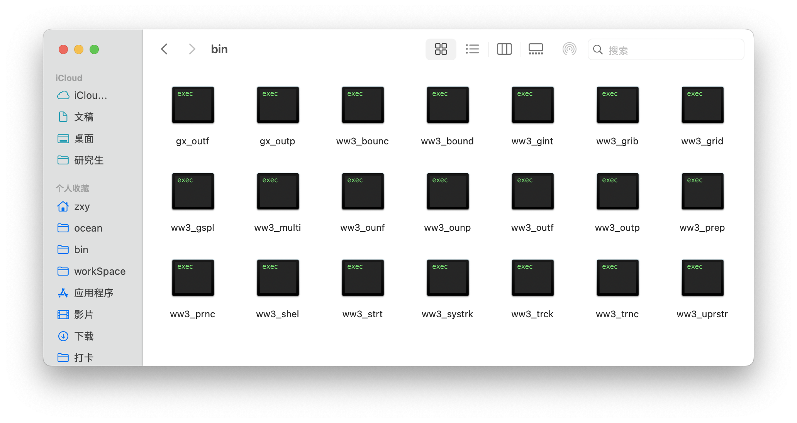

### 连接服务器

首先，你需要配置 ssh 账号和密码，在设置页面我们找到服务器配置这个选项

注意默认服务器路径，这是你的服务器存放工作目录的路径

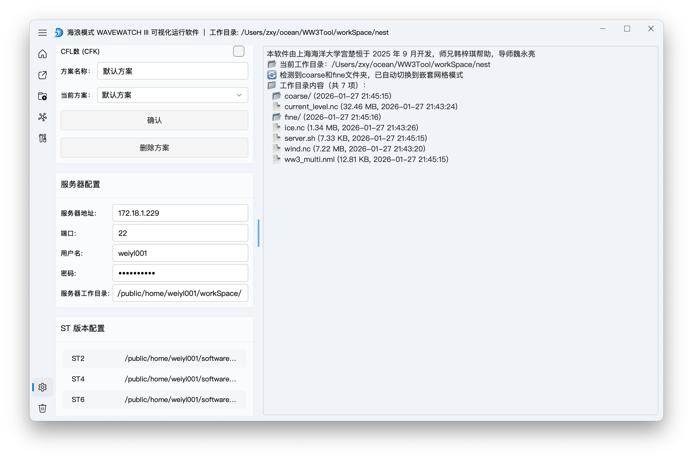

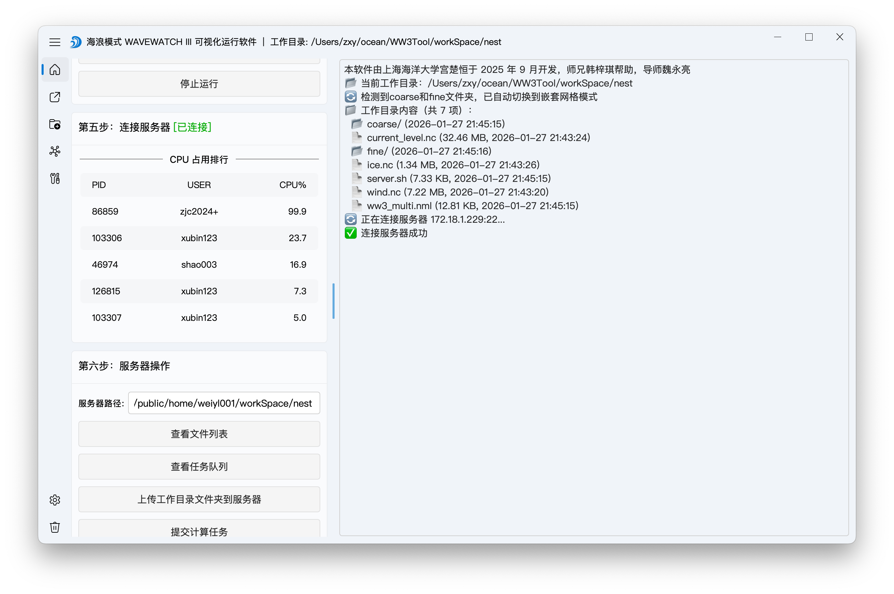

点击连接服务器，连接成功后会先显示一个 CPU 占用排行，这个列表每秒钟刷新一次

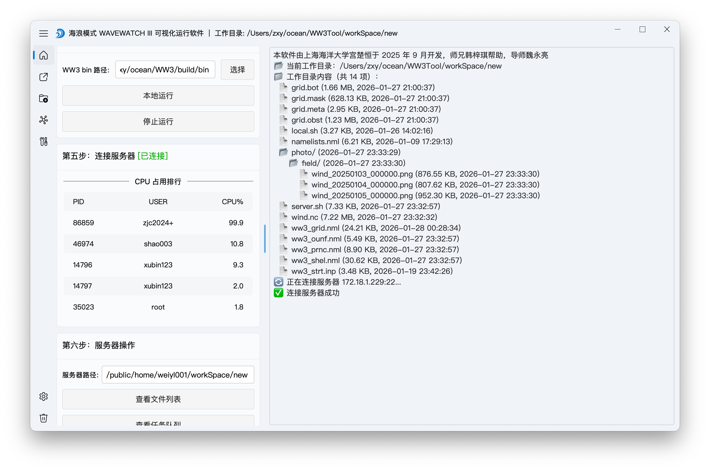
如果在第六步提交计算任务到 Slurm ，还会显示任务队列

### 服务器操作

查看任务队列就是在服务器执行了 squeue -l

上传工作目录到服务器，就是把当前工作目录上传到服务器工作目录，这在设置页面有配置

提交计算任务就是在服务器执行了 server.sh 这个脚本，如果运行成功(所有指令正常运行)，会在服务器工作目录生成一个 success.log，包含所有的执行 Log，如果失败，则会生成一个 fail.log 同样包含所有的执行 log

检查是否已完成就是检测是否存在 success. log 或 fail. log

清空文件夹就是清空当前服务器工作目录文件夹

下载结果到本地会自动下载所有 ww3\*nc 文件，如果是嵌套网格模式，只会下载 fine 内的结果文件。

下载 log 文件就是下载 success. log 或 fail. log

### 自动操作

打开一个工作目录，会自动检测是否已经存在转换了的强迫场文件，自动填充到按钮

自动读取网格文件的范围和精度，填充第二步，检测是否保护 coarse 和 fine 文件夹，自动切换到嵌套网格模式

自动检测 points. lits 切换到点输出模式，检测到 track_i.ww3 切换到航迹模式

自动读取 server.sh 的 slurm 参数填充第四步，自动检测 ww3_shel. nml 的计算精度，时间范围，谱分区方案

### 设置页面


设置页面的绝大部分设置都是自动保存的，除了谱分区输出方案

#### 运行方式

运行方式，这个其实只是控制主页的某些元素是否显示罢了，没有什么实际的影响

例如选择本地运行的时候，不会显示 Slurm 参数


#### 强迫场选择

强迫场选择的自动关联就是打开一个文件如果包含多个强迫场，那么可以自动填充其他按钮

文件处理方式就是对原本的强迫场文件的处理方式：复制或剪切。

#### JASON 数据路径

JASON 数据路径就是绘图的时候用的，比如你想看模拟的结果和 JASON 3 卫星的观测的波高对比。


#### WW3 配置

WW3 配置就是主页第四步的默认值，确认参数会修改 ww3_shel.nml 和 ww3_multi.nml 计算精度，ww3_ounf.nml, ww3_ounp.nml, ww3_trnc.nml 输出精度

文件分割就是 ww3_ounf. nml, ww3_ounp. nml, ww3_trnc. nml 的 TIMESPLIT，比如你计算的时间范围是 3 个月，那么你选择月分割或年分割比较合适，如果你选择日分割，则会每天一个文件。

频谱参数配置、数值积分时间步长、近岸配置都是 ww3_grid.nml 的配置，在这里修改会同时修改 WW3Tool 和当前工作目录的 ww3_grid.nml （如果存在）

谱分区输出是 ww3_shel.nml、 ww3_ounf、ww3_ounp 的配置

#### CPU 配置

在服务器端输入指令

``` sh
sinfo
```

可以查看服务器的 CPU (如果你已经服务配置了 slurm)

然后打开软件的设置页面，找到 Slurm 参数一栏，点击 CPU 管理，改成你的服务器的 CPU


#### 服务器连接

你需要填写 SSH 账号，以及默认的登录路径，在这个路径，每次的工作目录都会上传到这里。

<figure>

<figcaption aria-hidden="true">400</figcaption>
</figure>

#### ST 版本管理

实际上，这个就是你编译的不同版本的 WAVEWATCH，你只需填写它们的路径即可

<figure>
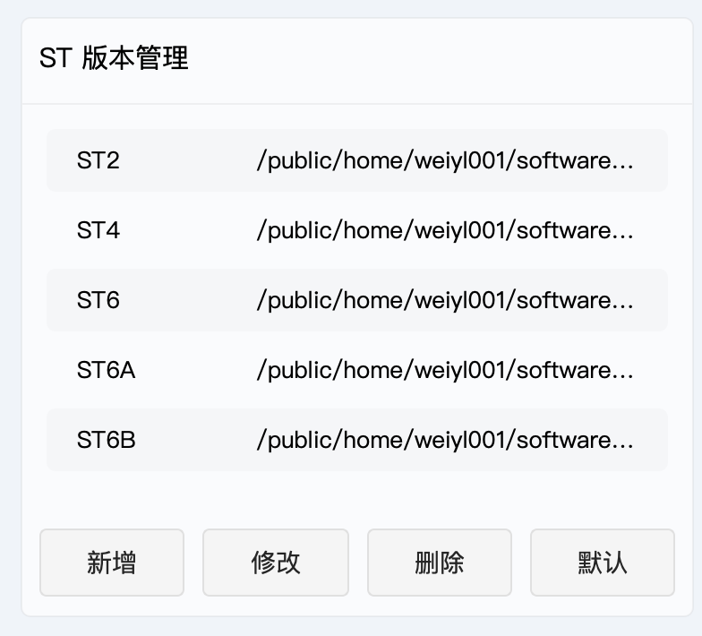
<figcaption aria-hidden="true">400</figcaption>
</figure>

### 绘图界面

#### 风场绘图


#### 二维谱绘图


#### 波高图


#### 风涌浪图


#### 卫星拟合图


## 文件获取

### 下载风场文件

#### ERA5

https://cds.climate.copernicus.eu/datasets/reanalysis-era5-single-levels?tab=download

下图是 ERA5 的数据下载，你需要先注册一个账号才能下载，注册账号需要注意你的英文名字不能是随机的字母，否则无法注册。


#### CFSR

http://tds.hycom.org/thredds/catalog/datasets/force/ncep_cfsv2/netcdf/catalog.html

找到 cfsv2-sec2_2025_01hr_uv-10m. nc 注意结尾是 uv-10m 的

如果你想下载全球整年的数据点击

HTTPServer: //tds. hycom. org/thredds/fileServer/datasets/force/ncep_cfsv2/netcdf/cfsv2-sec2_2025_01hr_uv-10m. nc

如果你想下载指定区域指定时间范围的风场，选择点击 NetcdfSubset: //ncss. hycom. org/thredds/ncss/grid/datasets/force/ncep_cfsv2/netcdf/cfsv2-sec2_2025_01hr_uv-10m. nc

打开后选择左侧的两个 wndewd 和 wndnwd ，拉到下面选择 Choose Output Format: netCDF

如果你发现无法输入经纬度，则取消选中 Disable horizontal subsetting


然后点击下面的 Time range 标签，输入时间范围，最后 submit

#### CCMP

https://data.remss.com/ccmp/v03.1/

这个很简单，直接下载就行

### 下载流场、水位场

https://data.marine.copernicus.eu/product/GLOBAL_ANALYSISFORECAST_PHY_001_024/download?dataset=cmems_mod_glo_phy_anfc_0.083deg_PT1H-m_202406

选择下面的 Variables，如果你不需要水位场，取消选中 Sea surface height above geoid

然后输入范围和时间即可，最后点击 DOWNLOAD


### 下载冰场

https://data.marine.copernicus.eu/product/GLOBAL_MULTIYEAR_PHY_001_030/download?dataset=cmems_mod_glo_phy_my_0.083deg_P1D-m_202311

可以下载海冰场和流场

海冰包括海冰覆盖 Sea ice area fraction 、海冰厚度场 Sea ice thickness


### JASON 3 数据

ftp:/ftp-oceans.ncei.noaa.gov/nodc/data/jason3-gdr/gdr

## 授权协议

本软件基于 GPLv3 授权的框架开发，根据 GPLv3 协议要求，整体以 GPLv3 方式发布。
