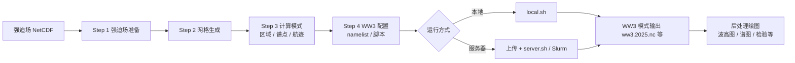

# WW3Tool  文档

## 1. 项目定位


WW3Tool 是围绕 **WAVEWATCH III**（海浪数值模式）构建的 **预处理与运行辅助工具**。它不替代 WW3 本身的可执行程序（`ww3_grid`、`ww3_prnc`、`ww3_shel` 等），而是负责：

- 强迫场文件的校验、修复与合并（纬度排序、变量重命名、时间轴修复）
- 网格生成（结构化矩形 / 三角形非结构化 / SMC 三种类型）
- 自动配置 WW3 所需的全套 namelist 文件（`ww3_grid.nml`、`ww3_prnc.nml`、`ww3_shel.nml`、`ww3_ounf.nml`、`ww3_multi.nml` 等）
- 生成 Slurm 提交脚本（`server.sh`）和本地运行脚本（`local.sh`）
- 通过 SSH 将工作目录上传到 HPC 服务器、提交 Slurm 作业、监控任务状态、下载结果
- 后处理绘图（波高填色图、方向谱、Jason-3 卫星验证、NDBC 浮标匹配等）

WW3Tool 完全由 Python 组成（其他语言的代码是网格生成器 meshgen 的代码），支持 Windows / Linux / macOS，UI 支持中英文双语。


## 2. 快速开始

`run.py` 是唯一入口，通过命令行参数区分三种模式：

```sh
python3 run.py                    # GUI（图形界面）
python3 run.py shell              # 交互式终端（REPL，可反复执行各步骤）
python3 run.py <子命令> [workdir]  # 无界面 CLI（一条命令一个步骤，适合脚本与 AI 调用）
```

三种模式共享同一套业务逻辑（`src/workflows/application/`），差别仅在交互层。


### 2.1 GUI 


```bash
python3 run.py  
```


### 2.2 交互式终端

```sh
python3 run.py shell              # 交互式终端
```


### 2.3 无界面 CLI 

```sh
python3 run.py <子命令> [workdir]  # 无界面 CLI（一条命令一个步骤，适合脚本与 AI 调用）
```

CLI 的"一条命令一个步骤、无需人工交互"特性天然适合 AI Agent 调用，命令包括：

| 类别   | 子命令                                                             | 说明                   |
| ---- | --------------------------------------------------------------- | -------------------- |
| 配置管理 | `workdir <path>`                                                | 创建或加载工作目录            |
|      | `validate [workdir]`                                            | 校验 params.yml        |
|      | `config [workdir]`                                              | 打印配置摘要               |
|      | `print-params [workdir]`                                        | 输出 params.yml 原文     |
| 预处理  | `prepare-forcing [workdir]`                                     | 准备强迫场（Step 1）        |
|      | `merge-forcing <in1.nc> [...] -o <out.nc>`                      | 独立工具：校验并合并强迫场 NetCDF |
|      | `generate-grid [workdir]`                                       | 生成网格（Step 2）         |
|      | `recommend-grid [workdir] [--coarse\|--fine]`                   | 按区域范围推荐网格间距          |
|      | `recommend-cfl [workdir]`                                       | 按 CFL 公式推荐时间步长       |
|      | `prepare-ww3 [workdir]`                                         | 仅生成 WW3 namelist     |
|      | `run-workflow [workdir]`                                        | 完整预处理流程              |
|      | `local-run [workdir]`                                           | 执行 local.sh          |
| 远程运维 | `connect-test [workdir]`                                        | 测试 SSH 连接            |
|      | `ssh [workdir]`                                                 | 打开交互式 SSH 终端         |
|      | `slurm-idle [workdir]`                                          | 查看 Slurm 空闲 CPU      |
|      | `confirm-slurm [workdir]`                                       | 写 server.sh          |
|      | `upload [workdir] --confirm`                                    | 上传工作目录到远程            |
|      | `submit [workdir]`                                              | 提交 server.sh         |
|      | `check-status [workdir]`                                        | 检查远程任务状态             |
|      | `queue-status [workdir]`                                        | 查看 SLURM 队列          |
|      | `download-results [workdir] [--nested]`                         | 下载远程结果               |
|      | `download-log [workdir]`                                        | 下载远程日志               |
|      | `clear-remote [workdir] --confirm`                              | 清空远程目录               |
|      | `cancel-job [workdir] <job_id>`                                 | 取消 SLURM 任务          |
|      | `ntfy-watch [workdir]`                                          | 注入常驻 ntfy 监听         |
|      | `ntfy-watch-job [workdir] <job_id>`                             | 为指定任务注入一次性 ntfy 监听   |
| 后处理  | `plot-wave-maps [workdir] [--contour]`                          | 波高填色图                |
|      | `plot-spectrum [workdir] [--mode ...] [--station N]`            | 方向谱图                 |
|      | `plot-jason3` / `plot-jason3-swh` / `download-jason3` [workdir] | Jason-3 相关           |
|      | `plot-ndbc [workdir]`                                           | NDBC 浮标匹配            |
|      | `download-ndbc [workdir]`                                       | 下载 NDBC 浮标观测数据       |
| 辅助   | `print-example`                                                 | 输出示例 params.yml      |


## 3. 项目结构

```
WW3Tool/
├── run.py                  # 唯一入口：依赖检查 → 语言切换 → 分发到 GUI / Shell / CLI
├── params.yml              # 算例参数模板（勿直接运行；用 workdir 创建副本后编辑）
├── public/                 # 全局资源
│   ├── languages/          #   zh_CN.json / en_US.json 翻译文件
│   ├── 7.14_nml/           #   WW3 namelist 模板（ww3_shel.nml, ww3_prnc.nml 等）
│   ├── 6.07_nml/           #   WW3 namelist 模板（ww3_shel.nml, ww3_prnc.nml 等）
│   ├── scripts/            #   远程脚本（ww3_ntfy_watch.sh 等）
│   └── forcing/            #   示例强迫场文件（测试用）
├── meshgen/                # 网格生成器
│   ├── structured_generator/  # 结构化矩形网格（含 pygridgen）
│   ├── unst_generator/        # JIGSAW 非结构化网格
│   ├── smc_generator/         # SMC 网格
│   ├── reference_data/        # 水深/海岸线数据（GEBCO, ETOPO 等，约 6.5GB）
│   └── cache/                 # 网格缓存（按参数 hash 索引）
├── workSpace/              # 默认工作目录根；每个子文件夹是一个独立算例
└── src/
    ├── desktop/            # PyQt6 图形界面层
    │   ├── windows/        #   主窗口（preprocessing_window.py）、设置窗口
    │   ├── steps/          #   各步骤面板（ww3_panel, server_connect_panel 等）
    │   ├── view_models/    #   视图模型（remote.py, pipeline.py 等）
    │   └── components/     #   可复用 UI 组件
    └── workflows/          # 核心业务逻辑（DDD 风格分层）
        ├── interfaces/     #   入口适配器：command_line.py, interactive_cli.py, workdir_setup.py
        ├── application/    #   用例层：configuration.py, preprocessing_workflow.py, remote_ops.py, slurm_ops.py, forcing_merge.py 等
        ├── domain/         #   领域模型：config_models.py, forcing_fields.py, grid_spacing_recommendation.py 等
        ├── infrastructure/ #   基础设施：adapters/, forcing/, remote/, plot/, ww3/ 等
        └── support/        #   工具类：日志、异常等
```

GUI 模式和 Shell 模式最终都调用 `src/workflows/application/` 中的用例函数。


## 4. 配置系统：params.yml

`params.yml` 是描述一次计算任务的全部参数。

比如我现在想要对 110E ~ 130E，10N~30N 的区域进行海浪模拟，使用 2025 年 1 月 3 号到   2025 年 1 月 5 号的 ERA5 再分析风场数据做强迫场，这次模拟就可以认为是一个计算任务，常用的 WW3 NML 配置参数都会在 params.yml 中设置。

ww3_grid.nml 常用的数值积分参数

```swift
&SPECTRUM_NML
	SPECTRUM%XFR   = 1.1
	SPECTRUM%FREQ1 = 0.04118
	SPECTRUM%NK    = 32
	SPECTRUM%NTH   = 24
/

&TIMESTEPS_NML
	TIMESTEPS%DTMAX = 900
	TIMESTEPS%DTXY = 320
	TIMESTEPS%DTKTH = 300
	TIMESTEPS%DTMIN = 15
/
```

在 params.yml 描述为

```swift
ww3_grid:
	SPECTRUM%XFR: 1.1
	SPECTRUM%FREQ1: 0.04118
	SPECTRUM%NK: 32
	SPECTRUM%NTH: 24
	TIMESTEPS%DTMAX: 900
	TIMESTEPS%DTXY: 320
	TIMESTEPS%DTKTH: 300
	TIMESTEPS%DTMIN: 15
```

根目录的 `params.yml` (即 WW3Tool/params.yml) 只是模板，用于提供默认参数；实际的运行时候，我们会创建独立的工作目录，再编辑该目录下的 `params.yml`。

工作目录中的 params.yml 描述了一次计算任务的全部参数。

GUI 模式下，你填写的表单，程序会先在内存中保存参数，然后把根 params.yml 复制覆盖当前工作目录 yml 然后覆盖相应的参数，这么做是为了始终保持工作目录的 params.yml 和根 params.yml  的结构一致。

每次打开工作目录，GUI 程序会自动读取 params.yml ，恢复表单，让你能方便的知道当前工作目录的配置。

而在 Shell 和 CLI 模式下，你需要手动修改工作目录的 params.yml ，然后使用 Shell 和 CLI  的指令执行。


### 校验 params.yml

每次执行指令都会自动校验一遍 params.yml ，检查是否存在格式问题。

在 Shell 和 CLI 模式下，有一个专门的指令用于校验 params.yml 。

```sh
python run.py validate [work_dir_name] 
```

 
### 路径验证

执行每个步骤的功能的时候，例如 

```swift
python3 run.py prepare-forcing [work_dir_name]
```

都会自动校验带有路径的参数有效性，比如 

```swift
paths:
	matlab_path: /Applications/MATLAB_R2024a.app/bin/matlab
	jason_path: /Users/zxy/ocean/Paper/WW3Tool/jason3
	ndbc_path: null 
	jason3_download_url: https://www.ncei.noaa.gov/data/oceans/jason3/
```

如果发现某个参数为空或者路径不存在，那么会自动填写为 WW3Tool/ndbc ，WW3Tool/jason 等等类似的，在程序内部都有相关的规定默认的路径是什么。


## 5. 内部实现逻辑

一次完整流程的典型链路：

```
→ [创建或加载工作目录]  自动复制根 params.yml 到工作目录
→ [Step 1 强迫场准备] 校验、修复、复制/移动强迫场数据到工作目录
→ [Step 2 网格生成] 调用 meshgen 生成网格文件
→ [Step 3 计算模式] 选择 区域计算 / 二维谱点计算 / 航迹计算
→ [Step 4 WW3 配置] 配置 nml 文件参数
→ [Step 5 连接服务器] SSH 连接、配置 Slurm 参数、选择服务器 WW3 版本
→ [Step 6 上传与运行] 上传工作目录、提交到 Slurm 作业系统
→ [Step 7 最终] WW3 模式输出结果 (ww3.*.nc 等)
```


我会在接下来的章节中，详细的和你说明每一步具体在做什么，让你放心的使用这个软件


### 5.1 创建工作目录

> 工作目录是什么？
> 
> 想象一个场景：我们现在想要对 110E ~ 130E，10N~30N 的区域进行海浪模拟，先使用 gridgen 生成了网格文件，然后下载了 2025 年 1 月 3 号到   2025 年 1 月 5 号的 ERA5 再分析风场数据做强迫场，配置了相关的 WW3 NML 文件，这一大堆文件都需要一个存放的位置：工作目录。

创建工作目录的 CLI  指令：

```sh
python3 run.py workdir [work_dir_name]    # 创建并加载工作目录，默认在 WW3Tool/workSpace 内创建
```


创建工作目录时，程序会自动执行以下操作：

1. 在 `WW3Tool/workSpace/` 下创建新文件夹，默认名称为当前时间戳（如 `2026-06-17_19-37-01`）

2. 将根目录 `params.yml` 原样复制到工作目录

3. 对工作目录 `params.yml` 执行：替换工作目录路径、清空强迫场文件路径、清空日期范围和 `remote_dir` ，这是防止每次自动恢复主页表单值的时候错误使用了根  params.yml  的值

4. 读取 params.yml 填充 UI 的默认值。

工作目录创建后，所有后续步骤（强迫场、网格、namelist 生成等）都在该目录中操作，不会影响根 params.yml (除了 GUI 的设置修改，修改设置会修改根 params.yml ，设置用来提供表单默认值)。


#### yml 对应参数

```swift
workdir:
	path: /Users/zxy/ocean/Paper/WW3Tool/workSpace/new
	default_workspace: /Volumes/Zxy's Disk/WW3Tool_workSpace/
```

path 是工作目录的路径

default_workspace 是新建工作目录默认的存放路径

```sh
python run.py workdir [work_dir_name]
```

这条指令中 work_dir_name 可以是一个绝对路径，也可以是一个名字，如果对应的目录不存在则会自动创建一个工作目录，自动复制根目录的 params.yml 到新工作目录，并替换工作目录的  params.yml 的 workdir.path 为工作目录路径。


#### 根目录校验

为了防止忘记创建工作目录就直接使用 Shell 或 CLI 指令，我加了一个校验当前目录是否是 WW3Tool 根目录，这样就不会误用根目录 params.yml 或忘记创建工作目录.

在 CLI 模式中，尝试不指定工作目录：

```bash
python3 run.py prepare-forcing 
    
---------------------------------------------------------------

Using project virtual environment: /Users/zxy/ocean/Paper/WW3Tool/.venv
Dependency check passed.
Parameter error: Cannot use the repository root params.yml directly (it is a template file).
Please create or load a working directory first:
  python3 run.py workdir my_workdir
```

在 shll 模式下不使用 workdir 指令，你是无法进行任何操作的。

```sh
ww3>  config  
⚠ No configuration loaded. Use 'workdir <path>' first.
ww3> queue-status
⚠ No configuration loaded. Use 'workdir <path>' first.
```


### 5.2 Step 1 — 强迫场准备

```sh
python3 run.py prepare-forcing [work_dir_name]    # 准备强迫场
```

所有强迫场（风场、流场、水位场、冰场）统一走同一条处理路径：复制/移动到工作目录后，由 `ForcingNormalizeService` 单遍读写完成全部标准化。`VariableDetector` 对 NetCDF 内部变量名做纯名称匹配（不读取数据）来检测场类型：

- **风场**：存在 `u10/v10`、`wndewd/wndnwd`、`uwnd/vwnd` 任一对（大小写均匹配）
- **流场**：存在 `uo/vo`
- **水位场**：存在 `zos`
- **冰场**：存在 `siconc`

#### 单遍归一化（ForcingNormalizeService）

所有强迫场文件统一通过 `ForcingNormalizeService.normalize()` 处理，从源文件读取后一次性写出标准化 NetCDF，保留源文件中的所有变量（不限于强迫场变量）。具体处理：

1. **变量名检测与重命名**：自动识别各类命名变体（如 `wndewd/wndnwd` → `u10/v10`、`uo/vo` 保持、`zos` 保持、`siconc` 保持），统一输出为标准变量名，并设置对应的 `units`、`level` 等属性
2. **坐标标准化**：坐标变量统一命名为 `longitude`/`latitude`/`time`（不论源文件用的是 `lon`/`lat`/`valid_time` 还是其他变体），同步重命名维度和引用该维度的所有变量
3. **时间单位转换**：统一转换为 `"seconds since 1970-01-01"`，使用 `num2date` 做精确换算，保留 `calendar` 属性
4. **纬度翻转**：纬度从大到小排列时自动翻转为从小到大（避免 WW3 6.07.1 的 `ww3_prnc` 在规则经纬网下触发 `EXTCDE(32)`）
5. **经度递减拒绝**：经度从大到小排列时**拒绝导入并记录错误**——经度闭合和 `0~360` / `-180~180` 范围关系不能安全猜测

目标文件名由 `FilePathManager.generate_forcing_filename()` 按固定顺序 `wind_current_level_ice` 拼接生成（如 `wind.nc`、`current.nc`、`current_level.nc`、`wind_current_level_ice.nc`）。文件写入方式由 `forcing.process_mode` 控制，支持 `copy`（`shutil.copy2`，保留元数据）和 `move`（`shutil.move`）。

大文件采用**自适应内存策略**：根据可用内存和数据量自动选择全量加载、分块处理（目标 ~16MB 块大小）、或多进程并行（文件 ≥ 2GB、时间步 ≥ 96、网格点 ≤ 30 万时启用 `ProcessPoolExecutor`）。写入先输出到临时文件再 `os.replace` 原子替换。

归一化**不强制**变量维度顺序。WW3 的 `ww3_prnc` 按维度名匹配变量维度，namelist 中通过 `FILE%LONGITUDE` / `FILE%LATITUDE` 指定维度名。

#### 多场文件与自动关联

如果一个 NetCDF 文件同时包含多种强迫场（如流场+水位场），`VariableDetector` 会检测所有存在的场类型：

- **自动关联**（`auto_associate=True`，默认）：文件名使用下划线连接所有检测到的场，如 `current_level.nc`、`wind_current_level_ice.nc`，同时多个强迫场槽位指向同一个文件

#### 工作目录扫描

打开已有工作目录时，`FileService.scan_forcing_files` 三阶段检测：
1. 先查标准名（`wind.nc`、`current.nc` 等）
2. 再解析合并文件名（如 `current_level.nc` → 映射到 current 和 level）
3. 最后用变量检测兜底（打开 `.nc` 文件检查内部变量）

独立工具 `merge-forcing` 可脱离工作目录，直接校验并合并多个强迫场 NetCDF（按时间拼接 + 变量合并），支持 `--time-range` 和 `--bbox` 裁剪。


### 5.3 Step 2 — 网格生成

```sh
python3 run.py generate-grid  [work_dir_name]                 # 生成网格
python3 run.py recommend-grid [work_dir_name] --coarse        # 使用推荐网格间距
```

关于网格生成器 WW3Tool/meshgen，他们的详细说明可以查看 meshgen/README.md ，这里不再赘述。

在生成网格前，我们需要下载水深数据、海岸边界数据 reference_data，我已经把下载功能集成到 WW3Tool 了，你只需点击生成网格就会自动提示你下载。

每次网格生成的文件都会自动缓存到 `meshgen/cache/`，以参数 hash 为 key，避免重复计算。

我们生成的网格文件最终会被 WAVEWATCH III 编译出来的程序：ww3_grid 处理。


#### 结构化矩形网格

> 关于嵌套网格，后续将进行重构，目前存在问题，请不要使用！


结构化矩形网格是由 gridgen 生成的，输出 grid.obst、grid.bot、grid.mask_nobound、grid.meta 文件

```swift
grid.bot
  - 格式：ASCII 文本文件
  - 内容：网格水深数据(来)
  - 单位：来(实际值 = 文件值 / 1000)
  - 尺寸：Ny × Nx
grid.mask_nobound
  - 格式：ASCII 文本文件
  - 内容：陆海掩膜
  - 值：0 = 陆地，1 = 海洋
  - 尺寸：Ny × Nx
grid.obst
  - 格式：ASCII 文本文件
  - 内容：x 和 y 方向的障碍物值
  - 单位：0-1 之间的比例(实际值 = 文件值 / 100)
  - 尺寸：Ny × Nx(x 方向)，Ny × Nx(y 方向)
grid.meta (实际上是 ww3_grid.nml，用于同步一些配置)
  - 格式：ASCII 文本文件
  - 内容：供 WAVEWATCH III `ww3_grid` 使用的网格描述
  - 包含：网格尺寸、分辨率、范围等信息
```


#### 三角形非结构化网格

基于 JIGSAW 生成，支持深水尺度、近岸尺度、浅水波长加密、水深梯度等参数

```yaml
# Unstructured (triangular) grid spacing parameters:
# hmax – maximum element spacing in deep water (km).
# hmin – minimum allowed spacing everywhere (km).
# hshr – target spacing near shorelines (km).
# nwav – number of wavelengths per element for resolution.
# dhdx – rate of spacing change with depth gradient.
# deep_ocean_threshold_m – depth (m) above which hmax applies.
# margin_deg – buffer margin around domain boundary (degrees).
# edge_segments – number of segments along coastlines.
# options.data – optional mask / exclusion file.
# options.command_line_args – extra JIGSAW CLI flags.
# options.regional – stereographic projection centre (stereo_lon/lat).

unstructured:
	hmax: 100
	hmin: 2
	hshr: 20
	nwav: 400
	dhdx: 0.05
	deep_ocean_threshold_m: 4000
	margin_deg: 1
	edge_segments: 64
	options:
	data:
	mask_file: ''
	command_line_args:
	black_sea: 3
	regional:
	stereo_lon: 120.0
	stereo_lat: 20.0
```


#### SMC 网格

基于 SMCGTools 生成

```yml
# SMC (Spherical Multi-Cell) grid options:
#   bathymetry       – dataset name (see presets.smc_bathymetry).
#   bathy_convention – 'elevation' (positive up) or 'depth' (positive down).
#   n_levels         – number of cell-size refinement levels.
#   wlevel           – water-level reference index.
#   depmin           – minimum depth below which cells are excluded (m).
#   dshalw           – shallow-water depth threshold for extra refinement (m).
#   generate_boundary_cells – whether to create open-boundary ghost cells.
#   msea             – minimum cell count across straits.
#   options.input    – low-level input pre-processing (auto-flip, tolerances).
#   options.grid     – grid identity & projection (global, arctic, origin).
#   options.output   – output file naming and formatting.
smc:
  bathymetry: ETOPO2
  bathy_convention: elevation
  n_levels: 2
  wlevel: 0
  depmin: 0
  dshalw: -150
  generate_boundary_cells: true
  msea: 1
  options:
    input:
      auto_flip_lat: true
      auto_flip_lon: true
      coord_spacing_rtol: 0.001
      coord_spacing_atol: 1.0e-08
      nan_fill_value: 1000.0
    grid:
      name: grid
      global: false
      arctic: false
      glb_arc_lat: 84.4
      origin:
        lon0: 0.0
        lat0: -90.0
    output:
      file_prefix: ''
```


### 5.4 Step 3 — 计算模式

计算模式在 `params.yml` 的 `calc.mode` 字段中设置，或通过 GUI 选择。无独立 CLI 命令，在 `run-workflow` 或 `prepare-ww3` 执行时自动读取。

`domain/config_models.py` 中 `CalcConfig.mode` 字段：

- `region`：标准区域计算，输出 `ww3.YYYY.nc`（通过 `ww3_ounf`）
- `spectral_point`：在工作目录生成 `points.list`（经度 纬度 点名称），输出 `ww3.YYYY_spec.nc`（通过 `ww3_ounp`），同时开启 `namelists.nml` 中的 `E3D=1`
- `track`：生成 `track_i.ww3`（含时间列），输出 `ww3.YYYY_trck.nc`（通过 `ww3_trnc`）

打开工作目录时，程序会自动检测 `points.list` 或 `track_i.ww3` 并切换对应模式。

### 5.5 Step 4 — WW3 配置（namelist 与脚本生成）

```sh
python3 run.py prepare-ww3 work_dir_name      # 仅生成 namelist 和脚本
python3 run.py run-workflow work_dir_name     # 完整预处理（Step 1~4 一次执行）
```

`infrastructure/adapters/ww3_namelist_adapter.py` + `infrastructure/ww3/`

这是最核心的步骤。**每一步修改都是确定性的、可追溯的**——仅修改配置中明确指定的字段，不会改动模板中的其他内容。以下逐项说明每次操作实际修改了什么。

#### 5.5.1 复制模板文件

从 `public/{version}_nml/`（如 `public/6.07_nml/` 或 `public/7.14_nml/`，由 `ww3.version` 决定）复制全套模板到工作目录，包含：`ww3_grid.nml`、`ww3_prnc.nml`、`ww3_shel.nml`、`ww3_ounf.nml`、`ww3_ounp.nml`、`ww3_trnc.nml`、`namelists.nml`、`server.sh`、`local.sh` 等。这些模板文件是后续所有修改的基础，修改只在模板上定点替换，不会重写整个文件。

#### 5.5.2 同步网格参数到 ww3_grid.nml

将 `grid.meta`（Step 2 网格生成的产物）中的参数同步到 `ww3_grid.nml` 对应位置。`grid.meta` 实质上就是 `ww3_grid.nml` 的子集，包含：

```
&RECT_NML
  RECT%NX   =  201
  RECT%NY   =  201
  RECT%SX   =  0.100000000000
  RECT%SY   =  0.100000000000
  RECT%X0   =  110.0000
  RECT%Y0   =  10.0000
/
&DEPTH_NML
  DEPTH%SF       = 0.001
  DEPTH%FILENAME = 'grid.bot'
/
&OBST_NML
  OBST%SF        = 0.010
  OBST%FILENAME  = 'grid.obst'
/
```

这些值会被逐字段写入 `ww3_grid.nml` 中相同的 namelist group，确保网格描述一致。

#### 5.5.3 谱分区输出方案 → ww3_shel.nml + ww3_ounf.nml

根据 `presets.output_scheme`（可在设置页面配置）修改两个文件：

`ww3_shel.nml` 的 `TYPE%FIELD%LIST`：
```
&OUTPUT_TYPE_NML
  TYPE%FIELD%LIST = 'HS DIR FP T02 WND PHS PTP PDIR PWS PNR TWS'
/
```

`ww3_ounf.nml` 的 `FIELD%LIST`：
```
&FIELD_NML
  FIELD%LIST      = 'HS DIR FP T02 WND PHS PTP PDIR PWS PNR TWS'
  FIELD%PARTITION = '0 1'
/
```

其中 `FIELD%PARTITION = '0 1'` 表示同时输出总波和分区结果。输出变量列表完全由用户在设置页面选择的谱分区方案决定。

#### 5.5.4 更新 server.sh

写入 Slurm 作业参数和 WW3 可执行文件路径。修改的具体字段：

```sh
#SBATCH -J 202501          # 作业名
#SBATCH -p CPU6240R        # CPU 分区
#SBATCH -n 48              # 核数
#SBATCH -N 1               # 节点数
#SBATCH --time=2880:00:00

#wavewatch3--ST2            # ST 版本标识
export PATH=/public/home/.../exe:$PATH  # ST 可执行文件路径

MPI_NPROCS=48               # MPI 进程数
CASENAME=202501             # 算例名
```

所有值来自 `params.yml` 的 `slurm` 段和 `presets.server_st`，不引入任何自动推断。

#### 5.5.5 设置输出时间 → ww3_ounf.nml

修改 `FIELD%TIMESTART`（起始时间）和 `FIELD%TIMESTRIDE`（输出间隔，单位秒）：

```
&FIELD_NML
  FIELD%TIMESTART  = '20250103 000000'
  FIELD%TIMESTRIDE = '3600'
/
```

#### 5.5.6 设置计算域时间 → ww3_shel.nml

修改 `DOMAIN_NML` 和 `OUTPUT_DATE_NML`：

```
&DOMAIN_NML
  DOMAIN%START = '20250103 000000'
  DOMAIN%STOP  = '20250105 235959'
/
&OUTPUT_DATE_NML
  DATE%FIELD   = '20250103 000000' '1800' '20250105 235959'
  DATE%RESTART = '20250103 000000' '86400' '20250105 235959'
/
```

`DATE%FIELD` 中间的值（如 `'1800'`）是输出步长。`DATE%RESTART` 控制 restart 文件的写入频率。这些值来自 `ww3.start_date`、`ww3.end_date` 和计算精度配置。

#### 5.5.7 强迫场时间范围 → ww3_prnc.nml

修改强迫场预处理的时间窗口，确保只处理计算需要的时间段：

```
&FORCING_NML
  FORCING%TIMESTART      = '20250103 000000'
  FORCING%TIMESTOP       = '20250105 235959'
  FORCING%FIELD%WINDS    = T
  FORCING%FIELD%CURRENTS = F
  FORCING%FIELD%WATER_LEVELS = F
  FORCING%FIELD%ICE_CONC = F
/
```

#### 5.5.8 非风强迫场独立 prnc 文件

对每种非风强迫场（流场、水位场、冰浓度、冰厚度）生成独立的 `ww3_prnc_*.nml`。这是因为 `ww3_prnc` 程序每次只能处理一种强迫场——每个文件只开启一个 `FORCING%FIELD%` 开关。

例如 `ww3_prnc_current.nml`：
```
&FORCING_NML
  FORCING%FIELD%CURRENTS = T
/
&FILE_NML
  FILE%FILENAME  = 'current.nc'
  FILE%LONGITUDE = 'longitude'
  FILE%LATITUDE  = 'latitude'
  FILE%VAR(1)    = 'uo'
  FILE%VAR(2)    = 'vo'
/
```

文件名和变量名来自 Step 1 强迫场准备阶段确定的映射关系。运行时 `server.sh` 会依次将每个 `ww3_prnc_*.nml` 重命名为 `ww3_prnc.nml` 再执行。

#### 5.5.9 更新强迫场开关 → ww3_shel.nml

根据实际使用的强迫场，更新 `ww3_shel.nml` 中的 `INPUT%FORCING%*` 开关：

```
&INPUT_NML
  INPUT%FORCING%WINDS        = 'T'
  INPUT%FORCING%WATER_LEVELS = 'T'
  INPUT%FORCING%CURRENTS     = 'T'
  INPUT%FORCING%ICE_CONC     = 'F'
  INPUT%FORCING%ICE_PARAM1   = 'F'
/
```

只有用户实际选择了的强迫场才会设为 `'T'`，其余保持 `'F'`。

#### 5.5.10 航迹模式 → track_i.ww3 + ww3_shel.nml + ww3_trnc.nml

航迹模式下额外生成 `track_i.ww3`：
```
WAVEWATCH III TRACK LOCATIONS DATA
20250103 000000   113.121   19.314    0
20250104 000000   126.442   21.132    1
```

在 `ww3_shel.nml` 的 `OUTPUT_DATE_NML` 中追加 `DATE%TRACK` 行：
```
&OUTPUT_DATE_NML
  DATE%TRACK = '20250103 000000' '1800' '20250105 000000'
/
```

修改 `ww3_trnc.nml` 的航迹输出时间：
```
&TRACK_NML
  TRACK%TIMESTART  = '20250103 000000'
  TRACK%TIMESTRIDE = '3600'
/
```

#### 5.5.11 谱点模式 → namelists.nml + points.list + ww3_ounp.nml

谱空间逐点计算模式下：

1. 修改 `namelists.nml` 的 `E3D` 从 `0` 改为 `1`（开启三维谱输出）：
```
&OUTS E3D = 1 /
```
如果谱分区输出方案中包含 `EF`（完整二维谱），同样会执行此修改。

2. 在工作目录生成 `points.list`（经度、纬度、点名称）：
```
117 18 '0'
126 21 '1'
127 20 '2'
```

3. 修改 `ww3_ounp.nml` 的输出时间和间隔：
```
&POINT_NML
  POINT%TIMESTART  = '20250103 000000'
  POINT%TIMESTRIDE = '3600'
/
```

#### 5.5.12 嵌套网格 → ww3_multi.nml

嵌套网格模式（coarse + fine 两个网格）额外处理：

- 复制 `ww3_multi.nml` 模板到工作目录，替代 `ww3_shel.nml` 作为主控文件
- `ww3_multi.nml` 配置内外网格的强迫场开关和资源分配比例：
```
&MODEL_GRID_NML
  MODEL(1)%NAME     = 'coarse'
  MODEL(1)%RESOURCE = 1 1 0.00 0.35 F
  MODEL(2)%NAME     = 'fine'
  MODEL(2)%RESOURCE = 2 1 0.35 1.00 F
/
```
`RESOURCE` 中的 `0.00 0.35` 和 `0.35 1.00` 表示两个网格各自占用的计算资源比例区间。

- 内外网格分别在 `coarse/` 和 `fine/` 子目录中各自生成完整的 namelist
- 强迫场文件使用 `../wind.nc` 引用共享，避免双倍存储

### 5.6 连接服务器与 Slurm 配置

```sh
python3 run.py connect-test work_dir_name             # 测试 SSH 连接
python3 run.py slurm-idle work_dir_name               # 查看 Slurm 空闲 CPU
python3 run.py queue-status work_dir_name             # 查看 SLURM 作业队列
python3 run.py confirm-slurm work_dir_name             # 确认 Slurm 参数并写 server.sh
python3 run.py ssh work_dir_name                      # 打开交互式 SSH 终端
```

`application/remote_ops.py` + `application/slurm_ops.py`

在运行之前，需要连接远程 HPC 服务器并确认计算资源。GUI 的"连接服务器"操作在后台执行以下步骤：

1. **SSH 连接**：通过 `paramiko` 使用 `params.yml` 中 `server` 段的账号/密码建立连接（`infrastructure/remote/ssh_client.py`），`exec_command` 使用 `get_pty=True` 以获取完整 shell 环境
2. **CPU 占用查询**：连接成功后自动执行远程命令获取 CPU 负载排行，供用户了解当前集群繁忙程度
3. **Slurm 队列查看**：执行 `squeue -l` 显示当前作业队列，用户可据此判断何时提交

`params.yml` 中与服务器相关的配置段：

| 字段 | 作用 |
|------|------|
| `server.user` | SSH 登录用户名 |
| `server.host` | 服务器地址 |
| `server.password` | SSH 密码 |
| `server.default_remote_dir` | 默认远程路径（工作目录上传到此路径下） |
| `server.remote_dir` | 可覆盖的自定义远程路径 |
| `slurm.partition` | CPU 分区名（如 `CPU6240R`） |
| `slurm.nodes` | 节点数 |
| `slurm.ntasks` | 总核数 / MPI 进程数 |
| `slurm.server_st` | WW3 可执行文件版本（对应 `presets.server_st` 中的路径） |

这些参数在 Step 4 确认时写入 `server.sh`（见 5.5.4）。GUI 设置页面的"CPU 管理"允许用户根据服务器 `sinfo` 的输出来配置可用分区。`presets.server_st` 段保存了用户编译的不同 WW3 版本路径，`slurm.server_st` 指定本次算例使用哪个版本。

### 5.7 上传与运行

```sh
python3 run.py upload --confirm work_dir_name       # 上传工作目录到服务器
python3 run.py submit work_dir_name                 # 提交 server.sh 到 Slurm
python3 run.py check-status work_dir_name           # 检查远程任务状态
python3 run.py download-results work_dir_name       # 下载结果（嵌套模式仅下载 fine/）
python3 run.py download-log work_dir_name           # 下载 run.log 及 success/fail 标记
python3 run.py cancel-job 12345 work_dir_name       # 取消 SLURM 任务
python3 run.py clear-remote --confirm work_dir_name # 清空远程工作目录
python3 run.py local-run work_dir_name              # 本地执行 local.sh
```

**本地运行**：执行工作目录下的 `local.sh`，调用本地安装的 WW3 可执行文件。

**服务器运行**：
1. 通过 SSH 将工作目录上传到服务器指定路径（`upload_matching_files` 自动处理 Windows `\r\n` → Unix `\n` 转换）
2. 在登录节点执行 `server.sh`（通过 `sbatch` 提交 Slurm 作业）
3. 服务器端 WW3 各程序依次运行（`ww3_grid` → `ww3_prnc` × N → `ww3_strt` → `ww3_shel` / `ww3_multi` → `ww3_ounf` / `ww3_ounp` / `ww3_trnc`）
4. 所有 WW3 执行日志始终写入 `run.log`；全部成功后在工作目录创建空标记文件 `success`，任一步骤失败则创建空标记文件 `fail`（`run.log` 不改名）
5. 通过 `check-status` 检测完成状态，`download-results` 下载结果（嵌套模式下只下载 `fine/` 内的输出）

### 5.8 ntfy 通知系统

```sh
python3 run.py ntfy-watch work_dir_name              # 注入全局常驻监听
python3 run.py ntfy-watch-job 12345 work_dir_name    # 注入单任务一次性监听
```

通过 `ntfy.sh` 服务实现 Slurm 作业完成通知：

- **全局监听**（`ntfy-watch`）：在登录节点注入常驻 bash 脚本 `ww3_ntfy_watch.sh`，通过 `nohup`/`disown` 后台运行，定期扫描 `squeue`/`sacct`，当任何作业完成时发送 ntfy 通知。Topic 由 `remote_dir` 的 SHA1 哈希生成（如 `ww3-f27171eb13a4b5c6`），不含工作目录名或用户名，避免信息泄露。
- **单任务监听**（`ntfy-watch-job <job_id>`）：注入一次性监听，监控指定作业。使用独立 topic（基础 topic + `-job-{job_id}` 后缀），避免与全局监听混在同一频道。
- 通知标题使用 SLURM 任务名（通过 `sacct --format=JobName` 查询），格式为 `{JobName} {job_id} {state}`（如 `my_run 12345 COMPLETED`），不使用工作目录名。
- GUI 中的"常驻 ntfy 监听"按钮具备智能判断：检查远端是否已有监听进程在运行，没有则注入，有则发送测试通知。

### 5.9 后处理绘图

```sh
python3 run.py plot-wave-maps work_dir_name             # 波高填色图
python3 run.py plot-wave-maps --contour work_dir_name   # 波高等高线图
python3 run.py plot-spectrum work_dir_name              # 方向谱图
python3 run.py plot-jason3 work_dir_name                # Jason-3 卫星轨迹对比
python3 run.py plot-jason3-swh work_dir_name            # Jason-3 波高对比
python3 run.py download-jason3 work_dir_name            # 下载 Jason-3 数据
python3 run.py plot-ndbc work_dir_name                  # NDBC 浮标匹配
python3 run.py download-ndbc work_dir_name              # 下载 NDBC 浮标观测数据
```


## 6. 代码架构

采用类 DDD（领域驱动设计）分层：

### interfaces/ — 入口适配器

- `command_line.py`：非交互 CLI，argparse 解析子命令 → 加载配置 → 调用 application 层用例
- `interactive_cli.py`：交互式 REPL（cmd.Cmd），支持 Tab 补全、历史翻阅、分组帮助
- `workdir_setup.py`：工作目录创建/加载逻辑

### application/ — 用例层（Use Cases）

无框架依赖的纯业务逻辑，接收配置对象，返回结果对象：

- `configuration.py`：YAML 解析 → `PipelineConfig`，含校验与交叉验证
- `preprocessing_workflow.py`：编排 Step 1~4 的完整流程
- `forcing_preparation.py` / `forcing_merge.py`：强迫场处理
- `grid_preparation.py`：网格生成调度
- `remote_ops.py`：SSH 远程操作（上传、提交、下载、ntfy 注入等）
- `slurm_ops.py`：Slurm 资源查询与确认
- `local_run.py`：本地运行
- `plot_wave_maps.py` / `plot_spectrum.py` / `match_jason3.py` / `match_ndbc.py`：后处理绘图与验证

### domain/ — 领域模型

- `config_models.py`：`PipelineConfig` 及各子结构的数据类定义
- `forcing_fields.py`：强迫场变量映射与元数据
- `grid_spacing_recommendation.py`：网格间距推荐算法（按区域跨度匹配档位）
- `timestep_recommendation.py`：CFL 时间步推荐
- `parameter_catalog.py`：参数目录

### infrastructure/ — 基础设施

- `adapters/ww3_namelist_adapter.py`：WW3 namelist 生成与修改的核心逻辑
- `forcing/`：强迫场文件服务（NetCDF 读写、变量修复、文件扫描）
- `remote/ssh_client.py`：paramiko SSH 封装（`exec_command`、`upload_matching_files`）
- `plot/`：matplotlib 绘图实现
- `ww3/`：server.sh / local.sh 脚本生成
- `runtime_config.py`：运行时全局状态（语言、路径等）

### desktop/ — PyQt6 图形界面

- `windows/preprocessing_window.py`：主窗口（约 2400 行），编排各步骤面板
- `steps/`：各步骤的 UI 面板（`ww3_panel.py`、`server_connect_panel.py` 等）
- `view_models/`：视图模型，作为 UI 与 application 层之间的桥接
  - `remote.py`：封装远程操作的异步调用
  - `pipeline.py`：配置加载/保存、GUI override 合并

---

## 7. 工作目录结构

一个典型工作目录（如 `workSpace/work_dir_name/`）包含：

```
work_dir_name/
├── params.yml              # 该算例的参数配置
├── wind.nc                 # 风场（Step 1 产生）
├── current.nc              # 流场（如有）
├── level.nc                # 水位场（如有）
├── ice.nc                  # 海冰场（如有）
├── grid.bot                # 网格水深（Step 2 产生）
├── grid.obst               # 网格障碍物
├── grid.mask_nobound       # 陆海掩膜
├── grid.meta               # 网格描述（实为 ww3_grid.nml 的子集）
├── ww3_grid.nml            # WW3 网格 namelist（Step 4 产生）
├── ww3_prnc.nml            # 强迫场预处理 namelist
├── ww3_prnc_current.nml    # 流场强迫场 namelist（如有）
├── ww3_prnc_level.nml      # 水位场 namelist（如有）
├── ww3_shel.nml            # WW3 主运行 namelist
├── ww3_ounf.nml            # 场输出 namelist
├── ww3_ounp.nml            # 谱点输出 namelist（如有）
├── ww3_trnc.nml            # 航迹输出 namelist（如有）
├── ww3_multi.nml           # 嵌套网格主控 namelist（如有）
├── namelists.nml           # 嵌套网格辅助配置（如有）
├── server.sh               # Slurm 提交脚本
├── local.sh                # 本地运行脚本
├── points.list             # 谱点坐标列表（如有）
├── track_i.ww3             # 航迹坐标列表（如有）
├── coarse/                 # 外网格文件（嵌套模式）
└── fine/                   # 内网格文件（嵌套模式）
```

打开工作目录时，程序自动扫描已有文件来恢复状态（只读取，不修改）：

- 检测 `wind.nc`、`current.nc`、`level.nc`、`ice.nc` 等文件名 → 自动填充强迫场按钮
- 检测 `coarse/` 和 `fine/` 文件夹是否存在 → 自动切换嵌套网格模式
- 检测 `points.list` → 自动切换到谱空间逐点计算模式并导入点列表
- 检测 `track_i.ww3` → 自动切换到航迹模式并导入航迹点
- 从 `server.sh` 读取 `#SBATCH` 参数 → 自动填充 Slurm 配置（作业名、分区、核数、节点数）
- 从 `ww3_shel.nml` 读取 `DOMAIN%START/STOP` → 恢复计算时间范围
- 从 `ww3_shel.nml` 读取 `TYPE%FIELD%LIST` → 恢复谱分区输出方案
- 从 `grid.bot` / `grid.meta` → 读取网格范围和精度，填充网格面板

---

## 8. 翻译系统

所有用户可见文本使用 `tr(key, default)` 函数：

- `key`：翻译键（如 `"icli_help_merge_forcing"`）
- `default`：默认文本（通常为英文）

运行时根据 `--lang` 参数（默认 `zh_CN`）从 `public/languages/zh_CN.json` 或 `en_US.json` 查找对应翻译。若键不存在则返回 default。

翻译文件约 2300+ 行，覆盖 GUI 标签、CLI 帮助、日志消息、错误提示等。

---

## 9. 远程操作

`application/remote_ops.py` 封装了所有通过 SSH 与远程 HPC 交互的用例：

- 使用 `paramiko` 作为 SSH 客户端（`infrastructure/remote/ssh_client.py`）
- `exec_command` 使用 `get_pty=True` 以获取完整 shell 环境
- 文件上传通过 `upload_matching_files` 实现，自动处理 Windows `\r\n` → Unix `\n` 转换
- 远程脚本（如 `ww3_ntfy_watch.sh`）通过 `nohup ... & echo $! > pid_file; disown` 模式启动后台进程，避免 SSH 断开时收到 SIGHUP

ntfy 监听脚本 `ww3_ntfy_watch.sh`（约 350 行）的关键机制：
- 通过 `squeue` + `sacct` 监控 Slurm 作业状态变化
- 使用 `curl` 发送 ntfy.sh 通知，含重试与超时
- 维护状态目录 `.ntfy_watch_state_{mode}/` 记录已知作业状态
- 对已完成但首次发现的作业（UNKNOWN_DONE），设置宽限期避免误报

---

## 10. 关键设计模式

**配置驱动**：所有行为由 `params.yml` 驱动，GUI 编辑通过 override 机制写回 YAML，CLI 直接读取 YAML。

**Override 合并**：GUI 面板的 `ww3_overrides()` / `slurm_overrides()` 返回字典，由 pipeline 合并到 YAML 对应段落后保存，再重新加载整个配置。这避免了部分更新导致的状态不一致。

**缓存机制**：网格生成结果按参数 hash 缓存，相同参数的重复生成直接使用缓存。

**向后兼容**：配置解析保留对旧字段名的兼容（如 `ww3.st` 作为 `slurm.server_st` 的 fallback），避免升级时破坏已有配置。

**分层解耦**：interfaces → application → domain ← infrastructure，业务逻辑不依赖具体框架，GUI 和 CLI 仅是不同的入口适配器。
