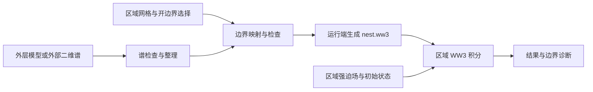

# WW3Tool 外部边界谱单向嵌套设计方案

设计日期：2026-09-08。代码核对基线：WW3Tool 0.1.30。

本文是交付给实现 AI 的功能规格与验收依据。交付目标是让用户将已有 WW3 二维方向谱作为区域模型的开边界条件，完成配置、检查、准备、本地运行、集群运行和结果检查。开发交付范围见第 2 节，后续扩展见第 15 节。

## 1. 功能与术语

用户可使用自己运行的外层模型谱输出，或符合支持格式的外部谱文件，驱动一个区域 WW3 模型。区域内部继续使用算例配置的风、流、水位、海冰强迫。



| 术语 | 本方案定义 |
| --- | --- |
| 外部边界谱 | 随时间变化的频率—方向二维方差谱及其站点坐标 |
| 单向嵌套 | 外层向区域模型提供波谱；区域结果不向外层反馈 |
| 离线 | 外部谱已经存在，区域模型独立运行 |
| 活动边界点 | WW3 网格中标记为接收边界输入的海点 |
| 源站点 | 外部谱文件中的固定位置 |
| 目标点 | 区域网格中的活动边界点 |
| 边界准备 | 检查、裁剪、按站点整理输入谱，形成执行所需文件 |
| 边界生成 | 在运行端使用区域 `mod_def.ww3` 和 `ww3_bounc` 生成 `nest.ww3` |

官方手册将外部谱生成边界文件列为区域细化的一条路线，并允许多网格系统的最外层接收外部边界。见 [WW3 嵌套说明](https://github.com/NOAA-EMC/WW3/blob/761cf79d1b1fede4924dd7383b0c393c092a015c/manual/app/nest.tex)。

## 2. 首版交付范围

### 2.1 必须完成的能力

| 项目 | 首版要求 |
| --- | --- |
| 网格 | 单层结构化经纬度矩形网格，`mesh_type: structured`、`grid_type: normal`、非周期闭合 |
| 输入 | WW3 原生二维谱 NetCDF；支持单文件多站点、单站点多文件和时间分片 |
| 来源位置 | 本地文件、服务器文件，两种模式分别支持 |
| 空间映射 | 最近邻为默认；两点线性插值作为高级选项，两个目标版本均必须通过第 7 节的映射核验 |
| 谱离散 | 与目标网格的频率和方向离散严格一致；支持等价坐标的排序与循环置换 |
| 边界选择 | 按西、东、南、北边选择，并预览实际活动海点 |
| 运行 | 本地 `local.sh`、集群 `server.sh`；冷启动与热启动 |
| 输出模式 | 区域场、已有谱点、已有轨迹输出均能配合使用 |
| 入口 | GUI、CLI、交互式终端、JSON/schema 与 MCP 命令入口 |
| 目标 WW3 | 配置中的 6.07 和 7.14；每个版本必须有真实可执行程序的验收证据 |
| 输入保护 | 原始网格、原始外部谱只读；派生文件写入算例的边界工作区 |

### 2.2 扩展能力与首版处理

| 能力 | 首版遇到时的处理 | 扩展方向 |
| --- | --- | --- |
| ASCII 二维谱 | 明确提示支持格式为 WW3 NetCDF | 独立 `ww3_bound` 适配器 |
| 直接导入二进制 `nest.ww3` | 报告不支持的输入类型 | 加入来源与二进制兼容性检查后支持 |
| UNST、SMC、CURV、旋转极网格 | 配置检查明确报告网格范围限制 | 分别增加网格适配器和真实测试 |
| 外部谱驱动 `ww3_multi` | 配置检查报告该组合待支持 | 将边界接到最外层网格 |
| 父级算例自动运行 | 由用户提供已生成的二维谱 | 父级谱点导出和父子作业依赖 |
| 自动下载第三方产品 | 用户选择已有文件 | 按具体数据源增加下载插件 |
| 频率或方向插值 | 报告具体谱离散差异 | 单独设计守恒谱重采样 |
| 波高、周期、平均波向产品 | 报告缺少二维谱数据 | 参数化谱重建作为独立研究功能 |
| 日期变更线跨越的目标矩形、全球周期网格 | 报告目标网格范围限制 | 单独完成几何与周期边界验收 |

首版可以接受源文件使用 0–360° 或 −180–180° 经度。经度标准化必须保留空间位置，不能将日期变更线附近相邻点判为相距接近一周。

### 2.3 用户配置约束

1. ST 方案名称和可执行目录必须作为用户提供的不透明字符串处理，允许任意名称及含空格的路径。
2. 禁止通过 ST 名称、目录名或路径片段推断源项、网格类型或 WW3 版本。
3. 版本适配依据显式 `ww3.version`；执行目录依据本地或服务器 ST 路径映射。
4. 边界功能只检查选定目录中所需程序是否存在且可执行。首版额外需要 `ww3_bounc`。
5. 检查必须给出解析后的完整程序路径。禁止在选定目录缺少程序时，静默使用其他 PATH 目录中的同名程序。
6. 禁止将某台服务器的真实目录、用户名或 ST 方案集合写入功能实现。

## 3. 配置模型

### 3.1 配置位置

新增顶层 `boundary`，表示区域模型的外部边界输入。它与空间网格配置、区域强迫场配置分别保存。

缺少 `boundary` 时，其有效值必须为 `mode: none`。工作目录缺少该段时，必须使用关闭状态；全局配置中的外部谱路径不得自动启用其他算例的边界。

现有 `grid.grid_type` 继续表达单层或多网格布局。首版外部谱输入对应 `grid_type: normal`；配置加载器必须显式检查组合是否合法。

### 3.2 本地谱示例

以下是需合并到一个有效算例的配置片段，谱参数沿用该算例的 `ww3.grid`。

```yaml
boundary:
  mode: external_spectra
  source:
    format: ww3_netcdf
    location: local
    files:
      - /data/example/outer_202501_spec.nc
      - /data/example/outer_202502_spec.nc
  selection:
    type: sides
    sides: [west, east, north]
    inset_cells: 1
  interpolation:
    method: nearest
    max_distance_km: 50.0
  validation:
    max_time_gap_seconds: 10800
  resources:
    memory_limit_mb: 1024
```

`50 km`、`10800 s` 和 `1024 MiB` 是示例选择，必须在界面说明其用途。它们不是 WW3 的普适物理推荐值。

### 3.3 服务器谱示例

```yaml
boundary:
  mode: external_spectra
  source:
    format: ww3_netcdf
    location: remote
    files:
      - /data/example/wave_boundary/outer_202501_spec.nc
  selection:
    type: sides
    sides: [west, east, south, north]
    inset_cells: 1
  interpolation:
    method: linear
    max_distance_km: 30.0
  validation:
    max_time_gap_seconds: 3600
  resources:
    memory_limit_mb: 2048
```

服务器路径必须按 POSIX 路径处理，由算例服务器配置指定主机。首版一份边界配置只使用一个来源位置；本地文件与服务器文件混合列表必须报错。

### 3.4 字段契约

| 字段 | 类型与默认值 | 约束 |
| --- | --- | --- |
| `mode` | `none` / `external_spectra`，默认 `none` | 未知枚举报错 |
| `source.format` | 默认 `ww3_netcdf` | 首版只接受该格式 |
| `source.location` | `local` / `remote`，默认 `local` | 决定文件在哪一端解析 |
| `source.files` | 字符串列表，默认空 | 启用时不能为空；首版为明确文件列表 |
| `selection.type` | 默认 `sides` | 首版只接受 `sides` |
| `selection.sides` | 默认四边 | 至少一项；仅允许 west/east/south/north；去重 |
| `selection.inset_cells` | 整数，默认 1 | 首版固定为 1；表示从几何外圈向内一格，界面显示实际位置 |
| `interpolation.method` | `nearest` / `linear`，默认 `nearest` | linear 的有效性见第 7 节 |
| `interpolation.max_distance_km` | 正数，无有效默认值 | 启用后必须由用户填写；限制每个参与映射的源点 |
| `validation.max_time_gap_seconds` | 正数，无有效默认值 | 启用后必须由用户填写；限制相邻谱时刻间隔 |
| `resources.memory_limit_mb` | 正整数，默认 1024 | 边界转换内存估计门槛，单位 MiB；与 Slurm 作业内存分别校验 |

首版参数模板只启用 `mode: none`；高级默认值可保存在空的配置结构中。示例路径必须保持示例性质，发布包中用户本地和服务器的文件列表必须清空。

`mode: none` 时允许保留尚未填写完整的表单内容，文件存在性、距离和时间间隔等启用条件不参与运行校验。切换回启用状态时必须重新检查。

### 3.5 数据模型与状态

在领域层新增 `BoundaryConfig`、`BoundarySourceConfig`、`BoundarySelectionConfig`、`BoundaryInterpolationConfig`、`BoundaryValidationConfig`、`BoundaryResourcesConfig`，并将 `boundary` 接入 `PipelineConfig`。

新增以下纯数据对象，禁止依赖 Qt：

- `BoundaryInspection`：源文件、站点、时间、谱坐标、单位、检查阶段与问题列表。
- `BoundaryTargetPoint`：稳定 ID、WW3 的一基索引 i/j、经纬度、所属边集合。
- `BoundaryMapping`：目标 ID、源 ID、距离、权重、插值方法、空间覆盖状态。
- `BoundaryPlan`：有效积分时段、网格和谱指纹、文件清单、执行位置、资源估计。
- `BoundaryResult`：阶段、状态、输出文件、诊断文件、错误列表。

状态至少包含 `disabled`、`needs_input`、`needs_inspection`、`metadata_checked`、`deferred_remote`、`prepared`、`stale`、`failed`。任务运行状态由第 10 节的运行记录表达，避免将配置准备状态当作积分完成状态。

`metadata_checked` 和 `deferred_remote` 必须显示待完成的数据检查。禁止用“全部通过”描述只检查过文件头的输入。

## 4. GUI 设计

### 4.1 第一步的入口

在第一步网格卡片中增加“外部边界”开关和状态摘要，启用后的显示名称为“外部边界谱 · 单向嵌套”。首版只在支持的单层结构化网格上可用。

开关与第二步的配置卡片双向同步。切换为不支持的网格组合时，显示需要调整的配置项，并阻止生成该组合的运行计划。

### 4.2 第二步的边界卡片

在强迫场区域增加独立“外部边界谱”卡片，保持现有步骤编号。建议布局：

```text
外部边界谱                                    已启用

谱文件位置       本地文件 / 服务器文件
谱文件列表       文件名、站点数、起止时间、检查状态
                 添加文件   移除所选   检查文件

输入边           西 ☑   东 ☑   南 ☐   北 ☑
活动边界         向内一格；显示实际经纬度范围
空间插值         最近邻 / 两点线性
最大匹配距离     [       ] km
最大时间间隔     [       ] 小时

                 预览边界   准备边界输入
状态             目标点数、已覆盖点数、最大距离、待检查项
```

文件检查与准备必须在后台执行，提供进度、取消和逐文件错误。文件列表按明确选择保存；文件夹批量选择可以在 UI 中展开为确定文件列表。

地图复用现有地图组件及缓存。显示目标边界点、源站点、匹配连线和覆盖失败点；点击目标点查看站点来源、权重、距离及时间覆盖。必须显示实际格点位置，避免将用户选框边缘当成已生效边界。

本地谱首次执行检查时只读取元数据与必要的小样本。完整有效值检查放在准备阶段。服务器检查使用已有 SSH 连接读取轻量摘要；需要扫描完整谱数据的操作必须进入作业执行环境。

### 4.3 第四步与提交摘要

第四步显示边界状态、源谱离散和目标谱离散。谱不匹配时列出不同的参数或坐标。可提供“将目标谱参数设为源谱”的显式操作，操作前展示参数变更，执行后将相关准备状态标记为 `stale`。

该操作只更新频率和方向离散，不修改用户的 ST 名称、路径或物理源项系数。禁止自动改变目标谱离散或自动做谱插值。

提交摘要必须包含边界来源位置、目标点数、有效运行时段、空间插值方法和远程待执行检查。源谱只在服务器时，允许保存配置、准备模板并提交计算节点检查；检查失败必须在积分前终止任务。

### 4.4 关闭与恢复

关闭边界功能必须保存 `mode: none`，恢复区域网格对基础掩码的引用，并将工具管理的边界文件状态设为不参与运行。运行端必须执行第 10.4 节的残留文件处理。

重新打开工作目录必须从该目录的 `params.yml` 恢复表单。切换主题、切换工作目录和软件重启必须保持正确文字颜色、按钮间距和状态；后台任务的回调不得更新已经切换到其他算例的表单。

## 5. 活动边界点与网格文件

### 5.1 点位生成

必须读取实际网格产物和最终 `ww3_grid.nml`，包括 NX、NY、X0、Y0、SX、SY、掩码布局与水深解释。禁止仅用 GUI 输入范围计算索引。

首版采用向内一格的边界环。以 WW3 的一基索引表示：

| 边 | 点位 |
| --- | --- |
| west | i = 2，j = 2 … NY−1 |
| east | i = NX−1，j = 2 … NY−1 |
| south | j = 2，i = 2 … NX−1 |
| north | j = NY−1，i = 2 … NX−1 |

向内一格是本方案的首版布局选择。必须在地图和报告中显示被采用的范围，并在两套 WW3 的实测中核对这些点确实保留为活动边界。

角点按 `(i,j)` 去重，并保留其所属边集合。稳定排序必须与生成的点清单一致，例如按 j、i 升序排序。点 ID 使用稳定的索引编码，不使用随列表变化的临时序号作为唯一身份。

仅选取基础掩码中的有效海点，并检查水深经过 DEPTH 的缩放及 WW3 限值后仍为海点。陆点、排除点必须保持其含义；禁止将岸线填成海点。某一边全部为陆地时显示“该边无有效海点”；全部所选边均为空时阻止准备。

目标网格至少需要可形成边界环和内部海点的尺寸。尺寸不足、边界环没有内部计算海点、基础掩码已有未纳入本次选择的活动边界等情况必须明确报错。

### 5.2 派生掩码

基础网格文件只读。生成 `boundary/grid.mask_boundary`，将选中有效点设置为 2，并保持其他点状态。`ww3_grid.nml` 的 `MASK%FILENAME` 指向该派生文件。

文件读写必须遵守 `MASK%IDLA` 和 `MASK%IDFM`。首版可将派生文件统一写成自由格式、南到北逐行，并显式设置 `IDLA=1`、`IDFM=1`；必须通过非对称掩码测试核对转置和南北翻转。

WW3 官方掩码定义中，2 表示活动边界点。掩码输入、水深条件与边界统计必须共同核对。见 [掩码配置](https://github.com/NOAA-EMC/WW3/blob/6.07.1/model/nml/ww3_grid.nml) 和 [网格程序](https://github.com/NOAA-EMC/WW3/blob/6.07.1/model/ftn/ww3_grid.ftn)。

运行 `ww3_grid` 后，必须核对其边界统计及后续 `ww3_bounc` 识别的目标点集合与 `target_points.csv` 一致。通用实现不得依赖可选编译输出开关才有的逐点日志；所选版本必须提供经过小算例验证的边界诊断适配器。

基础网格缓存继续以基础网格参数管理。派生掩码的指纹必须额外包含边选择、基础掩码、水深处理和边界选择算法版本。

## 6. 外部谱的数据契约

### 6.1 接受的源数据

首版接受可识别的 WW3 原生点谱 NetCDF，包含 `time`、`frequency`、`direction`、`efth`、站点经纬度，支持固定站点的维度布局置换。首版必须支持 `efth(time,station,frequency,direction)` 与 `efth(station,time,frequency,direction)`。

存在 `scale_factor`、`add_offset`、填充值时，必须采用统一解码方式，防止重复缩放。移动站点、时间变化的位置、坐标无法识别、只有一维谱或统计波参数时必须报告具体不支持项。

所有源站点都必须具有可追溯的身份。站名重复时，必须结合坐标区分；同名异址必须报告，禁止静默合并。空间相同且谱值完全一致的重复站点可以合并，并记录来源。

### 6.2 按站点整理与时间分片

WW3 6.07.1 的 `ww3_bounc` 对谱列表逐文件读取位置和一个站点的谱，并使用首个文件的时间轴。因此执行文件列表必须是一站一文件，全部站点使用一致时间轴。见 [边界读取程序](https://github.com/NOAA-EMC/WW3/blob/6.07.1/model/ftn/ww3_bounc.ftn)。

必须先建立 `(源站点, 时间片段)` 索引，将同一站点的分片按时间归并，再生成执行所需的一站一文件。禁止直接将逐月文件清单交给 `ww3_bounc`。

重复时间戳仅在相应谱数据一致时去重；值不一致时必须报冲突文件和时刻。文件按名称排序不能代替时间排序。每站点最终时间坐标必须逐项一致，禁止仅比较时间步数量。

### 6.3 时间覆盖

时间统一解码为 UTC。首版接受 standard/gregorian 对应的公历时间，写为明确参考时刻的秒数，并使用 WW3 可读的字符型属性。

有效积分起点必须在 restart 选择完成后确定：冷启动为模拟起点，热启动为实际采用的 checkpoint 时间。终点必须来自最终积分配置的精确时间。

裁剪必须保留覆盖有效起点的前一个样本及有效终点的后一个样本；端点恰有样本时可以直接使用。所有参与空间映射的站点必须覆盖有效区间。禁止用最后一帧无限延伸或用零谱补足缺口。

相邻时间差必须为正且不超过 `max_time_gap_seconds`。缺测值检查必须覆盖实际采用的全部时间、频率和方向。首次文件头检查通过不能代替这一步。

采用原始有效采样时刻，首版不做额外时间重采样。`ww3.output_step` 只控制模型输出，禁止将它当成边界谱输入的采样间隔。

### 6.4 谱坐标、单位和方向

目标谱坐标必须由最终的 `SPECTRUM%FREQ1`、`XFR`、`NK`、`NTH`、`THOFF` 解析得到。频率比较建议使用 `rtol=1e-6`、`atol=1e-10 Hz`；角度采用循环角距离，容差 `1e-4°`。容差必须写进诊断和测试。

首版仅接受与目标离散等价的完整二维谱。坐标排序、方向循环移位必须同步重排 `efth`。频带缺失、方向档数不同或目标频率不匹配必须报错，禁止自动补零、补谱尾或调用未经本功能验收的谱转换。

WW3 6.07.1 的原生输出将 `efth` 标为 `m2 s rad-1`，方向变量标为传播去向；输出代码的方向排列由内部角度转换获得。实现必须依据实际数据和版本适配器核对，不得只依据某条模板注释。见 [WW3 谱输出程序](https://github.com/NOAA-EMC/WW3/blob/6.07.1/model/ftn/ww3_ounp.ftn)。

规范化数据要求：频率为 Hz，方差谱密度为每 Hz、每弧度；方向表示从真北顺时针量取的传播去向。已明确标识的每度谱可转换为每弧度谱，转换系数为 `180/pi`，必须同步更新单位；来向转去向增加 180°。未知单位、未知角度约定必须报错，禁止猜测。

最终写给 WW3 的方向数组必须匹配该版本原生谱输出的排列，不能仅为显示方便按 0–360° 升序写入。`THOFF` 必须参与匹配。方向置换和单位转换后，按同一频率箱宽、方向箱宽积分的总方差必须保持一致。

允许真实零能量。非有限值、未解码填充值和明显负谱必须报错。浮点舍入范围内的负值可以按明确数值容差截为零，但必须记录数量和最大修正量。

### 6.5 执行用 NetCDF

采用一站一文件、每文件 `station=1` 的规范布局：

```text
time(time)
station(station)
station_name(station,string16)
longitude(station)
latitude(station)
frequency(frequency)
direction(direction)
efth(time,station,frequency,direction)
```

如实际 WW3 适配器要求经纬度采用 `(time,station)`，写入器可以使用该原生布局，但每个文件的位置必须固定，并在验收样本中确认读取成功。

文件名采用短 ASCII 标识，如 `src_000001.nc`。原始 Unicode 站名、长文件名和来源路径保存到 manifest。执行文件采用 netCDF3 classic 或经过两版本验证的等价编码；首版建议 float32 的未打包谱值、float64 的时间、字符数组站名和字符型时间属性。

`spec.list` 每行写一个规范化文件的相对路径，无空行、注释或 shell 通配符。用户输入路径可以含空格与中文，执行端通过文件索引转换为这些安全短文件名。

## 7. 空间映射与质量检查

### 7.1 最近邻

使用球面距离寻找源站点。每个目标点的最近有效源站点必须在 `max_distance_km` 内，超限点必须阻止边界生成。相同距离的选择必须有稳定的规则，并在测试中核对与 WW3 的实际选择一致。

为降低内存，只将实际映射涉及的源站点写入执行清单。每个目标点都必须有映射记录。

### 7.2 两点线性

该选项对应 `BOUND%INTERP=2`，必须按选定版本的 WW3 算法预览两个参与点及权重。它是两个源站点之间的插值，界面说明必须准确。

两个参与源点均须满足距离上限，位置必须不同且权重有限。目标投影位于源点线段外、实际计算会夹取端点权重时，必须标明退化情况；首版将该目标视为 linear 覆盖失败，提示调整源点或明确选择 nearest。

必须记录最近邻和线性算法的版本，以及 WW3 边界生成的实际映射。预览与实际结果不一致时，必须终止积分。开发过程中，对尚未可靠提取或核对映射的版本，linear 必须显示不可用；该版本的 linear 验收通过才满足首版完整交付要求。

空间预览必须显示跨岛屿、海峡两岸等可疑连线。仅有离散源点时不得宣称已证明海陆连通；若能使用已有海陆掩码进行检查，应将可判定和不可判定范围分别记录。

### 7.3 地理约束

外部源数据按站点覆盖评价，不要求存在可读取的父级网格，也不要求父子网格分辨率为整数倍。需要严格一致的是首版的谱离散，以及参与站点对目标的时间和空间覆盖。

## 8. WW3 版本适配与文件生成

### 8.1 版本适配表

| 内容 | 6.07 适配 | 7.14 适配 |
| --- | --- | --- |
| 来源标识 | 官方 6.07.1 源码可作为基础，记录测试构建信息 | 实现时必须固定实际 7.14 构建来源与测试信息 |
| 边界程序 | `ww3_bounc` | `ww3_bounc` |
| 输入配置 | `ww3_bounc.nml` 的 `BOUND_NML` | 根据对应构建模板及真实测试确认 |
| 输入组织 | 每站一个文件，相同时间轴 | 首版采用相同规范化组织 |
| 谱处理 | 本功能执行 strict 匹配 | 本功能执行 strict 匹配 |
| 二进制 | 由该运行目录选定的程序生成 | 由该运行目录选定的程序生成 |

公开 develop 参考提交为 `761cf79d1b1fede4924dd7383b0c393c092a015c`，其边界程序包含谱转换逻辑和其他更新。7.14 的支持声明必须依据实际版本验证记录；develop 参考代码的能力只用于帮助核对。见 [参考边界程序](https://github.com/NOAA-EMC/WW3/blob/761cf79d1b1fede4924dd7383b0c393c092a015c/model/src/ww3_bounc.F90)。

### 8.2 边界配置

边界生成配置的确定语义如下：

```fortran
&BOUND_NML
  BOUND%MODE = 'WRITE'
  BOUND%INTERP = 1
  BOUND%VERBOSE = 1
  BOUND%FILE = 'boundary/normalized/spec.list'
/
```

nearest 对应 1，linear 对应 2。`WRITE` 表示从输入谱生成 `nest.ww3`；`READ` 用于检查已有边界文件。生成模式不得因“读取外部谱”的 UI 文案而误写成 `READ`。见 [官方边界配置](https://github.com/NOAA-EMC/WW3/blob/6.07.1/model/nml/ww3_bounc.nml)。

程序的工作目录和 `BOUND%FILE` 的相对路径必须统一。生产生成建议放在隔离的 `boundary/runtime/<run_id>/` 目录，在该目录准备 `mod_def.ww3`、谱文件清单和版本适配配置，成功后原子发布最终文件。

上面的配置片段展示算例根目录运行时的相对路径；隔离目录中的实际配置必须由路径生成器重写，不能原样复制造成清单位置错误。

### 8.3 区域模型配置

必须在派生掩码生效后运行 `ww3_grid`，然后使用它生成的 `mod_def.ww3` 执行 `ww3_bounc`。`ww3_shel` 的积分启动必须晚于边界生成及检查完成。

区域模型按 WW3 的边界输入机制读取工作目录内 `nest.ww3`。`DATE%BOUNDARY` 表达输出边界的时间安排；本功能的输入采样与文件接入不得通过该字段控制。必须核查谱点模式的日期写入函数，避免其边界输出设置混入本功能的数据依赖。

`points.list` 表达用户谱点输出，不能覆盖为输入边界点列表。外部谱输入不能把 `calc.mode` 强制改为 `spectral_point`。

## 9. 文件组织与计算开销

### 9.1 算例目录

```text
workdir/
├── params.yml
├── grid.mask_nobound
├── ww3_grid.nml
├── ww3_shel.nml
├── local.sh
├── server.sh
├── mod_def.ww3
├── nest.ww3
└── boundary/
    ├── grid.mask_boundary
    ├── target_points.csv
    ├── source_index.json
    ├── mapping.csv
    ├── plan.json
    ├── inspection.json
    ├── manifest.json
    ├── normalized/
    │   ├── spec.list
    │   ├── src_000001.nc
    │   └── src_000002.nc
    ├── runtime/
    │   └── <run_id>/
    │       ├── status.json
    │       ├── boundary_build.log
    │       └── boundary_check.log
    └── archive/
```

`plan.json` 是执行计划，`manifest.json` 是完成准备后的可追溯记录。它们必须包含独立 `schema_version`，并区分本地来源路径、服务器来源路径和包内相对路径。

计划必须单独保存 `execution_inputs.mode`，取值为 `normalized_bundle` 或 `remote_source`。前者按包内相对路径及校验和读取规范化文件，后者按配置的服务器路径读取原始谱。原始 `source.location` 表达数据来源，执行端不能据此强制访问另一台机器上的路径。

本地来源上传后的服务器计划必须使用 `normalized_bundle`，并携带整个配置积分区间及端点插值所需的输入覆盖；服务器自动选择的 restart 只能使用该覆盖范围内的数据。服务器配置验证必须识别完整输入包，原始本地路径仅保留为来源信息。

### 9.2 指纹与失效

指纹至少包含：生效的边界配置、目标网格几何、基础与派生掩码、水深处理、谱离散、有效时间窗、参与源站点与源数据标识、规范化算法版本。

规范化数据生成时必须计算派生文件校验和；最终二进制记录所用 `mod_def.ww3`、规范化输入、边界配置和执行程序标识。原始大文件可以同时记录尺寸、修改时间和选用数据的校验摘要；报告必须准确说明校验对象。

配置修改、源文件变化、网格重建、谱参数变化、restart 起点改变必须使相应状态失效。禁止只凭文件存在或 `prepared` 标记复用。

首版允许每次运行重新生成边界二进制。若实现缓存复用，必须校验上述依赖，并提供强制重建选项。禁止仅凭路径或 mtime 宣称已完成内容一致性验证。

### 9.3 内存与文件大小

Python 数据整理必须按站点或时间块读取，并支持取消。禁止将整个外层全球谱产品一次载入内存。

`ww3_bounc` 本身可能一次分配多份谱数组，因此 Python 分块不能保证 WW3 的内存占用很小。必须根据参与站点数、时间数、频率数和方向数估计转换开销，并同时报告规范化文件大小。

可采用保守的初始估计：

$$
M_{est} = 3 \times 4 \times N_{station}N_{time}N_fN_\theta + 256\times 2^{20}\quad\mathrm{bytes}
$$

该式是工程估算，必须用代表性小算例测量校准。超过 `memory_limit_mb` 时阻止转换，并给出缩短时段、减少源站点或提高明确资源预算的操作建议；不得自行裁掉时间或谱档。集群作业还必须为随后积分留足实际资源。

## 10. 本地与集群执行流程

### 10.1 公共流程

```text
读取有效算例配置
→ 获取算例执行锁，生成 run_id
→ 解析选定程序目录与所需程序
→ 确定冷启动或实际 restart 时刻
→ 检查边界模式与残留文件
→ 建立活动边界与最终 WW3 配置
→ 在执行端完整检查并准备谱输入
→ 运行 ww3_grid，核对活动边界
→ 在隔离目录运行 ww3_bounc
→ 检查边界时间、点位、谱和文件完整性
→ 原子发布 nest.ww3
→ 准备区域强迫场
→ 冷启动运行 ww3_strt；热启动准备 restart.ww3
→ 运行 ww3_shel
→ 检查边界读取与更新、执行输出转换
→ 保存状态与诊断，释放执行锁
```

边界功能必须复用公共应用层。两个 shell 模板调用同一个无 Qt 的运行入口，不能各实现一套谱读取和边界检查算法。

建议内部入口为 `python -m workflows.infrastructure.boundary.runtime`，通过 JSON 计划和明确参数调用，不使用 shell 拼接 Python 代码。执行解释器必须可配置并可用；在安装 WW3Tool 的环境内解析，不能硬编码开发者 Python 路径。

### 10.2 本地运行

本地源谱可在 GUI 或 CLI 先准备；启动 `local.sh` 时仍须校验配置与准备记录是否一致，并重新确定 restart 时间。只有边界完整检查通过，才能运行积分。

用户选择服务器来源而执行本地运行时，必须报告执行位置不匹配；首版不自动下载原始谱到本地。

### 10.3 集群运行

服务器来源的原始谱在服务器原地读取。GUI/CLI 上传的是配置、网格和边界计划，完整规范化与转换在计算节点执行。

本地来源必须先准备可传输的规范化谱包；上传包内相对路径及清单，不能让远程运行去解析本地绝对路径。上传前缺少规范化文件必须报准备未完成。

上传清单必须区分输入、运行产物和诊断。`nest.ww3`、本地 `mod_def.ww3`、临时目录和失败产物必须排除，由运行端重建。普通上传和“上传非强迫场文件”都必须正确处理边界输入；后者不能因为文件扩展名为 `.nc` 而排除必需的边界谱。

必须复用现有原子传输及错误汇总。禁止递归跟随指向外部数据目录的软链接上传全部原始数据。服务器路径使用明确参数和正确引用，禁止拼接为 shell 指令。

集群脚本沿用项目 Slurm 资源及 MPI 启动规则。不得为边界功能加入固定 `--time`。完整谱扫描和边界转换必须运行在计算节点；登录节点只进行有界的轻量检查。

### 10.4 原子性与残留文件

WW3 可能依据固定文件名读取边界，因此 `mode: none` 的运行也必须检查根目录 `nest.ww3`。

工具拥有的 `nest.ww3` 通过 manifest 与校验和识别。关闭功能时，将匹配记录的文件移入边界归档目录，并恢复基础掩码。出现无来源记录或校验和不符的同名文件时，必须在积分前报 `BOUNDARY_UNMANAGED_FILE`，保留原文件并说明位置。

外部边界生成使用唯一临时目录。失败时保留日志和失败状态，禁止将旧的同名 `nest.ww3` 视为本次成功产物。成功后以原子替换发布，记录所属 run_id；所有临时目录都由工具清单管理。

算例内同时执行两次准备或运行必须被执行锁阻止。正常退出或取消必须释放锁；陈旧锁必须能够依据本机进程或服务器作业状态识别，并提供明确的恢复方法。

### 10.5 热启动

热启动继续读取边界数据，必须覆盖实际 restart 时刻至积分终点。自动最新 checkpoint 的选择必须先于边界时间检查。

边界数据不能代替区域初始场。冷启动的初始化方式沿用算例配置；报告中记录初始化方式。禁止因边界缺失而静默切换为冷启动，或因 restart 缺失而偷偷忽略热启动请求。

若规范化包已覆盖整个配置运行区间，可以在实际 restart 时刻裁剪或复用覆盖子集；若实际时刻超出已准备范围，必须重做准备或报缺少输入。

### 10.6 状态与结果

运行阶段至少记录 `inspect`、`normalize`、`grid`、`build_boundary`、`verify_boundary`、`forcing`、`initialize`、`integrate`、`postprocess`、`done`。每个阶段包含开始结束时间、退出码、输出和错误。

程序返回 0 和存在 `nest.ww3` 是基础条件；还必须验证其记录可读、边界点数与位置正确、时间覆盖完整。边界读取及更新诊断需使用经过对应版本验证的解析器；禁止仅匹配一个宽泛的 success 字符串。

诊断适配器必须检查完整的边界文件结构：文件标识及格式版本、谱维度、目标坐标、源点映射索引和权重、各时刻的谱记录数、记录完整性及最终时刻。目标边界点数和每时刻写入的源谱数必须分别记录；二者可能不同，禁止用“每个目标点必有一条独立谱记录”解释文件布局。

允许使用经过原生 `READ` 模式交叉验证的 Fortran 顺序记录读取器，或与目标构建配套的诊断程序。读取器必须确认记录标记、字节序和数据类型，核对每条记录前后长度以及截断情况。无法识别的二进制布局必须报告不支持。原生 `READ` 模式返回 0 只能作为检查证据的一部分，终点覆盖和记录数仍须独立核对。

至少抽取两个不同源谱及两个时间验证数值与映射；用于比较的内部谱必须按对应版本的频率变量和单位换算。二进制诊断实现以官方边界读写代码和原生生成样本为依据。见 [边界记录读写模块](https://github.com/NOAA-EMC/WW3/blob/6.07.1/model/ftn/w3iobcmd.ftn)。

首版单层算例继续从根目录获取场、谱点和轨迹结果。增加下载边界报告与日志的入口，默认只下载小型诊断；规范化谱及边界二进制使用显式选择下载。

## 11. 应用层、CLI 与代码接入

### 11.1 公共应用接口

建议新增 `src/workflows/application/boundary_preparation.py`：

```python
inspect_boundary(config, *, execution_context, depth, log) -> BoundaryInspection
build_boundary_plan(config, *, inspection, effective_window, log) -> BoundaryPlan
prepare_boundary_inputs(config, *, plan, execution_context, log, cancel) -> BoundaryResult
verify_boundary_runtime(config, *, plan, runtime_files, log) -> BoundaryResult
```

`depth` 区分 metadata 与 full；`execution_context` 显式区分本地和服务器路径语义。纯配置检查不能隐式触发 SSH。谱解析器、几何映射器和 WW3 二进制/日志适配器分别位于基础设施层。

### 11.2 建议新增模块

| 路径 | 职责 |
| --- | --- |
| `src/workflows/domain/boundary_models.py` | 计划、检查结果、点位、映射、错误数据对象 |
| `src/workflows/application/boundary_preparation.py` | GUI/CLI 共用编排与状态处理 |
| `src/workflows/infrastructure/boundary/spectra_reader.py` | 原生谱元数据、站点与时间分片读取 |
| `src/workflows/infrastructure/boundary/spectra_normalizer.py` | 坐标、单位、维度及一站一文件写出 |
| `src/workflows/infrastructure/boundary/rect_boundary.py` | 实际网格点位与派生掩码 |
| `src/workflows/infrastructure/boundary/spatial_mapping.py` | 球面距离、映射预览、覆盖检查 |
| `src/workflows/infrastructure/boundary/manifest.py` | 指纹、原子写入、文件归属、状态 |
| `src/workflows/infrastructure/boundary/runtime.py` | 脚本共用的执行端入口 |
| `src/workflows/infrastructure/ww3/ww3_bounc_nml.py` | 版本化配置生成与诊断适配 |
| `src/desktop/steps/boundary_panel.py` | 边界配置卡片 |
| `src/desktop/view_models/boundary.py` | 后台执行、进度、取消与数据状态 |

新增模块名称可按实际代码组织调整，职责和入口等价性必须满足本方案。

### 11.3 已存在的接入点

| 文件 | 必须处理的内容 |
| --- | --- |
| [config_models.py](/Users/zxy/ocean/Paper/WW3Tool/src/workflows/domain/config_models.py) | `PipelineConfig.boundary` |
| [configuration.py](/Users/zxy/ocean/Paper/WW3Tool/src/workflows/application/configuration.py) | 解析、枚举、路径位置、默认关闭、boundary 验证阶段 |
| [runtime_config.py](/Users/zxy/ocean/Paper/WW3Tool/src/workflows/infrastructure/runtime_config.py) | 参数读写、模板和保存，不丢失新字段 |
| [ww3_namelist_adapter.py](/Users/zxy/ocean/Paper/WW3Tool/src/workflows/infrastructure/adapters/ww3_namelist_adapter.py) | 合并运行配置、最终谱参数写入之后建立边界计划 |
| [modify_ww3_nml.py](/Users/zxy/ocean/Paper/WW3Tool/src/workflows/infrastructure/ww3/modify_ww3_nml.py) | GUI 调度与无头路径使用同一个边界服务 |
| [ww3_grid_nml.py](/Users/zxy/ocean/Paper/WW3Tool/src/workflows/infrastructure/ww3/ww3_grid_nml.py) | 派生 MASK 引用与关闭恢复 |
| [ww3_shel_nml.py](/Users/zxy/ocean/Paper/WW3Tool/src/workflows/infrastructure/ww3/ww3_shel_nml.py) | 输入边界与输出日期职责、热启动有效时段 |
| [preprocessing_workflow.py](/Users/zxy/ocean/Paper/WW3Tool/src/workflows/application/preprocessing_workflow.py) | 完整预处理中加入边界准备 |
| [remote_ops.py](/Users/zxy/ocean/Paper/WW3Tool/src/workflows/application/remote_ops.py) | 上传计划、输入筛选、远程检查及诊断下载 |
| [ssh_client.py](/Users/zxy/ocean/Paper/WW3Tool/src/workflows/infrastructure/remote/ssh_client.py) | 按显式清单传输、软链接处理、原子提交 |
| [command_line.py](/Users/zxy/ocean/Paper/WW3Tool/src/workflows/interfaces/command_line.py) | 命令注册、参数、JSON 和 schema |
| [interactive_cli.py](/Users/zxy/ocean/Paper/WW3Tool/src/workflows/interfaces/interactive_cli.py) | 同名操作与帮助 |
| [pipeline.py](/Users/zxy/ocean/Paper/WW3Tool/src/desktop/view_models/pipeline.py) | 表单序列化与默认值合并 |
| [preprocessing_window.py](/Users/zxy/ocean/Paper/WW3Tool/src/desktop/windows/preprocessing_window.py) | 卡片装配、工作目录恢复、后台状态和主题 |
| [local.sh](/Users/zxy/ocean/Paper/WW3Tool/public/scripts/local.sh)、[server.sh](/Users/zxy/ocean/Paper/WW3Tool/public/scripts/server.sh) | 调用公共运行入口、失败阻断、残留处理 |
| [ww3tool_mcp.py](/Users/zxy/ocean/Paper/WW3Tool/public/packaging/mcp/ww3tool_mcp.py) | 命令列表与结构化返回能力检查 |
| [run.py](/Users/zxy/ocean/Paper/WW3Tool/run.py) | 打包复制与参数模板路径清洗 |

必须核查表单默认值合并、无头 adapter、配置复制与恢复这四条路径，确保边界配置不会被某个入口丢弃或隐式开启。

### 11.4 CLI 契约

建议新增以下面向用户的命令；统一复用现有工作目录定位和 JSON 错误信封：

```text
ww3tool inspect-boundary WORKDIR [--remote]
ww3tool prepare-boundary WORKDIR
ww3tool boundary-status WORKDIR [--remote]
ww3tool download-boundary-report WORKDIR
ww3tool validate WORKDIR --stage boundary
```

- `inspect-boundary` 默认执行本地元数据检查；`--remote` 通过配置连接检查服务器来源元数据，传回小型摘要。
- `prepare-boundary` 为本地来源生成规范化输入和计划；服务器来源生成可执行计划，并返回 `deferred_remote` 及待执行检查列表，禁止把它报告为数据准备全部完成。
- `boundary-status` 读取状态与依赖指纹；发现变化返回 `stale`。
- `download-boundary-report` 只下载本次边界 manifest、检查报告、映射和日志。
- `validate --stage boundary` 执行纯配置及可用本地元数据检查，不运行 WW3、不隐式连接服务器。需要深度检查时使用准备入口。

`prepare-ww3` 和 `run-workflow` 必须接入同样规则；`local-run` 和服务器脚本负责执行端最终检查。JSON 的 data 必须包含 `state`、`validation_depth`、`pending_checks`、`artifacts`，错误包含 `code`、`message`、`context` 与建议操作。

## 12. 诊断与错误设计

| 错误码 | 触发条件 | 用户可采取的操作 |
| --- | --- | --- |
| `BOUNDARY_GRID_UNSUPPORTED` | 不支持的网格或布局组合 | 选择首版支持的区域网格 |
| `BOUNDARY_SOURCE_MISSING` | 文件或必需变量缺失 | 选择完整二维谱文件 |
| `BOUNDARY_LOCATION_MISMATCH` | 本地执行引用远程来源 | 使用服务器执行或配置本地来源 |
| `BOUNDARY_NO_WET_POINTS` | 所选边无有效海点 | 检查网格水深、范围和输入边 |
| `BOUNDARY_MASK_CONFLICT` | 基础网格活动边界与选择冲突 | 查看冲突点并明确边界选择 |
| `BOUNDARY_SPECTRAL_MISMATCH` | 频率、方向或 THOFF 不匹配 | 查看差异，调整目标谱或源数据 |
| `BOUNDARY_CONVENTION_UNKNOWN` | 单位或方向约定不明 | 使用元数据明确的受支持谱 |
| `BOUNDARY_TIME_COVERAGE` | 有效积分区间覆盖不足 | 补充起止时刻附近谱数据 |
| `BOUNDARY_TIME_GAP` | 时间缺口超限 | 补充数据或调整明确的间隔要求 |
| `BOUNDARY_DUPLICATE_CONFLICT` | 重复时刻或站点数据冲突 | 选择一致的数据来源 |
| `BOUNDARY_SPATIAL_COVERAGE` | 参与源站点距离超限或线性退化 | 查看地图并调整源点、范围或方法 |
| `BOUNDARY_INVALID_SPECTRA` | 非有限值、缺测或负谱 | 检查源产品及数据整理 |
| `BOUNDARY_MEMORY_BUDGET` | 转换估计超过预算 | 调整时段、站点或明确资源预算 |
| `BOUNDARY_EXECUTABLE_MISSING` | 选定目录缺少可执行程序 | 补充相应 WW3 程序或修正目录 |
| `BOUNDARY_UNMANAGED_FILE` | 存在无归属的 nest.ww3 | 用户检查并移走该文件 |
| `BOUNDARY_STALE` | 准备记录与输入不一致 | 重新准备边界 |
| `BOUNDARY_BUILD_FAILED` | WW3 边界转换失败 | 查看完整退出码和转换日志 |
| `BOUNDARY_VERIFY_FAILED` | 点位、时间、谱或读取不一致 | 查看边界检查报告 |
| `BOUNDARY_WORKDIR_BUSY` | 同一算例已在准备或运行 | 等待任务结束或处理已确认的陈旧锁 |

错误必须定位文件、站点、时刻、目标点或程序路径。GUI 使用翻译文本，CLI/JSON 使用稳定错误码。禁止将输入失败转换为静默零边界。

## 13. 测试与验收

### 13.1 数据与配置测试

使用小型人工数据和 WW3 原生样本，测试应覆盖有物理含义的非对称值：

1. 缺少 boundary 时关闭；任意 ST 名称及含空格路径；配置保存和重开；本地与远程路径区分。
2. 单文件多站点、按站点拆分、按月分片、不同文件顺序、重复相同时刻和冲突时刻。
3. 所有参与站点时间坐标逐项一致；覆盖端点、缺少端点、内部缺口、热启动起点变化。
4. 单位转换、scale/offset 只应用一次、方向来去向、方向循环移位、THOFF、360° 重复端点。
5. 坐标排序后谱峰位置正确，积分方差保持一致；使用非对称方向谱检查 180° 翻转。
6. 掩码维度、IDLA 布局、角点去重、陆点过滤、活动边界冲突、原始文件不被修改。
7. 最近邻与线性权重、距离上限、同址站点、线性退化、日期变更线附近源坐标。
8. 内存估计、取消中途写入、原子发布、并发锁、配置变更后的失效。
9. 关闭边界时处理工具拥有的文件；未知 `nest.ww3` 必须阻止运行并保持原样。
10. 本地源上传清单完整，远程源原地读取，运行产物排除，软链接外部数据不被递归上传。

### 13.2 脚本与入口测试

用可记录调用的轻量程序替身检查 `ww3_grid → ww3_bounc → 检查 → ww3_shel` 顺序，以及中间失败、取消、过期输入、边界关闭、restart 的分支。替身测试不代表真实 WW3 验收。

GUI、CLI、交互式终端和 MCP 对等价配置应产生等价的计划、掩码和规范化输入。可忽略的差异限于生成时间、run_id 和机器相关路径，不允许谱内容或边界语义差异。

### 13.3 真实 WW3 小算例

6.07 和 7.14 必须分别执行。测试目录及大型输出不得提交到源码仓库。

| 算例 | 设置 | 必须验证的结果 |
| --- | --- | --- |
| 单边入射 | 平底小矩形、西侧边界、朝东传播的窄带谱 | 波能从西侧进入内部；主传播方向正确 |
| 零边界对照 | 相同网格与初始状态、零边界谱 | 与入射算例有可解释差异，确认波能来自边界 |
| 两点插值 | 两源点同谱形不同能量，目标位于其间 | 权重和边界方差符合预期；插值对象为谱密度 |
| 多站点输入 | 一个包含多个不同站点谱的文件 | 每个参与站点均被实际使用，不只读取第一站 |
| 时间分片 | 同一数据分别组织为一个文件与两段文件 | 生成和模拟结果在设定数值容差内一致 |
| 热启动 | 一次连续积分与中途 checkpoint 续算 | 后半段结果在固定构建及并行配置的容差内一致 |
| 输入不足 | 缺少边界末端样本 | 在积分前明确失败 |
| 边界关闭 | 使用曾完成边界运行的工具管理算例 | 活动掩码及 nest 文件处理正确，积分无残留输入 |

入射验证必须使用可核查的无波初始状态及零风，避免初始谱或本地风掩盖边界效果。当前配置验证要求风场存在，测试可提供合法的全零风场；WW3 初始状态通过该版本支持的 `ww3_strt` 设置构造并记录，禁止默认假设冷启动文件一定为零。

方向测试建议使用约 10 s 的窄带谱、足够深的平底水深和覆盖传播到内部探针所需的模拟时长，核对谱峰方向、波高和到达顺序。参数与误差门槛必须在运行前写入测试说明。不得把物理过程中的合理耗散当作严格振幅守恒错误。

边界生成的成功条件：程序正常退出、文件完整可读、非零目标点数、点位与计划一致、时间覆盖及更新正确、谱离散正确、映射核验通过。积分成功条件还包括完整运行终点和预期输出。

### 13.4 GUI 与发布验收

必须实测浅色/深色/自动主题、地图响应、文件列表长路径、后台取消、切换算例、关闭重开和参数恢复。

必须构建 wheel/sdist，确认新模块、边界模板、翻译和必要样例被包含，个人来源路径被清洗；在无 Qt 环境验证 CLI 导入。真实测试缺少某个 WW3 版本时，报告必须明确列出待验版本，禁止将替身测试标为两版本支持已完成。

## 14. 实施顺序与完成定义

| 阶段 | 工作 | 阶段完成条件 |
| --- | --- | --- |
| A：最小真实链路 | 固定两个版本来源；人工网格与谱；生成并读取边界 | 明确实际输入布局、方向、单位、边界点与诊断方法 |
| B：公共数据层 | 配置、站点和时间整理、谱匹配、掩码、映射、manifest | 数据测试通过，CLI 可生成完整计划和规范化包 |
| C：运行与传输 | 本地/远程执行、残留处理、原子性、热启动、上传清单 | 两执行位置的成功和失败分支通过；真实基本链路通过 |
| D：GUI 与其他入口 | 卡片、地图、恢复、进度、主题、JSON/schema/MCP | 入口一致，用户可完整操作 |
| E：验收与文档 | 完成小算例矩阵、打包、帮助和诊断说明 | 提供测试证据、支持矩阵及完整交付说明 |

首版完成必须同时满足：

- 用户可以在 GUI 和 CLI 中配置外部谱并独立运行区域模型。
- 本地和服务器来源的文件处理、准备及运行路径均有效。
- 两个目标 WW3 版本的支持状态有真实证据。
- 时间、谱、空间、内存和程序缺失的错误能够在积分前阻止任务。
- 输入边界与谱点输出、区域强迫、restart 和已有多网格路径的组合行为经过回归检查。
- 原始数据只读，关闭功能与失败重试时没有残留边界输入。
- 交付包含数据契约、配置示例、命令帮助、用户文档、测试说明和实施记录。

## 15. 扩展设计

### 15.1 父级谱点输出与自动父子运行

提供独立“导出边界采样点”操作，将子网格目标点导出为可供父级 WW3 谱点输出使用的坐标列表。该操作不覆盖父级用户已有 `points.list`，必须通过明确的合并或独立输出方案接入。

父级输出配置必须核对 `POINT%TYPE=1`、`SPECTRA%OUTPUT=3` 等实际版本字段，并保证真实谱密度和足够时间覆盖。父级产生 NetCDF 后，子级继续使用本方案相同的外部谱入口。见 [官方谱输出配置](https://github.com/NOAA-EMC/WW3/blob/6.07.1/model/nml/ww3_ounp.nml)。

自动运行扩展可将算例组织为有向无环图，父级产物验收通过后再执行子级。每个子级保留独立工作目录、运行时段和 restart 状态；父子兼容按边界覆盖与谱契约判断。

### 15.2 非结构网格与 SMC

UNST 适配器需读取真实网格节点 ID 和开边界标识；SMC 适配器需处理边界单元、边界索引文件与相关 namelist。两者分别提供 `target_points`、网格修改计划和 WW3 诊断适配器，共用源谱整理及检查层。

### 15.3 多网格外部边界

允许多网格系统最外层接收外部谱，内部通过 `ww3_multi` 交换。配置可扩展为 `boundary.target: level0`；二进制的网格标识与文件命名必须按真实 `ww3_multi` 输入约定设计和测试。

### 15.4 谱重采样与更多来源

守恒谱重采样、ASCII 输入、第三方产品适配和已生成边界二进制导入应分别作为独立适配器交付。每项都需要明确数据语义、误差指标和版本矩阵。

## 16. 给实现 AI 的交付任务

请依据本文实现 WW3Tool 首版外部边界谱单向嵌套功能，按第 14 节推进，交付第 2.1 节的完整入口与运行链路。先核对仓库适用规范和相关代码，再完成最小真实 WW3 验证。功能语义以本文的数据契约、运行顺序、错误处理和验收要求为准。

必须保留用户对 ST 名称和路径的自由配置，不从名称或目录推断编译方案。必须通过公共应用层保证 GUI、CLI 与集群脚本行为一致。必须特别检查一站一文件、分片时间合并、每弧度谱单位、方向去向与数组排列、有效 restart 时间、原始掩码保护、残留 nest 文件、上传清单及打包路径清洗。

实施提交必须只包含本功能相关文件，保护工作区已有用户改动。最终说明必须列出实现范围、支持版本及插值方法、执行过的真实测试、测试结果文件、已知限制与待验事项。发布 PyPI、更新服务器软件及正式大规模算例由用户另行安排。
